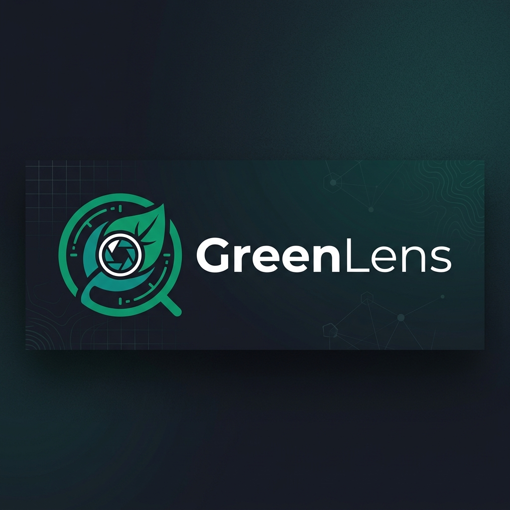

<p align="center">
  
</p>

<h1 align="center">GreenLens — Backend Service</h1>

<p align="center">
  <strong>Crowdsourced Application for Reporting Environmental Pollution</strong><br/>
  <em>Ứng dụng báo cáo điểm rác thải và ô nhiễm môi trường</em>
</p>

<p align="center">
  
  
  
  
  
  
</p>

<p align="center">
  
  
  
  
  
</p>

---

## 📋 Table of Contents

- [Overview](#-overview)
- [Features](#-features)
- [Architecture](#-architecture)
- [Tech Stack](#-tech-stack)
- [Getting Started](#-getting-started)
- [Project Structure](#-project-structure)
- [API Documentation](#-api-documentation)
- [Testing](#-testing)
- [AI Agent Configuration](#-ai-agent-configuration)
- [Contributing](#-contributing)
- [License](#-license)

---

## 🌍 Overview

**GreenLens** is a crowdsourcing platform enabling citizens to report environmental pollution (with photos + GPS), visualize pollution hotspots on maps, and transparently track resolution progress.

The backend handles core business logic: **authentication**, **report lifecycle**, **geo-queries**, **gamification**, **AI integration**, **notifications**, and **analytics**.

| Metric | Target |
|--------|--------|
| Concurrent Users | 5,000 CCU |
| Report Scale | 100,000+ reports |
| API Latency | p95 < 2 seconds |
| Uptime | ≥ 99.5% / month |
| Recovery | RPO ≤ 24h, RTO ≤ 4h |
| Localization | vi-VN, en-US |

> **Project Code:** SU26SE049 — FPT University, Semester SU26

---

## ✨ Features

### 👥 Actors & Capabilities

| Actor | Capabilities |
|-------|-------------|
| 🧑 **Citizen** | Submit reports with photos + GPS, view map, track status, earn points & badges |
| 👮 **Environmental Officer** | Verify, classify, assign tasks, manage SLA compliance |
| 🧹 **Cleanup Team** | GPS check-in, upload before/after photos, mark resolved |
| 🔧 **System Administrator** | Manage users, roles, categories, system config, audit logs |
| 🤖 **AI Service** | Auto-classify images, detect duplicates, estimate severity, anti-fraud |
| 🏢 **Community Organization** | View public map, export open data |

### 🔄 Report Lifecycle

```
                   ┌─► Rejected   (Officer, reason ≥ 20 chars)
Submitted ─────────┼─► Verified ──► InProgress ──► Resolved ──┬─► Closed (Citizen confirm OR auto 7d)
                   └─► Duplicate  (Officer/AI)                └─► InProgress (re-open, max 2x)
```

### 🗺️ Map & Geospatial

- Nearby reports with radius search (PostGIS `ST_DWithin`)
- Pollution hotspot detection (≥ 10 reports / 500m / 30 days)
- Heatmap visualization with cached map data (10-min TTL)
- GPS precision rounding for privacy (10m public accuracy)

### 🏆 Gamification

- Points & badges for citizen engagement
- Daily / weekly / monthly leaderboards
- Achievement system tied to report quality

---

## 🏗️ Architecture

GreenLens follows **Clean Architecture** with strict dependency rules:

```
┌─────────────────────────────────────────────────┐
│                   Greenlens.Api                  │  ◄── Composition Root (HTTP)
│              Controllers · Middlewares           │
├─────────────────────────────────────────────────┤
│              Greenlens.Infrastructure            │  ◄── Adapters (DB, R2, Redis, FCM)
│  Persistence · Identity · Storage · Security · Geo│
├─────────────────────────────────────────────────┤
│              Greenlens.Application               │  ◄── Use Cases (CQRS + MediatR)
│          Features · Behaviors · Interfaces       │
├─────────────────────────────────────────────────┤
│                Greenlens.Domain                  │  ◄── Core Business (NO dependencies)
│       Entities · ValueObjects · Events · Enums   │
└─────────────────────────────────────────────────┘
```

**Dependency Rule:**
```
Api ──► Application ──► Domain
 │           │
 └──► Infrastructure ──► Application (interfaces) ──► Domain
```

### Key Patterns

| Pattern | Implementation |
|---------|---------------|
| **CQRS** | Commands (mutate) + Queries (read) via MediatR |
| **Result Pattern** | `Result<T>` for business logic, exceptions only for infrastructure |
| **Vertical Slices** | Each use case = 1 folder (Command + Handler + Validator + Response) |
| **Outbox Pattern** | At-least-once delivery for events (notifications, AI, MQ) |
| **Domain Events** | State transitions raise events (`ReportVerifiedEvent`, etc.) |

---

## 🛠️ Tech Stack

| Layer | Technology |
|-------|-----------|
| **Runtime** | .NET 9 (C# 13) |
| **Web API** | ASP.NET Core 9 — Controller-based |
| **ORM** | Entity Framework Core 9 |
| **Database** | PostgreSQL 18 + PostGIS |
| **Cache** | Redis (multi-level: L1 Memory + L2 Redis) |
| **Object Storage** | Cloudflare R2 (S3-compatible, zero egress) |
| **CDN / WAF / DDoS** | Cloudflare (edge proxy, 300+ POP) |
| **CAPTCHA** | Cloudflare Turnstile (BR-AUTH-011) |
| **Message Queue** | RabbitMQ / MassTransit |
| **Background Jobs** | Hangfire |
| **Auth** | ASP.NET Core Identity + JWT RS256 (24h access / 30d refresh) |
| **Validation** | FluentValidation (3-layer: edge + input + business) |
| **Mapping** | Mapster (source-gen, faster than AutoMapper) |
| **Security** | OwaspHeaders.Core, Data Protection API, bcrypt.net-next |
| **Logging** | Serilog → Seq / ELK |
| **Observability** | OpenTelemetry → Jaeger / Tempo |
| **API Docs** | Swashbuckle (OpenAPI 3.0) |
| **Testing** | xUnit + FluentAssertions + NSubstitute + Testcontainers |

---

## 🚀 Getting Started

### Prerequisites

| Tool | Version |
|------|---------|
| [.NET SDK](https://dotnet.microsoft.com/download) | 9.0+ |
| [PostgreSQL](https://www.postgresql.org/) + PostGIS | 18+ |
| [Redis](https://redis.io/) | 7+ |
| [Docker](https://www.docker.com/) | 24+ (for Testcontainers) |

### Setup

```bash
# 1. Clone the repository
git clone https://github.com/Capstonne-Project/greenlens-service.git
cd greenlens-service

# 2. Restore dependencies
dotnet restore

# 3. Configure user secrets (development)
cd src/Greenlens.Api
dotnet user-secrets init
dotnet user-secrets set "ConnectionStrings:DefaultConnection" "Host=localhost;Port=5432;Database=greenlens;Username=postgres;Password=yourpassword"
dotnet user-secrets set "ConnectionStrings:Redis" "localhost:6379"
dotnet user-secrets set "Jwt:Secret" "your-256-bit-secret-key-here-minimum-32-chars"
dotnet user-secrets set "Cloudflare:R2:AccessKeyId" "your-r2-access-key"
dotnet user-secrets set "Cloudflare:R2:SecretAccessKey" "your-r2-secret-key"
dotnet user-secrets set "Cloudflare:Turnstile:SecretKey" "your-turnstile-secret"

# 4. Apply database migrations
dotnet ef database update --project ../Greenlens.Infrastructure

# 5. Run the application
dotnet run
```

The API will be available at `http://localhost:5000/v1`.

### Docker Compose (Quick Start)

```bash
docker compose up -d
```

### Environment Variables

| Variable | Description | Default |
|----------|------------|---------|
| `ConnectionStrings__DefaultConnection` | PostgreSQL connection string | — |
| `ConnectionStrings__Redis` | Redis connection string | `localhost:6379` |
| `Jwt__Secret` | JWT signing key (≥ 32 chars, HS256 dev only) | — |
| `Jwt__Issuer` | JWT issuer | `greenlens-api` |
| `Jwt__Audience` | JWT audience | `greenlens-client` |
| `Cloudflare__R2__Endpoint` | R2 endpoint URL | — |
| `Cloudflare__R2__Bucket` | R2 bucket name | `ecoreport-media` |
| `Cloudflare__Turnstile__SiteKey` | Turnstile site key (public) | — |
| `ASPNETCORE_ENVIRONMENT` | Environment name | `Development` |

> ⚠️ **Never** commit real secrets (R2 keys, Turnstile secret, JWT private key). Use `dotnet user-secrets` for dev, Azure Key Vault for production.

---

## 📁 Project Structure

```
greenlens-service/
│
├── src/
│   ├── Greenlens.Domain/              # Core business — NO framework dependencies
│   │   ├── Common/                    # BaseEntity, AuditableEntity, Result<T>
│   │   ├── Entities/                  # User, Report, Comment, Badge, CleanupTask
│   │   ├── Enums/                     # ReportStatus, PollutionType, Severity
│   │   ├── ValueObjects/              # GeoLocation, Email, PhoneNumber
│   │   ├── Events/                    # ReportSubmittedEvent, StatusChangedEvent
│   │   └── Exceptions/               # DomainException
│   │
│   ├── Greenlens.Application/         # Use cases via CQRS (MediatR)
│   │   ├── Common/                    # Behaviors, Interfaces, Mappings
│   │   ├── Features/                  # Vertical slices per module
│   │   │   ├── Auth/                  # Register, Login, RefreshToken
│   │   │   ├── Reports/               # Submit, Verify, Assign, Resolve, Close
│   │   │   ├── Map/                   # GetNearby, GetHotspots, GetHeatmap
│   │   │   ├── Officer/               # Verify, Assign, ReassignTask
│   │   │   ├── Cleanup/               # CheckIn, UpdateProgress, MarkResolved
│   │   │   ├── Gamification/          # AwardPoints, Leaderboard, Badges
│   │   │   └── Admin/                 # Users, Roles, Categories, AuditLog
│   │   └── BusinessRules/             # BR-*-NNN constants
│   │
│   ├── Greenlens.Infrastructure/      # Adapters — DB, R2, Redis, FCM
│   │   ├── Persistence/               # DbContext, Configurations, Migrations
│   │   ├── Identity/                  # JWT service, CurrentUser
│   │   ├── Storage/                   # R2FileStorage (S3-compatible), ImageProcessor
│   │   ├── Caching/                   # Redis cache service
│   │   ├── Geo/                       # PostGIS query helpers
│   │   ├── Security/                  # TurnstileVerifier, BcryptHasher, SecretsRotator
│   │   ├── BackgroundJobs/            # Hangfire jobs
│   │   └── DependencyInjection.cs     # All registrations
│   │
│   └── Greenlens.Api/                 # HTTP entry point
│       ├── Controllers/               # API Controllers
│       ├── Middlewares/               # Exception, Logging, RateLimit
│       └── Program.cs
│
├── tests/
│   ├── Greenlens.Domain.UnitTests/
│   ├── Greenlens.Application.UnitTests/
│   ├── Greenlens.Application.IntegrationTests/    # Testcontainers
│   └── Greenlens.Api.FunctionalTests/             # WebApplicationFactory
│
├── docs/                              # Documentation & images
├── OVERVIEW.md                        # Detailed architecture guide
├── 00_API_CONVENTIONS.md              # API contract conventions
└── README.md                          # ← You are here
```

---

## 📡 API Documentation

### Base URL

| Environment | URL |
|-------------|-----|
| Local | `http://localhost:5000/v1` |
| Dev | `https://api-dev.greenlens.com.vn/v1` |
| Staging | `https://api-stg.greenlens.com.vn/v1` |
| Production | `https://api.greenlens.com.vn/v1` |

### Response Envelope

**All** responses follow this format:

```json
{
  "code": "SUCCESS",
  "message": "Operation completed successfully",
  "status": 200,
  "data": { ... }
}
```

### Authentication

```http
Authorization: Bearer {access_token}
Content-Type: application/json
Accept-Language: vi-VN
```

| Token | Lifetime |
|-------|----------|
| Access Token | 24 hours |
| Refresh Token | 30 days |
| OTP (Email) | 10 minutes |

### Key Endpoints

| Method | Path | Description | Auth |
|--------|------|-------------|------|
| `POST` | `/v1/auth/register` | Register citizen account | Public |
| `POST` | `/v1/auth/login` | Login, receive JWT | Public |
| `POST` | `/v1/auth/refresh` | Refresh access token | Bearer |
| `POST` | `/v1/reports` | Submit pollution report | Citizen |
| `GET` | `/v1/reports` | List reports (paginated) | Bearer |
| `GET` | `/v1/reports/{id}` | Get report details | Bearer |
| `PUT` | `/v1/reports/{id}/verify` | Verify report | Officer |
| `PUT` | `/v1/reports/{id}/assign` | Assign to cleanup team | Officer |
| `PUT` | `/v1/reports/{id}/resolve` | Mark as resolved | CleanupTeam |
| `GET` | `/v1/map/nearby` | Get nearby reports | Public |
| `GET` | `/v1/map/hotspots` | Get pollution hotspots | Public |
| `GET` | `/v1/map/heatmap` | Get heatmap data | Public |
| `GET` | `/v1/gamification/leaderboard` | Get leaderboard | Bearer |

> 📖 Full API documentation available at `/swagger` when running locally.

### Rate Limits

| Scope | Limit |
|-------|-------|
| Anonymous API | 60 req/min/IP (Cloudflare edge + app) |
| Authenticated user | 300 req/min/user (app layer) |
| Submit report | 5/hour, 20/24h per citizen (Redis-backed) |
| Login attempts | 5 fail/15min → lock 30min + Turnstile from 3rd fail |

---

## 🧪 Testing

### Testing Pyramid

| Layer | Ratio | Stack |
|-------|-------|-------|
| **Unit** | ~70% | xUnit + FluentAssertions + NSubstitute |
| **Integration** | ~25% | + Testcontainers (PostgreSQL + PostGIS) + Respawn |
| **Functional/E2E** | ~5% | + WebApplicationFactory |

### Running Tests

```bash
# Run all tests
dotnet test

# Run specific test project
dotnet test tests/Greenlens.Domain.UnitTests/

# Run tests for a specific business rule
dotnet test --filter "FullyQualifiedName~BR_REP_001"

# Run with coverage
dotnet test --collect:"XPlat Code Coverage"
```

### Test Naming Convention

```csharp
[Fact]
public async Task SubmitReport_NoPhoto_ReturnsValidationError_BR_REP_001()
```

Pattern: `{Method}_{Scenario}_{ExpectedResult}_{BR_ID}`

> Every business rule (`BR-*-NNN`) must have at least 1 test.

---

## 🤖 AI Agent Configuration

This repository includes configuration for **two** AI coding assistants:

### Antigravity (Google)

```
.agents/
└── skills/
    ├── plan/                          # Scope document + milestone checklist
    ├── build/                         # Code implementation + notes
    ├── test/                          # Test writing + failure triage
    ├── release/                       # Rollout checklist + risk log
    └── csharp-conventions/            # Coding standards + patterns
        └── resources/                 # 9 detailed pattern guides
            ├── folder-structure.md
            ├── di-patterns.md
            ├── async-patterns.md
            ├── result-pattern.md
            ├── data-access-patterns.md
            ├── caching-patterns.md
            ├── security-patterns.md    # NEW: §13 Security
            ├── performance-patterns.md # NEW: §10 + §14
            └── best-practices.md
```

### Cursor

```
.cursor/
├── rules/                             # 11 enforcement rules (.mdc)
├── agents/                            # 8 specialized agents
├── skills/                            # 6 workflow skills
└── hooks/                             # 7 automated hooks (PowerShell)
```

Both agents enforce the same conventions from `OVERVIEW.md` and `00_API_CONVENTIONS.md`.

---

## 🤝 Contributing

### Branch Strategy

Trunk-based development:

```
main ←── feature/<ticket>-<slug>
     ←── fix/<ticket>-<slug>
     ←── chore/<slug>
```

### Commit Convention

[Conventional Commits](https://www.conventionalcommits.org/) with BR IDs:

```
feat(reports): submit report endpoint (BR-REP-001..013)
fix(auth): refresh token rotation (BR-AUTH-013)
chore(infra): add SLA breach background job (BR-OFF-020)
```

### PR Checklist

- [ ] Code follows Clean Architecture dependency rule
- [ ] All handlers have BR ID XML comments
- [ ] Response envelope `{code, message, status, data}` used
- [ ] Unit test: happy path + ≥ 1 error case
- [ ] Integration test with DB
- [ ] Swagger annotations complete
- [ ] BR IDs listed in commit message
- [ ] ≥ 1 reviewer approved

### Definition of Done

See full checklist in [`00_API_CONVENTIONS.md §12`](00_API_CONVENTIONS.md).

---

## 📜 License

This project is part of the FPT University capstone program (SU26SE049).

---

<p align="center">
  <strong>GreenLens</strong> — Making environmental reporting transparent and accessible 🌱
</p>
