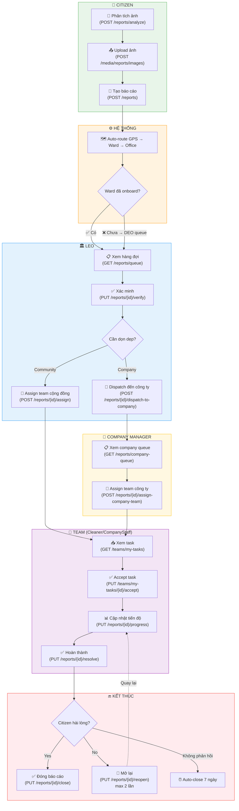
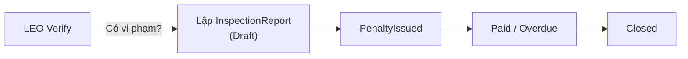

# GreenLens — API Dashboard & Report Lifecycle

> Tổng hợp tất cả API endpoints theo vai trò (role) và luồng xử lý báo cáo ô nhiễm.
>
> **Cập nhật:** 2026-06-11 · **Version:** v1.5

---

## Mục lục

1. [Dashboard theo Role](#1-dashboard-theo-role)
2. [Luồng xử lý báo cáo (Report Lifecycle)](#2-luồng-xử-lý-báo-cáo)
3. [API theo thứ tự luồng](#3-api-theo-thứ-tự-luồng)

---

## 1. Dashboard theo Role

### 🌍 Public (Anonymous)

> Xem bản đồ ô nhiễm công khai, không cần đăng nhập.

| # | Method | Endpoint | Mô tả |
|---|---|---|---|
| 1 | `GET` | `/v1/map/reports` | Bản đồ: báo cáo trong bounding box |
| 2 | `GET` | `/v1/map/summary` | Bản đồ: tổng hợp viewport (số lượng + chart) |
| 3 | `GET` | `/v1/catalog/pollution-categories` | Danh mục loại ô nhiễm |
| 4 | `GET` | `/v1/catalog/provinces` | Danh sách tỉnh/thành |
| 5 | `GET` | `/v1/catalog/provinces/{code}/wards` | Danh sách phường/xã theo tỉnh |

---

### 🔐 Auth (Tất cả user đã đăng nhập)

| # | Method | Endpoint | Mô tả |
|---|---|---|---|
| 1 | `POST` | `/v1/auth/register` | Đăng ký tài khoản |
| 2 | `POST` | `/v1/auth/login` | Đăng nhập |
| 3 | `POST` | `/v1/auth/google-login` | Đăng nhập bằng Google |
| 4 | `POST` | `/v1/auth/request-otp` | Yêu cầu mã OTP |
| 5 | `POST` | `/v1/auth/verify-otp` | Xác minh OTP |
| 6 | `POST` | `/v1/auth/forgot-password` | Quên mật khẩu |
| 7 | `POST` | `/v1/auth/reset-password` | Đặt lại mật khẩu |
| 8 | `POST` | `/v1/auth/change-password` | Đổi mật khẩu |
| 9 | `POST` | `/v1/auth/refresh-token` | Refresh JWT token |
| 10 | `GET` | `/v1/users/profile` | Xem profile cá nhân |
| 11 | `PUT` | `/v1/users/profile` | Cập nhật profile |
| 12 | `POST` | `/v1/users/avatar` | Upload avatar |
| 13 | `POST` | `/v1/users/phone/verify-firebase` | Xác minh SĐT qua Firebase |
| 14 | `GET` | `/v1/reports` | Danh sách báo cáo (filter) |
| 15 | `GET` | `/v1/reports/{id}` | Chi tiết báo cáo |
| 16 | `GET` | `/v1/reports/{id}/history` | Timeline thay đổi status |
| 17 | `GET` | `/v1/waste-tags` | Danh sách loại rác thải |

---

### 👤 Citizen (Công dân)

> Gửi báo cáo ô nhiễm, theo dõi trạng thái, xác nhận hoàn thành.

| # | Method | Endpoint | Mô tả |
|---|---|---|---|
| 1 | `POST` | `/v1/reports/analyze` | Phân tích ảnh trước khi tạo (Step 1) |
| 2 | `POST` | `/v1/media/reports/images` | Upload ảnh báo cáo |
| 3 | `POST` | `/v1/reports` | Tạo báo cáo ô nhiễm (Step 2) |
| 4 | `GET` | `/v1/reports/my` | Danh sách báo cáo của tôi |
| 5 | `PUT` | `/v1/reports/{id}/close` | Xác nhận hài lòng → Đóng báo cáo |
| 6 | `PUT` | `/v1/reports/{id}/reopen` | Mở lại nếu chưa hài lòng (tối đa 2 lần) |

---

### 🔍 DEO — Sở Tài nguyên Môi trường (cấp tỉnh/thành)

> Quản lý tổ chức: department, công ty DVMT, địa bàn phụ trách. Fallback queue khi phường chưa onboard.

| # | Method | Endpoint | Mô tả |
|---|---|---|---|
| | | **━━ Department ━━** | |
| 1 | `GET` | `/v1/departments` | Danh sách departments |
| 2 | `GET` | `/v1/departments/{id}` | Chi tiết department |
| 3 | `GET` | `/v1/departments/my-offices` | DS văn phòng MT trong tỉnh |
| 4 | `GET` | `/v1/departments/my/reports` | Tất cả báo cáo trong department |
| | | **━━ Công ty DVMT ━━** | |
| 5 | `POST` | `/v1/companies` | Tạo công ty DVMT |
| 6 | `GET` | `/v1/companies` | Danh sách công ty (tìm kiếm, lọc, sắp xếp) |
| 7 | `GET` | `/v1/companies/{id}` | Chi tiết công ty + service areas + nhân sự |
| 8 | `PUT` | `/v1/companies/{id}/activate` | Kích hoạt công ty (sau khi CM đặt MK) |
| 9 | `GET` | `/v1/companies/{id}/service-areas` | Xem danh sách phường do công ty phụ trách |
| 10 | `PUT` | `/v1/companies/{id}/service-areas` | Cập nhật địa bàn phụ trách (thay thế toàn bộ) |
| | | **━━ Officer Queue ━━** | |
| 11 | `GET` | `/v1/reports/queue` | Hàng đợi báo cáo (fallback DEO) |

---

### 🏛️ LEO — Văn phòng MT cấp xã/phường

> Xác minh, điều phối, quản lý đội cộng đồng, quản lý nhân sự phường.

| # | Method | Endpoint | Mô tả |
|---|---|---|---|
| | | **━━ Xác minh & Điều phối ━━** | |
| 1 | `GET` | `/v1/offices/my/reports` | Tất cả báo cáo trong phường (kèm tiến độ) |
| 2 | `GET` | `/v1/reports/queue` | Hàng đợi báo cáo chờ xử lý |
| 3 | `PUT` | `/v1/reports/{id}/verify` | Xác minh báo cáo (override severity/category) |
| 4 | `PUT` | `/v1/reports/{id}/reject` | Từ chối báo cáo (lý do ≥ 20 ký tự) |
| 5 | `POST` | `/v1/reports/{id}/assign` | Phân công team cộng đồng xử lý |
| 6 | `PUT` | `/v1/reports/{id}/reassign` | Chuyển giao team |
| 7 | `POST` | `/v1/reports/{id}/dispatch-to-company` | Điều phối task đến công ty DVMT |
| 8 | `PUT` | `/v1/reports/{id}/waste-tags` | Gắn tag loại rác cho báo cáo |
| 9 | `GET` | `/v1/reports/progress-board` | Board tổng quan báo cáo đang xử lý |
| 10 | `GET` | `/v1/reports/{id}/progress` | Tiến trình xử lý chi tiết |
| | | **━━ Đội cộng đồng (Community Team) ━━** | |
| 11 | `GET` | `/v1/teams` | Danh sách teams cộng đồng |
| 12 | `GET` | `/v1/teams/{id}` | Chi tiết team |
| 13 | `POST` | `/v1/teams` | Tạo team cộng đồng |
| 14 | `PUT` | `/v1/teams/{id}` | Cập nhật team |
| 15 | `POST` | `/v1/teams/{teamId}/members` | Thêm thành viên |
| 16 | `DELETE` | `/v1/teams/{teamId}/members/{userId}` | Xóa thành viên |
| 17 | `PUT` | `/v1/teams/{teamId}/members/{userId}/transfer` | Chuyển thành viên sang team khác |
| | | **━━ Nhân sự phường ━━** | |
| 18 | `GET` | `/v1/offices/my/staff/lookup` | Tra cứu tài khoản theo email |
| 19 | `POST` | `/v1/offices/my/staff` | Tuyển nhân sự vào phường + team |
| 20 | `GET` | `/v1/offices/my/staff` | Danh sách nhân sự trong phường |

---

### 🏢 Company Manager (CM) — Quản lý Công ty DVMT

> Nhận task từ LEO, quản lý team công ty, phân công xử lý.

| # | Method | Endpoint | Mô tả |
|---|---|---|---|
| | | **━━ Task Management ━━** | |
| 1 | `GET` | `/v1/reports/company-queue` | Danh sách task chờ phân công |
| 2 | `POST` | `/v1/reports/{id}/assign-company-team` | Phân công team công ty xử lý |
| 3 | `GET` | `/v1/reports/progress-board` | Board tiến độ tất cả task |
| 4 | `GET` | `/v1/reports/{id}/progress` | Tiến trình xử lý chi tiết |
| | | **━━ Team CRUD ━━** | |
| 5 | `GET` | `/v1/teams/company-teams` | Danh sách teams của công ty |
| 6 | `POST` | `/v1/teams/company-teams` | Tạo team cho công ty |
| 7 | `GET` | `/v1/teams/{id}` | Chi tiết team |

---

### 🧹 Cleaner / CompanyStaff / Inspector (Đội hiện trường)

> Nhận task, xử lý thực địa, cập nhật tiến độ.

| # | Method | Endpoint | Mô tả |
|---|---|---|---|
| 1 | `GET` | `/v1/teams/my-profile` | Profile team của tôi |
| 2 | `GET` | `/v1/teams/my-tasks` | Danh sách task được giao |
| 3 | `GET` | `/v1/teams/my-tasks/{reportId}` | Chi tiết task |
| 4 | `PUT` | `/v1/teams/my-tasks/{reportId}/accept` | Chấp nhận task |
| 5 | `PUT` | `/v1/teams/my-tasks/{reportId}/decline` | Từ chối task |
| 6 | `PUT` | `/v1/reports/{id}/progress` | Cập nhật tiến độ + ảnh |
| 7 | `PUT` | `/v1/reports/{id}/resolve` | Hoàn thành phần việc (cần ≥ 2 ảnh after) |
| 8 | `GET` | `/v1/teams/my-progress` | Lịch sử tiến độ của team |

---

### ⚙️ Admin (Quản trị hệ thống)

> Quản lý user/role, danh mục, departments, offices, cấu hình hệ thống.

| # | Method | Endpoint | Mô tả |
|---|---|---|---|
| | | **━━ User Management ━━** | |
| 1 | `POST` | `/v1/admin/users` | Tạo user |
| 2 | `GET` | `/v1/admin/users/all` | Tất cả users (no filter) |
| 3 | `GET` | `/v1/admin/users` | DS users (paginated, filter) |
| 4 | `GET` | `/v1/admin/users/{id}` | Chi tiết user |
| 5 | `PUT` | `/v1/admin/users/{id}` | Cập nhật user |
| 6 | `DELETE` | `/v1/admin/users/{id}` | Xóa user (soft delete) |
| 7 | `PUT` | `/v1/admin/users/{id}/role` | Đổi role user |
| | | **━━ Report Management ━━** | |
| 8 | `GET` | `/v1/admin/reports` | Tất cả báo cáo (admin view) |
| 9 | `GET` | `/v1/admin/reports/{id}` | Chi tiết báo cáo |
| 10 | `PUT` | `/v1/admin/reports/{id}/status` | Force đổi status (emergency) |
| | | **━━ Pollution Categories ━━** | |
| 11 | `POST` | `/v1/admin/pollution-categories` | Tạo loại ô nhiễm |
| 12 | `PUT` | `/v1/admin/pollution-categories/{id}` | Cập nhật |
| 13 | `DELETE` | `/v1/admin/pollution-categories/{id}` | Xóa |
| 14 | `PUT` | `/v1/admin/pollution-categories/{id}/archive` | Lưu trữ |
| | | **━━ Waste Tags ━━** | |
| 15 | `GET` | `/v1/admin/waste-tags` | Danh sách loại rác (admin) |
| 16 | `POST` | `/v1/admin/waste-tags` | Tạo loại rác |
| 17 | `PUT` | `/v1/admin/waste-tags/{id}` | Cập nhật |
| 18 | `PATCH` | `/v1/admin/waste-tags/{id}/toggle` | Bật/tắt |
| | | **━━ Roles & Permissions ━━** | |
| 19 | `GET` | `/v1/admin/roles` | Danh sách roles |
| 20 | `GET` | `/v1/admin/permissions` | Danh sách permissions |
| | | **━━ Organization ━━** | |
| 21 | `POST` | `/v1/departments` | Tạo department (Sở TNMT) |
| 22 | `PUT` | `/v1/departments/{id}` | Cập nhật department |
| 23 | `DELETE` | `/v1/departments/{id}` | Xóa department |
| 24 | `PUT` | `/v1/departments/{id}/officer` | Gán DEO cho department |
| 25 | `POST` | `/v1/offices` | Tạo office (văn phòng MT phường) |
| 26 | `PUT` | `/v1/offices/{id}` | Cập nhật office |
| 27 | `PUT` | `/v1/offices/{id}/officer` | Gán LEO cho office |

---

## 2. Luồng xử lý báo cáo

### Sơ đồ tổng thể

### Nhánh song song: Xử phạt (Inspection)

> **Lưu ý:** Một báo cáo có thể chạy **cả hai nhánh** (dọn dẹp + xử phạt) cùng lúc.

---

## 3. API theo thứ tự luồng

### Phase 1: Citizen gửi báo cáo

| Bước | Method | Endpoint | Actor | Mô tả |
|---|---|---|---|---|
| 1.1 | `POST` | `/v1/reports/analyze` | Citizen | Phân tích ảnh bằng AI (nhận gợi ý category, severity) |
| 1.2 | `POST` | `/v1/media/reports/images` | Citizen | Upload ảnh báo cáo (1–5 ảnh) |
| 1.3 | `POST` | `/v1/reports` | Citizen | Tạo báo cáo (category, GPS, description, mediaIds) |
| — | — | — | System | Auto-route GPS → Ward → LocalOffice (hoặc DEO queue) |

### Phase 2: LEO xác minh

| Bước | Method | Endpoint | Actor | Mô tả |
|---|---|---|---|---|
| 2.1 | `GET` | `/v1/reports/queue` | LEO | Xem hàng đợi báo cáo chờ xác minh |
| 2.2 | `GET` | `/v1/reports/{id}` | LEO | Xem chi tiết báo cáo |
| 2.3a | `PUT` | `/v1/reports/{id}/verify` | LEO | ✅ Xác minh (có thể override severity/category) |
| 2.3b | `PUT` | `/v1/reports/{id}/reject` | LEO | ❌ Từ chối (lý do ≥ 20 ký tự) |

### Phase 3: LEO điều phối

| Bước | Method | Endpoint | Actor | Mô tả |
|---|---|---|---|---|
| | | | | **Nhánh A — Community Team** |
| 3A.1 | `POST` | `/v1/reports/{id}/assign` | LEO | Phân công team cộng đồng → Status = InProgress |
| | | | | **Nhánh B — Company** |
| 3B.1 | `POST` | `/v1/reports/{id}/dispatch-to-company` | LEO | Điều phối task đến công ty → Status giữ Verified |

### Phase 4: CM phân công (chỉ nhánh Company)

| Bước | Method | Endpoint | Actor | Mô tả |
|---|---|---|---|---|
| 4.1 | `GET` | `/v1/reports/company-queue` | CM | Xem danh sách task chờ phân công |
| 4.2 | `POST` | `/v1/reports/{id}/assign-company-team` | CM | Phân công team công ty → Status = InProgress |

### Phase 5: Team xử lý

| Bước | Method | Endpoint | Actor | Mô tả |
|---|---|---|---|---|
| 5.1 | `GET` | `/v1/teams/my-tasks` | Team | Xem danh sách task được giao |
| 5.2 | `GET` | `/v1/teams/my-tasks/{reportId}` | Team | Xem chi tiết task |
| 5.3 | `PUT` | `/v1/teams/my-tasks/{reportId}/accept` | Team | Chấp nhận task (check-in ≤ 200m) → MarkStarted |
| 5.4 | `PUT` | `/v1/reports/{id}/progress` | Team | Cập nhật tiến độ + upload ảnh xử lý |
| 5.5 | `PUT` | `/v1/reports/{id}/resolve` | Team | Hoàn thành (cần ≥ 2 ảnh after) → Status = Resolved |

### Phase 6: Đóng báo cáo

| Bước | Method | Endpoint | Actor | Mô tả |
|---|---|---|---|---|
| 6.1a | `PUT` | `/v1/reports/{id}/close` | Citizen | Xác nhận hài lòng → Status = Closed |
| 6.1b | — | — | System | Auto-close sau 7 ngày nếu không phản hồi |
| 6.2 | `PUT` | `/v1/reports/{id}/reopen` | Citizen | Mở lại nếu chưa hài lòng (tối đa 2 lần) → InProgress |

### Monitoring (song song với Phase 5)

| Method | Endpoint | Actor | Mô tả |
|---|---|---|---|
| `GET` | `/v1/reports/progress-board` | LEO/CM | Board tổng quan tất cả báo cáo đang xử lý |
| `GET` | `/v1/reports/{id}/progress` | LEO/CM | Tiến trình xử lý chi tiết từng báo cáo |
| `PUT` | `/v1/reports/{id}/reassign` | LEO | Chuyển giao team nếu team hiện tại không xử lý được |

---

## Tổng kết API count

| Controller | Route Prefix | Số Endpoints |
|---|---|---|
| AuthController | `/v1/auth` | 9 |
| CatalogController | `/v1/catalog` | 3 |
| UsersController | `/v1/users` | 4 |
| ReportsController | `/v1/reports` | 22 |
| CompaniesController | `/v1/companies` | 6 |
| DepartmentsController | `/v1/departments` | 7 |
| LocalOfficesController | `/v1/offices` | 8 |
| TeamsController | `/v1/teams` | 14 |
| AdminController | `/v1/admin` | 14 |
| MapController | `/v1/map` | 2 |
| MediaController | `/v1/media` | 1 |
| **Tổng** | | **90** |
