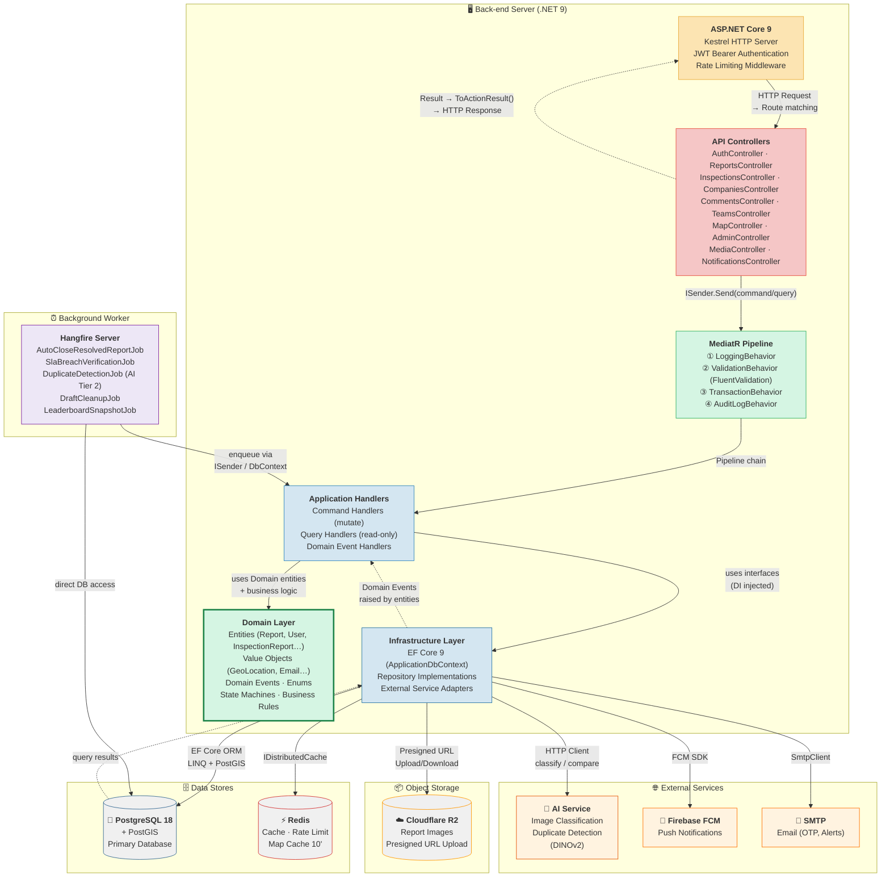
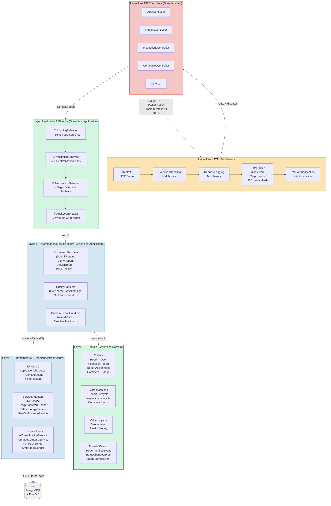
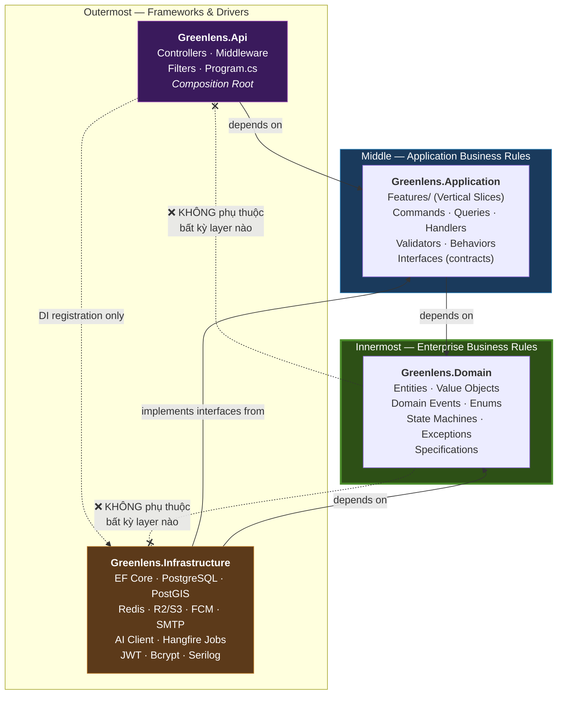

# GreenLens — Back-end Architecture

> **Dự án:** SU26SE049 — Crowdsourced Application for Reporting Environmental Pollution  
> **Stack:** .NET 9 · ASP.NET Core 9 · EF Core 9 · PostgreSQL 18 + PostGIS · Redis · Cloudflare R2 · Hangfire · Firebase FCM  
> **Pattern:** Clean Architecture · CQRS (MediatR) · Vertical Slice · Result Pattern

---

## 1. Back-end Architecture Overview



---

## 2. Layered Detail — Request Flow



---

## 3. Dependency Rule (Clean Architecture)



---

## 4. Component Mapping

| Layer | Project | Trách nhiệm | Tech |
|-------|---------|-------------|------|
| **HTTP** | `Greenlens.Api` | Routing, Auth, Rate Limit, Error Handling, DI | ASP.NET Core 9, Kestrel |
| **Controller** | `Greenlens.Api/Controllers/` | Nhận HTTP request → dispatch MediatR → trả HTTP response | API Controllers, `ISender` |
| **Pipeline** | `Greenlens.Application/Common/Behaviors/` | Cross-cutting: Logging, Validation, Transaction, Audit | MediatR `IPipelineBehavior` |
| **Business Logic** | `Greenlens.Application/Features/` | Use case handlers (CQRS), vertical slices | MediatR `IRequestHandler` |
| **Domain** | `Greenlens.Domain/` | Entities, state machines, domain events, business rules | Pure C# (no framework deps) |
| **ORM / Adapters** | `Greenlens.Infrastructure/` | DB access, external service adapters, background jobs | EF Core 9, Hangfire |
| **Database** | External | Primary data store + spatial queries | PostgreSQL 18 + PostGIS |
| **Cache** | External | Map cache (10'), rate limit counters, session | Redis |
| **Object Storage** | External | Report images, videos (presigned URL upload) | Cloudflare R2 (S3-compatible) |
| **AI** | External | Image classification, duplicate detection (DINOv2) | Python FastAPI |
| **Push** | External | Mobile push notifications | Firebase FCM |
| **Email** | External | OTP, alerts, notification digest | SMTP |
| **Background** | `Greenlens.Infrastructure/BackgroundJobs/` | Recurring/scheduled jobs | Hangfire |

---

## 5. Key Design Decisions

### 5.1 Tại sao Clean Architecture?

```
✅ Domain KHÔNG phụ thuộc framework → dễ unit test
✅ Application chỉ biết interfaces → swap implementation dễ dàng
✅ Infrastructure bọc tất cả external dependency → isolate thay đổi
✅ Api layer mỏng → chỉ routing + DI
```

### 5.2 Tại sao CQRS (MediatR)?

```
✅ Command (write) tách khỏi Query (read) → optimize riêng
✅ Pipeline Behaviors xử lý cross-cutting (validation, logging, tx) tự động
✅ Vertical Slice: 1 feature = 1 folder = 4 files (Command, Handler, Validator, Response)
✅ Domain Events → decouple side effects (gamification, notification)
```

### 5.3 Result Pattern (không dùng Exception cho business logic)

```
✅ Business error → Result.Failure(error) → ToActionResult() → HTTP 4xx
✅ Infrastructure error → Exception → ExceptionHandlingMiddleware → HTTP 500
✅ Luồng rõ ràng, không try/catch rải rác trong controllers
```
