# GreenLens — Class Diagrams (Theo Use Case / Luồng nghiệp vụ)

> **Dự án:** SU26SE049 — Crowdsourced Application for Reporting Environmental Pollution  
> **Tổng quan:** 24 Class Diagram theo Use Case, khớp 1:1 với 22 ⭐ Sequence Diagram ưu tiên.  
> **Nguyên tắc:** Mỗi CD hiển thị **tất cả object tham gia** trong luồng tương ứng (Entity, Enum, Interface, Handler, Controller).  
> **Ký hiệu:** Mermaid UML. Xem bằng GitHub, VS Code, hoặc bất kỳ renderer hỗ trợ Mermaid.

---

## Chú giải 4 loại Relationship (UML)

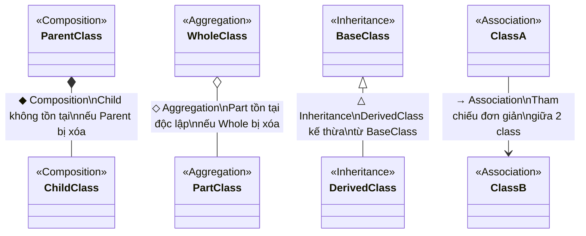

| Ký hiệu | Tên | Mermaid syntax | Ý nghĩa | Ví dụ GreenLens |
|----------|-----|----------------|----------|-----------------|
| ◆ (filled diamond) | **Composition** | `A *-- B` | B **không thể tồn tại** nếu A bị xóa | `Report *-- ReportMedia` — xóa Report → xóa luôn Media |
| ◇ (empty diamond) | **Aggregation** | `A o-- B` | B **vẫn tồn tại** độc lập khi A bị xóa | `LocalOffice o-- EnvironmentalTeam` — team có thể transfer sang office khác |
| △ (triangle) | **Inheritance** | `A <\|-- B` | B kế thừa từ A | `AuditableEntity <\|-- User` |
| → (arrow) | **Association** | `A --> B` | A tham chiếu đến B (lookup, FK) | `Report --> User` — Report tham chiếu reporter |
| ◁ (dashed) | **Dependency** | `A ..> B` | A phụ thuộc vào B (sử dụng) | `Handler ..> IRepository` — Handler dùng Repository |
| ◁ (implements) | **Realization** | `A <\|.. B` | B implement interface A | `IJwtService <\|.. JwtService` |

---

## Hệ thống phân cấp Entity Base (chung cho tất cả module)

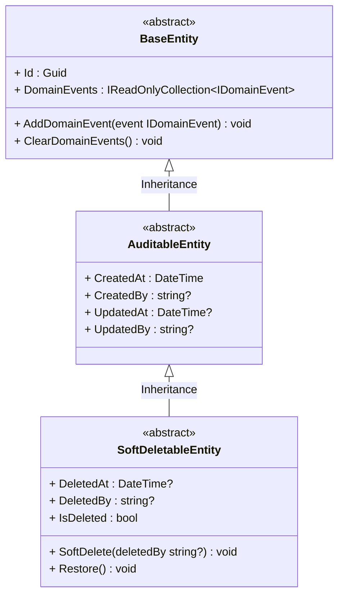

---

## Nhóm 1: Authentication & Account

---

### CD-01: Register (→ SD-01 ⭐)

**Actor:** Citizen · **BR:** BR-AUTH-001, BR-AUTH-003, BR-AUTH-005, BR-DAT-001

**Phân loại Relationship:**

| Relationship | Loại | Lý do |
|---|---|---|
| User → OtpCode | **Composition** ◆ | OTP gắn chặt với User |
| User → PasswordHistory | **Composition** ◆ | Lịch sử MK thuộc về User |
| SoftDeletableEntity → User | **Inheritance** △ | User kế thừa SoftDeletableEntity |
| RegisterCommandHandler ..> IUserRepository | **Dependency** | Handler dùng repo để check + add |
| RegisterCommandHandler ..> IPasswordHasher | **Dependency** | Handler dùng hasher |
| RegisterCommandHandler ..> IOtpRepository | **Dependency** | Handler lưu OTP |
| RegisterCommandHandler ..> IEmailSender | **Dependency** | Handler gửi OTP qua email |
| AuthController --> ISender | **Association** | Controller dispatch qua MediatR |

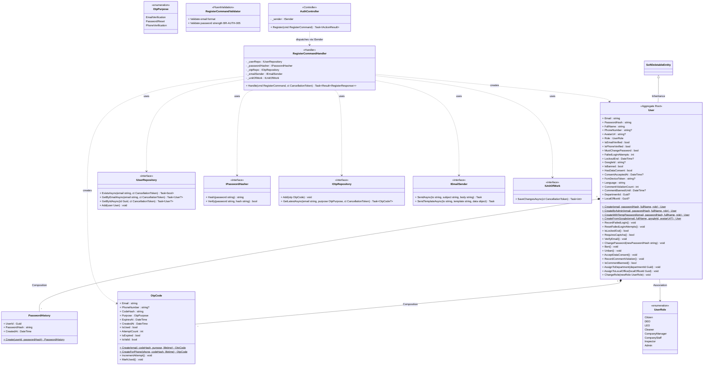

---

### CD-02: Login (→ SD-02 ⭐)

**Actor:** All · **BR:** BR-AUTH-013, BR-AUTH-014, BR-AUTH-015, BR-AUTH-016

**Phân loại Relationship:**

| Relationship | Loại | Lý do |
|---|---|---|
| User → RefreshToken | **Composition** ◆ | Token thuộc về User |
| SoftDeletableEntity → User | **Inheritance** △ | Kế thừa |
| LoginCommandHandler ..> IUserRepository | **Dependency** | Tìm user |
| LoginCommandHandler ..> IJwtService | **Dependency** | Tạo token |
| LoginCommandHandler ..> IPasswordHasher | **Dependency** | Verify password |

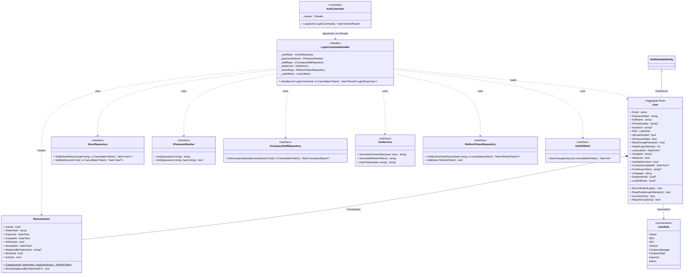

---

### CD-03: Refresh Token Rotation (→ SD-04 ⭐)

**Actor:** All · **BR:** BR-AUTH-013

**Phân loại Relationship:**

| Relationship | Loại | Lý do |
|---|---|---|
| User → RefreshToken | **Composition** ◆ | Token thuộc về User |
| RefreshTokenCommandHandler ..> IJwtService | **Dependency** | Hash + generate |
| RefreshTokenCommandHandler ..> IRefreshTokenRepository | **Dependency** | Rotate token |

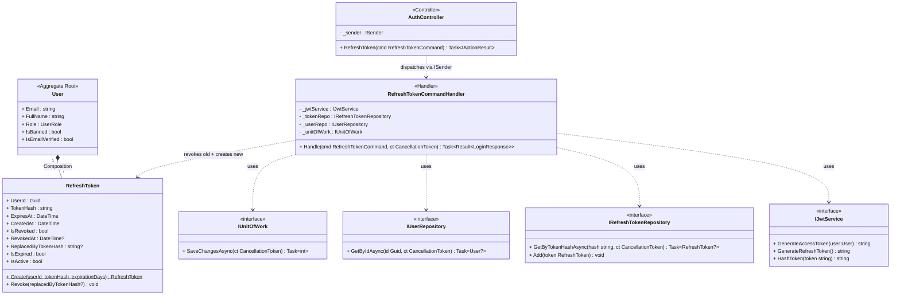

---

## Nhóm 2: Report Lifecycle — Core ⭐

---

### CD-04: Submit Pollution Report (→ SD-09 ⭐)

**Actor:** Citizen · **BR:** BR-REP-001, BR-REP-003, BR-REP-004, BR-REP-005, BR-REP-010, BR-REP-011, BR-REP-013, BR-REP-030, BR-ORG-010

**Phân loại Relationship:**

| Relationship | Loại | Lý do |
|---|---|---|
| Report → ReportMedia | **Composition** ◆ | Media thuộc về Report |
| Report → ReportStatusHistory | **Composition** ◆ | Lịch sử gắn chặt |
| Report → ReportWasteTag | **Composition** ◆ | Join table |
| Report → PollutionCategory | **Association** → | Report lookup danh mục |
| Report → User | **Association** → | Report tham chiếu reporter |

```mermaid
classDiagram
    class Report {
        <<Aggregate Root>>
        + Code : string
        + ReporterId : Guid?
        + HideReporterName : bool
        + CategoryId : Guid
        + Severity : Severity
        + SeveritySetBy : SeveritySource
        + Description : string?
        + Latitude : decimal
        + Longitude : decimal
        + Address : string?
        + WardCode : string?
        + ProvinceCode : string?
        + Status : ReportStatus
        + AssignedOfficeId : Guid?
        + AssignedDepartmentId : Guid?
        + VerifiedBy : Guid?
        + AssignedByOfficerId : Guid?
        + AssignedCompanyId : Guid?
        + ParentReportId : Guid?
        + ReporterCount : int
        + IsPossibleDuplicate : bool
        + AiSimilarityScore : decimal?
        + IsSuspicious : bool
        + AiPending : bool
        + AiClassifiedType : string?
        + AiConfidence : decimal?
        + AiEstimatedSeverity : Severity?
        + PriorityScore : decimal
        + VerifiedAt : DateTime?
        + RejectedReason : string?
        + ResolvedAt : DateTime?
        + ClosedAt : DateTime?
        + ReopenedCount : int
        + SlaVerifyBreached : bool
        + SlaResolveBreached : bool
        + IsOverdue : bool
        + IsHidden : bool
        + Create(code, reporter, category, lat, lng, ...)$ Report
        + Verify(leoId, severity?, categoryId?) void
        + Reject(reason string) void
        + Assign(leoId Guid) void
        + Resolve() void
        + Close() void
        + TryReopen() bool
        + MarkDuplicate(primaryReportId Guid) void
        + MarkPossibleDuplicate(candidateId, source, score?) void
        + ApplyAiResults(type, confidence, severity) void
        + FlagSuspicious(reasons string) void
        + ForceStatus(newStatus ReportStatus) void
        + Hide(adminId Guid, reason string) void
        + Unhide() void
        + CanDelete() bool
    }

    class ReportMedia {
        + ReportId : Guid
        + Type : MediaType
        + Url : string
        + ThumbnailUrl : string?
        + MimeType : string
        + SizeBytes : long
        + Width : int?
        + Height : int?
        + DurationSeconds : int?
        + PHash : string?
        + ExifData : string?
        + UploadedBy : Guid?
        + UploadedAt : DateTime
        + Create(reportId, type, url, mimeType, sizeBytes)$ ReportMedia
        + SetThumbnail(url string) void
        + SetPHash(pHash string) void
        + SetDimensions(w int, h int) void
        + ChangeType(newType MediaType) void
        + ReassignToReport(primaryId Guid) void
    }

    class ReportStatusHistory {
        + ReportId : Guid
        + FromStatus : ReportStatus
        + ToStatus : ReportStatus
        + Reason : string?
        + ChangedBy : Guid?
        + ChangedAt : DateTime
    }

    class ReportWasteTag {
        <<join table>>
        + ReportId : Guid
        + WasteTagId : Guid
    }

    class PollutionCategory {
        + Name : string
        + Description : string?
        + IconUrl : string?
        + IsActive : bool
        + SortOrder : int
    }

    class ReportStatus {
        <<enumeration>>
        Submitted
        Verified
        InProgress
        Resolved
        Closed
        Rejected
        Duplicate
    }

    class Severity {
        <<enumeration>>
        Low
        Medium
        High
        Critical
    }

    class MediaType {
        <<enumeration>>
        Image
        Video
        Before
        After
        Progress
    }

    class IReportSubmissionRateLimiter {
        <<interface>>
        + IsAllowedAsync(userId Guid) Task~bool~
        + RecordSubmissionAsync(userId Guid) Task
    }

    class IProfanityFilter {
        <<interface>>
        + ContainsProfanity(text string) bool
    }

    class ICategoryRepository {
        <<interface>>
        + GetByIdAsync(id Guid, ct CancellationToken) Task~PollutionCategory?~
    }

    class IWardRepository {
        <<interface>>
        + ExistsAsync(wardCode string, provinceCode string, ct CancellationToken) Task~bool~
    }

    class ILocalOfficeRepository {
        <<interface>>
        + FindByWardCodeAsync(wardCode string, ct CancellationToken) Task~LocalOffice?~
    }

    class IExifAnalyzer {
        <<interface>>
        + Analyze(imageBytes byte[]) ExifAnalysisResult
    }

    class IUnitOfWork {
        <<interface>>
        + SaveChangesAsync(ct CancellationToken) Task~int~
    }

    class SubmitReportCommandHandler {
        <<Handler>>
        - _rateLimiter : IReportSubmissionRateLimiter
        - _profanityFilter : IProfanityFilter
        - _categoryRepo : ICategoryRepository
        - _wardRepo : IWardRepository
        - _officeRepo : ILocalOfficeRepository
        - _exifAnalyzer : IExifAnalyzer
        - _unitOfWork : IUnitOfWork
        + Handle(cmd SubmitReportCommand, ct CancellationToken) Task~Result~SubmitReportResponse~~
    }

    class ReportsController {
        <<Controller>>
        - _sender : ISender
        + Submit(cmd SubmitReportCommand) Task~IActionResult~
    }

    SoftDeletableEntity <|-- Report : Inheritance
    SoftDeletableEntity <|-- ReportMedia : Inheritance

    Report "1" *-- "1..*" ReportMedia : Composition
    Report "1" *-- "0..*" ReportStatusHistory : Composition
    Report "1" *-- "0..*" ReportWasteTag : Composition
    Report "0..*" --> "1" PollutionCategory : Association
    Report --> ReportStatus : Association
    Report --> Severity : Association
    ReportMedia --> MediaType : Association

    SubmitReportCommandHandler ..> IReportSubmissionRateLimiter : uses
    SubmitReportCommandHandler ..> IProfanityFilter : uses
    SubmitReportCommandHandler ..> ICategoryRepository : uses
    SubmitReportCommandHandler ..> IWardRepository : uses
    SubmitReportCommandHandler ..> ILocalOfficeRepository : uses
    SubmitReportCommandHandler ..> IExifAnalyzer : uses
    SubmitReportCommandHandler ..> IUnitOfWork : uses
    SubmitReportCommandHandler ..> Report : creates
    SubmitReportCommandHandler ..> ReportMedia : creates
    SubmitReportCommandHandler ..> ReportStatusHistory : creates
    ReportsController ..> SubmitReportCommandHandler : dispatches via ISender
```

---

### CD-05: Verify Report (→ SD-11 ⭐)

**Actor:** LEO · **BR:** BR-REP-020, BR-REP-021, BR-OFF-020

**Phân loại Relationship:**

| Relationship | Loại | Lý do |
|---|---|---|
| Report → ReportStatusHistory | **Composition** ◆ | Lịch sử gắn chặt |
| VerifyReportHandler ..> IReportRepository | **Dependency** | Load report |
| VerifyReportHandler ..> INotificationService | **Dependency** | Gửi thông báo |

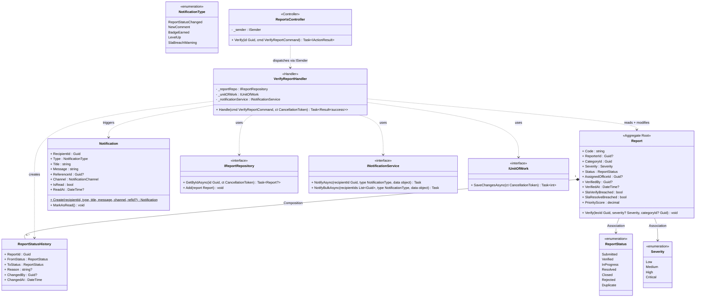

---

### CD-06: Reject Report (→ SD-12 ⭐)

**Actor:** LEO · **BR:** BR-REP-021, BR-GAM-001

**Phân loại Relationship:**

| Relationship | Loại | Lý do |
|---|---|---|
| Report → ReportStatusHistory | **Composition** ◆ | Lịch sử gắn chặt |
| User → UserPoints | **Composition** ◆ | Points thuộc về User |
| UserPoints → PointTransaction | **Composition** ◆ | Transaction gắn chặt |
| RejectReportHandler ..> IReportRepository | **Dependency** | Load report |
| RejectReportHandler ..> IUserPointsRepository | **Dependency** | Trừ điểm |

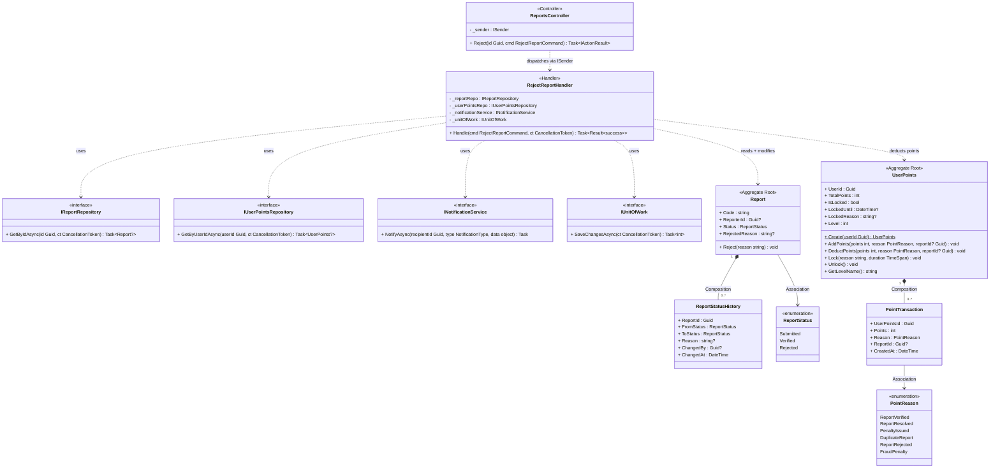

---

### CD-07: Assign Cleanup Team (→ SD-13 ⭐)

**Actor:** LEO · **BR:** BR-OFF-001, BR-CLN-001, BR-REP-021

**Phân loại Relationship:**

| Relationship | Loại | Lý do |
|---|---|---|
| Report → ReportAssignment | **Composition** ◆ | Assignment thuộc về Report |
| Report → ReportStatusHistory | **Composition** ◆ | Lịch sử gắn chặt |
| ReportAssignment → EnvironmentalTeam | **Association** → | Assignment tham chiếu Team |

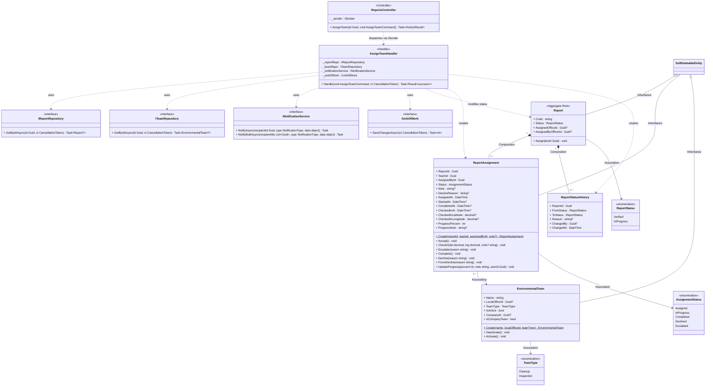

---

### CD-08: Resolve Report (→ SD-15 ⭐)

**Actor:** Cleaner / CompanyStaff · **BR:** BR-CLN-004, BR-REP-020

**Phân loại Relationship:**

| Relationship | Loại | Lý do |
|---|---|---|
| Report → ReportAssignment | **Composition** ◆ | Assignment thuộc về Report |
| Report → ReportMedia | **Composition** ◆ | Media thuộc về Report |
| Report → ReportStatusHistory | **Composition** ◆ | Lịch sử gắn chặt |

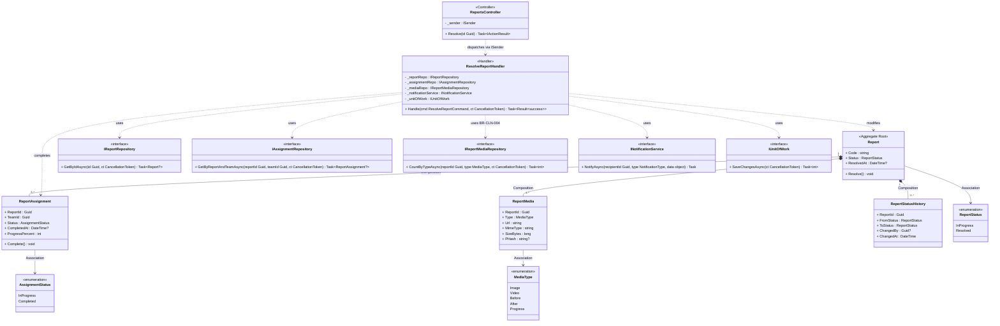

---

### CD-09: Close Report (→ SD-16 ⭐)

**Actor:** Citizen / System · **BR:** BR-REP-016, BR-REP-025

**Phân loại Relationship:**

| Relationship | Loại | Lý do |
|---|---|---|
| Report → ReportStatusHistory | **Composition** ◆ | Lịch sử gắn chặt |
| User → UserPoints | **Composition** ◆ | Points thuộc về User |
| UserPoints → PointTransaction | **Composition** ◆ | Transaction gắn chặt |

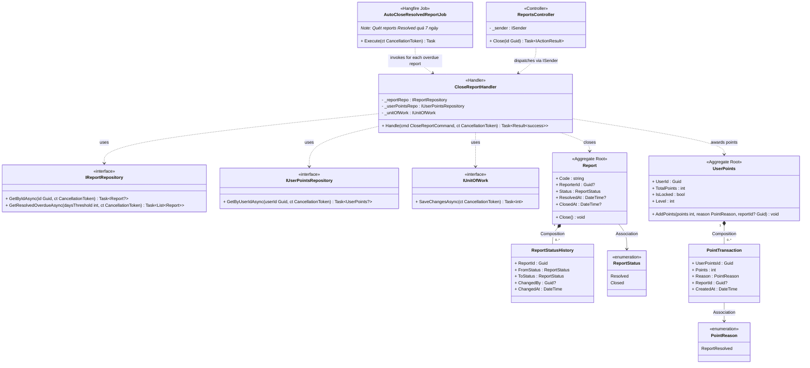

---

### CD-10: Duplicate Detection & Handling (→ SD-18 ⭐)

**Actor:** AI / LEO · **BR:** BR-REP-030, BR-REP-032, BR-AI-002

**Phân loại Relationship:**

| Relationship | Loại | Lý do |
|---|---|---|
| Report → ReportMedia | **Composition** ◆ | Media thuộc về Report |
| Report → Report | **Association** → | Self-reference: duplicate → parent |

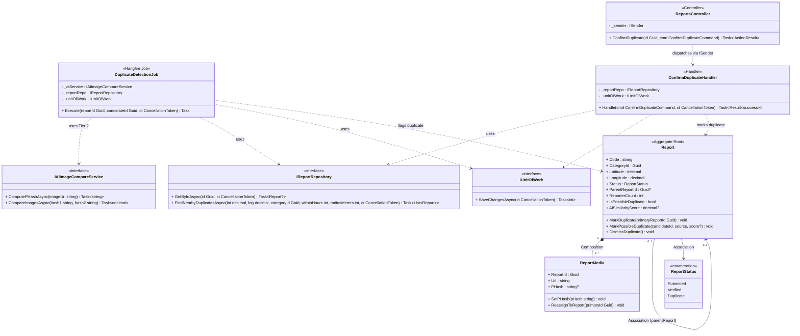

---

## Nhóm 3: Cleanup & Field Work

---

### CD-11: Accept / Decline Assignment (→ SD-21 ⭐)

**Actor:** Cleaner / CompanyStaff · **BR:** BR-CLN-001

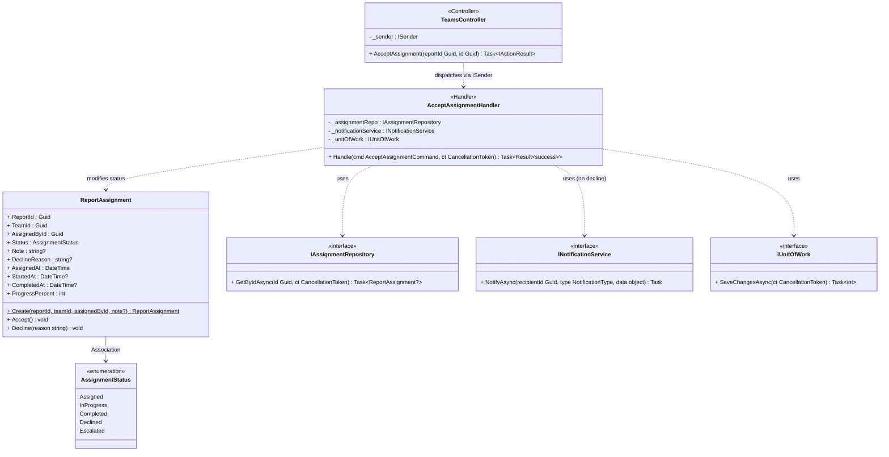

---

### CD-12: Check-in at Cleanup Site (→ SD-22 ⭐)

**Actor:** Cleaner / CompanyStaff · **BR:** BR-CLN-002

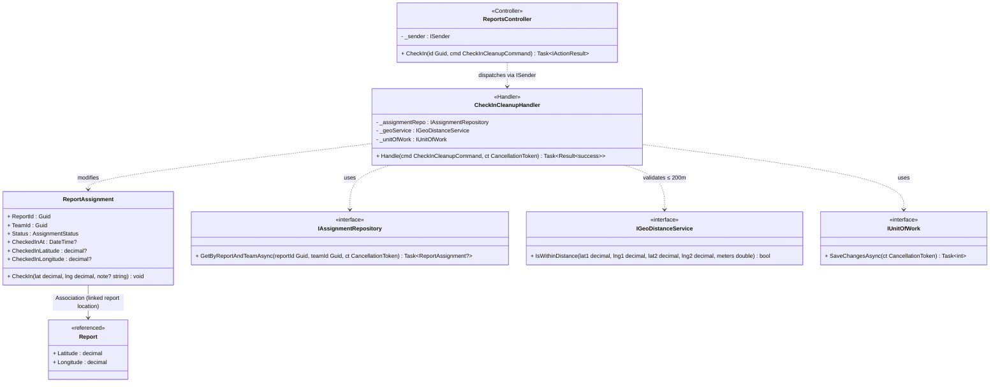

---

## Nhóm 4: Inspection & Penalty

---

### CD-13: Create Inspection Report (→ SD-28 ⭐)

**Actor:** LEO · **BR:** BR-INS-001

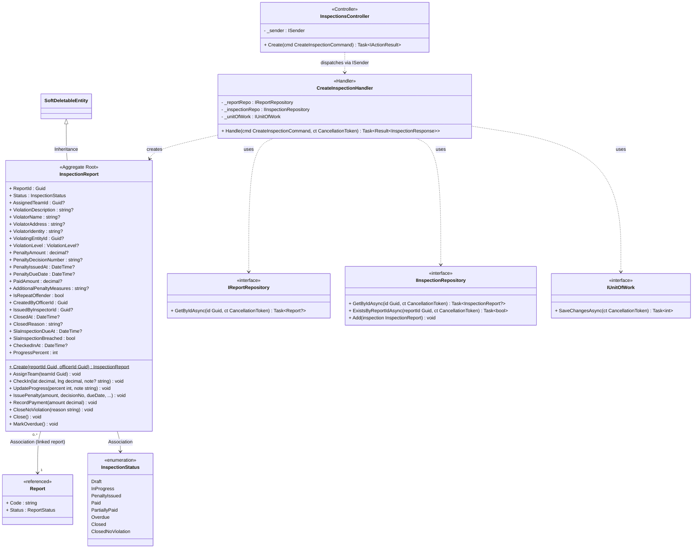

---

### CD-14: Assign Inspection Team (→ SD-29 ⭐)

**Actor:** LEO · **BR:** BR-INS-002

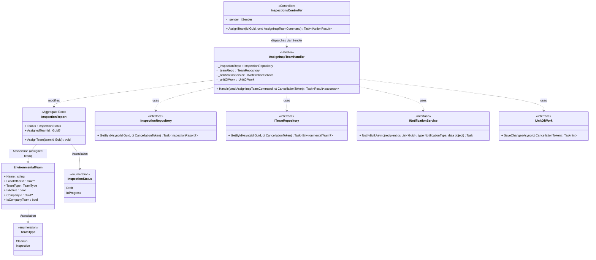

---

### CD-15: Issue Penalty (→ SD-32 ⭐)

**Actor:** Inspector / LEO · **BR:** BR-INS-005, BR-INS-006, BR-INS-010

```mermaid
classDiagram
    class InspectionReport {
        <<Aggregate Root>>
        + ReportId : Guid
        + Status : InspectionStatus
        + ViolatingEntityId : Guid?
        + ViolationLevel : ViolationLevel?
        + PenaltyAmount : decimal?
        + PenaltyDecisionNumber : string?
        + PenaltyIssuedAt : DateTime?
        + PenaltyDueDate : DateTime?
        + IsRepeatOffender : bool
        + IssuedByInspectorId : Guid?
        + IssuePenalty(amount, decisionNo, dueDate, ...) void
    }

    class ViolatingEntity {
        + Name : string
        + Address : string?
        + TaxCode : string?
        + IdentityNumber : string?
        + PhoneNumber : string?
        + Type : ViolatorType
        + Create(name, type, ...)$ ViolatingEntity
        + Update(name?, address?, ...) void
    }

    class PenaltyFramework {
        + CategoryId : Guid
        + Level : ViolationLevel
        + MinAmount : decimal
        + MaxAmount : decimal
        + Description : string?
        + IsActive : bool
    }

    class InspectionStatus {
        <<enumeration>>
        InProgress
        PenaltyIssued
    }

    class ViolationLevel {
        <<enumeration>>
        Minor
        Moderate
        Severe
        Critical
    }

    class ViolatorType {
        <<enumeration>>
        Individual
        Business
    }

    class IInspectionRepository {
        <<interface>>
        + GetByIdAsync(id Guid, ct CancellationToken) Task~InspectionReport?~
    }

    class IViolatingEntityRepository {
        <<interface>>
        + Add(entity ViolatingEntity) void
        + FindByIdentityAsync(identityNumber string, ct CancellationToken) Task~ViolatingEntity?~
    }

    class IPenaltyFrameworkRepository {
        <<interface>>
        + GetByCategoryAndLevelAsync(categoryId Guid, level ViolationLevel, ct CancellationToken) Task~PenaltyFramework?~
    }

    class INotificationService {
        <<interface>>
        + NotifyAsync(recipientId Guid, type NotificationType, data object) Task
    }

    class IUnitOfWork {
        <<interface>>
        + SaveChangesAsync(ct CancellationToken) Task~int~
    }

    class IssuePenaltyHandler {
        <<Handler>>
        - _inspectionRepo : IInspectionRepository
        - _violatingEntityRepo : IViolatingEntityRepository
        - _penaltyFrameworkRepo : IPenaltyFrameworkRepository
        - _notificationService : INotificationService
        - _unitOfWork : IUnitOfWork
        + Handle(cmd IssuePenaltyCommand, ct CancellationToken) Task~Result~success~~
    }

    class InspectionsController {
        <<Controller>>
        - _sender : ISender
        + IssuePenalty(id Guid, cmd IssuePenaltyCommand) Task~IActionResult~
    }

    SoftDeletableEntity <|-- InspectionReport : Inheritance
    SoftDeletableEntity <|-- ViolatingEntity : Inheritance

    InspectionReport --> ViolatingEntity : Association (violator)
    InspectionReport --> InspectionStatus : Association
    InspectionReport --> ViolationLevel : Association
    ViolatingEntity --> ViolatorType : Association
    PenaltyFramework --> ViolationLevel : Association

    IssuePenaltyHandler ..> IInspectionRepository : uses
    IssuePenaltyHandler ..> IViolatingEntityRepository : uses
    IssuePenaltyHandler ..> IPenaltyFrameworkRepository : validates amount range
    IssuePenaltyHandler ..> INotificationService : uses
    IssuePenaltyHandler ..> IUnitOfWork : uses
    IssuePenaltyHandler ..> InspectionReport : issues penalty
    IssuePenaltyHandler ..> ViolatingEntity : creates or finds
    InspectionsController ..> IssuePenaltyHandler : dispatches via ISender
```

---

## Nhóm 5: Organization Management

---

### CD-16: Create Department & LocalOffice (→ SD-36 ⭐)

**Actor:** Admin · **BR:** BR-ORG-001, BR-ORG-002

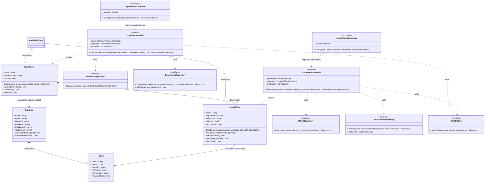

---

### CD-17: Create Team (→ SD-37 ⭐)

**Actor:** LEO · **BR:** BR-ORG-013

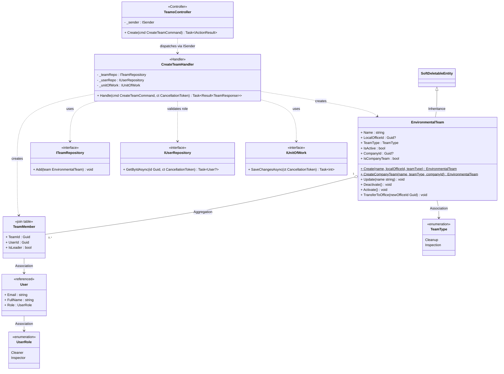

---

### CD-18: Onboard Environmental Company (→ SD-38 ⭐)

**Actor:** DEO · **BR:** BR-CMP-001, BR-CMP-006

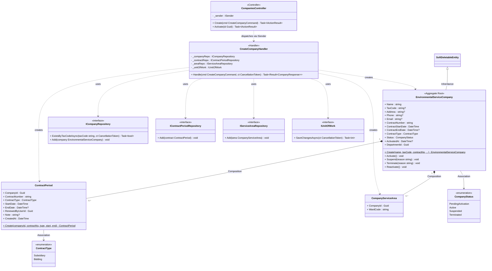

---

## Nhóm 6: Comment & Community

---

### CD-19: Add Comment (→ SD-44 ⭐)

**Actor:** Citizen · **BR:** BR-CMT-001, BR-CMT-002, BR-CMT-003

```mermaid
classDiagram
    class Comment {
        <<Aggregate Root>>
        + ReportId : Guid
        + AuthorId : Guid
        + Content : string
        + IsHidden : bool
        + HiddenReason : string?
        + HiddenBy : Guid?
        + HiddenAt : DateTime?
        + ParentCommentId : Guid?
        + Create(reportId, authorId, content, parentId?)$ Comment
        + Edit(content string, editorId Guid) void
        + DeleteByAuthor(authorId Guid) void
        + Hide(reason string, moderatorId Guid) void
        + Unhide() void
    }

    class CommentMedia {
        + CommentId : Guid
        + Url : string
        + MimeType : string
        + SizeBytes : long
    }

    class CommentLike {
        <<join table>>
        + CommentId : Guid
        + UserId : Guid
        + CreatedAt : DateTime
    }

    class BlockedWord {
        + Word : string
        + IsActive : bool
        + CreatedAt : DateTime
    }

    class User {
        <<referenced>>
        + Email : string
        + FullName : string
        + CommentViolationCount : int
        + CommentBannedUntil : DateTime?
        + IsCommentBanned() bool
        + RecordCommentViolation() void
    }

    class Report {
        <<referenced>>
        + Code : string
        + HideReporterName : bool
        + ReporterId : Guid?
    }

    class IUserRepository {
        <<interface>>
        + GetByIdAsync(id Guid, ct CancellationToken) Task~User?~
    }

    class IReportRepository {
        <<interface>>
        + GetByIdAsync(id Guid, ct CancellationToken) Task~Report?~
    }

    class IProfanityFilter {
        <<interface>>
        + ContainsProfanity(text string) bool
    }

    class IApplicationDbContext {
        <<interface>>
        + Set~Comment~() DbSet~Comment~
        + Set~CommentMedia~() DbSet~CommentMedia~
    }

    class IUnitOfWork {
        <<interface>>
        + SaveChangesAsync(ct CancellationToken) Task~int~
    }

    class AddCommentCommandHandler {
        <<Handler>>
        - _userRepo : IUserRepository
        - _reportRepo : IReportRepository
        - _profanityFilter : IProfanityFilter
        - _dbContext : IApplicationDbContext
        - _unitOfWork : IUnitOfWork
        + Handle(cmd AddCommentCommand, ct CancellationToken) Task~Result~AddCommentResponse~~
    }

    class CommentsController {
        <<Controller>>
        - _sender : ISender
        + Create(reportId Guid, cmd AddCommentCommand) Task~IActionResult~
    }

    SoftDeletableEntity <|-- Comment : Inheritance

    Comment "1" *-- "0..*" CommentMedia : Composition
    Comment "1" *-- "0..*" CommentLike : Composition
    Comment "1" *-- "0..*" Comment : Composition (replies)
    Comment "0..*" --> "1" Report : Association
    Comment "0..*" --> "1" User : Association (author)
    CommentLike --> User : Association (liker)

    AddCommentCommandHandler ..> IUserRepository : uses
    AddCommentCommandHandler ..> IReportRepository : uses
    AddCommentCommandHandler ..> IProfanityFilter : validates content
    AddCommentCommandHandler ..> IApplicationDbContext : uses
    AddCommentCommandHandler ..> IUnitOfWork : uses
    AddCommentCommandHandler ..> Comment : creates
    AddCommentCommandHandler ..> CommentMedia : creates
    AddCommentCommandHandler ..> User : checks ban status
    CommentsController ..> AddCommentCommandHandler : dispatches via ISender
```

---

## Nhóm 7: Gamification

---

### CD-20: Award Points — Event-driven (→ SD-48 ⭐)

**Actor:** System · **BR:** BR-GAM-001, BR-GAM-002, BR-GAM-003

```mermaid
classDiagram
    class UserPoints {
        <<Aggregate Root>>
        + UserId : Guid
        + TotalPoints : int
        + IsLocked : bool
        + LockedUntil : DateTime?
        + LockedReason : string?
        + Level : int
        + Create(userId Guid)$ UserPoints
        + AddPoints(points int, reason PointReason, reportId? Guid) void
        + DeductPoints(points int, reason PointReason, reportId? Guid) void
        + Lock(reason string, duration TimeSpan) void
        + Unlock() void
        + GetLevelName() string
    }

    class PointTransaction {
        + UserPointsId : Guid
        + Points : int
        + Reason : PointReason
        + ReportId : Guid?
        + CreatedAt : DateTime
    }

    class Badge {
        + Code : string
        + NameVi : string
        + NameEn : string
        + Description : string?
        + IconUrl : string?
        + IsActive : bool
        + RequiredPoints : int?
        + RequiredReportCount : int?
        + CreatedAt : DateTime
        + Create(code, nameVi, nameEn, ...)$ Badge
    }

    class UserBadge {
        <<join table>>
        + UserId : Guid
        + BadgeId : Guid
        + EarnedAt : DateTime
    }

    class GamificationConfig {
        + ActionKey : string
        + Points : int
        + Description : string?
        + IsActive : bool
    }

    class PointReason {
        <<enumeration>>
        ReportVerified
        ReportResolved
        PenaltyIssued
        DuplicateReport
        ReportRejected
        FraudPenalty
    }

    class ReportVerifiedEvent {
        <<DomainEvent>>
        + ReportId : Guid
        + ReporterId : Guid
    }

    class IGamificationConfigRepository {
        <<interface>>
        + GetByActionKeyAsync(actionKey string, ct CancellationToken) Task~GamificationConfig?~
    }

    class IUserPointsRepository {
        <<interface>>
        + GetByUserIdAsync(userId Guid, ct CancellationToken) Task~UserPoints?~
    }

    class IBadgeRepository {
        <<interface>>
        + GetAllActiveAsync(ct CancellationToken) Task~List~Badge~~
        + GetUserBadgeIdsAsync(userId Guid, ct CancellationToken) Task~List~Guid~~
    }

    class INotificationService {
        <<interface>>
        + NotifyAsync(recipientId Guid, type NotificationType, data object) Task
    }

    class IUnitOfWork {
        <<interface>>
        + SaveChangesAsync(ct CancellationToken) Task~int~
    }

    class AwardPointsHandler {
        <<DomainEvent Handler>>
        - _configRepo : IGamificationConfigRepository
        - _userPointsRepo : IUserPointsRepository
        - _badgeRepo : IBadgeRepository
        - _notificationService : INotificationService
        - _unitOfWork : IUnitOfWork
        + Handle(event ReportVerifiedEvent, ct CancellationToken) Task
    }

    UserPoints "1" *-- "0..*" PointTransaction : Composition
    User "0..*" o-- "0..*" Badge : Aggregation (via UserBadge)
    PointTransaction --> PointReason : Association
    UserBadge --> User : Association
    UserBadge --> Badge : Association

    AwardPointsHandler ..> IGamificationConfigRepository : gets points config
    AwardPointsHandler ..> IUserPointsRepository : uses
    AwardPointsHandler ..> IBadgeRepository : checks eligibility
    AwardPointsHandler ..> INotificationService : notifies LevelUp + BadgeEarned
    AwardPointsHandler ..> IUnitOfWork : uses
    AwardPointsHandler ..> UserPoints : adds points
    AwardPointsHandler ..> UserBadge : creates
    ReportVerifiedEvent ..> AwardPointsHandler : triggers
```

---

## Nhóm 8: Notification

---

### CD-21: Send Notification — Event-driven, Multi-channel (→ SD-52 ⭐)

**Actor:** System · **BR:** BR-NTF-001, BR-NTF-002

```mermaid
classDiagram
    class Notification {
        + RecipientId : Guid
        + Type : NotificationType
        + Title : string
        + Message : string
        + ReferenceId : Guid?
        + Channel : NotificationChannel
        + IsRead : bool
        + ReadAt : DateTime?
        + Create(recipientId, type, title, message, channel, refId?)$ Notification
        + MarkAsRead() void
    }

    class NotificationPreference {
        + UserId : Guid
        + Type : NotificationType
        + PushEnabled : bool
        + EmailEnabled : bool
        + Create(userId, type, push, email)$ NotificationPreference
        + Update(pushEnabled bool, emailEnabled bool) void
    }

    class NotificationTemplate {
        + TemplateKey : string
        + TitleVi : string
        + BodyVi : string
        + TitleEn : string?
        + BodyEn : string?
        + Channel : NotificationChannel
        + Type : NotificationType
        + IsPublished : bool
        + IsActive : bool
        + Create(...)$ NotificationTemplate
        + Update(titleVi, bodyVi, titleEn?, bodyEn?) void
        + Publish() void
        + Unpublish() void
    }

    class NotificationType {
        <<enumeration>>
        ReportStatusChanged
        NewComment
        BadgeEarned
        LevelUp
        SlaBreachWarning
        NearbyReport
        PenaltyIssued
        ContractExpiry
        ReportOverdue
        ReportUnassigned
        ReportAutoClosed
        DuplicateReviewNeeded
    }

    class NotificationChannel {
        <<enumeration>>
        Push
        Email
        Both
    }

    class DomainEvent {
        <<abstract>>
        + ReportStatusChangedEvent
        + CommentPostedEvent
        + BadgeEarnedEvent
    }

    class INotificationService {
        <<interface>>
        + NotifyAsync(recipientId Guid, type NotificationType, data object) Task
        + NotifyBulkAsync(recipientIds List~Guid~, type NotificationType, data object) Task
    }

    class INotifPreferenceRepository {
        <<interface>>
        + GetPreferenceAsync(userId Guid, type NotificationType, ct CancellationToken) Task~NotificationPreference?~
    }

    class INotifTemplateRepository {
        <<interface>>
        + GetTemplateAsync(type NotificationType, channel NotificationChannel, ct CancellationToken) Task~NotificationTemplate?~
    }

    class IPushNotificationSender {
        <<interface>>
        + SendAsync(deviceToken string, title string, body string) Task
    }

    class IEmailSender {
        <<interface>>
        + SendAsync(to string, subject string, body string) Task
        + SendTemplateAsync(to string, template string, data object) Task
    }

    class IUnitOfWork {
        <<interface>>
        + SaveChangesAsync(ct CancellationToken) Task~int~
    }

    class NotificationEventHandler {
        <<DomainEvent Handler>>
        - _notificationService : INotificationService
        + Handle(event DomainEvent, ct CancellationToken) Task
    }

    class NotificationService {
        <<Service Implementation>>
        - _preferenceRepo : INotifPreferenceRepository
        - _templateRepo : INotifTemplateRepository
        - _pushSender : IPushNotificationSender
        - _emailSender : IEmailSender
        - _unitOfWork : IUnitOfWork
        + NotifyAsync(recipientId, type, data) Task
        + NotifyBulkAsync(recipientIds, type, data) Task
    }

    AuditableEntity <|-- Notification : Inheritance
    AuditableEntity <|-- NotificationPreference : Inheritance
    AuditableEntity <|-- NotificationTemplate : Inheritance
    INotificationService <|.. NotificationService : implements

    Notification --> NotificationType : Association
    Notification --> NotificationChannel : Association
    NotificationPreference --> NotificationType : Association
    NotificationTemplate --> NotificationType : Association
    NotificationTemplate --> NotificationChannel : Association

    NotificationEventHandler ..> INotificationService : uses
    NotificationService ..> INotifPreferenceRepository : checks user preference
    NotificationService ..> INotifTemplateRepository : renders template
    NotificationService ..> IPushNotificationSender : sends FCM push
    NotificationService ..> IEmailSender : sends email
    NotificationService ..> IUnitOfWork : saves notification record
    NotificationService ..> Notification : creates
    DomainEvent ..> NotificationEventHandler : triggers
```

---

## Nhóm 9: Map & Public Data

---

### CD-22: View Public Map (→ SD-55 ⭐)

**Actor:** Citizen / Anonymous · **BR:** BR-MAP-001, BR-MAP-004, BR-MAP-012

```mermaid
classDiagram
    class Report {
        <<projected view>>
        + Id : Guid
        + Latitude : decimal
        + Longitude : decimal
        + Status : ReportStatus
        + Severity : Severity
        + CategoryId : Guid
        + CreatedAt : DateTime
    }

    class PollutionCategory {
        + Name : string
        + IconUrl : string?
    }

    class ReportStatus {
        <<enumeration>>
        Submitted
        Verified
        InProgress
        Resolved
        Closed
    }

    class Severity {
        <<enumeration>>
        Low
        Medium
        High
        Critical
    }

    class RedisCache {
        <<infrastructure>>
        + GET(key string) string?
        + SET(key string, value string, ttl TimeSpan) void
        _Note: TTL 10 phút — BR-MAP-012_
    }

    class PostGISDatabase {
        <<infrastructure>>
        + ST_DWithin(geom1, geom2, distance) bool
        + Spatial index on reports.location
    }

    class GetNearbyHandler {
        <<Handler>>
        - _cache : IDistributedCache
        - _dbContext : IApplicationDbContext
        + Handle(query GetNearbyReportsQuery, ct CancellationToken) Task~Result~MapResponse~~
        _Note: Round GPS to 4 decimals ≈11m — BR-MAP-004_
    }

    class MapController {
        <<Controller>>
        - _sender : ISender
        + GetNearby(query GetNearbyReportsQuery) Task~IActionResult~
    }

    Report --> ReportStatus : Association
    Report --> Severity : Association
    Report --> PollutionCategory : Association

    GetNearbyHandler ..> RedisCache : cache hit/miss
    GetNearbyHandler ..> PostGISDatabase : spatial query
    GetNearbyHandler ..> Report : projects
    MapController ..> GetNearbyHandler : dispatches via ISender
```

---

## Nhóm 10: Media & File Upload

---

### CD-23: Upload Report Image — Presigned URL + AI (→ SD-66 ⭐)

**Actor:** Citizen · **BR:** BR-REP-001, BR-REP-002, BR-AI-001, BR-AI-007

```mermaid
classDiagram
    class ReportMedia {
        + ReportId : Guid
        + Type : MediaType
        + Url : string
        + ThumbnailUrl : string?
        + MimeType : string
        + SizeBytes : long
        + Width : int?
        + Height : int?
        + PHash : string?
        + ExifData : string?
        + UploadedBy : Guid?
        + UploadedAt : DateTime
        + Create(reportId, type, url, mimeType, sizeBytes)$ ReportMedia
        + SetThumbnail(url string) void
        + SetPHash(pHash string) void
        + SetDimensions(w int, h int) void
    }

    class MediaType {
        <<enumeration>>
        Image
        Video
        Before
        After
        Progress
    }

    class IFileStorageService {
        <<interface>>
        + GeneratePresignedUploadUrl(fileName string, mimeType string, maxSize long) Task~PresignedUrlResult~
        + GeneratePresignedDownloadUrl(key string) Task~string~
        + DownloadAsync(key string, ct CancellationToken) Task~byte[]~
        + DeleteAsync(key string, ct CancellationToken) Task
    }

    class R2FileStorageService {
        <<Cloudflare R2 / S3>>
        - _s3Client : IAmazonS3
        - _options : R2Options
    }

    class IExifAnalyzer {
        <<interface>>
        + Analyze(imageBytes byte[]) ExifAnalysisResult
    }

    class IAiClassificationService {
        <<interface>>
        + ClassifyImageAsync(imageBytes byte[]) Task~AiClassificationResult~
        + EstimateSeverityAsync(imageBytes byte[]) Task~Severity~
    }

    class ITempImageStore {
        <<interface>>
        + StoreAsync(tempId Guid, bytes byte[], aiResult AiClassificationResult?) Task
        + GetAsync(tempId Guid, ct CancellationToken) Task~TempImageData?~
    }

    class AnalyzeImageHandler {
        <<Handler>>
        - _fileStorage : IFileStorageService
        - _exifAnalyzer : IExifAnalyzer
        - _aiService : IAiClassificationService
        - _tempStore : ITempImageStore
        + Handle(cmd AnalyzeUploadedReportImageCommand, ct CancellationToken) Task~Result~AnalyzeResponse~~
    }

    class MediaController {
        <<Controller>>
        - _sender : ISender
        + GetPresignedUrl(cmd PresignedUrlCommand) Task~IActionResult~
        + Analyze(cmd AnalyzeUploadedReportImageCommand) Task~IActionResult~
    }

    IFileStorageService <|.. R2FileStorageService : implements
    ReportMedia --> MediaType : Association

    AnalyzeImageHandler ..> IFileStorageService : downloads + validates
    AnalyzeImageHandler ..> IExifAnalyzer : strips sensitive EXIF
    AnalyzeImageHandler ..> IAiClassificationService : classifies image
    AnalyzeImageHandler ..> ITempImageStore : stores temp result
    MediaController ..> AnalyzeImageHandler : dispatches via ISender
```

---

## Nhóm 11: Administration

---

### CD-24: View Audit Logs (→ SD-62 ⭐)

**Actor:** Admin · **BR:** BR-ADM-010

```mermaid
classDiagram
    class AuditLog {
        + Action : string
        + EntityType : string
        + EntityId : Guid?
        + OldValues : string?
        + NewValues : string?
        + PerformedBy : Guid?
        + CreatedAt : DateTime
        + IpAddress : string?
    }

    class GetAuditLogsHandler {
        <<Handler>>
        - _dbContext : IApplicationDbContext
        + Handle(query GetAuditLogsQuery, ct CancellationToken) Task~Result~PagedResult~AuditLogDto~~~
    }

    class AdminController {
        <<Controller>>
        - _sender : ISender
        + ViewAuditLogs(query GetAuditLogsQuery) Task~IActionResult~
    }

    class IApplicationDbContext {
        <<interface>>
        + AuditLogs : DbSet~AuditLog~
        + SaveChangesAsync(ct CancellationToken) Task~int~
    }

    GetAuditLogsHandler ..> IApplicationDbContext : queries
    GetAuditLogsHandler ..> AuditLog : reads + maps to DTO
    AdminController ..> GetAuditLogsHandler : dispatches via ISender
```

---

## State Machine — Report Lifecycle

```mermaid
stateDiagram-v2
    [*] --> Submitted : Citizen submit

    Submitted --> Verified : LEO verify
    Submitted --> Rejected : LEO reject (reason ≥ 20 chars)
    Submitted --> Duplicate : LEO/AI confirm duplicate

    Verified --> InProgress : LEO/CM assign team
    Verified --> Duplicate : LEO/AI confirm duplicate

    InProgress --> Resolved : Team complete cleanup
    InProgress --> Verified : Company deactivated (revert)

    Resolved --> Closed : Citizen confirm OR Auto-close 7d
    Resolved --> InProgress : Citizen reopen (max 2x)

    Closed --> [*]
    Rejected --> [*]
    Duplicate --> [*]
```

---

## State Machine — Inspection Lifecycle

```mermaid
stateDiagram-v2
    [*] --> Draft : LEO creates

    Draft --> InProgress : Team check-in at site
    Draft --> ClosedNoViolation : No violation found

    InProgress --> PenaltyIssued : Inspector issues penalty
    InProgress --> ClosedNoViolation : No violation found

    PenaltyIssued --> Paid : Full payment received
    PenaltyIssued --> PartiallyPaid : Partial payment
    PenaltyIssued --> Overdue : Past due date

    PartiallyPaid --> Paid : Remaining paid
    PartiallyPaid --> Overdue : Past due date

    Overdue --> Paid : Late payment received
    Overdue --> Closed : Admin force close

    Paid --> Closed : Auto-close

    Closed --> [*]
    ClosedNoViolation --> [*]
```

---

## Tổng hợp quan hệ liên module (Cross-Module Overview)

> Diagram tổng quan cấp cao, hiển thị các entity chính và quan hệ cross-module với đầy đủ 4 loại relationship.

```mermaid
classDiagram
    class User {
        <<CD-01~03: Auth>>
    }
    class Report {
        <<CD-04~10: Report>>
    }
    class ReportAssignment {
        <<CD-07~08: Report>>
    }
    class ReportMedia {
        <<CD-04,23: Report/Media>>
    }
    class EnvironmentalTeam {
        <<CD-07,14,17: Org>>
    }
    class LocalOffice {
        <<CD-16: Organization>>
    }
    class Department {
        <<CD-16: Organization>>
    }
    class EnvironmentalServiceCompany {
        <<CD-18: Organization>>
    }
    class InspectionReport {
        <<CD-13~15: Inspection>>
    }
    class PenaltyPayment {
        <<CD-15: Inspection>>
    }
    class Comment {
        <<CD-19: Comment>>
    }
    class UserPoints {
        <<CD-06,09,20: Gamification>>
    }
    class Notification {
        <<CD-05,21: Notification>>
    }
    class PollutionCategory {
        <<CD-04: Catalog>>
    }

    %% Inheritance (△)
    SoftDeletableEntity <|-- User : Inheritance
    SoftDeletableEntity <|-- Report : Inheritance

    %% Composition (◆ child dies with parent)
    Report "1" *-- "1..*" ReportMedia : Composition
    Report "1" *-- "0..*" ReportAssignment : Composition
    InspectionReport "1" *-- "0..*" PenaltyPayment : Composition
    User "1" *-- "1" UserPoints : Composition
    User "1" *-- "0..*" Notification : Composition
    Department "1" *-- "0..*" LocalOffice : Composition

    %% Aggregation (◇ child exists independently)
    LocalOffice "1" o-- "0..*" EnvironmentalTeam : Aggregation
    EnvironmentalServiceCompany "1" o-- "0..*" EnvironmentalTeam : Aggregation

    %% Association (→ simple reference)
    User "1" --> "0..*" Report : Association (submits)
    Report "0..*" --> "1" PollutionCategory : Association (categorizedAs)
    Report --> LocalOffice : Association (routedTo)
    ReportAssignment --> EnvironmentalTeam : Association (assignedTo)
    InspectionReport --> Report : Association (linkedTo)
    Comment --> Report : Association (commentOn)
    Comment --> User : Association (writtenBy)
    EnvironmentalServiceCompany --> Department : Association (contracted)
```

---

## Architecture Layer — Clean Architecture & Dependency Inversion

### Dependency Rule

```mermaid
flowchart TB
    subgraph API ["🌐 Greenlens.Api (Composition Root)"]
        direction LR
        Controllers
        Middlewares
        Filters
    end

    subgraph APP ["📋 Greenlens.Application (Use Cases)"]
        direction LR
        Handlers["Handlers\n(Command/Query)"]
        Validators["FluentValidation\nValidators"]
        Interfaces["Interfaces\n(Contracts)"]
        Behaviors["Pipeline\nBehaviors"]
    end

    subgraph DOM ["🏛️ Greenlens.Domain (Core Business)"]
        direction LR
        Entities
        ValueObjects["Value Objects"]
        DomainEvents["Domain Events"]
        Enums
    end

    subgraph INFRA ["⚙️ Greenlens.Infrastructure (Adapters)"]
        direction LR
        Persistence["Persistence\n(EF Core + PostGIS)"]
        ExternalSvc["External Services\n(S3, AI, FCM, SMTP)"]
        Identity["Identity\n(JWT, OAuth)"]
        BackgroundJobs["Background Jobs\n(Hangfire)"]
    end

    API -->|depends on| APP
    API -.->|DI registration| INFRA
    APP -->|depends on| DOM
    INFRA -->|implements| APP
    INFRA -->|depends on| DOM

    style DOM fill:#2d5016,stroke:#4a8c2a,color:#fff
    style APP fill:#1a3a5c,stroke:#2980b9,color:#fff
    style INFRA fill:#5c3a1a,stroke:#b97829,color:#fff
    style API fill:#3a1a5c,stroke:#8e44ad,color:#fff
```

### Class Diagram — Interface ↔ Implementation (Dependency Inversion)

```mermaid
classDiagram
    %% ══════════════════════════════════════════
    %% APPLICATION LAYER — Interfaces (Contracts)
    %% ══════════════════════════════════════════

    class IApplicationDbContext {
        <<interface>>
        + Reports : DbSet~Report~
        + Users : DbSet~User~
        + Comments : DbSet~Comment~
        + InspectionReports : DbSet~InspectionReport~
        + Notifications : DbSet~Notification~
        + ...other DbSets
        + SaveChangesAsync(ct CancellationToken) Task~int~
    }

    class ICurrentUser {
        <<interface>>
        + Id : Guid?
        + Role : UserRole?
        + IsAuthenticated : bool
    }

    class IJwtService {
        <<interface>>
        + GenerateAccessToken(user User) string
        + GenerateRefreshToken() string
        + HashToken(token string) string
    }

    class IFileStorageService {
        <<interface>>
        + GeneratePresignedUploadUrl(fileName, mimeType, maxSize) Task~PresignedUrlResult~
        + GeneratePresignedDownloadUrl(key string) Task~string~
        + DownloadAsync(key string, ct CancellationToken) Task~byte[]~
        + DeleteAsync(key string, ct CancellationToken) Task
    }

    class IEmailSender {
        <<interface>>
        + SendAsync(to string, subject string, body string) Task
        + SendTemplateAsync(to string, template string, data object) Task
    }

    class IPushNotificationSender {
        <<interface>>
        + SendAsync(deviceToken string, title string, body string) Task
    }

    class INotificationService {
        <<interface>>
        + NotifyAsync(recipientId Guid, type NotificationType, data object) Task
        + NotifyBulkAsync(recipientIds List~Guid~, type NotificationType, data object) Task
    }

    class IAiClassificationService {
        <<interface>>
        + ClassifyImageAsync(imageBytes byte[]) Task~AiClassificationResult~
        + EstimateSeverityAsync(imageBytes byte[]) Task~Severity~
    }

    class IAiImageCompareService {
        <<interface>>
        + ComputePHashAsync(imageUrl string) Task~string~
        + CompareImagesAsync(hash1 string, hash2 string) Task~decimal~
    }

    class IGeoDistanceService {
        <<interface>>
        + IsWithinDistance(lat1, lng1, lat2, lng2, meters double) bool
    }

    class IPasswordHasher {
        <<interface>>
        + Hash(password string) string
        + Verify(password string, hash string) bool
    }

    class IDateTimeProvider {
        <<interface>>
        + UtcNow : DateTime
    }

    class ITransactionManager {
        <<interface>>
        + BeginTransactionAsync(ct CancellationToken) Task
        + CommitAsync(ct CancellationToken) Task
        + RollbackAsync(ct CancellationToken) Task
    }

    class IAuditLogger {
        <<interface>>
        + LogAsync(action string, entityType string, entityId Guid?, data object) Task
    }

    class IReportSubmissionRateLimiter {
        <<interface>>
        + IsAllowedAsync(userId Guid) Task~bool~
        + RecordSubmissionAsync(userId Guid) Task
    }

    %% ══════════════════════════════════════════
    %% INFRASTRUCTURE LAYER — Implementations
    %% ══════════════════════════════════════════

    class ApplicationDbContext {
        <<EF Core>>
        + Reports : DbSet~Report~
        + Users : DbSet~User~
        + OnModelCreating(builder ModelBuilder) void
    }

    class CurrentUser {
        - _httpContextAccessor : IHttpContextAccessor
    }

    class JwtService {
        - _options : JwtOptions
        - _dateTimeProvider : IDateTimeProvider
    }

    class R2FileStorageService {
        <<Cloudflare R2 / S3>>
        - _s3Client : IAmazonS3
        - _options : R2Options
    }

    class SmtpEmailSender {
        <<SMTP>>
        - _smtpOptions : SmtpOptions
    }

    class FcmPushNotificationSender {
        <<Firebase FCM>>
        - _messaging : FirebaseMessaging
    }

    class NotificationService {
        - _dbContext : IApplicationDbContext
        - _pushSender : IPushNotificationSender
        - _emailSender : IEmailSender
    }

    class AiClassificationService {
        <<External AI API>>
        - _httpClient : HttpClient
        - _options : AiOptions
    }

    class AiImageCompareService {
        <<pHash comparison>>
        - _httpClient : HttpClient
    }

    class PostGisDistanceService {
        <<PostGIS>>
        - _dbContext : IApplicationDbContext
    }

    class BcryptPasswordHasher {
        <<bcrypt ≥ 12 rounds>>
    }

    class DateTimeProvider {
    }

    class TransactionManager {
        - _dbContext : ApplicationDbContext
    }

    %% ══════════════════════════════════════════
    %% Dependency Inversion
    %% ══════════════════════════════════════════

    IApplicationDbContext <|.. ApplicationDbContext : implements
    ICurrentUser <|.. CurrentUser : implements
    IJwtService <|.. JwtService : implements
    IFileStorageService <|.. R2FileStorageService : implements
    IEmailSender <|.. SmtpEmailSender : implements
    IPushNotificationSender <|.. FcmPushNotificationSender : implements
    INotificationService <|.. NotificationService : implements
    IAiClassificationService <|.. AiClassificationService : implements
    IAiImageCompareService <|.. AiImageCompareService : implements
    IGeoDistanceService <|.. PostGisDistanceService : implements
    IPasswordHasher <|.. BcryptPasswordHasher : implements
    IDateTimeProvider <|.. DateTimeProvider : implements
    ITransactionManager <|.. TransactionManager : implements
```

### Class Diagram — MediatR Pipeline (Request Flow)

```mermaid
classDiagram
    class ISender {
        <<interface / MediatR>>
        + Send~TResponse~(request IRequest~TResponse~, ct CancellationToken) Task~TResponse~
    }

    class IRequest~TResponse~ {
        <<interface / MediatR>>
    }

    class IRequestHandler~TRequest_TResponse~ {
        <<interface / MediatR>>
        + Handle(request TRequest, ct CancellationToken) Task~TResponse~
    }

    class IPipelineBehavior~TRequest_TResponse~ {
        <<interface / MediatR>>
        + Handle(request TRequest, next RequestHandlerDelegate, ct CancellationToken) Task~TResponse~
    }

    class ValidationBehavior {
        <<Pipeline Behavior>>
        - _validators : IEnumerable~IValidator~
        + Handle(request, next, ct) Task~TResponse~
    }

    class LoggingBehavior {
        <<Pipeline Behavior>>
        - _logger : ILogger
        + Handle(request, next, ct) Task~TResponse~
    }

    class TransactionBehavior {
        <<Pipeline Behavior>>
        - _transactionManager : ITransactionManager
        + Handle(request, next, ct) Task~TResponse~
    }

    class AuditLogBehavior {
        <<Pipeline Behavior>>
        - _auditLogger : IAuditLogger
        - _currentUser : ICurrentUser
        + Handle(request, next, ct) Task~TResponse~
    }

    IPipelineBehavior <|.. ValidationBehavior : implements
    IPipelineBehavior <|.. LoggingBehavior : implements
    IPipelineBehavior <|.. TransactionBehavior : implements
    IPipelineBehavior <|.. AuditLogBehavior : implements

    ISender --> IPipelineBehavior : 1. dispatches through
    IPipelineBehavior --> IRequestHandler : 2. delegates to
```

### Request Flow tổng quan (API → Handler → Domain)

```mermaid
flowchart LR
    Client["📱 Client\n(Mobile/Web)"] -->|HTTP Request| Controller["🌐 Controller\n(Api Layer)"]
    Controller -->|ISender.Send| Pipeline["⚙️ MediatR Pipeline"]

    subgraph Pipeline["MediatR Pipeline (Application Layer)"]
        direction TB
        B1["1️⃣ LoggingBehavior\n→ log request"] --> B2["2️⃣ ValidationBehavior\n→ FluentValidation"]
        B2 --> B3["3️⃣ TransactionBehavior\n→ begin transaction"]
        B3 --> B4["4️⃣ AuditLogBehavior\n→ audit trail"]
        B4 --> Handler["✅ Handler\n→ business logic"]
    end

    Handler -->|"uses"| Domain["🏛️ Domain\nEntities"]
    Handler -->|"uses"| Infra["⚙️ Infrastructure\n(DB, S3, AI, FCM)"]
    Handler -->|"returns"| Result["📦 Result~T~"]
    Result -->|"ToActionResult()"| Response["📤 HTTP Response\n(ProblemDetails)"]

    style Client fill:#34495e,color:#fff
    style Controller fill:#8e44ad,color:#fff
    style Handler fill:#2980b9,color:#fff
    style Domain fill:#27ae60,color:#fff
    style Infra fill:#d35400,color:#fff
    style Result fill:#2c3e50,color:#fff
    style Response fill:#16a085,color:#fff
```

---

## Mapping CD ↔ SD (Tra cứu nhanh)

| CD | Sequence Diagram | Use Case | Actor |
|----|-----------------|----------|-------|
| CD-01 | SD-01 ⭐ | Register (Email + OTP) | Citizen |
| CD-02 | SD-02 ⭐ | Login (Email/Password) | All |
| CD-03 | SD-04 ⭐ | Refresh Token Rotation | All |
| CD-04 | SD-09 ⭐ | Submit Pollution Report | Citizen |
| CD-05 | SD-11 ⭐ | Verify Report | LEO |
| CD-06 | SD-12 ⭐ | Reject Report | LEO |
| CD-07 | SD-13 ⭐ | Assign Cleanup Team | LEO |
| CD-08 | SD-15 ⭐ | Resolve Report | Cleaner |
| CD-09 | SD-16 ⭐ | Close Report | Citizen/System |
| CD-10 | SD-18 ⭐ | Duplicate Detection | AI/LEO |
| CD-11 | SD-21 ⭐ | Accept/Decline Assignment | Cleaner |
| CD-12 | SD-22 ⭐ | Check-in at Cleanup Site | Cleaner |
| CD-13 | SD-28 ⭐ | Create Inspection Report | LEO |
| CD-14 | SD-29 ⭐ | Assign Inspection Team | LEO |
| CD-15 | SD-32 ⭐ | Issue Penalty | Inspector |
| CD-16 | SD-36 ⭐ | Create Dept & LocalOffice | Admin |
| CD-17 | SD-37 ⭐ | Create Team | LEO |
| CD-18 | SD-38 ⭐ | Onboard Company | DEO |
| CD-19 | SD-44 ⭐ | Add Comment | Citizen |
| CD-20 | SD-48 ⭐ | Award Points (Event) | System |
| CD-21 | SD-52 ⭐ | Send Notification (Event) | System |
| CD-22 | SD-55 ⭐ | View Public Map | Citizen |
| CD-23 | SD-66 ⭐ | Upload Image (Presigned) | Citizen |
| CD-24 | SD-62 ⭐ | View Audit Logs | Admin |
