# GreenLens — Class Diagrams

> **Dự án:** SU26SE049 — Crowdsourced Application for Reporting Environmental Pollution  
> **Tổng quan:** 8 Class Diagram theo Module / Bounded Context, dựa trên mã nguồn thực tế.  
> **Ký hiệu:** Mermaid UML. Xem bằng bất kỳ Markdown renderer nào hỗ trợ Mermaid (GitHub, VS Code, v.v.)

---

## Chú giải 4 loại Relationship (UML)

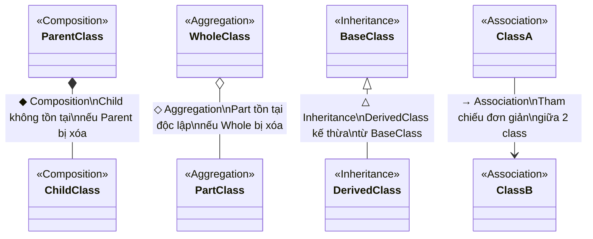

| Ký hiệu | Tên | Mermaid syntax | Ý nghĩa | Ví dụ GreenLens |
|----------|-----|----------------|----------|-----------------|
| ◆ (filled diamond) | **Composition** | `A *-- B` | B **không thể tồn tại** nếu A bị xóa | `Report *-- ReportMedia` — xóa Report → xóa luôn Media |
| ◇ (empty diamond) | **Aggregation** | `A o-- B` | B **vẫn tồn tại** độc lập khi A bị xóa | `LocalOffice o-- EnvironmentalTeam` — team có thể transfer sang office khác |
| △ (triangle) | **Inheritance** | `A <\|-- B` | B kế thừa từ A | `AuditableEntity <\|-- User` |
| → (arrow) | **Association** | `A --> B` | A tham chiếu đến B (lookup, FK) | `Report --> User` — Report tham chiếu reporter |

---

## Hệ thống phân cấp Entity Base (chung cho tất cả module)

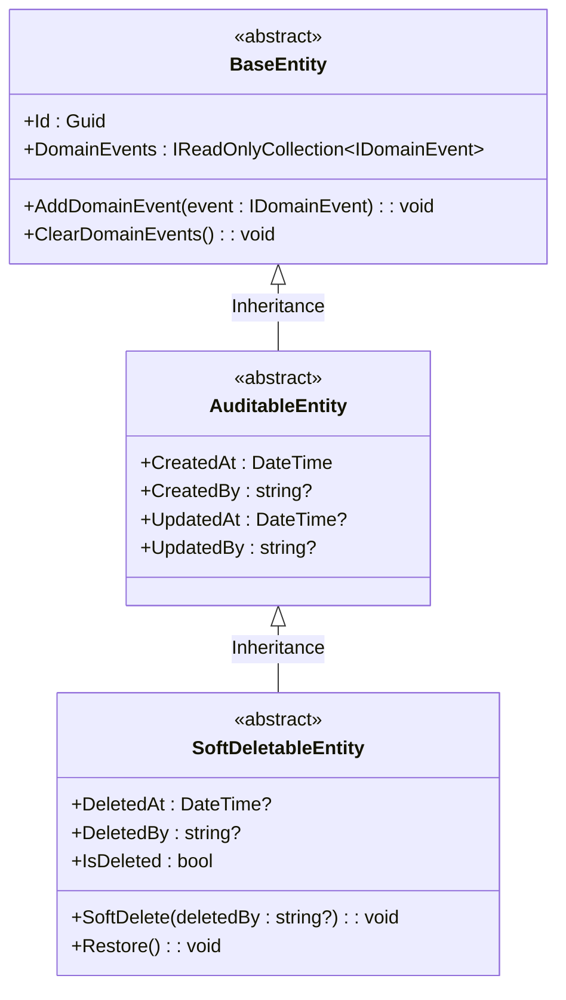

---

## CD-01: User & Authentication Module

**Mô tả:** Quản lý vòng đời tài khoản, xác thực JWT, OTP, social login, lockout, ban.

**Phân loại Relationship:**

| Relationship | Loại | Lý do |
|---|---|---|
| User → RefreshToken | **Composition** ◆ | Token không có ý nghĩa nếu User bị xóa |
| User → OtpCode | **Composition** ◆ | OTP gắn chặt với User, xóa User → xóa OTP |
| User → PasswordHistory | **Composition** ◆ | Lịch sử mật khẩu thuộc về User |
| SoftDeletableEntity → User | **Inheritance** △ | User kế thừa SoftDeletableEntity |

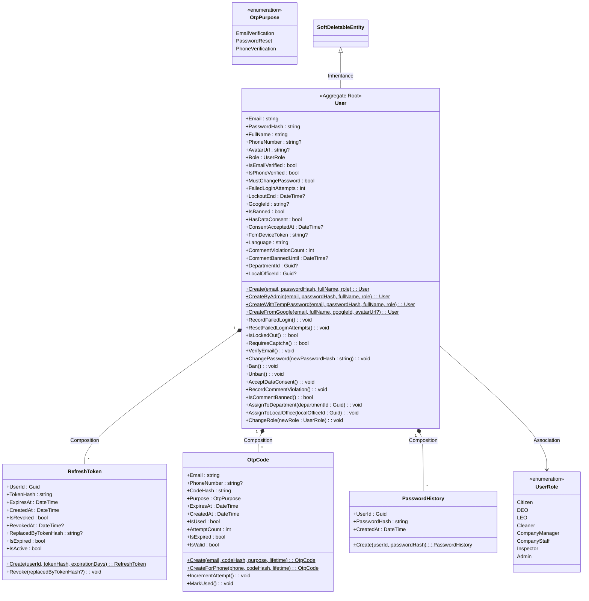

---

## CD-02: Report (Pollution Report) Module

**Mô tả:** Vòng đời báo cáo ô nhiễm — state machine, media, assignment, flag, satisfaction, duplicate detection, AI analysis.

**Phân loại Relationship:**

| Relationship | Loại | Lý do |
|---|---|---|
| Report → ReportMedia | **Composition** ◆ | Media thuộc về Report, xóa Report → xóa Media |
| Report → ReportAssignment | **Composition** ◆ | Assignment không tồn tại nếu Report bị xóa |
| Report → ReportStatusHistory | **Composition** ◆ | Lịch sử trạng thái gắn chặt với Report |
| Report → ReportFlag | **Composition** ◆ | Flag chỉ có ý nghĩa trong context Report |
| Report → ReportSatisfaction | **Composition** ◆ | Đánh giá gắn chặt với Report |
| Report → ReportWasteTag | **Composition** ◆ | Join table, xóa Report → xóa liên kết |
| Report → ReportDraft | **Composition** ◆ | Draft thuộc về Report |
| Report → User | **Association** → | Report tham chiếu reporter, User tồn tại độc lập |
| Report → PollutionCategory | **Association** → | Report lookup danh mục, Category tồn tại độc lập |
| Report → Report | **Association** → | Self-reference: duplicate → parent |
| ReportAssignment → EnvironmentalTeam | **Association** → | Assignment tham chiếu Team, Team tồn tại độc lập |

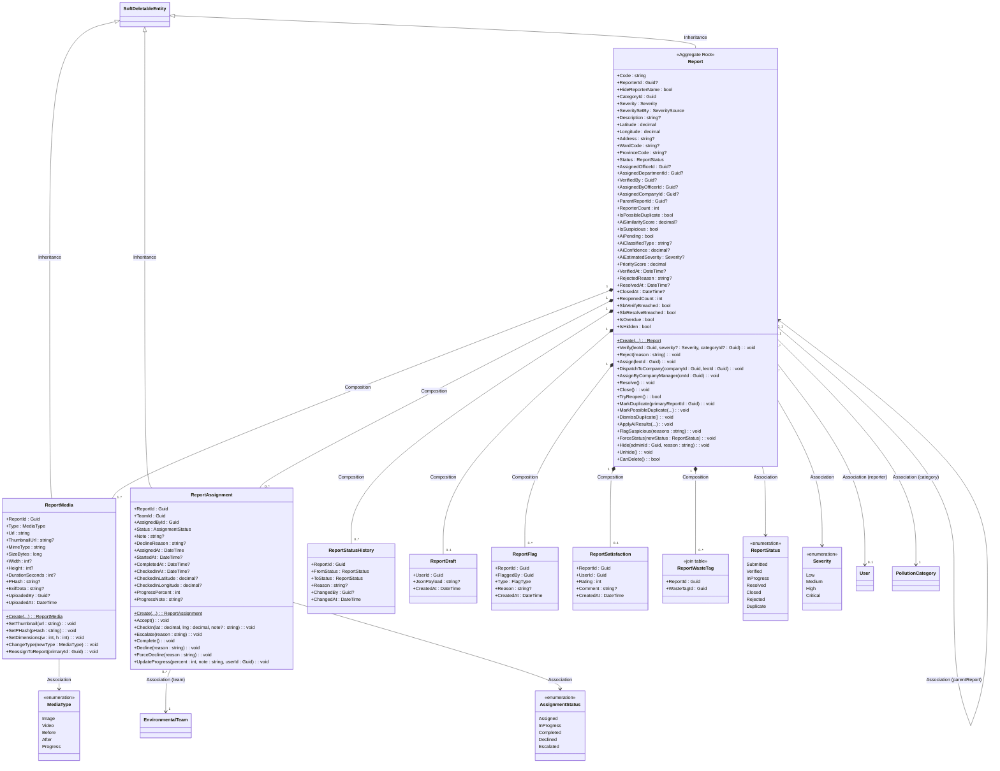

### State Machine — Report Lifecycle

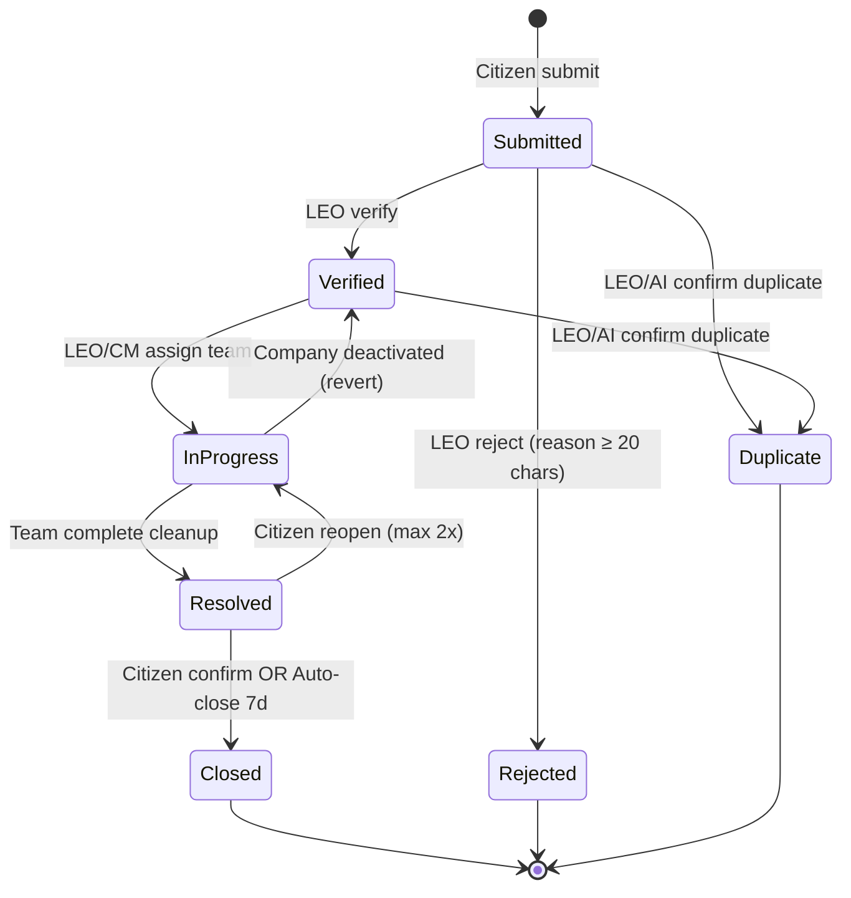

---

## CD-03: Organization Module

**Mô tả:** Cơ cấu tổ chức hành chính (Tỉnh → Phòng ban → Văn phòng phường), Công ty dịch vụ, đội dọn dẹp/thanh tra.

**Phân loại Relationship:**

| Relationship | Loại | Lý do |
|---|---|---|
| Department → LocalOffice | **Composition** ◆ | LocalOffice thuộc về Department, không tồn tại độc lập |
| Company → CompanyStaff | **Composition** ◆ | Staff thuộc về Company, xóa Company → xóa Staff |
| Company → CompanyServiceArea | **Composition** ◆ | Vùng phục vụ gắn chặt với Company |
| Company → ContractPeriod | **Composition** ◆ | Lịch sử hợp đồng thuộc về Company |
| Company → StaffInvitation | **Composition** ◆ | Lời mời thuộc về Company |
| LocalOffice → EnvironmentalTeam | **Aggregation** ◇ | Team có thể transfer sang office khác |
| EnvironmentalTeam → TeamMember | **Aggregation** ◇ | Member (User) tồn tại độc lập, có thể chuyển team |
| Company → EnvironmentalTeam | **Aggregation** ◇ | Company team, team có thể tách ra |
| LocalOffice → User (Officer) | **Association** → | Office tham chiếu LEO, User tồn tại độc lập |
| TeamMember → User | **Association** → | Join table tham chiếu User |
| Company → Department | **Association** → | Company tham chiếu Department |

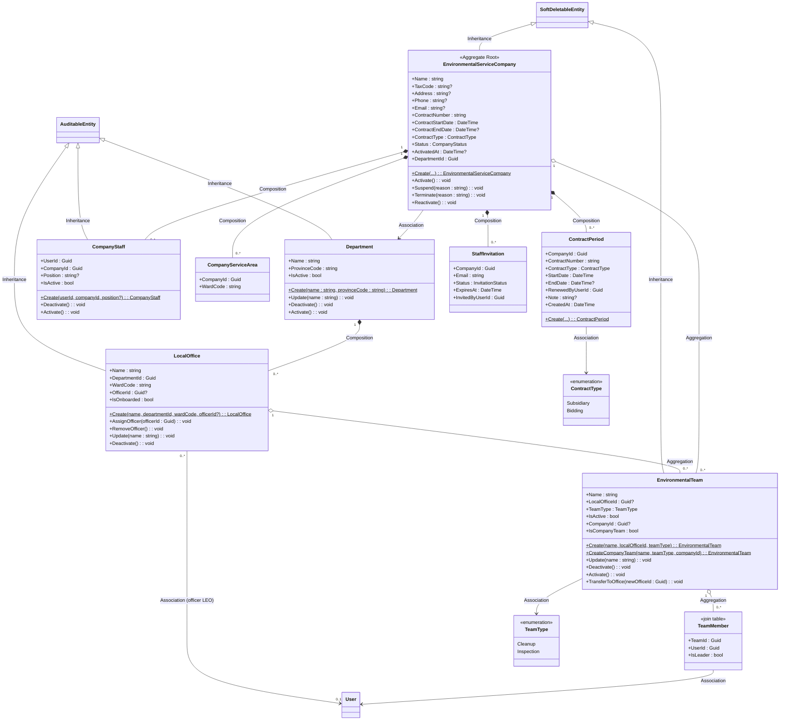

---

## CD-04: Inspection & Penalty Module

**Mô tả:** Quy trình thanh tra vi phạm, lập biên bản xử phạt, quản lý đối tượng vi phạm, theo dõi thanh toán.

**Phân loại Relationship:**

| Relationship | Loại | Lý do |
|---|---|---|
| InspectionReport → PenaltyPayment | **Composition** ◆ | Payment gắn chặt với biên bản, xóa biên bản → xóa payment |
| ViolatingEntity → InspectionReport | **Aggregation** ◇ | Đối tượng vi phạm tồn tại độc lập, có thể liên kết nhiều biên bản |
| InspectionReport → Report | **Association** → | Tham chiếu Report gốc |
| InspectionReport → EnvironmentalTeam | **Association** → | Tham chiếu Team thanh tra |
| PenaltyFramework → PollutionCategory | **Association** → | Tham chiếu danh mục |

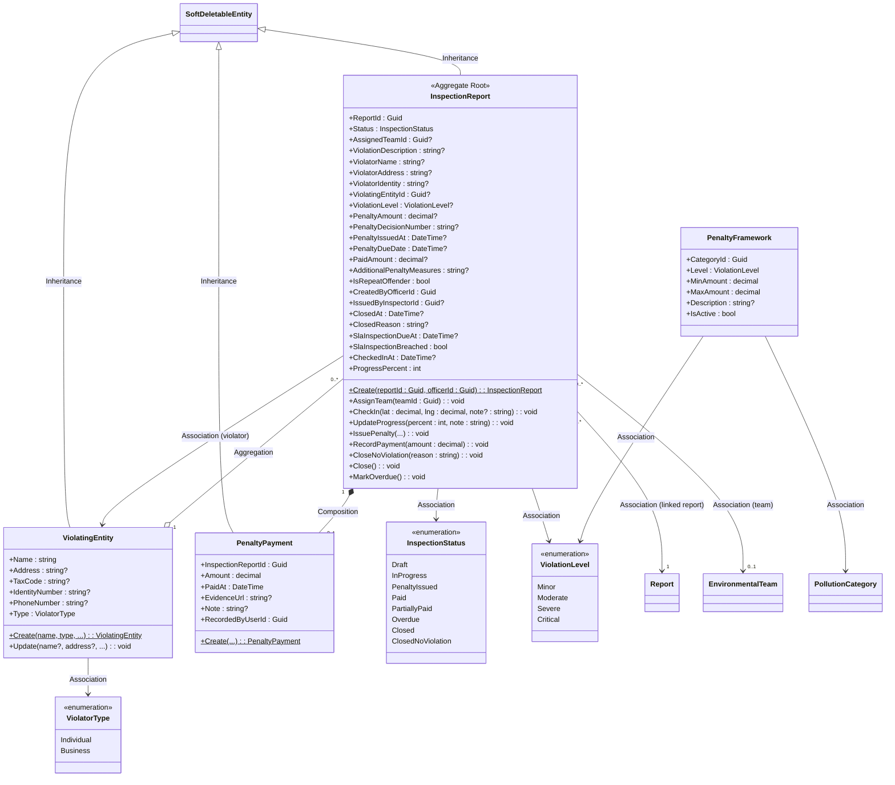

### State Machine — Inspection Lifecycle

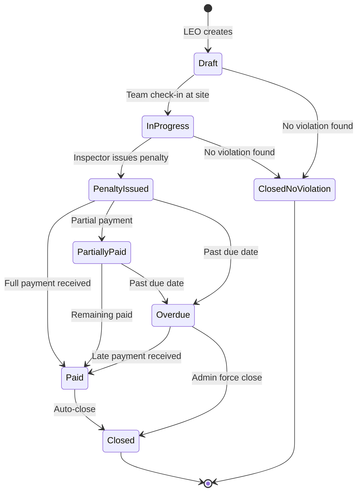

---

## CD-05: Comment & Community Interaction Module

**Mô tả:** Bình luận cộng đồng trên báo cáo, reply, like, media đính kèm, kiểm duyệt nội dung.

**Phân loại Relationship:**

| Relationship | Loại | Lý do |
|---|---|---|
| Comment → CommentMedia | **Composition** ◆ | Media thuộc về Comment, xóa Comment → xóa Media |
| Comment → CommentLike | **Composition** ◆ | Like gắn chặt với Comment |
| Comment → Comment (replies) | **Composition** ◆ | Reply thuộc về Comment cha, xóa cha → xóa reply |
| Comment → Report | **Association** → | Comment tham chiếu Report |
| Comment → User | **Association** → | Comment tham chiếu Author |
| CommentLike → User | **Association** → | Like tham chiếu User |

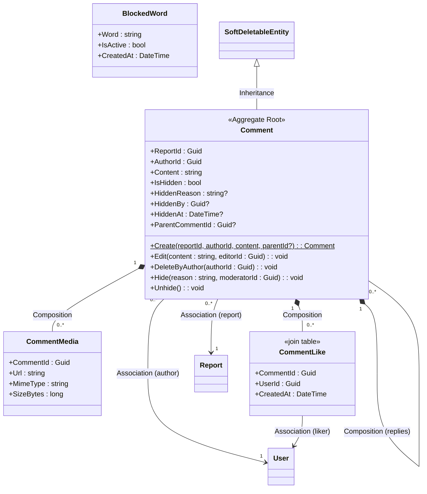

---

## CD-06: Gamification Module

**Mô tả:** Hệ thống điểm thưởng, cấp bậc, huy hiệu, bảng xếp hạng để khuyến khích công dân tham gia.

**Phân loại Relationship:**

| Relationship | Loại | Lý do |
|---|---|---|
| User → UserPoints | **Composition** ◆ | UserPoints thuộc về User (1:1), xóa User → xóa Points |
| UserPoints → PointTransaction | **Composition** ◆ | Transaction gắn chặt với UserPoints |
| User ↔ Badge (qua UserBadge) | **Aggregation** ◇ | Badge tồn tại độc lập (seed data), User chỉ "sở hữu" badge |

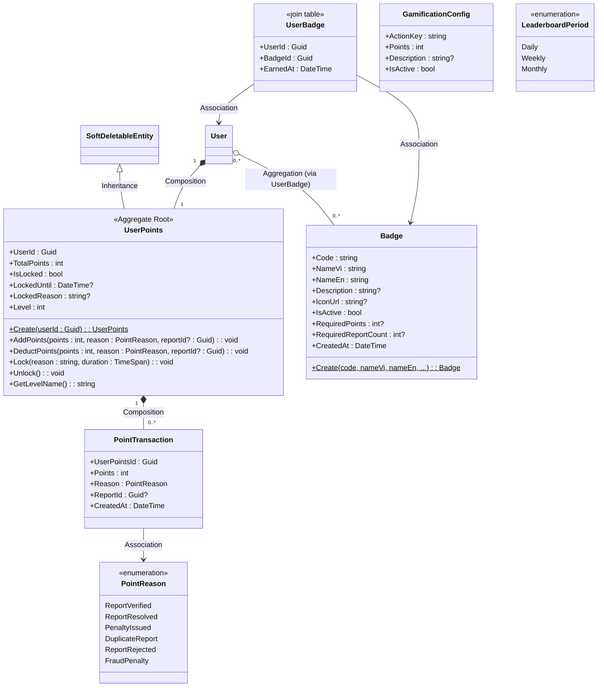

### Level System

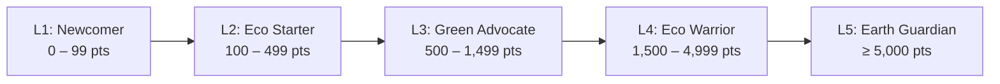

---

## CD-07: Notification Module

**Mô tả:** Hệ thống thông báo đa kênh (push FCM, email, in-app), cài đặt preference, template quản lý bởi Admin.

**Phân loại Relationship:**

| Relationship | Loại | Lý do |
|---|---|---|
| User → Notification | **Composition** ◆ | Notification thuộc về User, xóa User → xóa Notification |
| User → NotificationPreference | **Composition** ◆ | Preference gắn chặt với User |
| NotificationTemplate → NotificationType | **Association** → | Template lookup type |

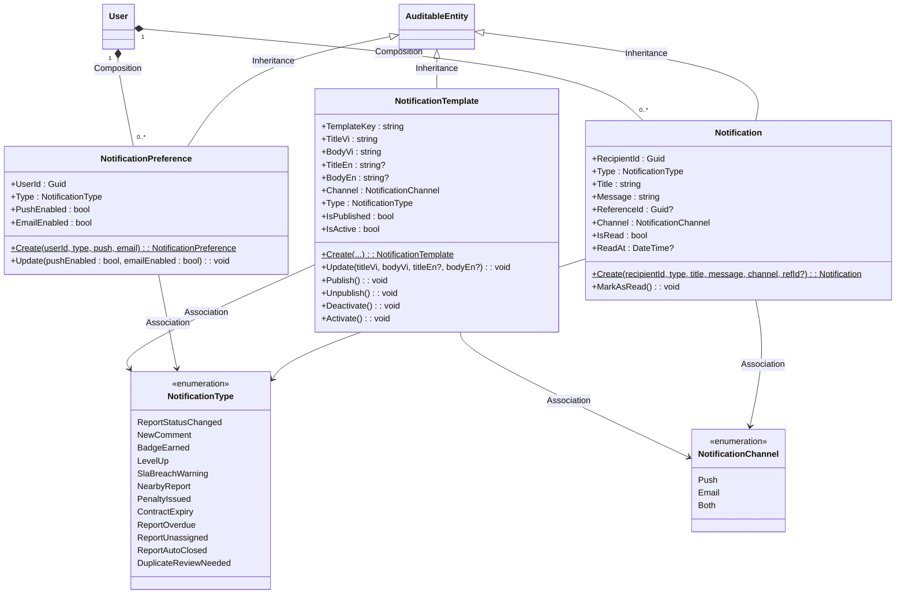

---

## CD-08: Catalog & Location Module

**Mô tả:** Dữ liệu tham chiếu — danh mục ô nhiễm, nhãn phân loại rác, đơn vị hành chính Việt Nam, nhật ký kiểm toán.

**Phân loại Relationship:**

| Relationship | Loại | Lý do |
|---|---|---|
| Province → Ward | **Composition** ◆ | Ward thuộc về Province, không tồn tại ngoài Province |
| Province → AdministrativeRegion | **Association** → | Province tham chiếu Region |
| Province → AdministrativeUnit | **Association** → | Province tham chiếu Unit |
| Report → PollutionCategory | **Association** → | Report lookup Category |
| Report ↔ WasteTag | **Association** → | Nhiều-Nhiều qua join table |

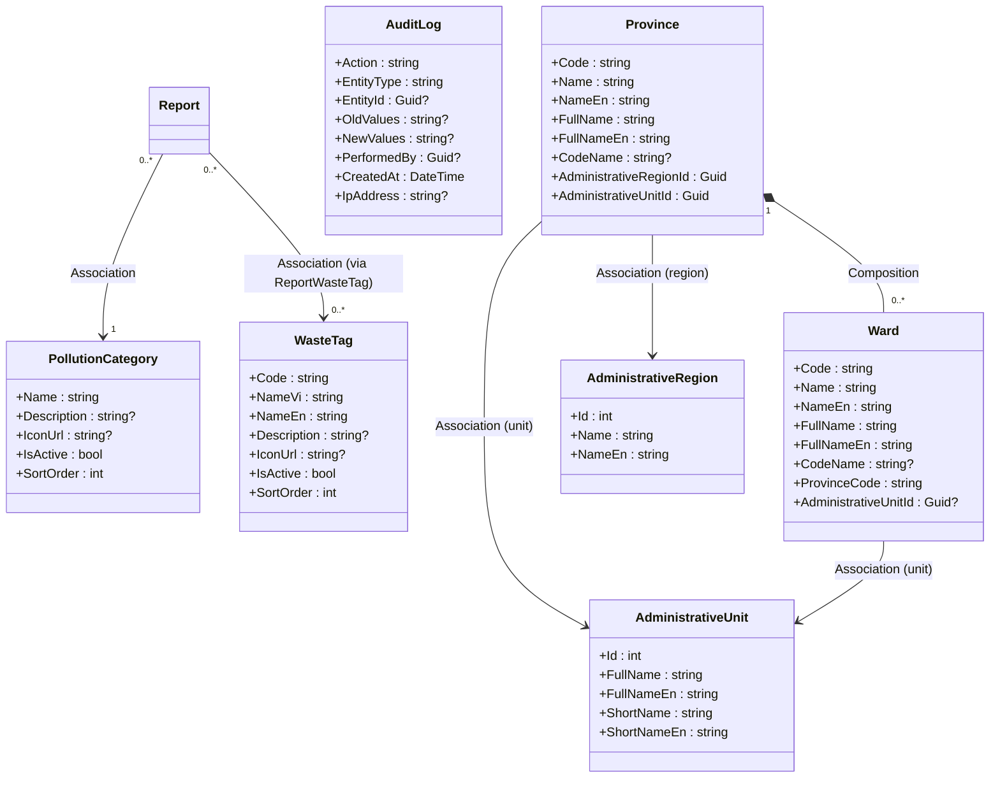

---

## Tổng hợp quan hệ liên module (Cross-Module Overview)

> Diagram tổng quan cấp cao, hiển thị các entity chính và quan hệ cross-module với đầy đủ 4 loại relationship.

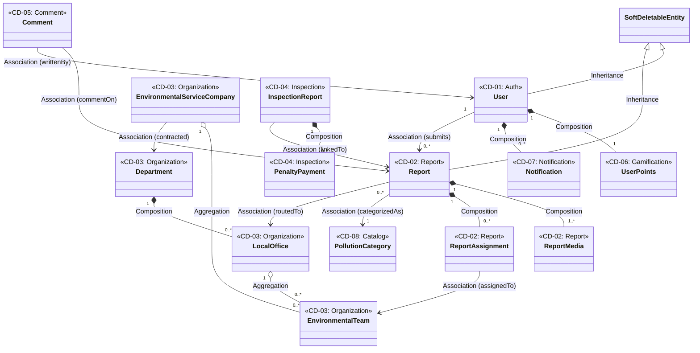
