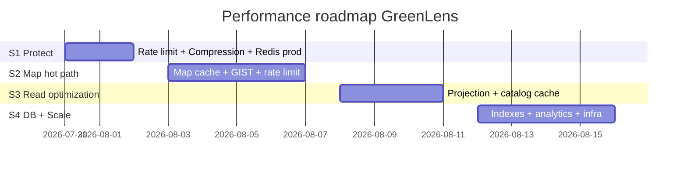

# GreenLens — Performance: Ưu tiên thực thi

> **Dự án:** SU26SE049 — Crowdsourced Application for Reporting Environmental Pollution  
> **Cập nhật:** 2026-07-30  
> **Phạm vi:** Backend .NET 9 · ASP.NET Core 9 · EF Core 9 · PostgreSQL + PostGIS · Redis · Hangfire  
> **Nguồn BR:** `SU26SE049_BusinessRules_v1_2.md` · `.cursor/rules/08-performance.mdc`

Tài liệu này liệt kê **thứ tự ưu tiên** tối ưu hiệu năng dựa trên codebase hiện tại và gap so với BR. **Không bao gồm Observability** (OpenTelemetry, Jaeger, APM stack) — ngoài phạm vi dự án.

---

## 1. Mục tiêu cần đạt

| Metric | Target | BR |
|--------|--------|-----|
| API p95 | < 2s @ ~5.000 CCU | BR-SYS-001 |
| Uptime | ≥ 99.5% / tháng | BR-SYS-003 |
| Throughput dữ liệu | 100.000+ reports | BR-SYS-002 |
| Rate limit API | 60 rpm/IP (anon) · 300 rpm/user (authed) | BR-SYS-004 |
| Map refresh | ≤ 20 lần/phút/user | BR-MAP-012 |
| Submit report quota | 5/h · 20/24h per user | BR-REP-010 |

---

## 2. Hiện trạng codebase (baseline)

### Đã có — không cần làm lại

| Hạng mục | Evidence |
|----------|----------|
| Read path `AsNoTracking()` | Hầu hết query handlers |
| Pagination list endpoints | `pageSize` mặc định 20, max 100 |
| Background jobs (Hangfire) | SLA, auto-close, duplicate AI Tier 2, leaderboard snapshot… |
| Submit rate limit | `IReportSubmissionRateLimiter` — Redis hoặc in-memory dev |
| **Global API rate limit (P0)** | `PerformanceServiceExtensions` — 60 rpm/IP · 300 rpm/user (BR-SYS-004) |
| **Response compression** | Brotli + Gzip (`UseResponseCompression`) |
| **Redis required prod** | `RedisInfrastructureOptions.Required` — fail fast staging/prod |
| Map cơ bản | Bbox limit, aggregate mode, làm tròn tọa độ `BR-MAP-004` |
| PostGIS | Check-in distance, nearby citizen notification |
| Profanity cache | `BlockedWordCache` in-memory |
| Transaction pipeline | `TransactionBehavior` wrap commands |

### Chưa có / thiếu — cần thực thi

| Hạng mục | Trạng thái | BR |
|----------|------------|-----|
| Redis cache map 10' | ❌ | BR-MAP-012 |
| Geo GIST index cho map | ❌ (filter lat/lng range scan) | BR-MAP-* |
| Projection DTO thay Include nặng | ⚠️ một phần | 08-performance.mdc |
| Cache catalog / leaderboard | ❌ | BR-GAM-005, BR-MAP-012 |
| Analytics gom query | ⚠️ nhiều CountAsync tuần tự | — |
| Export audit stream | ⚠️ load full rows vào memory | BR-OFF-022 pattern |

---

## 3. Ưu tiên thực thi

### P0 — Bảo vệ hệ thống + giảm tải ngay (1–2 ngày) ✅ **HOÀN THÀNH 2026-07-30**

| # | Task | Mô tả | Touchpoints | BR | Status |
|---|------|--------|-------------|-----|--------|
| P0-1 | **Global rate limiting** | `AddRateLimiter` sliding window; anon 60/min/IP · authed 300/min/user; 429 + `Retry-After` + `API_RATE_LIMIT_EXCEEDED` | `PerformanceServiceExtensions.cs`, `Program.cs`, `ApiRateLimitOptions` | BR-SYS-004 | ✅ |
| P0-2 | **Response compression** | Brotli (ưu tiên) + Gzip fallback | `PerformanceServiceExtensions.cs`, `UseResponseCompression()` | 08-performance | ✅ |
| P0-3 | **Redis bắt buộc staging/prod** | `Redis:Required=true` production → fail fast nếu thiếu `ConnectionStrings:Redis` | `RedisInfrastructureOptions`, `DependencyInjection.cs`, `appsettings.Production.json` | BR-REP-010 | ✅ |

**Evidence code:**

- `src/Greenlens.Api/Extensions/PerformanceServiceExtensions.cs`
- `src/Greenlens.Api/RateLimiting/ApiRateLimitPartitionResolver.cs`
- `src/Greenlens.Infrastructure/Options/RedisInfrastructureOptions.cs`

**FE impact:** Xem [fe-performance-p0-api-guide.md](../Changelogs/fe-performance-p0-api-guide.md).

**Lưu ý vận hành:** Global limiter hiện **in-process per API instance** (ASP.NET `RateLimiter`). Submit quota vẫn dùng Redis sliding window. Khi scale >1 node, cân nhắc Redis-backed global limit (P3) hoặc sticky session — hiện tại mỗi node có bucket riêng.

---

### P1 — Hot path API (impact cao nhất, 3–5 ngày)

| # | Task | Mô tả | Touchpoints | BR |
|---|------|--------|-------------|-----|
| P1-1 | **Redis cache Map 10 phút** | Key `map:nearby:{bbox}:{category}:{mode}`; TTL 10'; invalidate khi report public đổi status trong vùng | `GetPublicMapReportsQueryHandler`, infra cache adapter | BR-MAP-012 |
| P1-2 | **Rate limit map refresh** | ≤ 20 request/phút/user trên endpoint map | Map controller / middleware per-feature | BR-MAP-012 |
| P1-3 | **Geo index (GIST)** | Thêm `geometry(Point,4326)` + GIST trên `reports`; query PostGIS `ST_Intersects` thay lat/lng BETWEEN | Migration, `ReportConfiguration`, map handler | BR-MAP-* |
| P1-4 | **Bỏ Count() thừa** | `GetPublicMapReportsQueryHandler` gọi `baseQuery.Count()` trước fetch — bỏ hoặc dùng meta từ kết quả | `GetPublicMapReportsQueryHandler.cs` | — |
| P1-5 | **Projection report detail** | `GetReportById`: thay 6× `Include` bằng `.Select()` / Mapster projection | `GetReportByIdQueryHandler.cs` | 08-performance |
| P1-6 | **Projection officer/inspection queue** | Tương tự cho `GetOfficerQueue`, `GetInspectionQueue`, `GetAdminReports` | Features/Reports, Features/Inspection | 08-performance |
| P1-7 | **Cache read-heavy catalog** | Categories, waste tags (1h); wards theo province (24h) | Catalog handlers, `IDistributedCache` | — |
| P1-8 | **Cache leaderboard** | TTL 5 phút hoặc đọc từ `LeaderboardSnapshotJob` | `GetLeaderboardQueryHandler` | BR-GAM-005 |

**Endpoint ưu tiên profile thủ công (không cần APM):**

- `GET /map/public-reports` — traffic citizen cao nhất  
- `GET /reports/{id}` — Include nặng  
- `GET` officer/inspection/admin queues  
- `GET /gamification/leaderboard`

---

### P2 — Database & ổn định (2–3 ngày)

| # | Task | Mô tả | Touchpoints |
|---|------|--------|-------------|
| P2-1 | **Connection pool tuning** | `Maximum Pool Size`, `Command Timeout` trên connection string prod | appsettings / env |
| P2-2 | **Index bổ sung** | `(status, created_at)` composite; partial `(is_hidden, status)` cho public map; `(created_at, entity_type)` audit_logs | EF migration + comment justify |
| P2-3 | **Analytics gom query** | Admin dashboard: nhiều `CountAsync` → 1 query `GROUP BY` hoặc materialized view refresh hourly | `Features/Analytics/*` |
| P2-4 | **Audit log write path** | `AuditLogger` SaveChanges riêng → cùng UoW hoặc batch flush | `AuditLogger.cs`, handlers |
| P2-5 | **Export audit streaming** | `ExportAuditLogs` dùng `IAsyncEnumerable` stream CSV, không load hết memory | `ExportAuditLogsQueryHandler` |
| P2-6 | **Duplicate Tier 1 PostGIS** | Thay Haversine in-memory bằng `ST_DWithin` trên DB khi đã có cột geo | `SubmitPollutionReportCommandHandler` |

**Index đề xuất (migration comment bắt buộc):**

```sql
-- reports queue + map
CREATE INDEX ix_reports_status_created_at ON reports (status, created_at);
CREATE INDEX ix_reports_public_map ON reports (status, is_hidden) WHERE is_hidden = false;

-- geo (sau khi thêm cột location)
CREATE INDEX ix_reports_location_gist ON reports USING GIST (location);
```

---

### P3 — Scale horizontal & infra (khi deploy prod)

| # | Task | Mô tả |
|---|------|--------|
| P3-1 | **CDN trước R2** | Ảnh/video qua CDN; API chỉ trả presigned URL |
| P3-2 | **Tách Hangfire worker** | API node HTTP-only; worker node chạy recurring jobs |
| P3-3 | **SignalR Redis backplane** | Khi > 1 API instance — `NotificationHub` |
| P3-4 | **Prod: không auto-migrate startup** | Dùng `dotnet ef migrations bundle` thay `MigrateDatabaseAsync()` |
| P3-5 | **AI service scale** | Python classify/compare tách replica; timeout 5s (BR-AI-006) |

---

## 4. Lộ trình đề xuất (4 sprint ngắn)

| Sprint | Phạm vi | Deliverable |
|--------|---------|-------------|
| **S1** | P0 | ✅ Rate limit global + compression + Redis prod config (2026-07-30) |
| **S2** | P1 (map) | Map cache + geo GIST + bỏ Count thừa + map rate limit |
| **S3** | P1 (read) | Projection report/queue + catalog/leaderboard cache |
| **S4** | P2 + P3 | Index migration, analytics gom query, infra scale checklist |



---

## 5. Redis cache — quy ước key (BR-MAP-012, 08-performance)

| Endpoint / data | TTL | Key pattern | Invalidate khi |
|-----------------|-----|-------------|----------------|
| Public map pins | 10 min | `map:nearby:{bboxHash}:{categoryId}:{mode}` | Report verified/status public đổi trong bbox |
| Public hotspots | 10 min | `map:hotspots:{bboxHash}:{filters}` | Hotspot job / new verified report (future) |
| Leaderboard | 5 min | `gamification:leaderboard:{period}:{year}:{month}` | Points awarded (optional lazy TTL) |
| Pollution categories | 1 hour | `catalog:categories` | Admin CRUD category |
| Waste tags | 1 hour | `catalog:waste-tags` | Admin CRUD tag |
| Wards by province | 24 hour | `catalog:wards:{provinceCode}` | Seed/migration only |

---

## 6. Kiểm tra hiệu năng (không Observability stack)

Chạy **một lần trên staging** trước và sau mỗi sprint — dùng k6/NBomber, đọc report thời gian response trực tiếp:

| Scenario | % traffic | Target p95 (staging) |
|----------|-----------|----------------------|
| Map pan/zoom | 40% | < 800 ms |
| Get report detail | 20% | < 1 s |
| Officer queue | 15% | < 1.5 s |
| Login | 10% | < 500 ms |
| Admin analytics | 10% | < 2 s |
| Submit report | 5% | < 2 s |

**Pass criteria sprint:** p95 map + report detail giảm ≥ 30% so với baseline sau S2–S3.

---

## 7. Top 5 việc nên làm trước (tóm tắt)

1. ~~**Global rate limit + Redis prod**~~ ✅ P0 done — tiếp **Map Redis cache + geo GIST** (P1)
2. **Map Redis cache 10' + geo GIST** — BR-MAP-012, hot path citizen  
3. ~~**Response compression (Brotli)**~~ ✅ P0 done  
4. **Projection `GetReportById` + queue handlers** — giảm ORM overhead  
5. **Cache catalog + leaderboard** — read-heavy, ít thay đổi  

---

## 8. Liên kết tài liệu

| File | Nội dung |
|------|----------|
| [BACKEND_ARCHITECTURE.md](./BACKEND_ARCHITECTURE.md) | Kiến trúc layer, Redis/Hangfire trong diagram |
| [br_v12_comparison_report.md](./br_v12_comparison_report.md) | BR coverage — Map, BR-SYS-004 status |
| `.cursor/rules/08-performance.mdc` | Rule bắt buộc pagination, cache, compression |
| `CLAUDE.md` §10 | Performance targets tổng quan |

---

## 9. Change log

| Ngày | Thay đổi |
|------|----------|
| 2026-07-30 | **P0 implemented:** global rate limit (BR-SYS-004), Brotli compression, `Redis:Required` prod. FE guide: `fe-performance-p0-api-guide.md` |
| 2026-07-30 | Tạo tài liệu — ưu tiên P0–P3, loại trừ Observability theo quyết định dự án |
