# GreenLens — Sequence Diagrams (22 ⭐ Ưu tiên)

> **Dự án:** SU26SE049 — Crowdsourced Application for Reporting Environmental Pollution  
> **Tổng quan:** 22 Sequence Diagram ưu tiên cho bài bảo vệ tốt nghiệp, dựa trên source code thực tế.  
> **Thứ tự:** Theo luồng trải nghiệm người dùng: Auth → Report → Cleanup → Inspection → Organization → Community → Gamification → Notification → Map → Media → Admin

> [!NOTE]
> **Quy ước đặt tên UML:** Các object backend sử dụng prefix `:` theo chuẩn UML instance notation (vd: `:AuthController`, `:IUserRepository`).  
> **Hạn chế Mermaid:** Mermaid tự lặp participant box ở dưới cùng — đây là hạn chế render, không phải chuẩn UML. Nếu cần bản chuẩn, export sang draw.io hoặc StarUML.

---

## Nhóm 1: Authentication & Account

---

### SD-01 ⭐ Register (Email + OTP)

**Actor:** Citizen · **BR:** BR-AUTH-001, BR-AUTH-003, BR-AUTH-005, BR-DAT-001

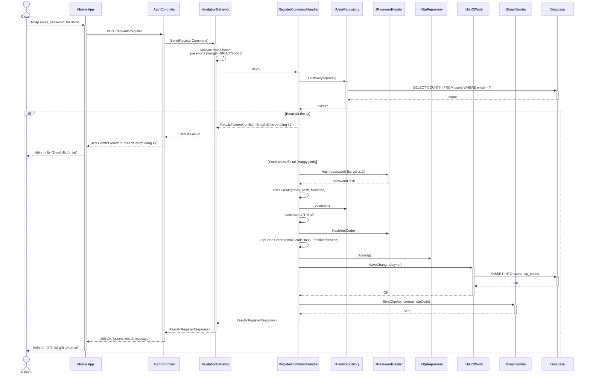
```mermaid
sequenceDiagram
    actor Citizen
    participant App as Mobile App
    participant Ctrl as :AuthController
    participant Val as :ValidationBehavior
    participant Hdl as :RegisterCommandHandler
    participant Repo as :IUserRepository
    participant Hash as :IPasswordHasher
    participant OtpRepo as :IOtpRepository
    participant UoW as :IUnitOfWork
    participant Email as :IEmailSender
    participant DB as Database

    Citizen->>+App: Nhập email, password, fullName
    App->>+Ctrl: POST /api/auth/register
    Ctrl->>+Val: Send(RegisterCommand)
    Val->>Val: Validate email format,<br/>password strength [BR-AUTH-005]
    Val->>+Hdl: next()

    Hdl->>+Repo: ExistsAsync(email)
    Repo->>+DB: SELECT COUNT(*) FROM users WHERE email = ?
    DB-->>-Repo: count
    Repo-->>-Hdl: exists?

    alt Email đã tồn tại
        Hdl-->>Val: Result.Failure(Conflict: "Email đã được đăng ký")
        Val-->>Ctrl: Result.Failure
        Ctrl-->>App: 409 Conflict {error: "Email đã được đăng ký"}
        App-->>Citizen: Hiển thị lỗi "Email đã tồn tại"
    else Email chưa tồn tại (Happy path)
        Hdl->>+Hash: Hash(password) [bcrypt ≥12]
        Hash-->>-Hdl: passwordHash

        Hdl->>Hdl: User.Create(email, hash, fullName)
        Hdl->>Repo: Add(user)

        Hdl->>Hdl: Generate OTP 6 số
        Hdl->>Hash: Hash(otpCode)
        Hdl->>Hdl: OtpCode.Create(email, codeHash, EmailVerification)
        Hdl->>OtpRepo: Add(otp)

        Hdl->>+UoW: SaveChangesAsync()
        UoW->>+DB: INSERT INTO users, otp_codes
        DB-->>-UoW: OK
        UoW-->>-Hdl: OK

        Hdl->>+Email: SendOtpAsync(email, otpCode)
        Email-->>-Hdl: Sent

        Hdl-->>-Val: Result<RegisterResponse>
        Val-->>-Ctrl: Result<RegisterResponse>
        Ctrl-->>-App: 200 OK {userId, email, message}
        App-->>-Citizen: Hiển thị "OTP đã gửi tới email"
    end
```

---

### SD-02 ⭐ Login (Email / Password)

**Actor:** All · **BR:** BR-AUTH-013, BR-AUTH-014, BR-AUTH-015, BR-AUTH-016

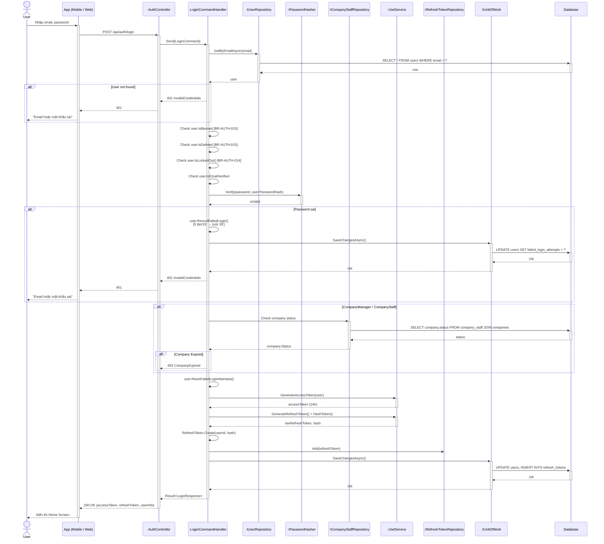
```mermaid
sequenceDiagram
    actor User
    participant App as App (Mobile / Web)
    participant Ctrl as :AuthController
    participant Hdl as :LoginCommandHandler
    participant Repo as :IUserRepository
    participant Hash as :IPasswordHasher
    participant Staff as :ICompanyStaffRepository
    participant JWT as :IJwtService
    participant TknRepo as :IRefreshTokenRepository
    participant UoW as :IUnitOfWork
    participant DB as Database

    User->>+App: Nhập email, password
    App->>+Ctrl: POST /api/auth/login
    Ctrl->>+Hdl: Send(LoginCommand)

    Hdl->>+Repo: GetByEmailAsync(email)
    Repo->>+DB: SELECT * FROM users WHERE email = ?
    DB-->>-Repo: row
    Repo-->>-Hdl: user

    alt User not found
        Hdl-->>Ctrl: 401 InvalidCredentials
        Ctrl-->>App: 401
        App-->>User: "Email hoặc mật khẩu sai"
    end

    Hdl->>Hdl: Check user.IsBanned [BR-AUTH-015]
    Hdl->>Hdl: Check user.IsDeleted [BR-AUTH-015]
    Hdl->>Hdl: Check user.IsLockedOut() [BR-AUTH-014]
    Hdl->>Hdl: Check user.IsEmailVerified

    Hdl->>+Hash: Verify(password, user.PasswordHash)
    Hash-->>-Hdl: isValid

    alt Password sai
        Hdl->>Hdl: user.RecordFailedLogin()<br/>[5 lần/15' → lock 30']
        Hdl->>+UoW: SaveChangesAsync()
        UoW->>+DB: UPDATE users SET failed_login_attempts = ?
        DB-->>-UoW: OK
        UoW-->>-Hdl: OK
        Hdl-->>Ctrl: 401 InvalidCredentials
        Ctrl-->>App: 401
        App-->>User: "Email hoặc mật khẩu sai"
    end

    alt CompanyManager / CompanyStaff
        Hdl->>+Staff: Check company status
        Staff->>+DB: SELECT company.status FROM company_staff JOIN companies
        DB-->>-Staff: status
        Staff-->>-Hdl: company.Status
        alt Company Expired
            Hdl-->>Ctrl: 403 CompanyExpired
        end
    end

    Hdl->>Hdl: user.ResetFailedLoginAttempts()

    Hdl->>+JWT: GenerateAccessToken(user)
    JWT-->>-Hdl: accessToken (24h)
    Hdl->>+JWT: GenerateRefreshToken() + HashToken()
    JWT-->>-Hdl: rawRefreshToken, hash

    Hdl->>Hdl: RefreshToken.Create(userId, hash)
    Hdl->>TknRepo: Add(refreshToken)

    Hdl->>+UoW: SaveChangesAsync()
    UoW->>+DB: UPDATE users, INSERT INTO refresh_tokens
    DB-->>-UoW: OK
    UoW-->>-Hdl: OK

    Hdl-->>-Ctrl: Result<LoginResponse>
    Ctrl-->>-App: 200 OK {accessToken, refreshToken, userInfo}
    App-->>-User: Hiển thị Home Screen
```

---

### SD-04 ⭐ Refresh Token (Rotation)

**Actor:** All · **BR:** BR-AUTH-013

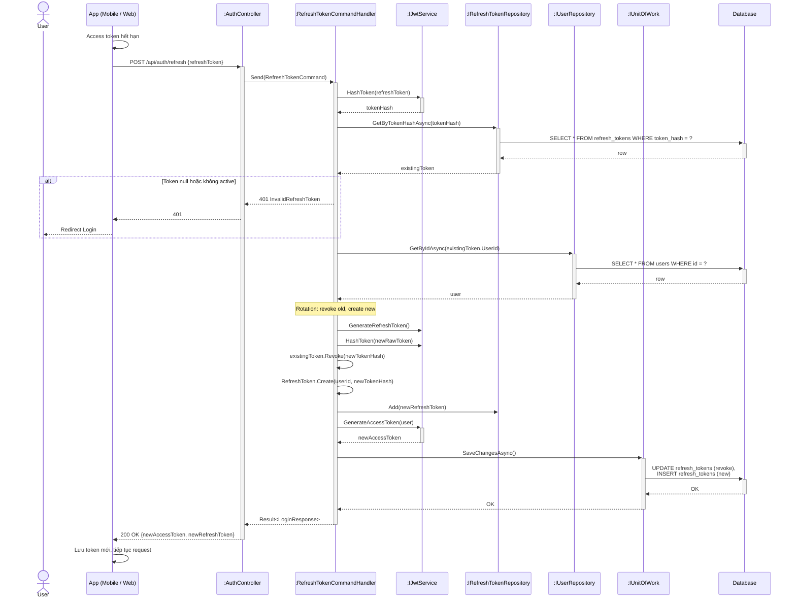
```mermaid
sequenceDiagram
    actor User
    participant App as App (Mobile / Web)
    participant Ctrl as :AuthController
    participant Hdl as :RefreshTokenCommandHandler
    participant JWT as :IJwtService
    participant TknRepo as :IRefreshTokenRepository
    participant UserRepo as :IUserRepository
    participant UoW as :IUnitOfWork
    participant DB as Database

    App->>App: Access token hết hạn
    App->>+Ctrl: POST /api/auth/refresh {refreshToken}
    Ctrl->>+Hdl: Send(RefreshTokenCommand)

    Hdl->>+JWT: HashToken(refreshToken)
    JWT-->>-Hdl: tokenHash

    Hdl->>+TknRepo: GetByTokenHashAsync(tokenHash)
    TknRepo->>+DB: SELECT * FROM refresh_tokens WHERE token_hash = ?
    DB-->>-TknRepo: row
    TknRepo-->>-Hdl: existingToken

    alt Token null hoặc không active
        Hdl-->>Ctrl: 401 InvalidRefreshToken
        Ctrl-->>App: 401
        App-->>User: Redirect Login
    end

    Hdl->>+UserRepo: GetByIdAsync(existingToken.UserId)
    UserRepo->>+DB: SELECT * FROM users WHERE id = ?
    DB-->>-UserRepo: row
    UserRepo-->>-Hdl: user

    Note over Hdl: Rotation: revoke old, create new
    Hdl->>JWT: GenerateRefreshToken()
    Hdl->>JWT: HashToken(newRawToken)
    Hdl->>Hdl: existingToken.Revoke(newTokenHash)
    Hdl->>Hdl: RefreshToken.Create(userId, newTokenHash)
    Hdl->>TknRepo: Add(newRefreshToken)

    Hdl->>+JWT: GenerateAccessToken(user)
    JWT-->>-Hdl: newAccessToken

    Hdl->>+UoW: SaveChangesAsync()
    UoW->>+DB: UPDATE refresh_tokens (revoke),<br/>INSERT refresh_tokens (new)
    DB-->>-UoW: OK
    UoW-->>-Hdl: OK

    Hdl-->>-Ctrl: Result<LoginResponse>
    Ctrl-->>-App: 200 OK {newAccessToken, newRefreshToken}
    App->>App: Lưu token mới, tiếp tục request
```

---

## Nhóm 2: Report Lifecycle — Core ⭐

---

### SD-09 ⭐ Submit Pollution Report

**Actor:** Citizen · **BR:** BR-REP-001, BR-REP-003, BR-REP-004, BR-REP-005, BR-REP-010, BR-REP-011, BR-REP-013, BR-REP-030, BR-ORG-010

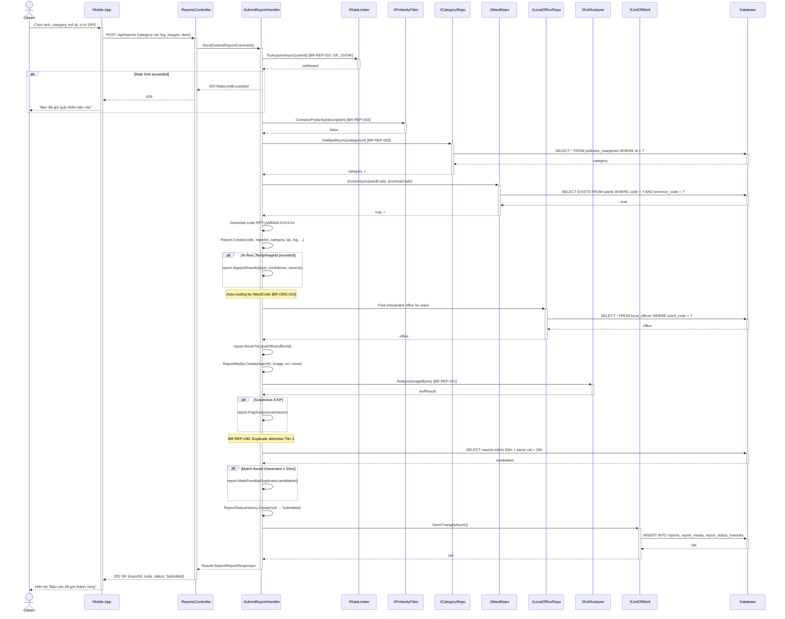
```mermaid
sequenceDiagram
    actor Citizen
    participant App as Mobile App
    participant Ctrl as :ReportsController
    participant Hdl as :SubmitReportHandler
    participant Rate as :IRateLimiter
    participant Prof as :IProfanityFilter
    participant CatRepo as :ICategoryRepo
    participant WardRepo as :IWardRepo
    participant OffRepo as :ILocalOfficeRepo
    participant EXIF as :IExifAnalyzer
    participant UoW as :IUnitOfWork
    participant DB as Database

    Citizen->>+App: Chọn ảnh, category, mô tả, vị trí GPS
    App->>+Ctrl: POST /api/reports {category, lat, lng, images, desc}
    Ctrl->>+Hdl: Send(SubmitReportCommand)

    Hdl->>+Rate: TryAcquireAsync(userId) [BR-REP-010: 5/h, 20/24h]
    Rate-->>-Hdl: isAllowed
    alt Rate limit exceeded
        Hdl-->>Ctrl: 429 RateLimitExceeded
        Ctrl-->>App: 429
        App-->>Citizen: "Bạn đã gửi quá nhiều báo cáo"
    end

    Hdl->>+Prof: ContainsProfanity(description) [BR-REP-004]
    Prof-->>-Hdl: false

    Hdl->>+CatRepo: GetByIdAsync(categoryId) [BR-REP-005]
    CatRepo->>+DB: SELECT * FROM pollution_categories WHERE id = ?
    DB-->>-CatRepo: category
    CatRepo-->>-Hdl: category ✓

    Hdl->>+WardRepo: ExistsAsync(wardCode, provinceCode)
    WardRepo->>+DB: SELECT EXISTS FROM wards WHERE code = ? AND province_code = ?
    DB-->>-WardRepo: true
    WardRepo-->>-Hdl: true ✓

    Hdl->>Hdl: Generate code RPT-yyMMdd-XXXXXX
    Hdl->>Hdl: Report.Create(code, reporter, category, lat, lng, ...)

    alt AI flow (TempImageId provided)
        Hdl->>Hdl: report.ApplyAiResults(type, confidence, severity)
    end

    Note over Hdl: Auto-routing by WardCode [BR-ORG-010]
    Hdl->>+OffRepo: Find onboarded office for ward
    OffRepo->>+DB: SELECT * FROM local_offices WHERE ward_code = ?
    DB-->>-OffRepo: office
    OffRepo-->>-Hdl: office
    Hdl->>Hdl: report.RouteToLocalOffice(officeId)

    Hdl->>Hdl: ReportMedia.Create(reportId, Image, url, mime)

    Hdl->>+EXIF: Analyze(imageBytes) [BR-REP-011]
    EXIF-->>-Hdl: exifResult
    alt Suspicious EXIF
        Hdl->>Hdl: report.FlagSuspicious(reason)
    end

    Note over Hdl: BR-REP-030: Duplicate detection Tier 1
    Hdl->>+DB: SELECT reports within 50m + same cat + 24h
    DB-->>-Hdl: candidates
    alt Match found (Haversine ≤ 50m)
        Hdl->>Hdl: report.MarkPossibleDuplicate(candidateId)
    end

    Hdl->>Hdl: ReportStatusHistory.Create(null → Submitted)

    Hdl->>+UoW: SaveChangesAsync()
    UoW->>+DB: INSERT INTO reports, report_media, report_status_histories
    DB-->>-UoW: OK
    UoW-->>-Hdl: OK

    Hdl-->>-Ctrl: Result<SubmitReportResponse>
    Ctrl-->>-App: 200 OK {reportId, code, status: Submitted}
    App-->>-Citizen: Hiển thị "Báo cáo đã gửi thành công"
```

---

### SD-11 ⭐ Verify Report

**Actor:** LEO · **BR:** BR-REP-020, BR-REP-021

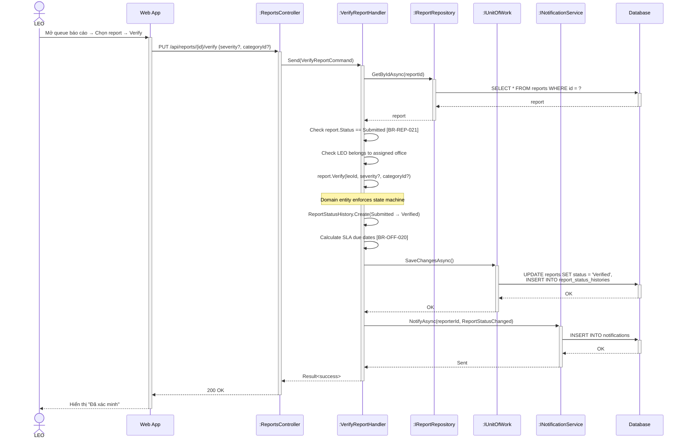
```mermaid
sequenceDiagram
    actor LEO
    participant App as Web App
    participant Ctrl as :ReportsController
    participant Hdl as :VerifyReportHandler
    participant Repo as :IReportRepository
    participant UoW as :IUnitOfWork
    participant Notif as :INotificationService
    participant DB as Database

    LEO->>+App: Mở queue báo cáo → Chọn report → Verify
    App->>+Ctrl: PUT /api/reports/{id}/verify {severity?, categoryId?}
    Ctrl->>+Hdl: Send(VerifyReportCommand)

    Hdl->>+Repo: GetByIdAsync(reportId)
    Repo->>+DB: SELECT * FROM reports WHERE id = ?
    DB-->>-Repo: report
    Repo-->>-Hdl: report

    Hdl->>Hdl: Check report.Status == Submitted [BR-REP-021]
    Hdl->>Hdl: Check LEO belongs to assigned office

    Hdl->>Hdl: report.Verify(leoId, severity?, categoryId?)
    Note over Hdl: Domain entity enforces state machine
    Hdl->>Hdl: ReportStatusHistory.Create(Submitted → Verified)
    Hdl->>Hdl: Calculate SLA due dates [BR-OFF-020]

    Hdl->>+UoW: SaveChangesAsync()
    UoW->>+DB: UPDATE reports SET status = 'Verified',<br/>INSERT INTO report_status_histories
    DB-->>-UoW: OK
    UoW-->>-Hdl: OK

    Hdl->>+Notif: NotifyAsync(reporterId, ReportStatusChanged)
    Notif->>+DB: INSERT INTO notifications
    DB-->>-Notif: OK
    Notif-->>-Hdl: Sent

    Hdl-->>-Ctrl: Result<success>
    Ctrl-->>-App: 200 OK
    App-->>-LEO: Hiển thị "Đã xác minh"
```

---

### SD-12 ⭐ Reject Report

**Actor:** LEO · **BR:** BR-REP-021

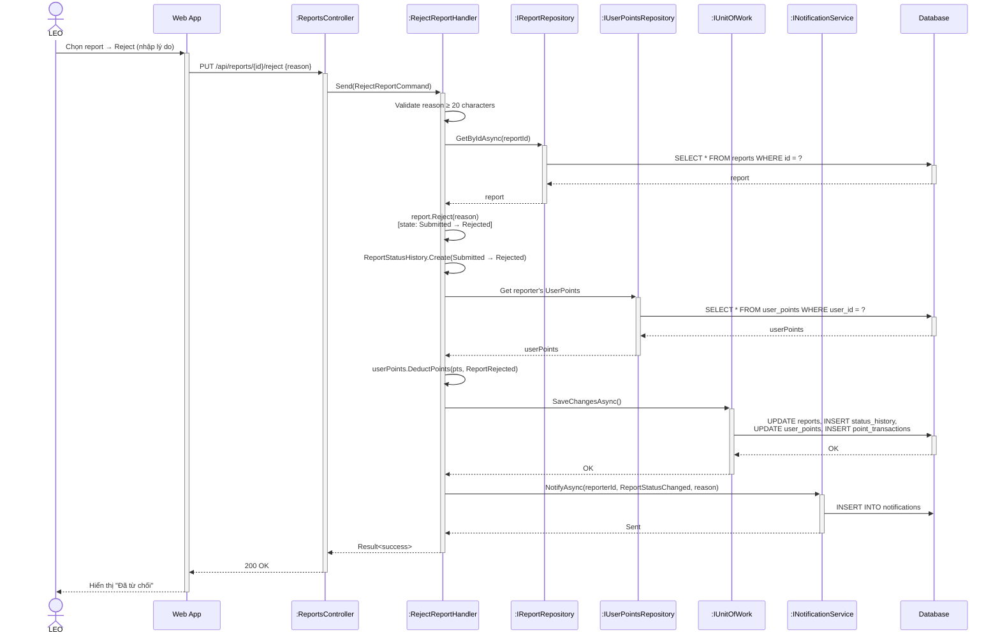
```mermaid
sequenceDiagram
    actor LEO
    participant App as Web App
    participant Ctrl as :ReportsController
    participant Hdl as :RejectReportHandler
    participant Repo as :IReportRepository
    participant PtsRepo as :IUserPointsRepository
    participant UoW as :IUnitOfWork
    participant Notif as :INotificationService
    participant DB as Database

    LEO->>+App: Chọn report → Reject (nhập lý do)
    App->>+Ctrl: PUT /api/reports/{id}/reject {reason}
    Ctrl->>+Hdl: Send(RejectReportCommand)

    Hdl->>Hdl: Validate reason ≥ 20 characters

    Hdl->>+Repo: GetByIdAsync(reportId)
    Repo->>+DB: SELECT * FROM reports WHERE id = ?
    DB-->>-Repo: report
    Repo-->>-Hdl: report

    Hdl->>Hdl: report.Reject(reason)<br/>[state: Submitted → Rejected]
    Hdl->>Hdl: ReportStatusHistory.Create(Submitted → Rejected)

    Hdl->>+PtsRepo: Get reporter's UserPoints
    PtsRepo->>+DB: SELECT * FROM user_points WHERE user_id = ?
    DB-->>-PtsRepo: userPoints
    PtsRepo-->>-Hdl: userPoints
    Hdl->>Hdl: userPoints.DeductPoints(pts, ReportRejected)

    Hdl->>+UoW: SaveChangesAsync()
    UoW->>+DB: UPDATE reports, INSERT status_history,<br/>UPDATE user_points, INSERT point_transactions
    DB-->>-UoW: OK
    UoW-->>-Hdl: OK

    Hdl->>+Notif: NotifyAsync(reporterId, ReportStatusChanged, reason)
    Notif->>DB: INSERT INTO notifications
    Notif-->>-Hdl: Sent

    Hdl-->>-Ctrl: Result<success>
    Ctrl-->>-App: 200 OK
    App-->>-LEO: Hiển thị "Đã từ chối"
```

---

### SD-13 ⭐ Assign Cleanup Team

**Actor:** LEO · **BR:** BR-OFF-001, BR-CLN-001

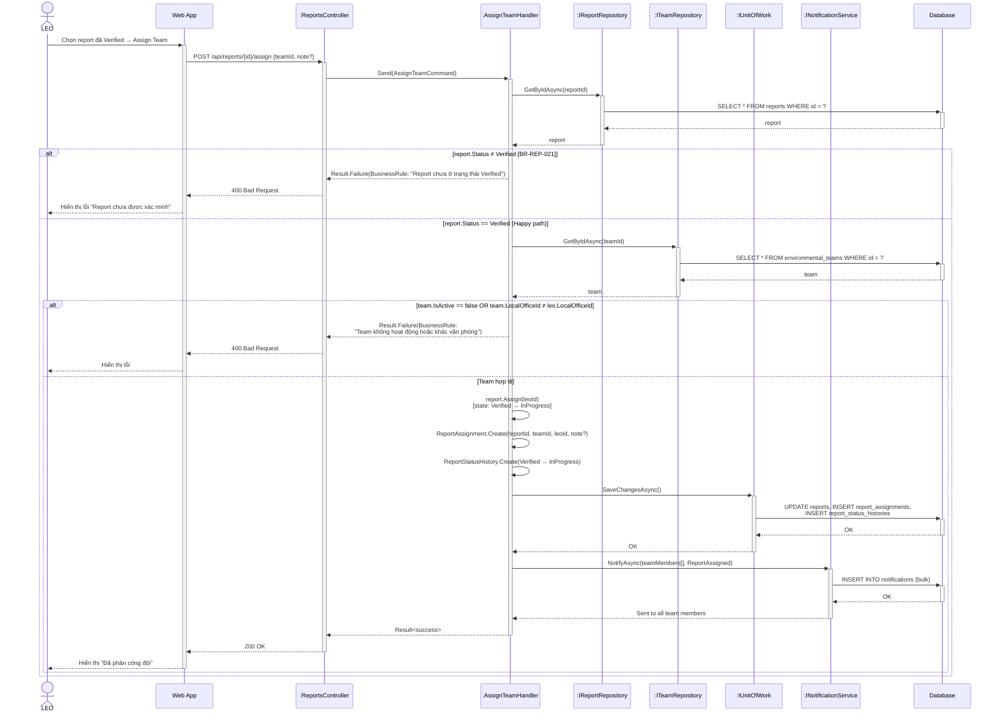
```mermaid
sequenceDiagram
    actor LEO
    participant App as Web App
    participant Ctrl as :ReportsController
    participant Hdl as :AssignTeamHandler
    participant RptRepo as :IReportRepository
    participant TeamRepo as :ITeamRepository
    participant UoW as :IUnitOfWork
    participant Notif as :INotificationService
    participant DB as Database

    LEO->>+App: Chọn report đã Verified → Assign Team
    App->>+Ctrl: POST /api/reports/{id}/assign {teamId, note?}
    Ctrl->>+Hdl: Send(AssignTeamCommand)

    Hdl->>+RptRepo: GetByIdAsync(reportId)
    RptRepo->>+DB: SELECT * FROM reports WHERE id = ?
    DB-->>-RptRepo: report
    RptRepo-->>-Hdl: report

    alt report.Status ≠ Verified [BR-REP-021]
        Hdl-->>Ctrl: Result.Failure(BusinessRule: "Report chưa ở trạng thái Verified")
        Ctrl-->>App: 400 Bad Request
        App-->>LEO: Hiển thị lỗi "Report chưa được xác minh"
    else report.Status == Verified (Happy path)
        Hdl->>+TeamRepo: GetByIdAsync(teamId)
        TeamRepo->>+DB: SELECT * FROM environmental_teams WHERE id = ?
        DB-->>-TeamRepo: team
        TeamRepo-->>-Hdl: team

        alt team.IsActive == false OR team.LocalOfficeId ≠ leo.LocalOfficeId
            Hdl-->>Ctrl: Result.Failure(BusinessRule:<br/>"Team không hoạt động hoặc khác văn phòng")
            Ctrl-->>App: 400 Bad Request
            App-->>LEO: Hiển thị lỗi
        else Team hợp lệ
            Hdl->>Hdl: report.Assign(leoId)<br/>[state: Verified → InProgress]
            Hdl->>Hdl: ReportAssignment.Create(reportId, teamId, leoId, note?)
            Hdl->>Hdl: ReportStatusHistory.Create(Verified → InProgress)

            Hdl->>+UoW: SaveChangesAsync()
            UoW->>+DB: UPDATE reports, INSERT report_assignments,<br/>INSERT report_status_histories
            DB-->>-UoW: OK
            UoW-->>-Hdl: OK

            Hdl->>+Notif: NotifyAsync(teamMembers[], ReportAssigned)
            Notif->>+DB: INSERT INTO notifications (bulk)
            DB-->>-Notif: OK
            Notif-->>-Hdl: Sent to all team members

            Hdl-->>-Ctrl: Result<success>
            Ctrl-->>-App: 200 OK
            App-->>-LEO: Hiển thị "Đã phân công đội"
        end
    end
```

---

### SD-15 ⭐ Resolve Report

**Actor:** Cleaner/CompanyStaff · **BR:** BR-CLN-004, BR-REP-020

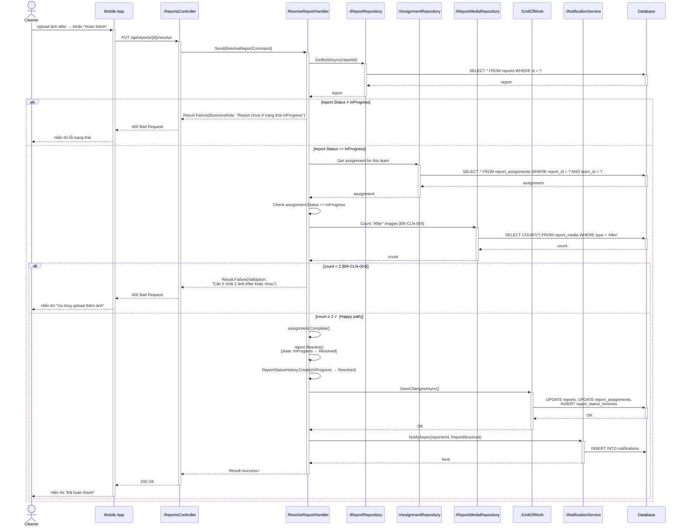
```mermaid
sequenceDiagram
    actor Cleaner
    participant App as Mobile App
    participant Ctrl as :ReportsController
    participant Hdl as :ResolveReportHandler
    participant RptRepo as :IReportRepository
    participant AsgRepo as :IAssignmentRepository
    participant MediaRepo as :IReportMediaRepository
    participant UoW as :IUnitOfWork
    participant Notif as :INotificationService
    participant DB as Database

    Cleaner->>+App: Upload ảnh after → Nhấn "Hoàn thành"
    App->>+Ctrl: PUT /api/reports/{id}/resolve
    Ctrl->>+Hdl: Send(ResolveReportCommand)

    Hdl->>+RptRepo: GetByIdAsync(reportId)
    RptRepo->>+DB: SELECT * FROM reports WHERE id = ?
    DB-->>-RptRepo: report
    RptRepo-->>-Hdl: report

    alt report.Status ≠ InProgress
        Hdl-->>Ctrl: Result.Failure(BusinessRule: "Report chưa ở trạng thái InProgress")
        Ctrl-->>App: 400 Bad Request
        App-->>Cleaner: Hiển thị lỗi trạng thái
    else report.Status == InProgress
        Hdl->>+AsgRepo: Get assignment for this team
        AsgRepo->>+DB: SELECT * FROM report_assignments WHERE report_id = ? AND team_id = ?
        DB-->>-AsgRepo: assignment
        AsgRepo-->>-Hdl: assignment
        Hdl->>Hdl: Check assignment.Status == InProgress

        Hdl->>+MediaRepo: Count "After" images [BR-CLN-004]
        MediaRepo->>+DB: SELECT COUNT(*) FROM report_media WHERE type = 'After'
        DB-->>-MediaRepo: count
        MediaRepo-->>-Hdl: count

        alt count < 2 [BR-CLN-004]
            Hdl-->>Ctrl: Result.Failure(Validation:<br/>"Cần ít nhất 2 ảnh After khác nhau")
            Ctrl-->>App: 400 Bad Request
            App-->>Cleaner: Hiển thị "Vui lòng upload thêm ảnh"
        else count ≥ 2 ✓ (Happy path)
            Hdl->>Hdl: assignment.Complete()
            Hdl->>Hdl: report.Resolve()<br/>[state: InProgress → Resolved]
            Hdl->>Hdl: ReportStatusHistory.Create(InProgress → Resolved)

            Hdl->>+UoW: SaveChangesAsync()
            UoW->>+DB: UPDATE reports, UPDATE report_assignments,<br/>INSERT report_status_histories
            DB-->>-UoW: OK
            UoW-->>-Hdl: OK

            Hdl->>+Notif: NotifyAsync(reporterId, ReportResolved)
            Notif->>DB: INSERT INTO notifications
            Notif-->>-Hdl: Sent

            Hdl-->>-Ctrl: Result<success>
            Ctrl-->>-App: 200 OK
            App-->>-Cleaner: Hiển thị "Đã hoàn thành"
        end
    end
```

---

### SD-16 ⭐ Close Report (Citizen Confirm / Auto-close)

**Actor:** Citizen / System · **BR:** BR-REP-016, BR-REP-025

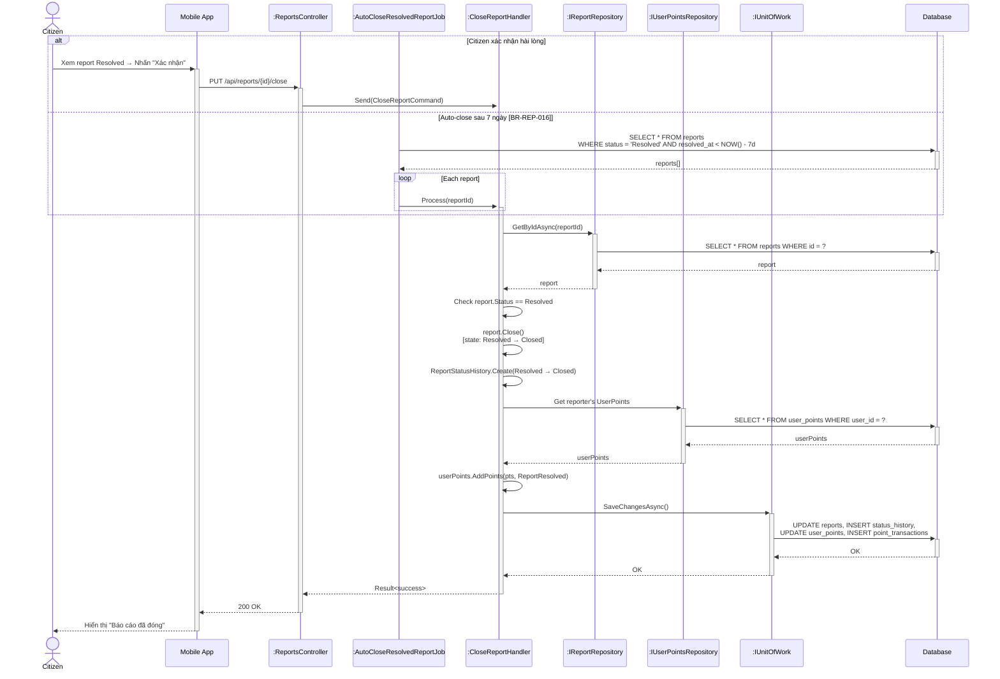
```mermaid
sequenceDiagram
    actor Citizen
    participant App as Mobile App
    participant Ctrl as :ReportsController
    participant Job as :AutoCloseResolvedReportJob
    participant Hdl as :CloseReportHandler
    participant RptRepo as :IReportRepository
    participant PtsRepo as :IUserPointsRepository
    participant UoW as :IUnitOfWork
    participant DB as Database

    alt Citizen xác nhận hài lòng
        Citizen->>+App: Xem report Resolved → Nhấn "Xác nhận"
        App->>+Ctrl: PUT /api/reports/{id}/close
        Ctrl->>+Hdl: Send(CloseReportCommand)
    else Auto-close sau 7 ngày [BR-REP-016]
        Job->>+DB: SELECT * FROM reports<br/>WHERE status = 'Resolved' AND resolved_at < NOW() - 7d
        DB-->>-Job: reports[]
        loop Each report
            Job->>+Hdl: Process(reportId)
        end
    end

    Hdl->>+RptRepo: GetByIdAsync(reportId)
    RptRepo->>+DB: SELECT * FROM reports WHERE id = ?
    DB-->>-RptRepo: report
    RptRepo-->>-Hdl: report
    Hdl->>Hdl: Check report.Status == Resolved

    Hdl->>Hdl: report.Close()<br/>[state: Resolved → Closed]
    Hdl->>Hdl: ReportStatusHistory.Create(Resolved → Closed)

    Hdl->>+PtsRepo: Get reporter's UserPoints
    PtsRepo->>+DB: SELECT * FROM user_points WHERE user_id = ?
    DB-->>-PtsRepo: userPoints
    PtsRepo-->>-Hdl: userPoints
    Hdl->>Hdl: userPoints.AddPoints(pts, ReportResolved)

    Hdl->>+UoW: SaveChangesAsync()
    UoW->>+DB: UPDATE reports, INSERT status_history,<br/>UPDATE user_points, INSERT point_transactions
    DB-->>-UoW: OK
    UoW-->>-Hdl: OK

    Hdl-->>-Ctrl: Result<success>
    Ctrl-->>-App: 200 OK
    App-->>-Citizen: Hiển thị "Báo cáo đã đóng"
```

---

### SD-18 ⭐ Duplicate Detection & Handling

**Actor:** AI / LEO · **BR:** BR-REP-030, BR-REP-032, BR-AI-002

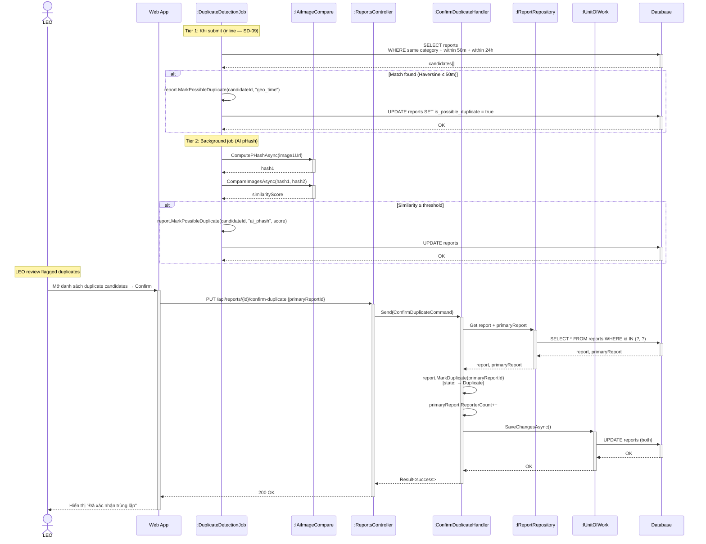
```mermaid
sequenceDiagram
    actor LEO
    participant App as Web App
    participant Job as :DuplicateDetectionJob
    participant AI as :IAiImageCompare
    participant Ctrl as :ReportsController
    participant Hdl as :ConfirmDuplicateHandler
    participant Repo as :IReportRepository
    participant UoW as :IUnitOfWork
    participant DB as Database

    Note over Job: Tier 1: Khi submit (inline — SD-09)
    Job->>+DB: SELECT reports<br/>WHERE same category + within 50m + within 24h
    DB-->>-Job: candidates[]
    alt Match found (Haversine ≤ 50m)
        Job->>Job: report.MarkPossibleDuplicate(candidateId, "geo_time")
        Job->>+DB: UPDATE reports SET is_possible_duplicate = true
        DB-->>-Job: OK
    end

    Note over Job: Tier 2: Background job (AI pHash)
    Job->>+AI: ComputePHashAsync(image1Url)
    AI-->>-Job: hash1
    Job->>+AI: CompareImagesAsync(hash1, hash2)
    AI-->>-Job: similarityScore
    alt Similarity ≥ threshold
        Job->>Job: report.MarkPossibleDuplicate(candidateId, "ai_phash", score)
        Job->>+DB: UPDATE reports
        DB-->>-Job: OK
    end

    Note over LEO: LEO review flagged duplicates
    LEO->>+App: Mở danh sách duplicate candidates → Confirm
    App->>+Ctrl: PUT /api/reports/{id}/confirm-duplicate {primaryReportId}
    Ctrl->>+Hdl: Send(ConfirmDuplicateCommand)

    Hdl->>+Repo: Get report + primaryReport
    Repo->>+DB: SELECT * FROM reports WHERE id IN (?, ?)
    DB-->>-Repo: report, primaryReport
    Repo-->>-Hdl: report, primaryReport

    Hdl->>Hdl: report.MarkDuplicate(primaryReportId)<br/>[state: → Duplicate]
    Hdl->>Hdl: primaryReport.ReporterCount++

    Hdl->>+UoW: SaveChangesAsync()
    UoW->>+DB: UPDATE reports (both)
    DB-->>-UoW: OK
    UoW-->>-Hdl: OK

    Hdl-->>-Ctrl: Result<success>
    Ctrl-->>-App: 200 OK
    App-->>-LEO: Hiển thị "Đã xác nhận trùng lặp"
```

---

## Nhóm 3: Cleanup & Field Work

---

### SD-21 ⭐ Accept / Decline Assignment

**Actor:** Cleaner/CompanyStaff · **BR:** BR-CLN-001

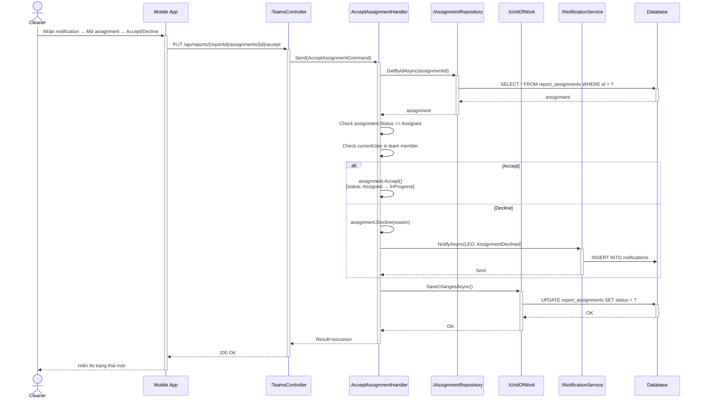
```mermaid
sequenceDiagram
    actor Cleaner
    participant App as Mobile App
    participant Ctrl as :TeamsController
    participant Hdl as :AcceptAssignmentHandler
    participant AsgRepo as :IAssignmentRepository
    participant UoW as :IUnitOfWork
    participant Notif as :INotificationService
    participant DB as Database

    Cleaner->>+App: Nhận notification → Mở assignment → Accept/Decline
    App->>+Ctrl: PUT /api/reports/{reportId}/assignments/{id}/accept
    Ctrl->>+Hdl: Send(AcceptAssignmentCommand)

    Hdl->>+AsgRepo: GetByIdAsync(assignmentId)
    AsgRepo->>+DB: SELECT * FROM report_assignments WHERE id = ?
    DB-->>-AsgRepo: assignment
    AsgRepo-->>-Hdl: assignment

    Hdl->>Hdl: Check assignment.Status == Assigned
    Hdl->>Hdl: Check currentUser is team member

    alt Accept
        Hdl->>Hdl: assignment.Accept()<br/>[status: Assigned → InProgress]
    else Decline
        Hdl->>Hdl: assignment.Decline(reason)
        Hdl->>+Notif: NotifyAsync(LEO, AssignmentDeclined)
        Notif->>DB: INSERT INTO notifications
        Notif-->>-Hdl: Sent
    end

    Hdl->>+UoW: SaveChangesAsync()
    UoW->>+DB: UPDATE report_assignments SET status = ?
    DB-->>-UoW: OK
    UoW-->>-Hdl: OK

    Hdl-->>-Ctrl: Result<success>
    Ctrl-->>-App: 200 OK
    App-->>-Cleaner: Hiển thị trạng thái mới
```

---

### SD-22 ⭐ Check-in at Cleanup Site

**Actor:** Cleaner/CompanyStaff · **BR:** BR-CLN-002

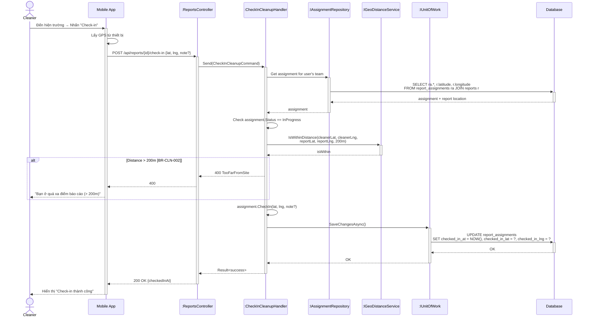
```mermaid
sequenceDiagram
    actor Cleaner
    participant App as Mobile App
    participant Ctrl as :ReportsController
    participant Hdl as :CheckInCleanupHandler
    participant AsgRepo as :IAssignmentRepository
    participant Geo as :IGeoDistanceService
    participant UoW as :IUnitOfWork
    participant DB as Database

    Cleaner->>+App: Đến hiện trường → Nhấn "Check-in"
    App->>App: Lấy GPS từ thiết bị
    App->>+Ctrl: POST /api/reports/{id}/check-in {lat, lng, note?}
    Ctrl->>+Hdl: Send(CheckInCleanupCommand)

    Hdl->>+AsgRepo: Get assignment for user's team
    AsgRepo->>+DB: SELECT ra.*, r.latitude, r.longitude<br/>FROM report_assignments ra JOIN reports r
    DB-->>-AsgRepo: assignment + report location
    AsgRepo-->>-Hdl: assignment

    Hdl->>Hdl: Check assignment.Status == InProgress

    Hdl->>+Geo: IsWithinDistance(cleanerLat, cleanerLng,<br/>reportLat, reportLng, 200m)
    Geo-->>-Hdl: isWithin

    alt Distance > 200m [BR-CLN-002]
        Hdl-->>Ctrl: 400 TooFarFromSite
        Ctrl-->>App: 400
        App-->>Cleaner: "Bạn ở quá xa điểm báo cáo (> 200m)"
    end

    Hdl->>Hdl: assignment.CheckIn(lat, lng, note?)

    Hdl->>+UoW: SaveChangesAsync()
    UoW->>+DB: UPDATE report_assignments<br/>SET checked_in_at = NOW(), checked_in_lat = ?, checked_in_lng = ?
    DB-->>-UoW: OK
    UoW-->>-Hdl: OK

    Hdl-->>-Ctrl: Result<success>
    Ctrl-->>-App: 200 OK {checkedInAt}
    App-->>-Cleaner: Hiển thị "Check-in thành công"
```

---

## Nhóm 4: Inspection & Penalty

---

### SD-28 ⭐ Create Inspection Report

**Actor:** LEO · **BR:** BR-INS-001

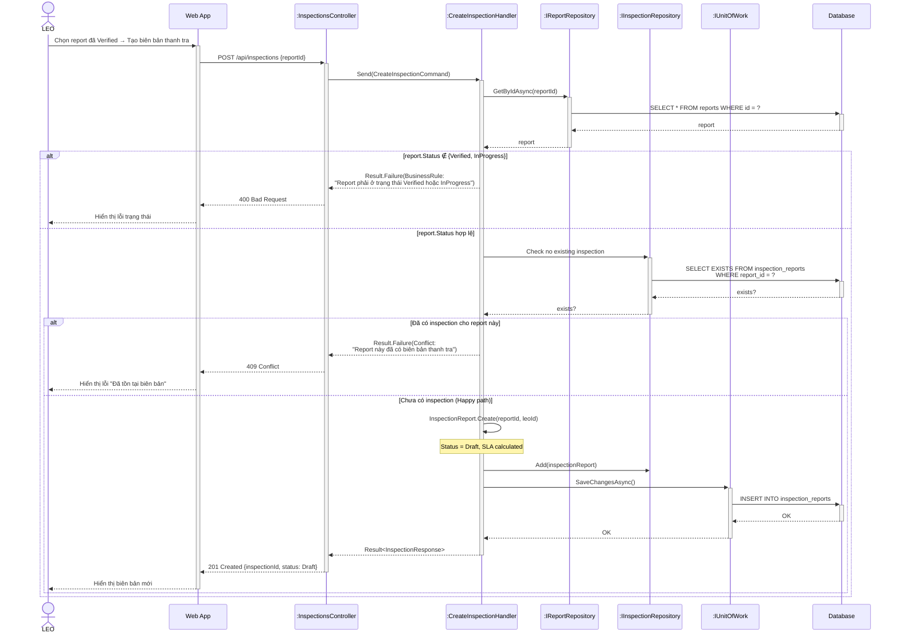
```mermaid
sequenceDiagram
    actor LEO
    participant App as Web App
    participant Ctrl as :InspectionsController
    participant Hdl as :CreateInspectionHandler
    participant RptRepo as :IReportRepository
    participant InspRepo as :IInspectionRepository
    participant UoW as :IUnitOfWork
    participant DB as Database

    LEO->>+App: Chọn report đã Verified → Tạo biên bản thanh tra
    App->>+Ctrl: POST /api/inspections {reportId}
    Ctrl->>+Hdl: Send(CreateInspectionCommand)

    Hdl->>+RptRepo: GetByIdAsync(reportId)
    RptRepo->>+DB: SELECT * FROM reports WHERE id = ?
    DB-->>-RptRepo: report
    RptRepo-->>-Hdl: report

    alt report.Status ∉ {Verified, InProgress}
        Hdl-->>Ctrl: Result.Failure(BusinessRule:<br/>"Report phải ở trạng thái Verified hoặc InProgress")
        Ctrl-->>App: 400 Bad Request
        App-->>LEO: Hiển thị lỗi trạng thái
    else report.Status hợp lệ
        Hdl->>+InspRepo: Check no existing inspection
        InspRepo->>+DB: SELECT EXISTS FROM inspection_reports<br/>WHERE report_id = ?
        DB-->>-InspRepo: exists?
        InspRepo-->>-Hdl: exists?

        alt Đã có inspection cho report này
            Hdl-->>Ctrl: Result.Failure(Conflict:<br/>"Report này đã có biên bản thanh tra")
            Ctrl-->>App: 409 Conflict
            App-->>LEO: Hiển thị lỗi "Đã tồn tại biên bản"
        else Chưa có inspection (Happy path)
            Hdl->>Hdl: InspectionReport.Create(reportId, leoId)
            Note over Hdl: Status = Draft, SLA calculated
            Hdl->>InspRepo: Add(inspectionReport)

            Hdl->>+UoW: SaveChangesAsync()
            UoW->>+DB: INSERT INTO inspection_reports
            DB-->>-UoW: OK
            UoW-->>-Hdl: OK

            Hdl-->>-Ctrl: Result<InspectionResponse>
            Ctrl-->>-App: 201 Created {inspectionId, status: Draft}
            App-->>-LEO: Hiển thị biên bản mới
        end
    end
```

---

### SD-29 ⭐ Assign Inspection Team

**Actor:** LEO · **BR:** BR-INS-002

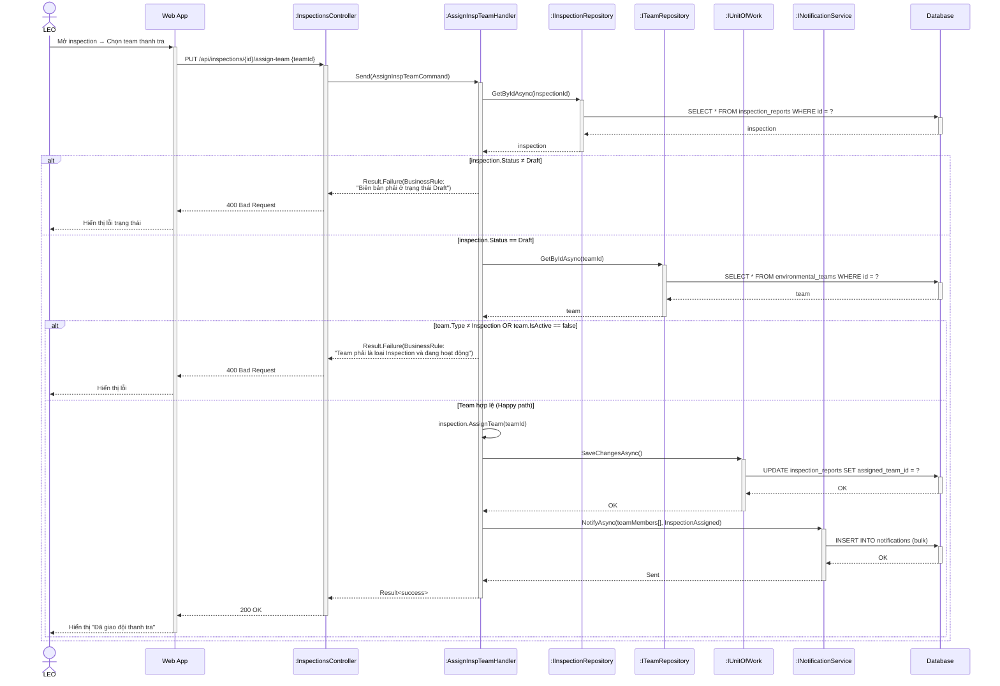
```mermaid
sequenceDiagram
    actor LEO
    participant App as Web App
    participant Ctrl as :InspectionsController
    participant Hdl as :AssignInspTeamHandler
    participant InspRepo as :IInspectionRepository
    participant TeamRepo as :ITeamRepository
    participant UoW as :IUnitOfWork
    participant Notif as :INotificationService
    participant DB as Database

    LEO->>+App: Mở inspection → Chọn team thanh tra
    App->>+Ctrl: PUT /api/inspections/{id}/assign-team {teamId}
    Ctrl->>+Hdl: Send(AssignInspTeamCommand)

    Hdl->>+InspRepo: GetByIdAsync(inspectionId)
    InspRepo->>+DB: SELECT * FROM inspection_reports WHERE id = ?
    DB-->>-InspRepo: inspection
    InspRepo-->>-Hdl: inspection

    alt inspection.Status ≠ Draft
        Hdl-->>Ctrl: Result.Failure(BusinessRule:<br/>"Biên bản phải ở trạng thái Draft")
        Ctrl-->>App: 400 Bad Request
        App-->>LEO: Hiển thị lỗi trạng thái
    else inspection.Status == Draft
        Hdl->>+TeamRepo: GetByIdAsync(teamId)
        TeamRepo->>+DB: SELECT * FROM environmental_teams WHERE id = ?
        DB-->>-TeamRepo: team
        TeamRepo-->>-Hdl: team

        alt team.Type ≠ Inspection OR team.IsActive == false
            Hdl-->>Ctrl: Result.Failure(BusinessRule:<br/>"Team phải là loại Inspection và đang hoạt động")
            Ctrl-->>App: 400 Bad Request
            App-->>LEO: Hiển thị lỗi
        else Team hợp lệ (Happy path)
            Hdl->>Hdl: inspection.AssignTeam(teamId)

            Hdl->>+UoW: SaveChangesAsync()
            UoW->>+DB: UPDATE inspection_reports SET assigned_team_id = ?
            DB-->>-UoW: OK
            UoW-->>-Hdl: OK

            Hdl->>+Notif: NotifyAsync(teamMembers[], InspectionAssigned)
            Notif->>+DB: INSERT INTO notifications (bulk)
            DB-->>-Notif: OK
            Notif-->>-Hdl: Sent

            Hdl-->>-Ctrl: Result<success>
            Ctrl-->>-App: 200 OK
            App-->>-LEO: Hiển thị "Đã giao đội thanh tra"
        end
    end
```

---

### SD-32 ⭐ Issue Penalty

**Actor:** Inspector / LEO · **BR:** BR-INS-005, BR-INS-006, BR-INS-010

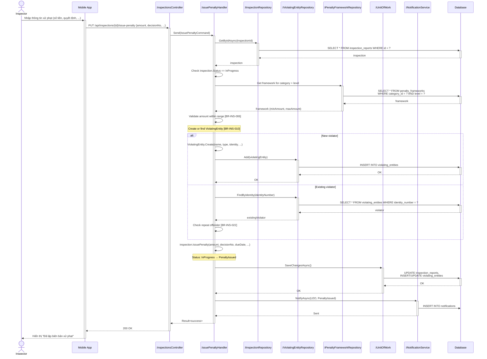
```mermaid
sequenceDiagram
    actor Inspector
    participant App as Mobile App
    participant Ctrl as :InspectionsController
    participant Hdl as :IssuePenaltyHandler
    participant InspRepo as :IInspectionRepository
    participant ViolRepo as :IViolatingEntityRepository
    participant FwRepo as :IPenaltyFrameworkRepository
    participant UoW as :IUnitOfWork
    participant Notif as :INotificationService
    participant DB as Database

    Inspector->>+App: Nhập thông tin xử phạt (số tiền, quyết định, ...)
    App->>+Ctrl: PUT /api/inspections/{id}/issue-penalty {amount, decisionNo, ...}
    Ctrl->>+Hdl: Send(IssuePenaltyCommand)

    Hdl->>+InspRepo: GetByIdAsync(inspectionId)
    InspRepo->>+DB: SELECT * FROM inspection_reports WHERE id = ?
    DB-->>-InspRepo: inspection
    InspRepo-->>-Hdl: inspection
    Hdl->>Hdl: Check inspection.Status == InProgress

    Hdl->>+FwRepo: Get framework for category + level
    FwRepo->>+DB: SELECT * FROM penalty_frameworks<br/>WHERE category_id = ? AND level = ?
    DB-->>-FwRepo: framework
    FwRepo-->>-Hdl: framework (minAmount, maxAmount)
    Hdl->>Hdl: Validate amount within range [BR-INS-006]

    Note over Hdl: Create or find ViolatingEntity [BR-INS-010]
    alt New violator
        Hdl->>Hdl: ViolatingEntity.Create(name, type, identity, ...)
        Hdl->>+ViolRepo: Add(violatingEntity)
        ViolRepo->>+DB: INSERT INTO violating_entities
        DB-->>-ViolRepo: OK
        ViolRepo-->>-Hdl: OK
    else Existing violator
        Hdl->>+ViolRepo: FindByIdentity(identityNumber)
        ViolRepo->>+DB: SELECT * FROM violating_entities WHERE identity_number = ?
        DB-->>-ViolRepo: violator
        ViolRepo-->>-Hdl: existingViolator
        Hdl->>Hdl: Check repeat offender [BR-INS-022]
    end

    Hdl->>Hdl: inspection.IssuePenalty(amount, decisionNo, dueDate, ...)
    Note over Hdl: Status: InProgress → PenaltyIssued

    Hdl->>+UoW: SaveChangesAsync()
    UoW->>+DB: UPDATE inspection_reports,<br/>INSERT/UPDATE violating_entities
    DB-->>-UoW: OK
    UoW-->>-Hdl: OK

    Hdl->>+Notif: NotifyAsync(LEO, PenaltyIssued)
    Notif->>DB: INSERT INTO notifications
    Notif-->>-Hdl: Sent

    Hdl-->>-Ctrl: Result<success>
    Ctrl-->>-App: 200 OK
    App-->>-Inspector: Hiển thị "Đã lập biên bản xử phạt"
```

---

## Nhóm 5: Organization Management

---

### SD-36 ⭐ Create Department & LocalOffice

**Actor:** Admin · **BR:** BR-ORG-001, BR-ORG-002

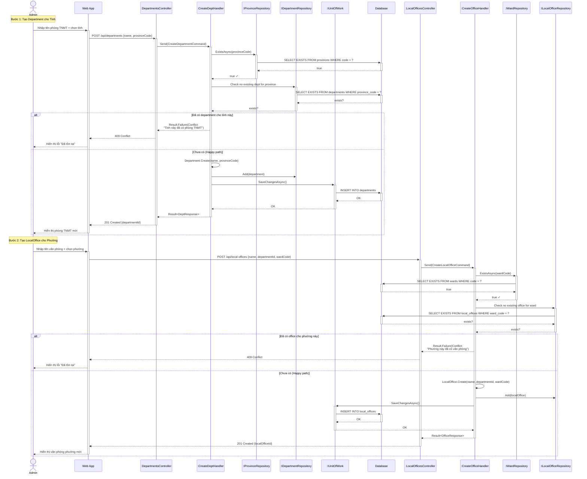
```mermaid
sequenceDiagram
    actor Admin
    participant App as Web App
    participant Ctrl1 as :DepartmentsController
    participant Hdl1 as :CreateDeptHandler
    participant ProvRepo as :IProvinceRepository
    participant DeptRepo as :IDepartmentRepository
    participant UoW as :IUnitOfWork
    participant DB as Database

    Note over Admin: Bước 1: Tạo Department cho Tỉnh
    Admin->>+App: Nhập tên phòng TNMT + chọn tỉnh
    App->>+Ctrl1: POST /api/departments {name, provinceCode}
    Ctrl1->>+Hdl1: Send(CreateDepartmentCommand)

    Hdl1->>+ProvRepo: ExistsAsync(provinceCode)
    ProvRepo->>+DB: SELECT EXISTS FROM provinces WHERE code = ?
    DB-->>-ProvRepo: true
    ProvRepo-->>-Hdl1: true ✓

    Hdl1->>+DeptRepo: Check no existing dept for province
    DeptRepo->>+DB: SELECT EXISTS FROM departments WHERE province_code = ?
    DB-->>-DeptRepo: exists?
    DeptRepo-->>-Hdl1: exists?

    alt Đã có department cho tỉnh này
        Hdl1-->>Ctrl1: Result.Failure(Conflict:<br/>"Tỉnh này đã có phòng TNMT")
        Ctrl1-->>App: 409 Conflict
        App-->>Admin: Hiển thị lỗi "Đã tồn tại"
    else Chưa có (Happy path)
        Hdl1->>Hdl1: Department.Create(name, provinceCode)
        Hdl1->>DeptRepo: Add(department)

        Hdl1->>+UoW: SaveChangesAsync()
        UoW->>+DB: INSERT INTO departments
        DB-->>-UoW: OK
        UoW-->>-Hdl1: OK

        Hdl1-->>-Ctrl1: Result<DeptResponse>
        Ctrl1-->>-App: 201 Created {departmentId}
        App-->>-Admin: Hiển thị phòng TNMT mới
    end

    participant Ctrl2 as :LocalOfficesController
    participant Hdl2 as :CreateOfficeHandler
    participant WardRepo as :IWardRepository
    participant OffRepo as :ILocalOfficeRepository

    Note over Admin: Bước 2: Tạo LocalOffice cho Phường
    Admin->>+App: Nhập tên văn phòng + chọn phường
    App->>+Ctrl2: POST /api/local-offices {name, departmentId, wardCode}
    Ctrl2->>+Hdl2: Send(CreateLocalOfficeCommand)

    Hdl2->>+WardRepo: ExistsAsync(wardCode)
    WardRepo->>+DB: SELECT EXISTS FROM wards WHERE code = ?
    DB-->>-WardRepo: true
    WardRepo-->>-Hdl2: true ✓

    Hdl2->>+OffRepo: Check no existing office for ward
    OffRepo->>+DB: SELECT EXISTS FROM local_offices WHERE ward_code = ?
    DB-->>-OffRepo: exists?
    OffRepo-->>-Hdl2: exists?

    alt Đã có office cho phường này
        Hdl2-->>Ctrl2: Result.Failure(Conflict:<br/>"Phường này đã có văn phòng")
        Ctrl2-->>App: 409 Conflict
        App-->>Admin: Hiển thị lỗi "Đã tồn tại"
    else Chưa có (Happy path)
        Hdl2->>Hdl2: LocalOffice.Create(name, departmentId, wardCode)
        Hdl2->>OffRepo: Add(localOffice)

        Hdl2->>+UoW: SaveChangesAsync()
        UoW->>+DB: INSERT INTO local_offices
        DB-->>-UoW: OK
        UoW-->>-Hdl2: OK

        Hdl2-->>-Ctrl2: Result<OfficeResponse>
        Ctrl2-->>-App: 201 Created {localOfficeId}
        App-->>-Admin: Hiển thị văn phòng phường mới
    end
```

---

### SD-37 ⭐ Create Team (Cleanup / Inspection)

**Actor:** LEO · **BR:** BR-ORG-013

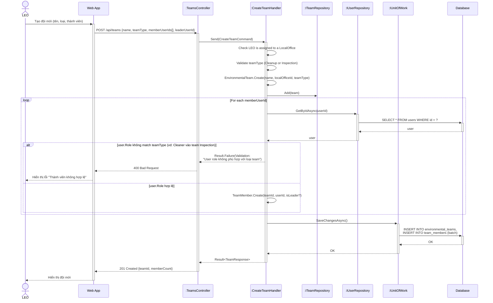
```mermaid
sequenceDiagram
    actor LEO
    participant App as Web App
    participant Ctrl as :TeamsController
    participant Hdl as :CreateTeamHandler
    participant TeamRepo as :ITeamRepository
    participant UserRepo as :IUserRepository
    participant UoW as :IUnitOfWork
    participant DB as Database

    LEO->>+App: Tạo đội mới (tên, loại, thành viên)
    App->>+Ctrl: POST /api/teams {name, teamType, memberUserIds[], leaderUserId}
    Ctrl->>+Hdl: Send(CreateTeamCommand)

    Hdl->>Hdl: Check LEO is assigned to a LocalOffice
    Hdl->>Hdl: Validate teamType (Cleanup or Inspection)

    Hdl->>Hdl: EnvironmentalTeam.Create(name, localOfficeId, teamType)
    Hdl->>TeamRepo: Add(team)

    loop For each memberUserId
        Hdl->>+UserRepo: GetByIdAsync(userId)
        UserRepo->>+DB: SELECT * FROM users WHERE id = ?
        DB-->>-UserRepo: user
        UserRepo-->>-Hdl: user

        alt user.Role không match teamType (vd: Cleaner vào team Inspection)
            Hdl-->>Ctrl: Result.Failure(Validation:<br/>"User role không phù hợp với loại team")
            Ctrl-->>App: 400 Bad Request
            App-->>LEO: Hiển thị lỗi "Thành viên không hợp lệ"
        else user.Role hợp lệ
            Hdl->>Hdl: TeamMember.Create(teamId, userId, isLeader?)
        end
    end

    Hdl->>+UoW: SaveChangesAsync()
    UoW->>+DB: INSERT INTO environmental_teams,<br/>INSERT INTO team_members (batch)
    DB-->>-UoW: OK
    UoW-->>-Hdl: OK

    Hdl-->>-Ctrl: Result<TeamResponse>
    Ctrl-->>-App: 201 Created {teamId, memberCount}
    App-->>-LEO: Hiển thị đội mới
```

---

### SD-38 ⭐ Onboard Environmental Company

**Actor:** DEO · **BR:** BR-CMP-001, BR-CMP-006

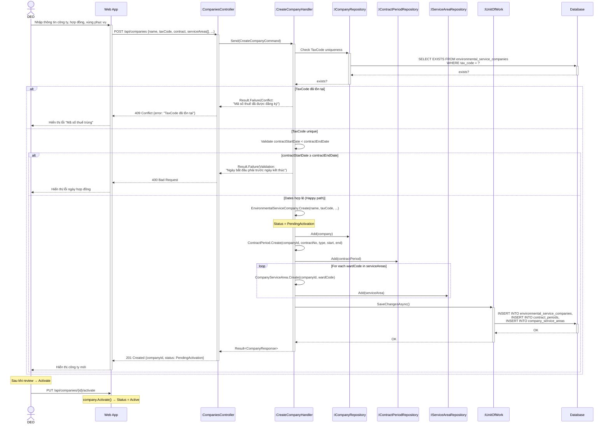
```mermaid
sequenceDiagram
    actor DEO
    participant App as Web App
    participant Ctrl as :CompaniesController
    participant Hdl as :CreateCompanyHandler
    participant CompRepo as :ICompanyRepository
    participant ContRepo as :IContractPeriodRepository
    participant AreaRepo as :IServiceAreaRepository
    participant UoW as :IUnitOfWork
    participant DB as Database

    DEO->>+App: Nhập thông tin công ty, hợp đồng, vùng phục vụ
    App->>+Ctrl: POST /api/companies {name, taxCode, contract, serviceAreas[], ...}
    Ctrl->>+Hdl: Send(CreateCompanyCommand)

    Hdl->>+CompRepo: Check TaxCode uniqueness
    CompRepo->>+DB: SELECT EXISTS FROM environmental_service_companies<br/>WHERE tax_code = ?
    DB-->>-CompRepo: exists?
    CompRepo-->>-Hdl: exists?

    alt TaxCode đã tồn tại
        Hdl-->>Ctrl: Result.Failure(Conflict:<br/>"Mã số thuế đã được đăng ký")
        Ctrl-->>App: 409 Conflict {error: "TaxCode đã tồn tại"}
        App-->>DEO: Hiển thị lỗi "Mã số thuế trùng"
    else TaxCode unique
        Hdl->>Hdl: Validate contractStartDate < contractEndDate

        alt contractStartDate ≥ contractEndDate
            Hdl-->>Ctrl: Result.Failure(Validation:<br/>"Ngày bắt đầu phải trước ngày kết thúc")
            Ctrl-->>App: 400 Bad Request
            App-->>DEO: Hiển thị lỗi ngày hợp đồng
        else Dates hợp lệ (Happy path)
            Hdl->>Hdl: EnvironmentalServiceCompany.Create(name, taxCode, ...)
            Note over Hdl: Status = PendingActivation
            Hdl->>CompRepo: Add(company)

            Hdl->>Hdl: ContractPeriod.Create(companyId, contractNo, type, start, end)
            Hdl->>ContRepo: Add(contractPeriod)

            loop For each wardCode in serviceAreas
                Hdl->>Hdl: CompanyServiceArea.Create(companyId, wardCode)
                Hdl->>AreaRepo: Add(serviceArea)
            end

            Hdl->>+UoW: SaveChangesAsync()
            UoW->>+DB: INSERT INTO environmental_service_companies,<br/>INSERT INTO contract_periods,<br/>INSERT INTO company_service_areas
            DB-->>-UoW: OK
            UoW-->>-Hdl: OK

            Hdl-->>-Ctrl: Result<CompanyResponse>
            Ctrl-->>-App: 201 Created {companyId, status: PendingActivation}
            App-->>-DEO: Hiển thị công ty mới
        end
    end

    Note over DEO: Sau khi review → Activate
    DEO->>App: PUT /api/companies/{id}/activate
    Note over App: company.Activate() → Status = Active
```

---

## Nhóm 6: Comment & Community

---

### SD-44 ⭐ Add Comment (with Media & Moderation)

**Actor:** Citizen · **BR:** BR-CMT-001, BR-CMT-002, BR-CMT-003

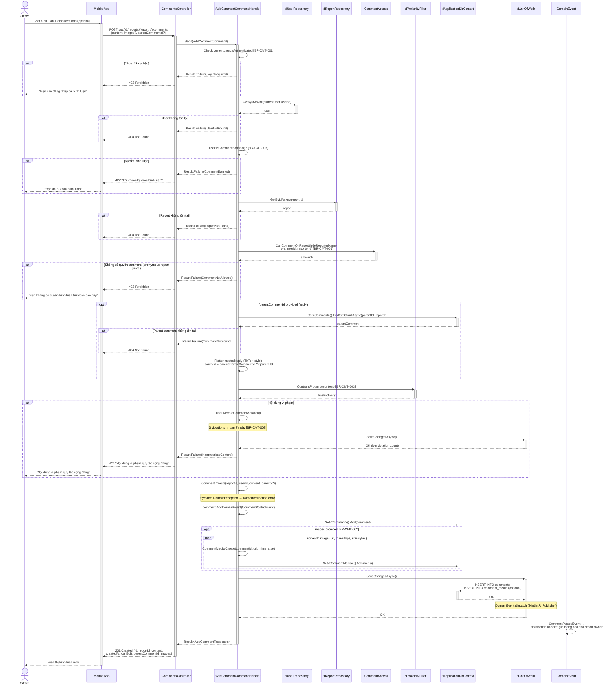
```mermaid
sequenceDiagram
    actor Citizen
    participant App as Mobile App
    participant Ctrl as :CommentsController
    participant Hdl as :AddCommentCommandHandler
    participant UserRepo as :IUserRepository
    participant RptRepo as :IReportRepository
    participant Access as CommentAccess
    participant Prof as :IProfanityFilter
    participant DB as :IApplicationDbContext
    participant UoW as :IUnitOfWork
    participant Evt as DomainEvent

    Citizen->>+App: Viết bình luận + đính kèm ảnh (optional)
    App->>+Ctrl: POST /api/v1/reports/{reportId}/comments<br/>{content, images?, parentCommentId?}
    Ctrl->>+Hdl: Send(AddCommentCommand)

    Hdl->>Hdl: Check currentUser.IsAuthenticated [BR-CMT-001]
    alt Chưa đăng nhập
        Hdl-->>Ctrl: Result.Failure(LoginRequired)
        Ctrl-->>App: 403 Forbidden
        App-->>Citizen: "Bạn cần đăng nhập để bình luận"
    end

    Hdl->>+UserRepo: GetByIdAsync(currentUser.UserId)
    UserRepo-->>-Hdl: user
    alt User không tồn tại
        Hdl-->>Ctrl: Result.Failure(UserNotFound)
        Ctrl-->>App: 404 Not Found
    end

    Hdl->>Hdl: user.IsCommentBanned()? [BR-CMT-003]
    alt Bị cấm bình luận
        Hdl-->>Ctrl: Result.Failure(CommentBanned)
        Ctrl-->>App: 422 "Tài khoản bị khóa bình luận"
        App-->>Citizen: "Bạn đã bị khóa bình luận"
    end

    Hdl->>+RptRepo: GetByIdAsync(reportId)
    RptRepo-->>-Hdl: report
    alt Report không tồn tại
        Hdl-->>Ctrl: Result.Failure(ReportNotFound)
        Ctrl-->>App: 404 Not Found
    end

    Hdl->>+Access: CanCommentOnReport(hideReporterName,<br/>role, userId, reporterId) [BR-CMT-001]
    Access-->>-Hdl: allowed?
    alt Không có quyền comment (anonymous report guard)
        Hdl-->>Ctrl: Result.Failure(CommentNotAllowed)
        Ctrl-->>App: 403 Forbidden
        App-->>Citizen: "Bạn không có quyền bình luận trên báo cáo này"
    end

    opt parentCommentId provided (reply)
        Hdl->>+DB: Set<Comment>().FirstOrDefaultAsync(parentId, reportId)
        DB-->>-Hdl: parentComment
        alt Parent comment không tồn tại
            Hdl-->>Ctrl: Result.Failure(CommentNotFound)
            Ctrl-->>App: 404 Not Found
        end
        Hdl->>Hdl: Flatten nested reply (TikTok-style):<br/>parentId = parent.ParentCommentId ?? parent.Id
    end

    Hdl->>+Prof: ContainsProfanity(content) [BR-CMT-003]
    Prof-->>-Hdl: hasProfanity
    alt Nội dung vi phạm
        Hdl->>Hdl: user.RecordCommentViolation()
        Note over Hdl: 3 violations → ban 7 ngày [BR-CMT-003]
        Hdl->>+UoW: SaveChangesAsync()
        UoW-->>-Hdl: OK (lưu violation count)
        Hdl-->>Ctrl: Result.Failure(InappropriateContent)
        Ctrl-->>App: 422 "Nội dung vi phạm quy tắc cộng đồng"
        App-->>Citizen: "Nội dung vi phạm quy tắc cộng đồng"
    end

    Hdl->>Hdl: Comment.Create(reportId, userId, content, parentId?)
    Note over Hdl: try/catch DomainException → DomainValidation error

    Hdl->>Hdl: comment.AddDomainEvent(CommentPostedEvent)
    Hdl->>DB: Set<Comment>().Add(comment)

    opt images provided [BR-CMT-002]
        loop For each image {url, mimeType, sizeBytes}
            Hdl->>Hdl: CommentMedia.Create(commentId, url, mime, size)
            Hdl->>DB: Set<CommentMedia>().Add(media)
        end
    end

    Hdl->>+UoW: SaveChangesAsync()
    UoW->>+DB: INSERT INTO comments,<br/>INSERT INTO comment_media (optional)
    DB-->>-UoW: OK
    Note over UoW: DomainEvent dispatch (MediatR IPublisher)
    UoW-->>-Hdl: OK

    Evt-->>Evt: CommentPostedEvent →<br/>Notification handler gửi thông báo cho report owner

    Hdl-->>-Ctrl: Result<AddCommentResponse>
    Ctrl-->>-App: 201 Created {id, reportId, content,<br/>createdAt, canEdit, parentCommentId, images}
    App-->>-Citizen: Hiển thị bình luận mới
```

---

## Nhóm 7: Gamification

---

### SD-48 ⭐ Award Points (Event-driven)

**Actor:** System · **BR:** BR-GAM-001, BR-GAM-002, BR-GAM-003

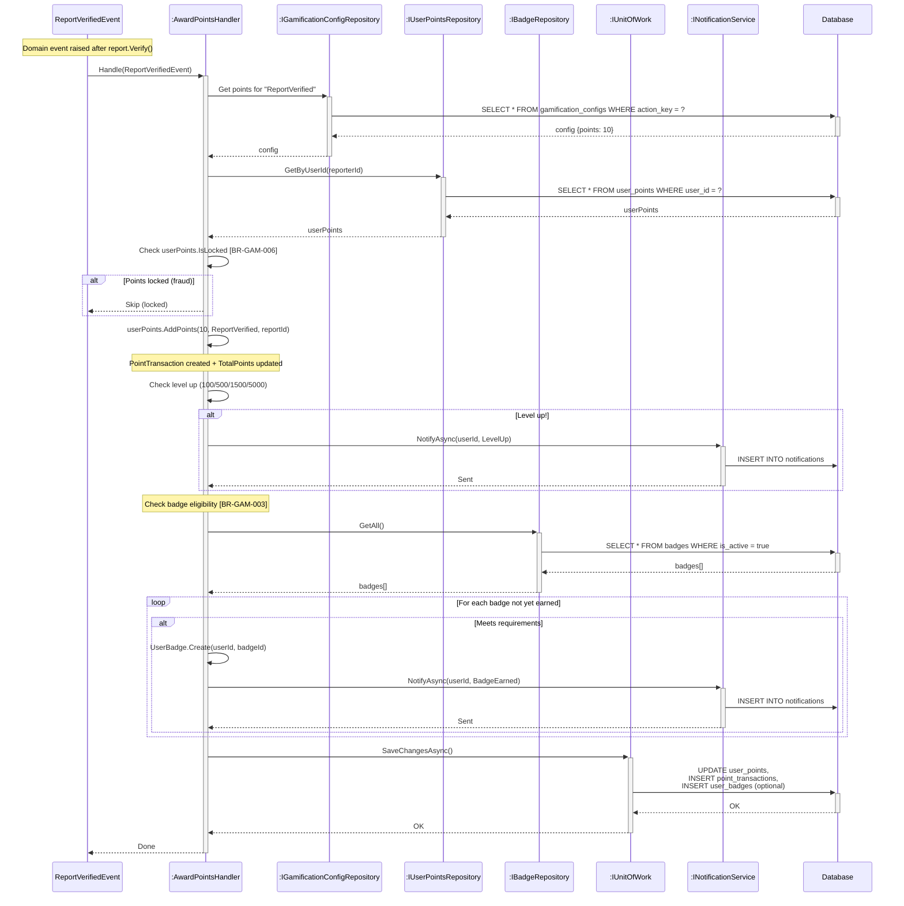
```mermaid
sequenceDiagram
    participant Event as ReportVerifiedEvent
    participant EvtHdl as :AwardPointsHandler
    participant CfgRepo as :IGamificationConfigRepository
    participant PtsRepo as :IUserPointsRepository
    participant BadgeRepo as :IBadgeRepository
    participant UoW as :IUnitOfWork
    participant Notif as :INotificationService
    participant DB as Database

    Note over Event: Domain event raised after report.Verify()

    Event->>+EvtHdl: Handle(ReportVerifiedEvent)

    EvtHdl->>+CfgRepo: Get points for "ReportVerified"
    CfgRepo->>+DB: SELECT * FROM gamification_configs WHERE action_key = ?
    DB-->>-CfgRepo: config {points: 10}
    CfgRepo-->>-EvtHdl: config

    EvtHdl->>+PtsRepo: GetByUserId(reporterId)
    PtsRepo->>+DB: SELECT * FROM user_points WHERE user_id = ?
    DB-->>-PtsRepo: userPoints
    PtsRepo-->>-EvtHdl: userPoints

    EvtHdl->>EvtHdl: Check userPoints.IsLocked [BR-GAM-006]
    alt Points locked (fraud)
        EvtHdl-->>Event: Skip (locked)
    end

    EvtHdl->>EvtHdl: userPoints.AddPoints(10, ReportVerified, reportId)
    Note over EvtHdl: PointTransaction created + TotalPoints updated

    EvtHdl->>EvtHdl: Check level up (100/500/1500/5000)
    alt Level up!
        EvtHdl->>+Notif: NotifyAsync(userId, LevelUp)
        Notif->>DB: INSERT INTO notifications
        Notif-->>-EvtHdl: Sent
    end

    Note over EvtHdl: Check badge eligibility [BR-GAM-003]
    EvtHdl->>+BadgeRepo: GetAll()
    BadgeRepo->>+DB: SELECT * FROM badges WHERE is_active = true
    DB-->>-BadgeRepo: badges[]
    BadgeRepo-->>-EvtHdl: badges[]

    loop For each badge not yet earned
        alt Meets requirements
            EvtHdl->>EvtHdl: UserBadge.Create(userId, badgeId)
            EvtHdl->>+Notif: NotifyAsync(userId, BadgeEarned)
            Notif->>DB: INSERT INTO notifications
            Notif-->>-EvtHdl: Sent
        end
    end

    EvtHdl->>+UoW: SaveChangesAsync()
    UoW->>+DB: UPDATE user_points,<br/>INSERT point_transactions,<br/>INSERT user_badges (optional)
    DB-->>-UoW: OK
    UoW-->>-EvtHdl: OK

    EvtHdl-->>-Event: Done
```

---

## Nhóm 8: Notification

---

### SD-52 ⭐ Send Notification (Event-driven, Multi-channel)

**Actor:** System · **BR:** BR-NTF-001, BR-NTF-002

```mermaid
sequenceDiagram
    participant Event as DomainEvent
    participant EvtHdl as :NotificationEventHandler
    participant Svc as :INotificationService
    participant PrefRepo as :INotifPreferenceRepository
    participant TplRepo as :INotifTemplateRepository
    participant Push as :IPushNotificationSender
    participant Email as :IEmailSender
    participant UoW as :IUnitOfWork
    participant DB as Database

    Event->>+EvtHdl: Handle(ReportStatusChangedEvent)

    EvtHdl->>+Svc: NotifyAsync(recipientId, type, refId, data)

    Svc->>+PrefRepo: GetPreference(userId, type)
    PrefRepo->>+DB: SELECT * FROM notification_preferences<br/>WHERE user_id = ? AND type = ?
    DB-->>-PrefRepo: preference
    PrefRepo-->>-Svc: preference {pushEnabled, emailEnabled}

    alt Push disabled AND Email disabled
        Svc-->>EvtHdl: Skip (user opted out)
    end

    Svc->>+TplRepo: GetTemplate(type, channel)
    TplRepo->>+DB: SELECT * FROM notification_templates<br/>WHERE type = ? AND is_published = true
    DB-->>-TplRepo: template
    TplRepo-->>-Svc: template {titleVi, bodyVi}

    Svc->>Svc: Render template with placeholders<br/>{user_name}, {report_code}, ...

    Svc->>Svc: Notification.Create(recipientId, type, title, msg)

    opt Push enabled [BR-NTF-002]
        Svc->>+Push: SendAsync(user.FcmDeviceToken, title, body)
        Push-->>-Svc: Sent via FCM
    end

    opt Email enabled
        Svc->>+Email: SendTemplateAsync(user.Email, template, data)
        Email-->>-Svc: Sent via SMTP
    end

    Svc->>+UoW: SaveChangesAsync()
    UoW->>+DB: INSERT INTO notifications
    DB-->>-UoW: OK
    UoW-->>-Svc: OK

    Svc-->>-EvtHdl: Done
    EvtHdl-->>-Event: Done
```

---

## Nhóm 9: Map & Public Data

---

### SD-55 ⭐ View Public Map (Reports + Heatmap)

**Actor:** Citizen / Anonymous · **BR:** BR-MAP-001, BR-MAP-004, BR-MAP-012

```mermaid
sequenceDiagram
    actor Citizen
    participant App as Mobile App
    participant Ctrl as :MapController
    participant Hdl as :GetNearbyHandler
    participant Cache as Redis
    participant DB as Database (PostGIS)

    Citizen->>+App: Mở bản đồ, kéo/zoom viewport
    App->>+Ctrl: GET /api/map/nearby?lat=X&lng=Y&radius=5000&filters=...
    Ctrl->>+Hdl: Send(GetNearbyReportsQuery)

    Hdl->>Hdl: Build cache key from bbox + filters

    Hdl->>+Cache: GET map:{cacheKey} [BR-MAP-012: TTL 10']
    Cache-->>-Hdl: cached?

    alt Cache hit
        Hdl-->>Ctrl: Return cached markers
        Ctrl-->>App: 200 OK (cached)
        App-->>Citizen: Hiển thị markers trên map
    end

    Hdl->>+DB: SELECT id, lat, lng, status, severity, category<br/>FROM reports<br/>WHERE lat BETWEEN ? AND ? AND lng BETWEEN ? AND ?<br/>AND status NOT IN ('Rejected','Duplicate')<br/>ORDER BY created_at DESC
    DB-->>-Hdl: reports[]

    Hdl->>Hdl: Round GPS to 4 decimals (≈11m) [BR-MAP-004]
    Note over Hdl: Privacy: ẩn vị trí chính xác trên map công cộng

    Hdl->>Hdl: Build marker DTO (id, lat, lng, status, severity, icon)

    Hdl->>+Cache: SET map:{cacheKey} TTL=600s
    Cache-->>-Hdl: OK

    Hdl-->>-Ctrl: Result<MapResponse>
    Ctrl-->>-App: 200 OK {markers[], totalCount, bbox}
    App-->>-Citizen: Hiển thị markers + heatmap trên bản đồ
```

---

## Nhóm 10: Media & File Upload

---

### SD-66 ⭐ Upload Report Image (Presigned URL + AI Analyze)

**Actor:** Citizen · **BR:** BR-REP-001, BR-REP-002, BR-AI-001, BR-AI-007

```mermaid
sequenceDiagram
    actor Citizen
    participant App as Mobile App
    participant Ctrl as :MediaController
    participant Storage as :IFileStorageService
    participant R2 as Cloudflare R2 (S3)
    participant Hdl as :AnalyzeImageHandler
    participant EXIF as :IExifAnalyzer
    participant AI as :IAiClassificationService
    participant TempStore as :ITempImageStore
    participant DB as Database

    Note over Citizen: Step 1: Request presigned URL
    Citizen->>+App: Chọn ảnh từ thư viện
    App->>+Ctrl: POST /api/media/presigned-url {fileName, mimeType}
    Ctrl->>+Storage: GeneratePresignedUploadUrl(fileName, mime)
    Storage-->>-Ctrl: {uploadUrl, publicUrl, key}
    Ctrl-->>-App: 200 OK {uploadUrl, publicUrl, key}

    Note over App: Step 2: Upload trực tiếp lên R2/S3
    App->>+R2: PUT uploadUrl [binary image data]
    R2-->>-App: 200 OK

    Note over App: Step 3: Analyze uploaded image (AI flow)
    App->>+Ctrl: POST /api/media/analyze {url, key, mimeType, sizeBytes}
    Ctrl->>+Hdl: Send(AnalyzeUploadedReportImageCommand)

    Hdl->>+Storage: DownloadAsync(key) [validate exists + size]
    Storage->>+R2: GET object
    R2-->>-Storage: imageBytes
    Storage-->>-Hdl: imageBytes

    Hdl->>Hdl: Validate content-type (magic bytes) [BR-REP-002]
    Hdl->>Hdl: Validate size ≤ 10MB

    Hdl->>+EXIF: Analyze(imageBytes) [BR-AI-007: strip sensitive]
    EXIF-->>-Hdl: exifResult

    Hdl->>+AI: ClassifyImageAsync(imageBytes) [timeout 5s]
    alt AI responds in time
        AI-->>-Hdl: {primaryClass, confidence, severity, decision}
    else AI timeout [BR-AI-006]
        Hdl->>Hdl: Mark as ai_pending, queue retry job
    end

    Hdl->>+TempStore: StoreAsync(tempId, bytes, aiResult)
    TempStore->>+DB: INSERT INTO temp cache (Redis or DB)
    DB-->>-TempStore: OK
    TempStore-->>-Hdl: tempImageId

    Hdl-->>-Ctrl: Result<AnalyzeResponse>
    Ctrl-->>-App: 200 OK {tempImageId, aiResult, exifWarning?}
    App-->>-Citizen: Hiển thị kết quả AI (loại ô nhiễm, severity)

    Note over Citizen: Step 4: Submit report với tempImageId → SD-09
```

---

## Nhóm 11: Administration

---

### SD-62 ⭐ View Audit Logs

**Actor:** Admin · **BR:** BR-ADM-010

```mermaid
sequenceDiagram
    actor Admin
    participant App as Web App
    participant Ctrl as :AdminController
    participant Hdl as :GetAuditLogsHandler
    participant DB as Database

    Admin->>+App: Mở trang Audit Log, chọn filter
    App->>+Ctrl: GET /api/admin/audit-logs?entityType=Report&action=Verify&from=...&to=...&page=1
    Ctrl->>+Hdl: Send(GetAuditLogsQuery)

    Hdl->>Hdl: Validate Admin role

    Hdl->>+DB: SELECT * FROM audit_logs<br/>WHERE entity_type = ? AND action = ?<br/>AND created_at BETWEEN ? AND ?<br/>ORDER BY created_at DESC<br/>LIMIT ? OFFSET ?
    DB-->>-Hdl: rows[], totalCount

    Hdl->>Hdl: Map to AuditLogDto[]

    Hdl-->>-Ctrl: Result<PagedResult<AuditLogDto>>
    Ctrl-->>-App: 200 OK {items[], totalCount, page, pageSize}
    App-->>-Admin: Hiển thị bảng audit log với pagination
```

---

## Tổng hợp — Thứ tự Trình bày

```mermaid
flowchart LR
    subgraph Auth ["1️⃣ Auth"]
        SD01["SD-01<br/>Register"]
        SD02["SD-02<br/>Login"]
        SD04["SD-04<br/>Refresh"]
    end

    subgraph Report ["2️⃣ Report Core"]
        SD09["SD-09<br/>Submit"]
        SD11["SD-11<br/>Verify"]
        SD12["SD-12<br/>Reject"]
        SD13["SD-13<br/>Assign"]
        SD15["SD-15<br/>Resolve"]
        SD16["SD-16<br/>Close"]
        SD18["SD-18<br/>Duplicate"]
    end

    subgraph Cleanup ["3️⃣ Cleanup"]
        SD21["SD-21<br/>Accept/Decline"]
        SD22["SD-22<br/>Check-in"]
    end

    subgraph Inspection ["4️⃣ Inspection"]
        SD28["SD-28<br/>Create"]
        SD29["SD-29<br/>Assign Team"]
        SD32["SD-32<br/>Issue Penalty"]
    end

    subgraph Org ["5️⃣ Organization"]
        SD36["SD-36<br/>Dept & Office"]
        SD37["SD-37<br/>Create Team"]
        SD38["SD-38<br/>Onboard Company"]
    end

    subgraph Cross ["6️⃣–11️⃣ Cross-cutting"]
        SD44["SD-44<br/>Comment"]
        SD48["SD-48<br/>Gamification"]
        SD52["SD-52<br/>Notification"]
        SD55["SD-55<br/>Map"]
        SD66["SD-66<br/>Media Upload"]
        SD62["SD-62<br/>Audit Log"]
    end

    Auth --> Report --> Cleanup --> Inspection --> Org --> Cross
```
