# GreenLens — Sequence Diagrams (22 ⭐ Ưu tiên)

> **Dự án:** SU26SE049 — Crowdsourced Application for Reporting Environmental Pollution  
> **Tổng quan:** 22 Sequence Diagram ưu tiên cho bài bảo vệ tốt nghiệp, dựa trên source code thực tế.  
> **Thứ tự:** Theo luồng trải nghiệm người dùng: Auth → Report → Cleanup → Inspection → Organization → Community → Gamification → Notification → Map → Media → Admin

---

## Nhóm 1: Authentication & Account

---

### SD-01 ⭐ Register (Email + OTP)

**Actor:** Citizen · **BR:** BR-AUTH-001, BR-AUTH-003, BR-AUTH-005, BR-DAT-001

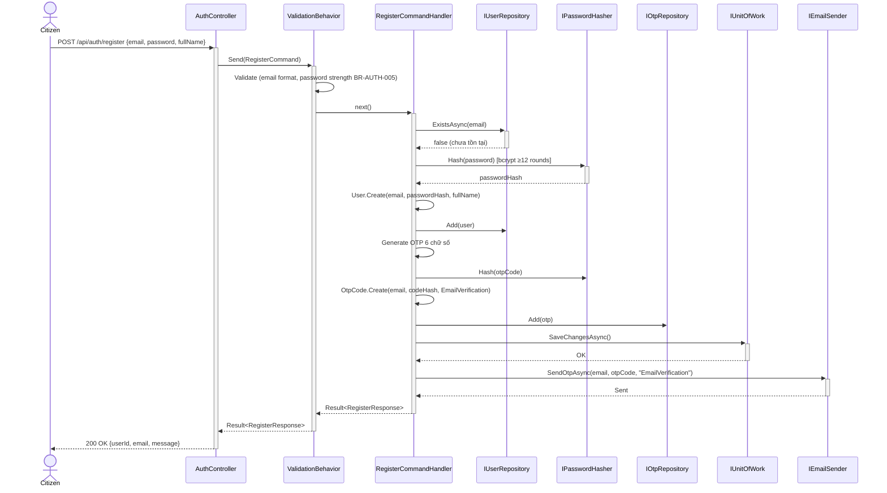
```mermaid
sequenceDiagram
    actor Citizen
    participant API as AuthController
    participant Val as ValidationBehavior
    participant Handler as RegisterCommandHandler
    participant UserRepo as IUserRepository
    participant Hasher as IPasswordHasher
    participant OtpRepo as IOtpRepository
    participant UoW as IUnitOfWork
    participant Email as IEmailSender

    Citizen->>+API: POST /api/auth/register {email, password, fullName}
    API->>+Val: Send(RegisterCommand)
    Val->>Val: Validate (email format, password strength BR-AUTH-005)
    Val->>+Handler: next()

    Handler->>+UserRepo: ExistsAsync(email)
    UserRepo-->>-Handler: false (chưa tồn tại)

    Handler->>+Hasher: Hash(password) [bcrypt ≥12 rounds]
    Hasher-->>-Handler: passwordHash

    Handler->>Handler: User.Create(email, passwordHash, fullName)
    Handler->>UserRepo: Add(user)

    Handler->>Handler: Generate OTP 6 chữ số
    Handler->>Hasher: Hash(otpCode)
    Handler->>Handler: OtpCode.Create(email, codeHash, EmailVerification)
    Handler->>OtpRepo: Add(otp)

    Handler->>+UoW: SaveChangesAsync()
    UoW-->>-Handler: OK

    Handler->>+Email: SendOtpAsync(email, otpCode, "EmailVerification")
    Email-->>-Handler: Sent

    Handler-->>-Val: Result<RegisterResponse>
    Val-->>-API: Result<RegisterResponse>
    API-->>-Citizen: 200 OK {userId, email, message}
```

---

### SD-02 ⭐ Login (Email / Password)

**Actor:** All · **BR:** BR-AUTH-013, BR-AUTH-014, BR-AUTH-015, BR-AUTH-016

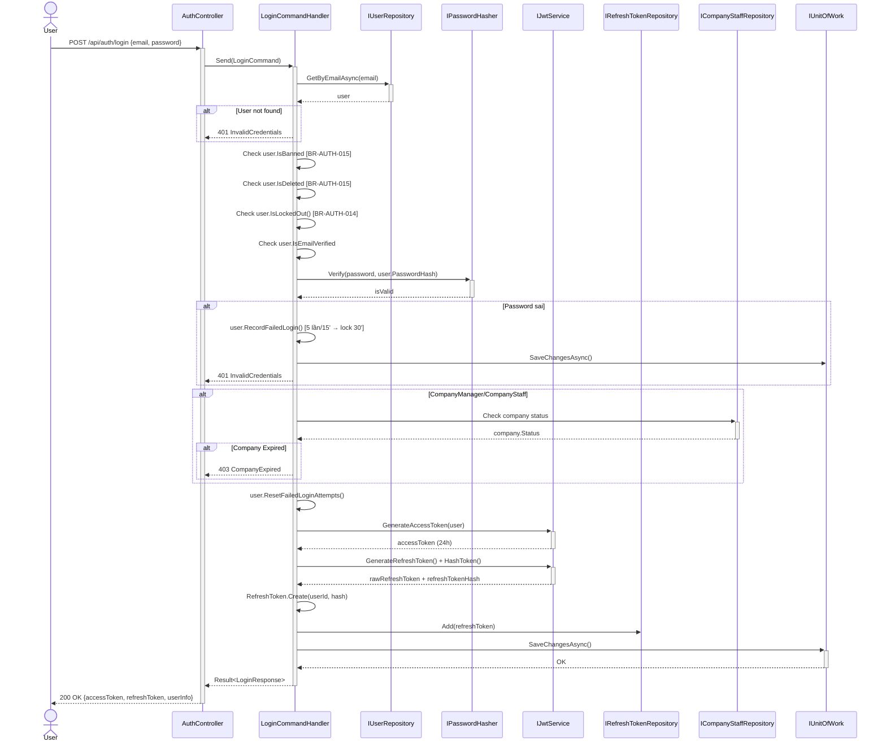
```mermaid
sequenceDiagram
    actor User
    participant API as AuthController
    participant Handler as LoginCommandHandler
    participant UserRepo as IUserRepository
    participant Hasher as IPasswordHasher
    participant JWT as IJwtService
    participant TokenRepo as IRefreshTokenRepository
    participant StaffRepo as ICompanyStaffRepository
    participant UoW as IUnitOfWork

    User->>+API: POST /api/auth/login {email, password}
    API->>+Handler: Send(LoginCommand)

    Handler->>+UserRepo: GetByEmailAsync(email)
    UserRepo-->>-Handler: user

    alt User not found
        Handler-->>API: 401 InvalidCredentials
    end

    Handler->>Handler: Check user.IsBanned [BR-AUTH-015]
    Handler->>Handler: Check user.IsDeleted [BR-AUTH-015]
    Handler->>Handler: Check user.IsLockedOut() [BR-AUTH-014]
    Handler->>Handler: Check user.IsEmailVerified

    Handler->>+Hasher: Verify(password, user.PasswordHash)
    Hasher-->>-Handler: isValid

    alt Password sai
        Handler->>Handler: user.RecordFailedLogin() [5 lần/15' → lock 30']
        Handler->>UoW: SaveChangesAsync()
        Handler-->>API: 401 InvalidCredentials
    end

    alt CompanyManager/CompanyStaff
        Handler->>+StaffRepo: Check company status
        StaffRepo-->>-Handler: company.Status
        alt Company Expired
            Handler-->>API: 403 CompanyExpired
        end
    end

    Handler->>Handler: user.ResetFailedLoginAttempts()

    Handler->>+JWT: GenerateAccessToken(user)
    JWT-->>-Handler: accessToken (24h)
    Handler->>+JWT: GenerateRefreshToken() + HashToken()
    JWT-->>-Handler: rawRefreshToken + refreshTokenHash

    Handler->>Handler: RefreshToken.Create(userId, hash)
    Handler->>TokenRepo: Add(refreshToken)
    Handler->>+UoW: SaveChangesAsync()
    UoW-->>-Handler: OK

    Handler-->>-API: Result<LoginResponse>
    API-->>-User: 200 OK {accessToken, refreshToken, userInfo}
```

---

### SD-04 ⭐ Refresh Token (Rotation)

**Actor:** All · **BR:** BR-AUTH-013

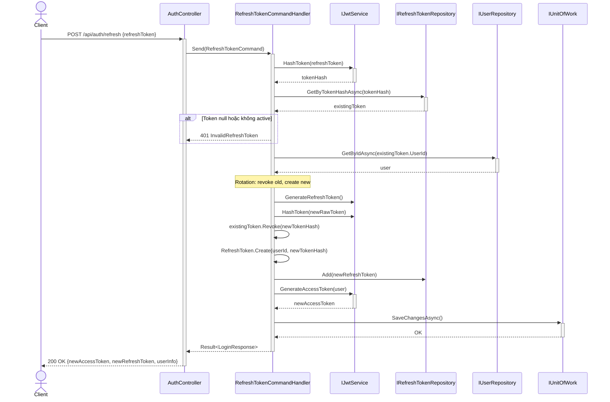
```mermaid
sequenceDiagram
    actor Client
    participant API as AuthController
    participant Handler as RefreshTokenCommandHandler
    participant JWT as IJwtService
    participant TokenRepo as IRefreshTokenRepository
    participant UserRepo as IUserRepository
    participant UoW as IUnitOfWork

    Client->>+API: POST /api/auth/refresh {refreshToken}
    API->>+Handler: Send(RefreshTokenCommand)

    Handler->>+JWT: HashToken(refreshToken)
    JWT-->>-Handler: tokenHash

    Handler->>+TokenRepo: GetByTokenHashAsync(tokenHash)
    TokenRepo-->>-Handler: existingToken

    alt Token null hoặc không active
        Handler-->>API: 401 InvalidRefreshToken
    end

    Handler->>+UserRepo: GetByIdAsync(existingToken.UserId)
    UserRepo-->>-Handler: user

    Note over Handler: Rotation: revoke old, create new
    Handler->>JWT: GenerateRefreshToken()
    Handler->>JWT: HashToken(newRawToken)
    Handler->>Handler: existingToken.Revoke(newTokenHash)
    Handler->>Handler: RefreshToken.Create(userId, newTokenHash)
    Handler->>TokenRepo: Add(newRefreshToken)

    Handler->>+JWT: GenerateAccessToken(user)
    JWT-->>-Handler: newAccessToken

    Handler->>+UoW: SaveChangesAsync()
    UoW-->>-Handler: OK

    Handler-->>-API: Result<LoginResponse>
    API-->>-Client: 200 OK {newAccessToken, newRefreshToken, userInfo}
```

---

## Nhóm 2: Report Lifecycle — Core ⭐

---

### SD-09 ⭐ Submit Pollution Report

**Actor:** Citizen · **BR:** BR-REP-001, BR-REP-003, BR-REP-004, BR-REP-005, BR-REP-010, BR-REP-011, BR-REP-013, BR-REP-030, BR-ORG-010

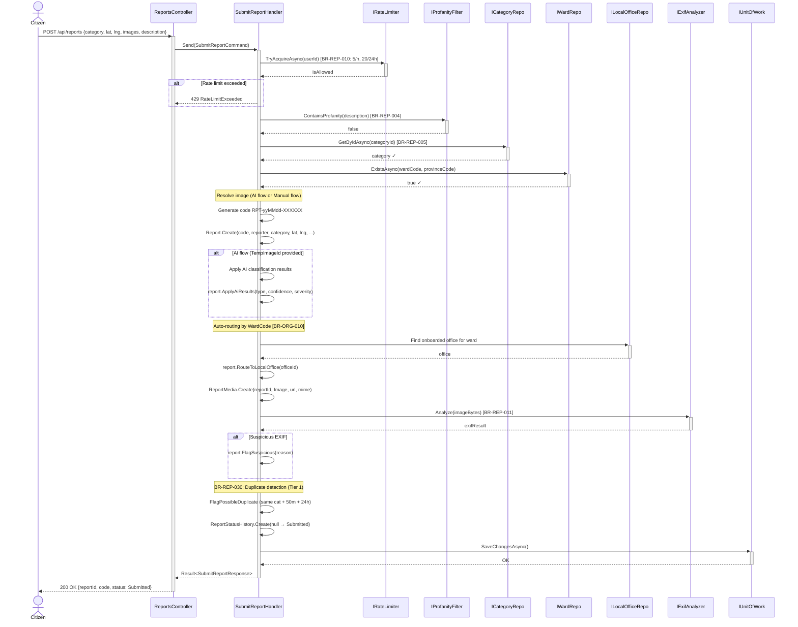
```mermaid
sequenceDiagram
    actor Citizen
    participant API as ReportsController
    participant Handler as SubmitReportHandler
    participant RateLimit as IRateLimiter
    participant Profanity as IProfanityFilter
    participant CatRepo as ICategoryRepo
    participant WardRepo as IWardRepo
    participant OfficeRepo as ILocalOfficeRepo
    participant EXIF as IExifAnalyzer
    participant DB as IUnitOfWork

    Citizen->>+API: POST /api/reports {category, lat, lng, images, description}
    API->>+Handler: Send(SubmitReportCommand)

    Handler->>+RateLimit: TryAcquireAsync(userId) [BR-REP-010: 5/h, 20/24h]
    RateLimit-->>-Handler: isAllowed

    alt Rate limit exceeded
        Handler-->>API: 429 RateLimitExceeded
    end

    Handler->>+Profanity: ContainsProfanity(description) [BR-REP-004]
    Profanity-->>-Handler: false

    Handler->>+CatRepo: GetByIdAsync(categoryId) [BR-REP-005]
    CatRepo-->>-Handler: category ✓

    Handler->>+WardRepo: ExistsAsync(wardCode, provinceCode)
    WardRepo-->>-Handler: true ✓

    Note over Handler: Resolve image (AI flow or Manual flow)
    Handler->>Handler: Generate code RPT-yyMMdd-XXXXXX
    Handler->>Handler: Report.Create(code, reporter, category, lat, lng, ...)

    alt AI flow (TempImageId provided)
        Handler->>Handler: Apply AI classification results
        Handler->>Handler: report.ApplyAiResults(type, confidence, severity)
    end

    Note over Handler: Auto-routing by WardCode [BR-ORG-010]
    Handler->>+OfficeRepo: Find onboarded office for ward
    OfficeRepo-->>-Handler: office
    Handler->>Handler: report.RouteToLocalOffice(officeId)

    Handler->>Handler: ReportMedia.Create(reportId, Image, url, mime)

    Handler->>+EXIF: Analyze(imageBytes) [BR-REP-011]
    EXIF-->>-Handler: exifResult
    alt Suspicious EXIF
        Handler->>Handler: report.FlagSuspicious(reason)
    end

    Note over Handler: BR-REP-030: Duplicate detection (Tier 1)
    Handler->>Handler: FlagPossibleDuplicate (same cat + 50m + 24h)

    Handler->>Handler: ReportStatusHistory.Create(null → Submitted)

    Handler->>+DB: SaveChangesAsync()
    DB-->>-Handler: OK

    Handler-->>-API: Result<SubmitReportResponse>
    API-->>-Citizen: 200 OK {reportId, code, status: Submitted}
```

---

### SD-11 ⭐ Verify Report

**Actor:** LEO · **BR:** BR-REP-020, BR-REP-021

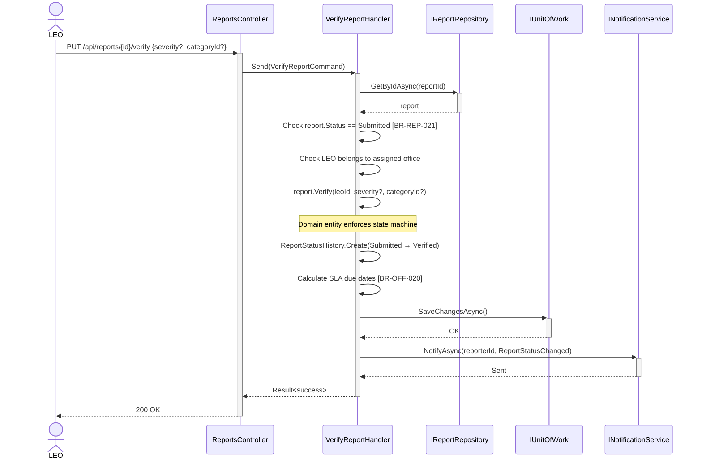
```mermaid
sequenceDiagram
    actor LEO
    participant API as ReportsController
    participant Handler as VerifyReportHandler
    participant ReportRepo as IReportRepository
    participant DB as IUnitOfWork
    participant Notif as INotificationService

    LEO->>+API: PUT /api/reports/{id}/verify {severity?, categoryId?}
    API->>+Handler: Send(VerifyReportCommand)

    Handler->>+ReportRepo: GetByIdAsync(reportId)
    ReportRepo-->>-Handler: report

    Handler->>Handler: Check report.Status == Submitted [BR-REP-021]
    Handler->>Handler: Check LEO belongs to assigned office

    Handler->>Handler: report.Verify(leoId, severity?, categoryId?)
    Note over Handler: Domain entity enforces state machine
    Handler->>Handler: ReportStatusHistory.Create(Submitted → Verified)
    Handler->>Handler: Calculate SLA due dates [BR-OFF-020]

    Handler->>+DB: SaveChangesAsync()
    DB-->>-Handler: OK

    Handler->>+Notif: NotifyAsync(reporterId, ReportStatusChanged)
    Notif-->>-Handler: Sent

    Handler-->>-API: Result<success>
    API-->>-LEO: 200 OK
```

---

### SD-12 ⭐ Reject Report

**Actor:** LEO · **BR:** BR-REP-021

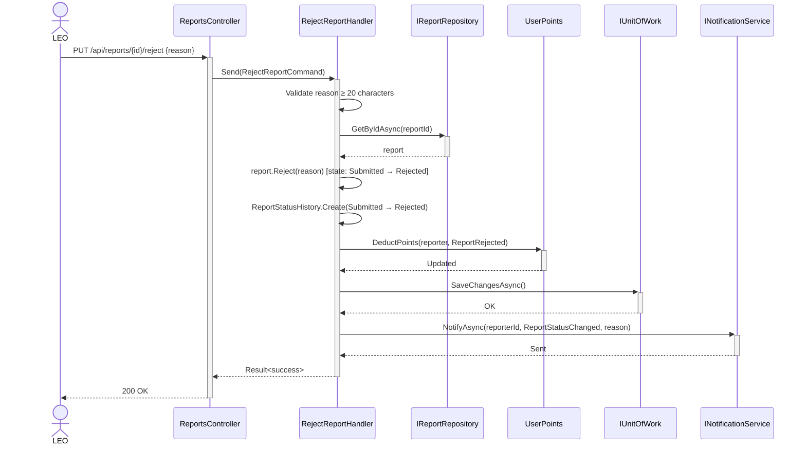
```mermaid
sequenceDiagram
    actor LEO
    participant API as ReportsController
    participant Handler as RejectReportHandler
    participant ReportRepo as IReportRepository
    participant Points as UserPoints
    participant DB as IUnitOfWork
    participant Notif as INotificationService

    LEO->>+API: PUT /api/reports/{id}/reject {reason}
    API->>+Handler: Send(RejectReportCommand)

    Handler->>Handler: Validate reason ≥ 20 characters

    Handler->>+ReportRepo: GetByIdAsync(reportId)
    ReportRepo-->>-Handler: report

    Handler->>Handler: report.Reject(reason) [state: Submitted → Rejected]
    Handler->>Handler: ReportStatusHistory.Create(Submitted → Rejected)

    Handler->>+Points: DeductPoints(reporter, ReportRejected)
    Points-->>-Handler: Updated

    Handler->>+DB: SaveChangesAsync()
    DB-->>-Handler: OK

    Handler->>+Notif: NotifyAsync(reporterId, ReportStatusChanged, reason)
    Notif-->>-Handler: Sent

    Handler-->>-API: Result<success>
    API-->>-LEO: 200 OK
```

---

### SD-13 ⭐ Assign Cleanup Team

**Actor:** LEO · **BR:** BR-OFF-001, BR-CLN-001

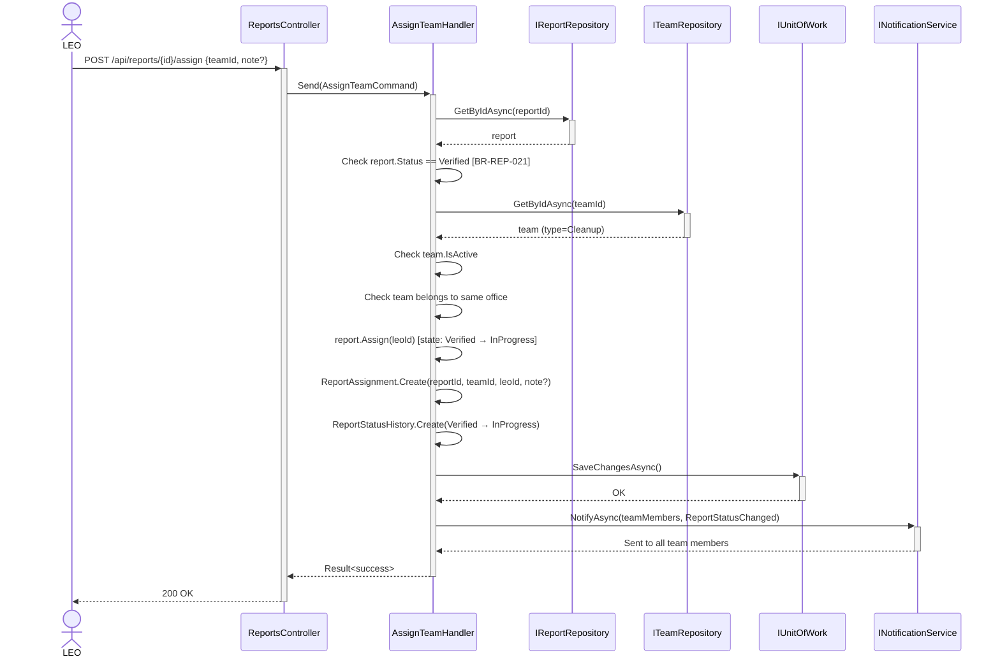
```mermaid
sequenceDiagram
    actor LEO
    participant API as ReportsController
    participant Handler as AssignTeamHandler
    participant ReportRepo as IReportRepository
    participant TeamRepo as ITeamRepository
    participant DB as IUnitOfWork
    participant Notif as INotificationService

    LEO->>+API: POST /api/reports/{id}/assign {teamId, note?}
    API->>+Handler: Send(AssignTeamCommand)

    Handler->>+ReportRepo: GetByIdAsync(reportId)
    ReportRepo-->>-Handler: report

    Handler->>Handler: Check report.Status == Verified [BR-REP-021]

    Handler->>+TeamRepo: GetByIdAsync(teamId)
    TeamRepo-->>-Handler: team (type=Cleanup)

    Handler->>Handler: Check team.IsActive
    Handler->>Handler: Check team belongs to same office

    Handler->>Handler: report.Assign(leoId) [state: Verified → InProgress]
    Handler->>Handler: ReportAssignment.Create(reportId, teamId, leoId, note?)
    Handler->>Handler: ReportStatusHistory.Create(Verified → InProgress)

    Handler->>+DB: SaveChangesAsync()
    DB-->>-Handler: OK

    Handler->>+Notif: NotifyAsync(teamMembers, ReportStatusChanged)
    Notif-->>-Handler: Sent to all team members

    Handler-->>-API: Result<success>
    API-->>-LEO: 200 OK
```

---

### SD-15 ⭐ Resolve Report

**Actor:** Cleaner/CompanyStaff · **BR:** BR-CLN-004, BR-REP-020

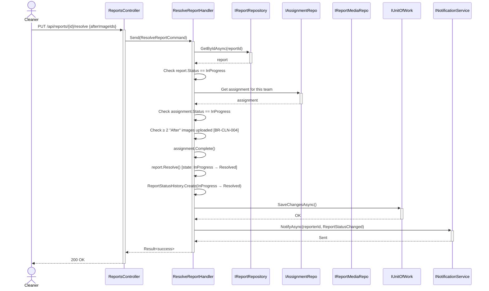
```mermaid
sequenceDiagram
    actor Cleaner
    participant API as ReportsController
    participant Handler as ResolveReportHandler
    participant ReportRepo as IReportRepository
    participant AssignRepo as IAssignmentRepo
    participant MediaRepo as IReportMediaRepo
    participant DB as IUnitOfWork
    participant Notif as INotificationService

    Cleaner->>+API: PUT /api/reports/{id}/resolve {afterImageIds}
    API->>+Handler: Send(ResolveReportCommand)

    Handler->>+ReportRepo: GetByIdAsync(reportId)
    ReportRepo-->>-Handler: report

    Handler->>Handler: Check report.Status == InProgress

    Handler->>+AssignRepo: Get assignment for this team
    AssignRepo-->>-Handler: assignment

    Handler->>Handler: Check assignment.Status == InProgress
    Handler->>Handler: Check ≥ 2 "After" images uploaded [BR-CLN-004]

    Handler->>Handler: assignment.Complete()
    Handler->>Handler: report.Resolve() [state: InProgress → Resolved]
    Handler->>Handler: ReportStatusHistory.Create(InProgress → Resolved)

    Handler->>+DB: SaveChangesAsync()
    DB-->>-Handler: OK

    Handler->>+Notif: NotifyAsync(reporterId, ReportStatusChanged)
    Notif-->>-Handler: Sent

    Handler-->>-API: Result<success>
    API-->>-Cleaner: 200 OK
```

---

### SD-16 ⭐ Close Report (Citizen Confirm / Auto-close)

**Actor:** Citizen / System · **BR:** BR-REP-016, BR-REP-025

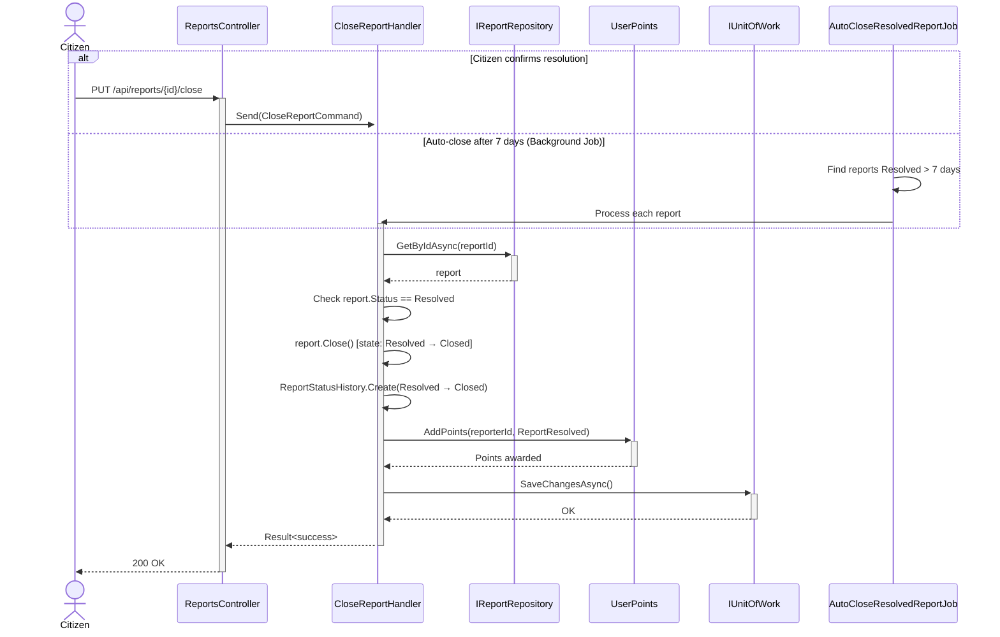
```mermaid
sequenceDiagram
    actor Citizen
    participant API as ReportsController
    participant Handler as CloseReportHandler
    participant ReportRepo as IReportRepository
    participant Points as UserPoints
    participant DB as IUnitOfWork

    alt Citizen confirms resolution
        Citizen->>+API: PUT /api/reports/{id}/close
        API->>+Handler: Send(CloseReportCommand)
    else Auto-close after 7 days (Background Job)
        participant Job as AutoCloseResolvedReportJob
        Job->>Job: Find reports Resolved > 7 days
        Job->>+Handler: Process each report
    end

    Handler->>+ReportRepo: GetByIdAsync(reportId)
    ReportRepo-->>-Handler: report

    Handler->>Handler: Check report.Status == Resolved

    Handler->>Handler: report.Close() [state: Resolved → Closed]
    Handler->>Handler: ReportStatusHistory.Create(Resolved → Closed)

    Handler->>+Points: AddPoints(reporterId, ReportResolved)
    Points-->>-Handler: Points awarded

    Handler->>+DB: SaveChangesAsync()
    DB-->>-Handler: OK

    Handler-->>-API: Result<success>
    API-->>-Citizen: 200 OK
```

---

### SD-18 ⭐ Duplicate Detection & Handling

**Actor:** AI / LEO · **BR:** BR-REP-030, BR-REP-032, BR-AI-002

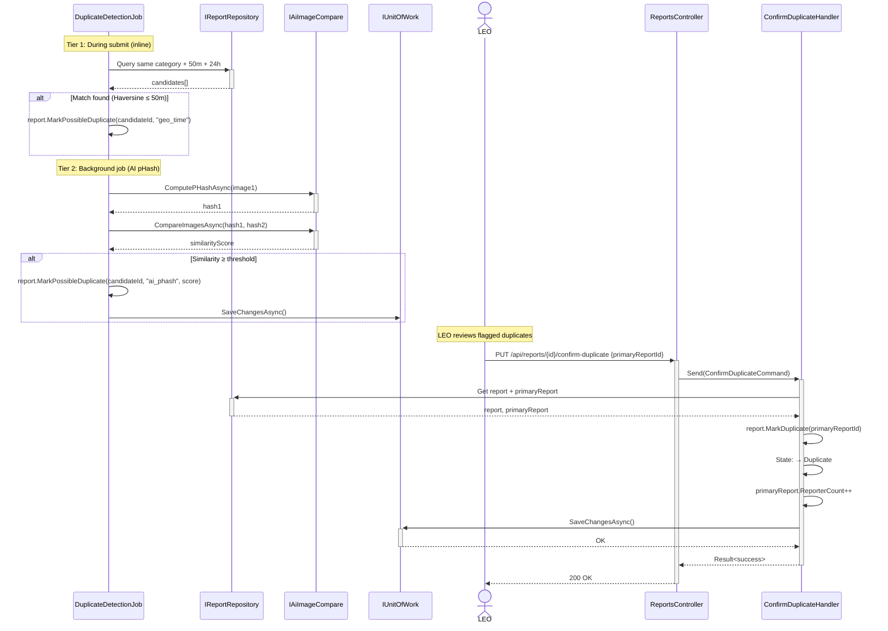
```mermaid
sequenceDiagram
    participant Job as DuplicateDetectionJob
    participant ReportRepo as IReportRepository
    participant AI as IAiImageCompare
    participant DB as IUnitOfWork
    actor LEO
    participant API as ReportsController
    participant Handler as ConfirmDuplicateHandler

    Note over Job: Tier 1: During submit (inline)
    Job->>+ReportRepo: Query same category + 50m + 24h
    ReportRepo-->>-Job: candidates[]

    alt Match found (Haversine ≤ 50m)
        Job->>Job: report.MarkPossibleDuplicate(candidateId, "geo_time")
    end

    Note over Job: Tier 2: Background job (AI pHash)
    Job->>+AI: ComputePHashAsync(image1)
    AI-->>-Job: hash1
    Job->>+AI: CompareImagesAsync(hash1, hash2)
    AI-->>-Job: similarityScore

    alt Similarity ≥ threshold
        Job->>Job: report.MarkPossibleDuplicate(candidateId, "ai_phash", score)
        Job->>DB: SaveChangesAsync()
    end

    Note over LEO: LEO reviews flagged duplicates
    LEO->>+API: PUT /api/reports/{id}/confirm-duplicate {primaryReportId}
    API->>+Handler: Send(ConfirmDuplicateCommand)

    Handler->>+ReportRepo: Get report + primaryReport
    ReportRepo-->>-Handler: report, primaryReport

    Handler->>Handler: report.MarkDuplicate(primaryReportId)
    Handler->>Handler: State: → Duplicate
    Handler->>Handler: primaryReport.ReporterCount++

    Handler->>+DB: SaveChangesAsync()
    DB-->>-Handler: OK

    Handler-->>-API: Result<success>
    API-->>-LEO: 200 OK
```

---

## Nhóm 3: Cleanup & Field Work

---

### SD-21 ⭐ Accept / Decline Assignment

**Actor:** Cleaner/CompanyStaff · **BR:** BR-CLN-001

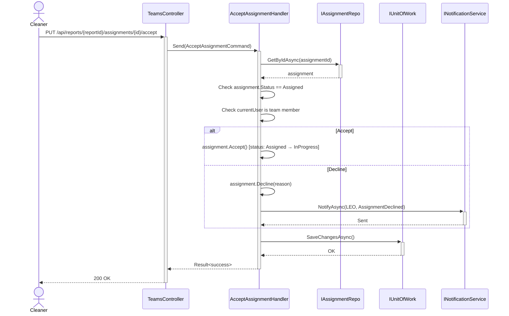
```mermaid
sequenceDiagram
    actor Cleaner
    participant API as TeamsController
    participant Handler as AcceptAssignmentHandler
    participant AssignRepo as IAssignmentRepo
    participant DB as IUnitOfWork
    participant Notif as INotificationService

    Cleaner->>+API: PUT /api/reports/{reportId}/assignments/{id}/accept
    API->>+Handler: Send(AcceptAssignmentCommand)

    Handler->>+AssignRepo: GetByIdAsync(assignmentId)
    AssignRepo-->>-Handler: assignment

    Handler->>Handler: Check assignment.Status == Assigned
    Handler->>Handler: Check currentUser is team member

    alt Accept
        Handler->>Handler: assignment.Accept() [status: Assigned → InProgress]
    else Decline
        Handler->>Handler: assignment.Decline(reason)
        Handler->>+Notif: NotifyAsync(LEO, AssignmentDeclined)
        Notif-->>-Handler: Sent
    end

    Handler->>+DB: SaveChangesAsync()
    DB-->>-Handler: OK

    Handler-->>-API: Result<success>
    API-->>-Cleaner: 200 OK
```

---

### SD-22 ⭐ Check-in at Cleanup Site

**Actor:** Cleaner/CompanyStaff · **BR:** BR-CLN-002

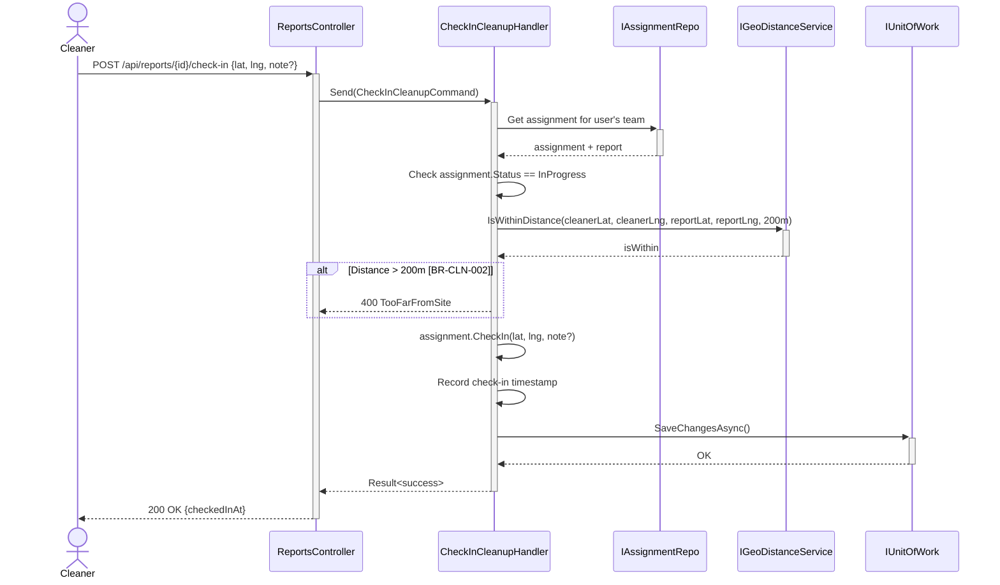
```mermaid
sequenceDiagram
    actor Cleaner
    participant API as ReportsController
    participant Handler as CheckInCleanupHandler
    participant AssignRepo as IAssignmentRepo
    participant Geo as IGeoDistanceService
    participant DB as IUnitOfWork

    Cleaner->>+API: POST /api/reports/{id}/check-in {lat, lng, note?}
    API->>+Handler: Send(CheckInCleanupCommand)

    Handler->>+AssignRepo: Get assignment for user's team
    AssignRepo-->>-Handler: assignment + report

    Handler->>Handler: Check assignment.Status == InProgress

    Handler->>+Geo: IsWithinDistance(cleanerLat, cleanerLng, reportLat, reportLng, 200m)
    Geo-->>-Handler: isWithin

    alt Distance > 200m [BR-CLN-002]
        Handler-->>API: 400 TooFarFromSite
    end

    Handler->>Handler: assignment.CheckIn(lat, lng, note?)
    Handler->>Handler: Record check-in timestamp

    Handler->>+DB: SaveChangesAsync()
    DB-->>-Handler: OK

    Handler-->>-API: Result<success>
    API-->>-Cleaner: 200 OK {checkedInAt}
```

---

## Nhóm 4: Inspection & Penalty

---

### SD-28 ⭐ Create Inspection Report

**Actor:** LEO · **BR:** BR-INS-001

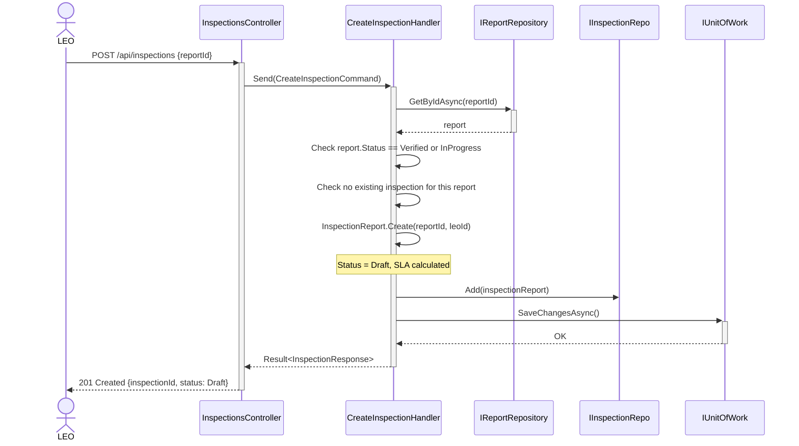
```mermaid
sequenceDiagram
    actor LEO
    participant API as InspectionsController
    participant Handler as CreateInspectionHandler
    participant ReportRepo as IReportRepository
    participant InspRepo as IInspectionRepo
    participant DB as IUnitOfWork

    LEO->>+API: POST /api/inspections {reportId}
    API->>+Handler: Send(CreateInspectionCommand)

    Handler->>+ReportRepo: GetByIdAsync(reportId)
    ReportRepo-->>-Handler: report

    Handler->>Handler: Check report.Status == Verified or InProgress
    Handler->>Handler: Check no existing inspection for this report

    Handler->>Handler: InspectionReport.Create(reportId, leoId)
    Note over Handler: Status = Draft, SLA calculated
    Handler->>InspRepo: Add(inspectionReport)

    Handler->>+DB: SaveChangesAsync()
    DB-->>-Handler: OK

    Handler-->>-API: Result<InspectionResponse>
    API-->>-LEO: 201 Created {inspectionId, status: Draft}
```

---

### SD-29 ⭐ Assign Inspection Team

**Actor:** LEO · **BR:** BR-INS-002

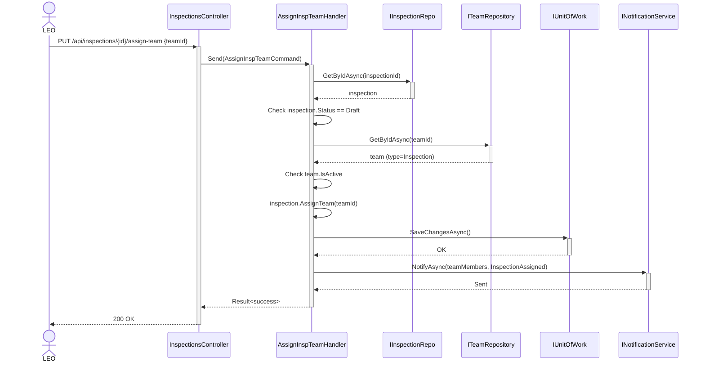
```mermaid
sequenceDiagram
    actor LEO
    participant API as InspectionsController
    participant Handler as AssignInspTeamHandler
    participant InspRepo as IInspectionRepo
    participant TeamRepo as ITeamRepository
    participant DB as IUnitOfWork
    participant Notif as INotificationService

    LEO->>+API: PUT /api/inspections/{id}/assign-team {teamId}
    API->>+Handler: Send(AssignInspTeamCommand)

    Handler->>+InspRepo: GetByIdAsync(inspectionId)
    InspRepo-->>-Handler: inspection

    Handler->>Handler: Check inspection.Status == Draft

    Handler->>+TeamRepo: GetByIdAsync(teamId)
    TeamRepo-->>-Handler: team (type=Inspection)

    Handler->>Handler: Check team.IsActive
    Handler->>Handler: inspection.AssignTeam(teamId)

    Handler->>+DB: SaveChangesAsync()
    DB-->>-Handler: OK

    Handler->>+Notif: NotifyAsync(teamMembers, InspectionAssigned)
    Notif-->>-Handler: Sent

    Handler-->>-API: Result<success>
    API-->>-LEO: 200 OK
```

---

### SD-32 ⭐ Issue Penalty

**Actor:** Inspector / LEO · **BR:** BR-INS-005, BR-INS-006, BR-INS-010

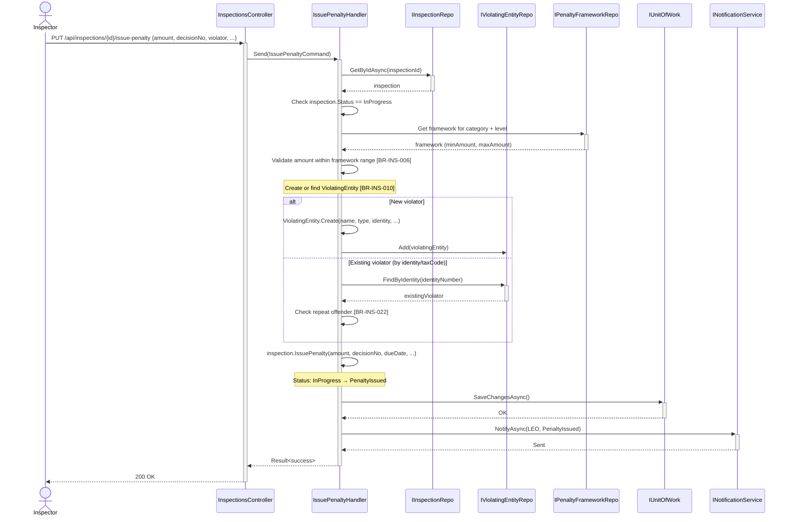
```mermaid
sequenceDiagram
    actor Inspector
    participant API as InspectionsController
    participant Handler as IssuePenaltyHandler
    participant InspRepo as IInspectionRepo
    participant ViolRepo as IViolatingEntityRepo
    participant FrameRepo as IPenaltyFrameworkRepo
    participant DB as IUnitOfWork
    participant Notif as INotificationService

    Inspector->>+API: PUT /api/inspections/{id}/issue-penalty {amount, decisionNo, violator, ...}
    API->>+Handler: Send(IssuePenaltyCommand)

    Handler->>+InspRepo: GetByIdAsync(inspectionId)
    InspRepo-->>-Handler: inspection

    Handler->>Handler: Check inspection.Status == InProgress

    Handler->>+FrameRepo: Get framework for category + level
    FrameRepo-->>-Handler: framework (minAmount, maxAmount)

    Handler->>Handler: Validate amount within framework range [BR-INS-006]

    Note over Handler: Create or find ViolatingEntity [BR-INS-010]
    alt New violator
        Handler->>Handler: ViolatingEntity.Create(name, type, identity, ...)
        Handler->>ViolRepo: Add(violatingEntity)
    else Existing violator (by identity/taxCode)
        Handler->>+ViolRepo: FindByIdentity(identityNumber)
        ViolRepo-->>-Handler: existingViolator
        Handler->>Handler: Check repeat offender [BR-INS-022]
    end

    Handler->>Handler: inspection.IssuePenalty(amount, decisionNo, dueDate, ...)
    Note over Handler: Status: InProgress → PenaltyIssued

    Handler->>+DB: SaveChangesAsync()
    DB-->>-Handler: OK

    Handler->>+Notif: NotifyAsync(LEO, PenaltyIssued)
    Notif-->>-Handler: Sent

    Handler-->>-API: Result<success>
    API-->>-Inspector: 200 OK
```

---

## Nhóm 5: Organization Management

---

### SD-36 ⭐ Create Department & LocalOffice

**Actor:** Admin · **BR:** BR-ORG-001, BR-ORG-002

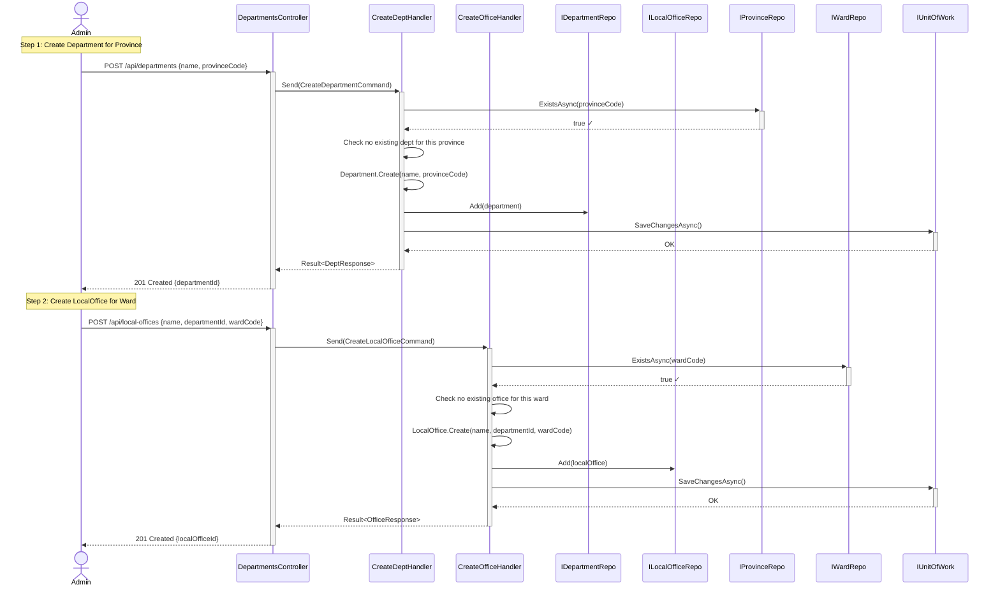
```mermaid
sequenceDiagram
    actor Admin
    participant API as DepartmentsController
    participant Handler1 as CreateDeptHandler
    participant Handler2 as CreateOfficeHandler
    participant DeptRepo as IDepartmentRepo
    participant OfficeRepo as ILocalOfficeRepo
    participant ProvRepo as IProvinceRepo
    participant WardRepo as IWardRepo
    participant DB as IUnitOfWork

    Note over Admin: Step 1: Create Department for Province
    Admin->>+API: POST /api/departments {name, provinceCode}
    API->>+Handler1: Send(CreateDepartmentCommand)

    Handler1->>+ProvRepo: ExistsAsync(provinceCode)
    ProvRepo-->>-Handler1: true ✓
    Handler1->>Handler1: Check no existing dept for this province
    Handler1->>Handler1: Department.Create(name, provinceCode)
    Handler1->>DeptRepo: Add(department)
    Handler1->>+DB: SaveChangesAsync()
    DB-->>-Handler1: OK

    Handler1-->>-API: Result<DeptResponse>
    API-->>-Admin: 201 Created {departmentId}

    Note over Admin: Step 2: Create LocalOffice for Ward
    Admin->>+API: POST /api/local-offices {name, departmentId, wardCode}
    API->>+Handler2: Send(CreateLocalOfficeCommand)

    Handler2->>+WardRepo: ExistsAsync(wardCode)
    WardRepo-->>-Handler2: true ✓
    Handler2->>Handler2: Check no existing office for this ward
    Handler2->>Handler2: LocalOffice.Create(name, departmentId, wardCode)
    Handler2->>OfficeRepo: Add(localOffice)
    Handler2->>+DB: SaveChangesAsync()
    DB-->>-Handler2: OK

    Handler2-->>-API: Result<OfficeResponse>
    API-->>-Admin: 201 Created {localOfficeId}
```

---

### SD-37 ⭐ Create Team (Cleanup / Inspection)

**Actor:** LEO · **BR:** BR-ORG-013

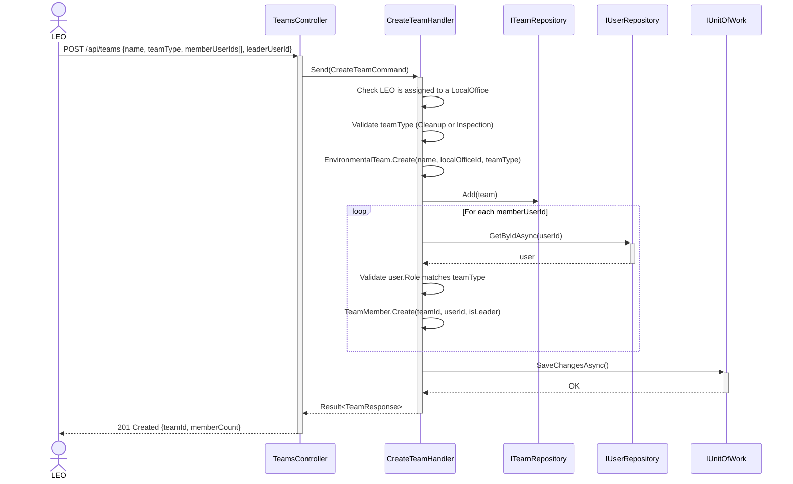
```mermaid
sequenceDiagram
    actor LEO
    participant API as TeamsController
    participant Handler as CreateTeamHandler
    participant TeamRepo as ITeamRepository
    participant UserRepo as IUserRepository
    participant DB as IUnitOfWork

    LEO->>+API: POST /api/teams {name, teamType, memberUserIds[], leaderUserId}
    API->>+Handler: Send(CreateTeamCommand)

    Handler->>Handler: Check LEO is assigned to a LocalOffice
    Handler->>Handler: Validate teamType (Cleanup or Inspection)

    Handler->>Handler: EnvironmentalTeam.Create(name, localOfficeId, teamType)
    Handler->>TeamRepo: Add(team)

    loop For each memberUserId
        Handler->>+UserRepo: GetByIdAsync(userId)
        UserRepo-->>-Handler: user
        Handler->>Handler: Validate user.Role matches teamType
        Handler->>Handler: TeamMember.Create(teamId, userId, isLeader)
    end

    Handler->>+DB: SaveChangesAsync()
    DB-->>-Handler: OK

    Handler-->>-API: Result<TeamResponse>
    API-->>-LEO: 201 Created {teamId, memberCount}
```

---

### SD-38 ⭐ Onboard Environmental Company

**Actor:** DEO · **BR:** BR-CMP-001, BR-CMP-006

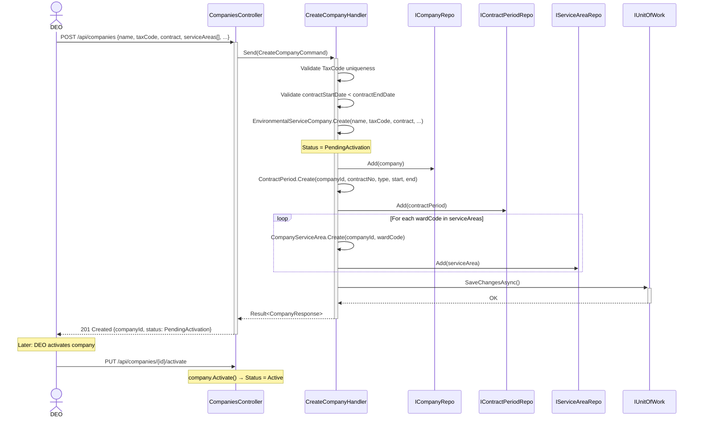
```mermaid
sequenceDiagram
    actor DEO
    participant API as CompaniesController
    participant Handler as CreateCompanyHandler
    participant CompRepo as ICompanyRepo
    participant ContRepo as IContractPeriodRepo
    participant AreaRepo as IServiceAreaRepo
    participant DB as IUnitOfWork

    DEO->>+API: POST /api/companies {name, taxCode, contract, serviceAreas[], ...}
    API->>+Handler: Send(CreateCompanyCommand)

    Handler->>Handler: Validate TaxCode uniqueness
    Handler->>Handler: Validate contractStartDate < contractEndDate

    Handler->>Handler: EnvironmentalServiceCompany.Create(name, taxCode, contract, ...)
    Note over Handler: Status = PendingActivation
    Handler->>CompRepo: Add(company)

    Handler->>Handler: ContractPeriod.Create(companyId, contractNo, type, start, end)
    Handler->>ContRepo: Add(contractPeriod)

    loop For each wardCode in serviceAreas
        Handler->>Handler: CompanyServiceArea.Create(companyId, wardCode)
        Handler->>AreaRepo: Add(serviceArea)
    end

    Handler->>+DB: SaveChangesAsync()
    DB-->>-Handler: OK

    Handler-->>-API: Result<CompanyResponse>
    API-->>-DEO: 201 Created {companyId, status: PendingActivation}

    Note over DEO: Later: DEO activates company
    DEO->>API: PUT /api/companies/{id}/activate
    Note over API: company.Activate() → Status = Active
```

---

## Nhóm 6: Comment & Community

---

### SD-44 ⭐ Add Comment (with Media & Moderation)

**Actor:** Citizen · **BR:** BR-CMT-001, BR-CMT-002, BR-CMT-005

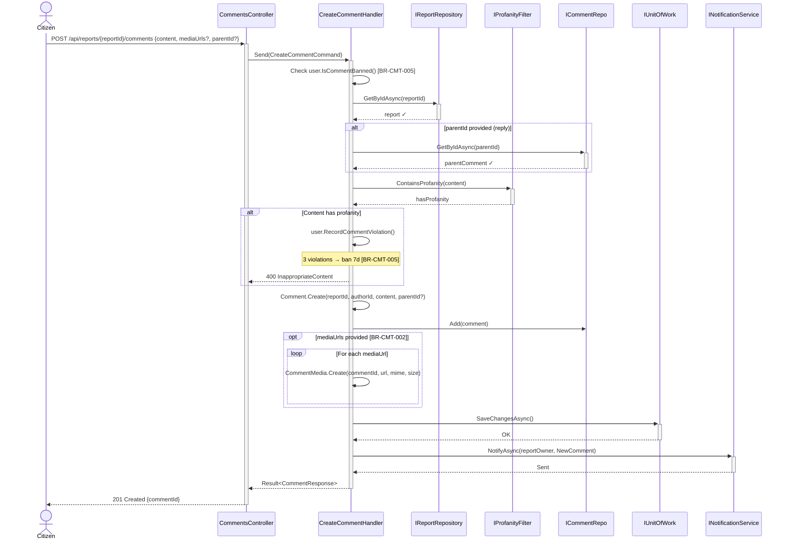
```mermaid
sequenceDiagram
    actor Citizen
    participant API as CommentsController
    participant Handler as CreateCommentHandler
    participant ReportRepo as IReportRepository
    participant Profanity as IProfanityFilter
    participant CommentRepo as ICommentRepo
    participant DB as IUnitOfWork
    participant Notif as INotificationService

    Citizen->>+API: POST /api/reports/{reportId}/comments {content, mediaUrls?, parentId?}
    API->>+Handler: Send(CreateCommentCommand)

    Handler->>Handler: Check user.IsCommentBanned() [BR-CMT-005]

    Handler->>+ReportRepo: GetByIdAsync(reportId)
    ReportRepo-->>-Handler: report ✓

    alt parentId provided (reply)
        Handler->>+CommentRepo: GetByIdAsync(parentId)
        CommentRepo-->>-Handler: parentComment ✓
    end

    Handler->>+Profanity: ContainsProfanity(content)
    Profanity-->>-Handler: hasProfanity

    alt Content has profanity
        Handler->>Handler: user.RecordCommentViolation()
        Note over Handler: 3 violations → ban 7d [BR-CMT-005]
        Handler-->>API: 400 InappropriateContent
    end

    Handler->>Handler: Comment.Create(reportId, authorId, content, parentId?)
    Handler->>CommentRepo: Add(comment)

    opt mediaUrls provided [BR-CMT-002]
        loop For each mediaUrl
            Handler->>Handler: CommentMedia.Create(commentId, url, mime, size)
        end
    end

    Handler->>+DB: SaveChangesAsync()
    DB-->>-Handler: OK

    Handler->>+Notif: NotifyAsync(reportOwner, NewComment)
    Notif-->>-Handler: Sent

    Handler-->>-API: Result<CommentResponse>
    API-->>-Citizen: 201 Created {commentId}
```

---

## Nhóm 7: Gamification

---

### SD-48 ⭐ Award Points (Event-driven)

**Actor:** System · **BR:** BR-GAM-001, BR-GAM-002

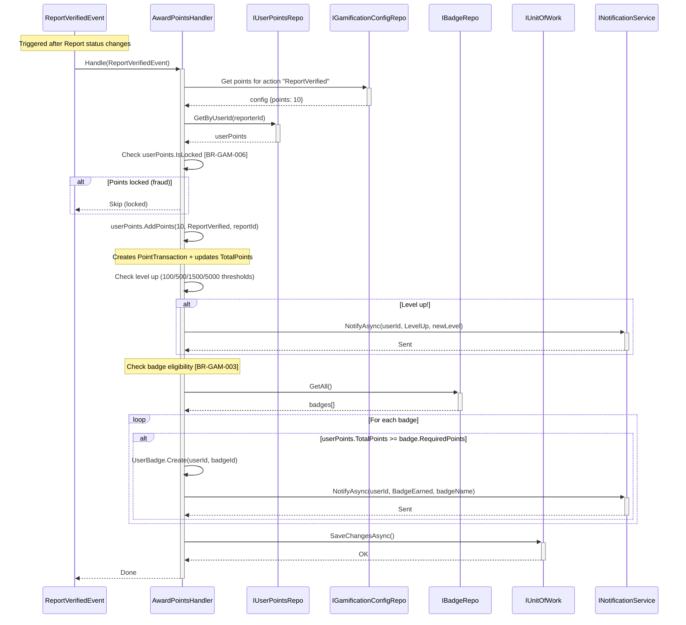
```mermaid
sequenceDiagram
    participant DomainEvent as ReportVerifiedEvent
    participant EventHandler as AwardPointsHandler
    participant PointsRepo as IUserPointsRepo
    participant ConfigRepo as IGamificationConfigRepo
    participant BadgeRepo as IBadgeRepo
    participant DB as IUnitOfWork
    participant Notif as INotificationService

    Note over DomainEvent: Triggered after Report status changes

    DomainEvent->>+EventHandler: Handle(ReportVerifiedEvent)

    EventHandler->>+ConfigRepo: Get points for action "ReportVerified"
    ConfigRepo-->>-EventHandler: config {points: 10}

    EventHandler->>+PointsRepo: GetByUserId(reporterId)
    PointsRepo-->>-EventHandler: userPoints

    EventHandler->>EventHandler: Check userPoints.IsLocked [BR-GAM-006]
    alt Points locked (fraud)
        EventHandler-->>DomainEvent: Skip (locked)
    end

    EventHandler->>EventHandler: userPoints.AddPoints(10, ReportVerified, reportId)
    Note over EventHandler: Creates PointTransaction + updates TotalPoints

    EventHandler->>EventHandler: Check level up (100/500/1500/5000 thresholds)
    alt Level up!
        EventHandler->>+Notif: NotifyAsync(userId, LevelUp, newLevel)
        Notif-->>-EventHandler: Sent
    end

    Note over EventHandler: Check badge eligibility [BR-GAM-003]
    EventHandler->>+BadgeRepo: GetAll()
    BadgeRepo-->>-EventHandler: badges[]

    loop For each badge
        alt userPoints.TotalPoints >= badge.RequiredPoints
            EventHandler->>EventHandler: UserBadge.Create(userId, badgeId)
            EventHandler->>+Notif: NotifyAsync(userId, BadgeEarned, badgeName)
            Notif-->>-EventHandler: Sent
        end
    end

    EventHandler->>+DB: SaveChangesAsync()
    DB-->>-EventHandler: OK

    EventHandler-->>-DomainEvent: Done
```

---

## Nhóm 8: Notification

---

### SD-52 ⭐ Send Notification (Event-driven, Multi-channel)

**Actor:** System · **BR:** BR-NTF-001, BR-NTF-002

```mermaid
sequenceDiagram
    participant Event as DomainEvent
    participant Handler as NotificationEventHandler
    participant NotifSvc as INotificationService
    participant PrefRepo as INotifPreferenceRepo
    participant TplRepo as INotifTemplateRepo
    participant Push as IPushNotificationSender
    participant Email as IEmailSender
    participant DB as IUnitOfWork

    Event->>+Handler: Handle(ReportStatusChangedEvent)

    Handler->>+NotifSvc: NotifyAsync(recipientId, type, referenceId, data)
    NotifSvc->>+PrefRepo: GetPreference(userId, type)
    PrefRepo-->>-NotifSvc: preference {pushEnabled, emailEnabled}

    alt Push disabled AND Email disabled
        NotifSvc-->>Handler: Skip (user opted out)
    end

    NotifSvc->>+TplRepo: GetTemplate(type, channel)
    TplRepo-->>-NotifSvc: template {titleVi, bodyVi, titleEn, bodyEn}

    NotifSvc->>NotifSvc: Render template with placeholders
    Note over NotifSvc: Replace {user_name}, {report_code}, etc.

    NotifSvc->>NotifSvc: Notification.Create(recipientId, type, title, message, channel)
    NotifSvc->>DB: Add(notification)

    opt Push enabled [BR-NTF-002]
        NotifSvc->>+Push: SendAsync(user.FcmDeviceToken, title, body)
        Push-->>-NotifSvc: Sent via FCM
    end

    opt Email enabled
        NotifSvc->>+Email: SendTemplateAsync(user.Email, template, data)
        Email-->>-NotifSvc: Sent via SMTP
    end

    NotifSvc->>+DB: SaveChangesAsync()
    DB-->>-NotifSvc: OK

    NotifSvc-->>-Handler: Done
    Handler-->>-Event: Done
```

---

## Nhóm 9: Map & Public Data

---

### SD-55 ⭐ View Public Map (Reports + Heatmap)

**Actor:** Citizen / Anonymous · **BR:** BR-MAP-001, BR-MAP-004, BR-MAP-012

```mermaid
sequenceDiagram
    actor Citizen
    participant API as MapController
    participant Handler as GetNearbyHandler
    participant Cache as Redis
    participant ReportRepo as IReportRepository
    participant DB as PostgreSQL + PostGIS

    Citizen->>+API: GET /api/map/nearby?lat=X&lng=Y&radius=5000&filters=...
    API->>+Handler: Send(GetNearbyReportsQuery)

    Handler->>Handler: Build cache key from bbox + filters

    Handler->>+Cache: GET map:{cacheKey} [BR-MAP-012: TTL 10']
    Cache-->>-Handler: cached?

    alt Cache hit
        Handler-->>API: Return cached markers
    end

    Handler->>+DB: Query reports within bounding box
    Note over DB: PostGIS: ST_DWithin or decimal bbox
    Note over DB: Filter: status, category, severity, dateRange
    DB-->>-Handler: reports[]

    Handler->>Handler: Round GPS to 4 decimals (≈11m) [BR-MAP-004]
    Note over Handler: Privacy: hide exact location on public map

    Handler->>Handler: Build marker DTO (id, lat, lng, status, severity, category)

    Handler->>+Cache: SET map:{cacheKey} TTL=600s
    Cache-->>-Handler: OK

    Handler-->>-API: Result<MapResponse>
    API-->>-Citizen: 200 OK {markers[], totalCount, bbox}
```

---

## Nhóm 10: Media & File Upload

---

### SD-66 ⭐ Upload Report Image (Presigned URL + AI Analyze)

**Actor:** Citizen · **BR:** BR-REP-001, BR-REP-002, BR-AI-001, BR-AI-007

```mermaid
sequenceDiagram
    actor Citizen
    participant API as MediaController
    participant Handler as AnalyzeImageHandler
    participant Storage as IFileStorageService
    participant EXIF as IImageExifAnalyzer
    participant AI as IAiClassificationService
    participant TempStore as ITempImageStore

    Note over Citizen: Step 1: Get presigned URL
    Citizen->>+API: POST /api/media/presigned-url {fileName, mimeType}
    API->>+Storage: GeneratePresignedUploadUrl(fileName, mime)
    Storage-->>-API: {uploadUrl, publicUrl, key}
    API-->>-Citizen: 200 OK {uploadUrl, publicUrl, key}

    Note over Citizen: Step 2: Upload direct to R2/S3
    Citizen->>Storage: PUT uploadUrl [binary image data]
    Storage-->>Citizen: 200 OK

    Note over Citizen: Step 3: Analyze uploaded image (optional AI flow)
    Citizen->>+API: POST /api/media/analyze {url, key, mimeType, sizeBytes}
    API->>+Handler: Send(AnalyzeUploadedReportImageCommand)

    Handler->>+Storage: DownloadAsync(key) [validate exists + size]
    Storage-->>-Handler: imageBytes

    Handler->>Handler: Validate content-type (magic bytes) [BR-REP-002]
    Handler->>Handler: Validate size ≤ 10MB

    Handler->>+EXIF: Analyze(imageBytes) [BR-AI-007: strip sensitive EXIF]
    EXIF-->>-Handler: exifResult

    Handler->>+AI: ClassifyImageAsync(imageBytes) [timeout 5s]
    alt AI responds in time
        AI-->>-Handler: {primaryClass, confidence, severity, decision}
    else AI timeout [BR-AI-006]
        Handler->>Handler: Mark as ai_pending, queue retry
    end

    Handler->>+TempStore: StoreAsync(tempId, bytes, aiResult)
    TempStore-->>-Handler: tempImageId

    Handler-->>-API: Result<AnalyzeResponse>
    API-->>-Citizen: 200 OK {tempImageId, aiResult, exifWarning?}

    Note over Citizen: Step 4: Submit report with tempImageId → SD-09
```

---

## Nhóm 11: Administration

---

### SD-62 ⭐ View Audit Logs

**Actor:** Admin · **BR:** BR-ADM-010

```mermaid
sequenceDiagram
    actor Admin
    participant API as AdminController
    participant Handler as GetAuditLogsHandler
    participant AuditRepo as IAuditLogRepository
    participant DB as PostgreSQL

    Admin->>+API: GET /api/admin/audit-logs?entityType=Report&action=Verify&from=...&to=...&page=1
    API->>+Handler: Send(GetAuditLogsQuery)

    Handler->>Handler: Validate Admin role

    Handler->>+AuditRepo: QueryAsNoTracking()
    Note over AuditRepo: Filter by entityType, action, dateRange, performedBy
    Note over AuditRepo: Order by CreatedAt DESC
    Note over AuditRepo: Paginate (page, pageSize)
    AuditRepo->>+DB: SELECT * FROM audit_logs WHERE ...
    DB-->>-AuditRepo: rows[]
    AuditRepo-->>-Handler: PagedResult<AuditLogDto>

    Handler-->>-API: Result<PagedResult<AuditLogDto>>
    API-->>-Admin: 200 OK {items[], totalCount, page, pageSize}
```

---

## Tổng hợp — Thứ tự Trình bày

```mermaid
flowchart LR
    subgraph Auth ["1️⃣ Auth"]
        SD01["SD-01\nRegister"]
        SD02["SD-02\nLogin"]
        SD04["SD-04\nRefresh"]
    end

    subgraph Report ["2️⃣ Report Core"]
        SD09["SD-09\nSubmit"]
        SD11["SD-11\nVerify"]
        SD12["SD-12\nReject"]
        SD13["SD-13\nAssign"]
        SD15["SD-15\nResolve"]
        SD16["SD-16\nClose"]
        SD18["SD-18\nDuplicate"]
    end

    subgraph Cleanup ["3️⃣ Cleanup"]
        SD21["SD-21\nAccept/Decline"]
        SD22["SD-22\nCheck-in"]
    end

    subgraph Inspection ["4️⃣ Inspection"]
        SD28["SD-28\nCreate"]
        SD29["SD-29\nAssign Team"]
        SD32["SD-32\nIssue Penalty"]
    end

    subgraph Org ["5️⃣ Organization"]
        SD36["SD-36\nDept & Office"]
        SD37["SD-37\nCreate Team"]
        SD38["SD-38\nOnboard Company"]
    end

    subgraph Cross ["6️⃣–11️⃣ Cross-cutting"]
        SD44["SD-44\nComment"]
        SD48["SD-48\nGamification"]
        SD52["SD-52\nNotification"]
        SD55["SD-55\nMap"]
        SD66["SD-66\nMedia Upload"]
        SD62["SD-62\nAudit Log"]
    end

    Auth --> Report --> Cleanup --> Inspection --> Org --> Cross
```
