# GreenLens — Use Case Diagram (v2.0)

> **Dự án:** SU26SE049 — Crowdsourced Application for Reporting Environmental Pollution
> **Loại:** Use Case Diagram — UML 2.0 style (Mermaid flowchart)
> **Cập nhật:** 2026-08-07 · **Nguồn:** Toàn bộ Feature slices từ src code thực tế
> **Tổng:** 9 Actors · ~170 use cases · 14 modules

---

## Actors

| #   | Actor                  | Vai trò                                                                        | UserRole enum value(s)         |
| --- | ---------------------- | ------------------------------------------------------------------------------ | ------------------------------ |
| 1   | 👤 **Guest**           | Chưa đăng nhập, xem map công khai, đăng ký, quên mật khẩu                     | —                              |
| 2   | 🟢 **Citizen**         | Gửi báo cáo, bình luận, flag, đánh giá, gamification, tham gia community cleanup | Citizen                        |
| 3   | 🔵 **LEO**             | Xác minh, assign team/company, inspect, community cleanup, moderate, SLA       | LEO                            |
| 4   | 🟣 **DEO**             | Quản lý tỉnh, tạo company, gia hạn hợp đồng, dashboard                       | DEO                            |
| 5   | 🟠 **Cleaner**         | Nhận task dọn dẹp, check-in, cập nhật tiến độ, resolve, dẫn community cleanup | Cleaner                        |
| 6   | 🔴 **Inspector**       | Checklist workflow, field investigation, xử phạt, thu tiền phạt                | Inspector                      |
| 7   | 🟡 **Company Manager** | Quản lý nhân sự công ty, team, task dispatch                                   | CompanyManager                 |
| 8   | 🟤 **Company Staff**   | Nhận task từ company, cập nhật tiến độ                                         | CompanyStaff                   |
| 9   | ⚫ **Admin**            | Quản lý user, danh mục, cấu hình, content mod, dashboard                       | Admin                          |
| —   | 🤖 **AI Service**      | Phân loại ảnh, phát hiện trùng, ước lượng severity (automated, không phải actor) | —                              |

---

## UC-01: Authentication & Account (Guest / All Users)

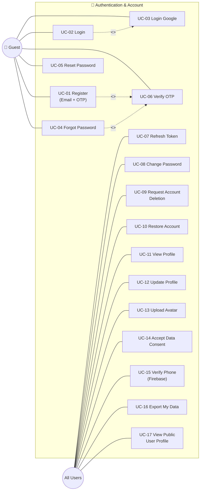

---

## UC-02: Pollution Report — Citizen

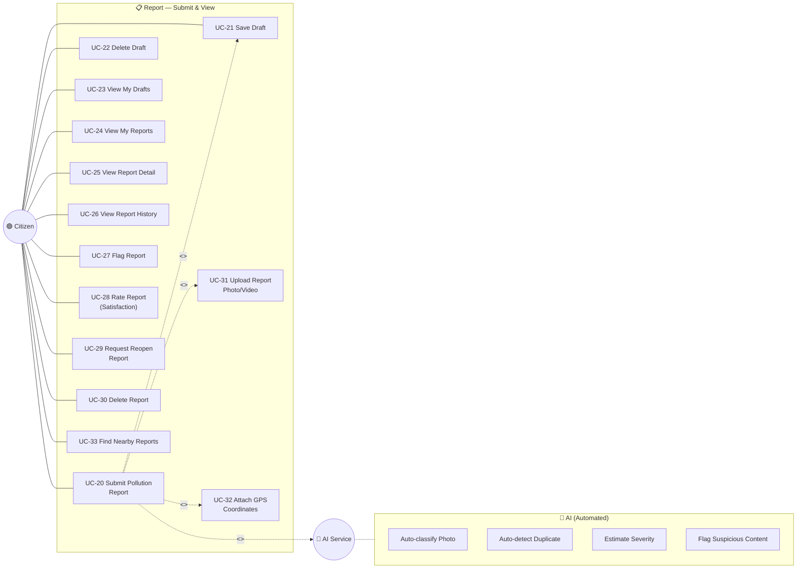

---

## UC-03: Report Management — LEO

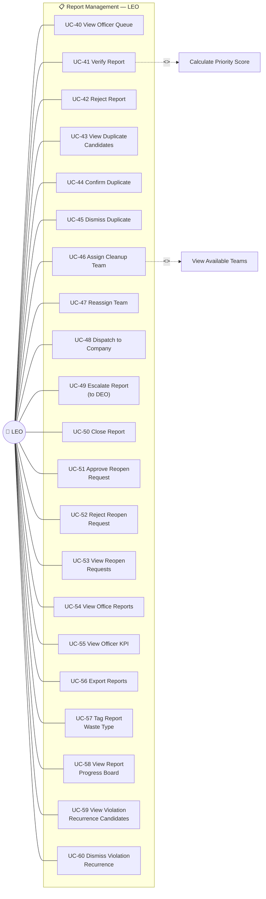

---

## UC-04: Cleanup Task — Cleaner / Company Staff

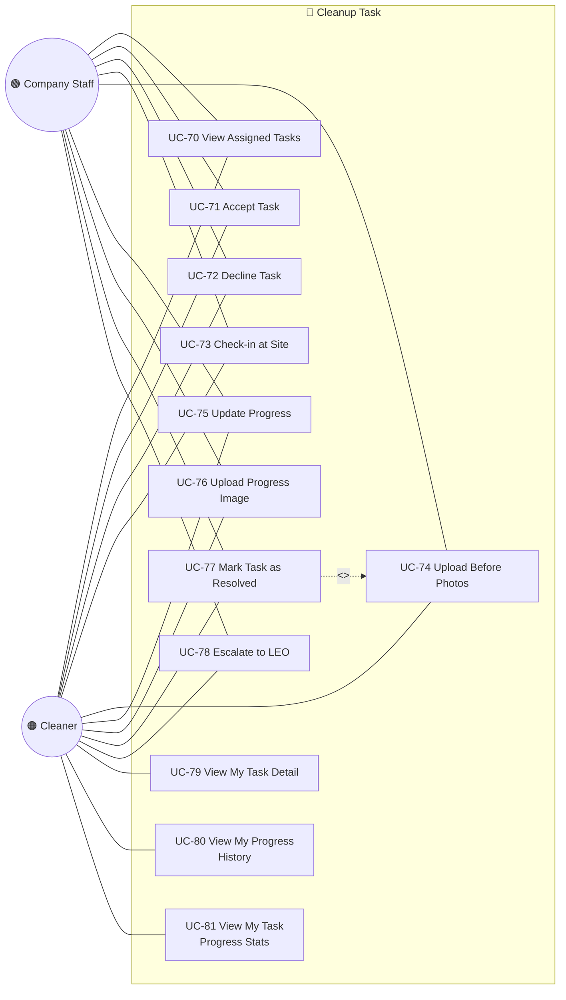

---

## UC-05: Inspection & Penalty — LEO / Inspector

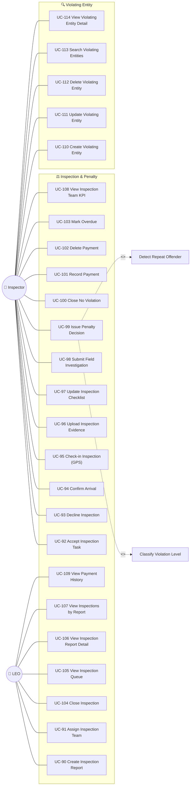

---

## UC-06: Community Cleanup — LEO / Cleaner / Citizen

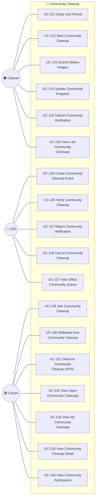

---

## UC-07: Comment — Citizen / LEO

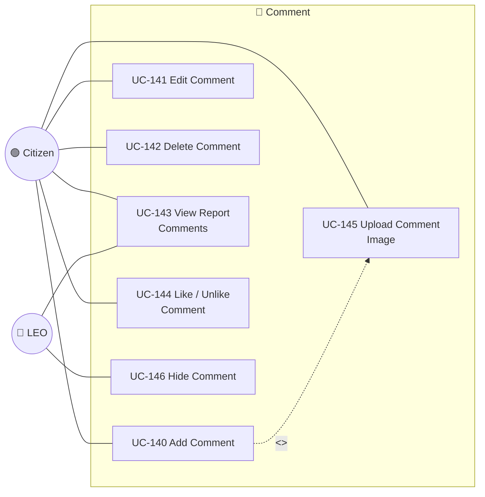

---

## UC-08: Organization & Team — LEO

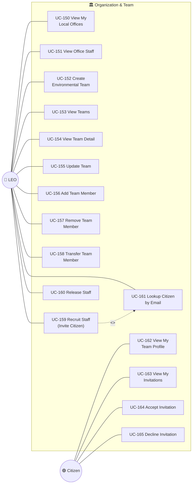

---

## UC-09: Company Management — DEO / Company Manager

```mermaid
flowchart LR
    DEO((🟣 DEO))
    CM((🟡 Company<br/>Manager))

    subgraph UC_COMPANY["🏢 Company Management"]
        UC170["UC-170 Create Company"]
        UC171["UC-171 View Companies"]
        UC172["UC-172 View Company Detail"]
        UC173["UC-173 Suspend Company"]
        UC174["UC-174 Reactivate Company"]
        UC175["UC-175 Terminate Company"]
        UC176["UC-176 Delete Company"]
        UC177["UC-177 Renew Contract"]
        UC178["UC-178 View Contract<br/>History"]
        UC179["UC-179 Update Company<br/>Service Areas"]
        UC180["UC-180 View Company<br/>Service Areas"]
        UC181["UC-181 View Company KPI"]
        UC182["UC-182 View Office<br/>Companies"]
        UC183["UC-183 Assign LEO to<br/>Office"]
        UC184["UC-184 Assign DEO to<br/>Department"]
    end

    subgraph UC_CM["🟡 Company Manager"]
        UC190["UC-190 View My Company"]
        UC191["UC-191 Create Company<br/>Staff Account"]
        UC192["UC-192 View Company Staff"]
        UC193["UC-193 Toggle Company<br/>Staff Status"]
        UC194["UC-194 Create Company Team"]
        UC195["UC-195 View Company Teams"]
        UC196["UC-196 Update Company Team"]
        UC197["UC-197 Toggle Company<br/>Team Status"]
        UC198["UC-198 Delete Company<br/>Team"]
        UC199["UC-199 Add Company<br/>Team Member"]
        UC200["UC-200 Remove Company<br/>Team Member"]
        UC201["UC-201 Reset CM Password"]
        UC202["UC-202 View Company<br/>Queue"]
        UC203["UC-203 View Company<br/>Assignments"]
        UC204["UC-204 Assign Company<br/>Team to Task"]
    end

    DEO --- UC170
    DEO --- UC171
    DEO --- UC172
    DEO --- UC173
    DEO --- UC174
    DEO --- UC175
    DEO --- UC176
    DEO --- UC177
    DEO --- UC178
    DEO --- UC179
    DEO --- UC180
    DEO --- UC181
    DEO --- UC182
    DEO --- UC183
    DEO --- UC184

    CM --- UC190
    CM --- UC191
    CM --- UC192
    CM --- UC193
    CM --- UC194
    CM --- UC195
    CM --- UC196
    CM --- UC197
    CM --- UC198
    CM --- UC199
    CM --- UC200
    CM --- UC201
    CM --- UC202
    CM --- UC203
    CM --- UC204
```

---

## UC-10: DEO Department Management

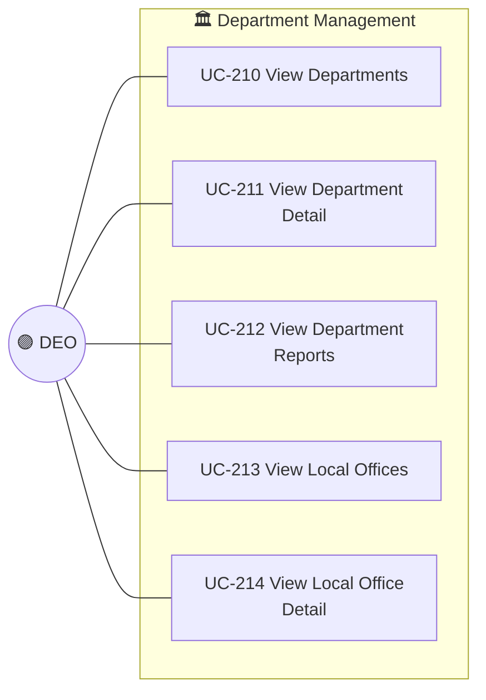

---

## UC-11: Gamification — Citizen

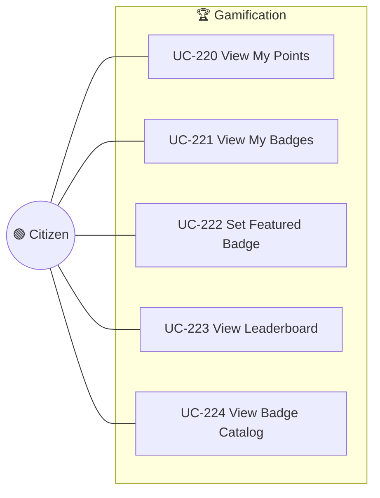

---

## UC-12: Notification — All Users

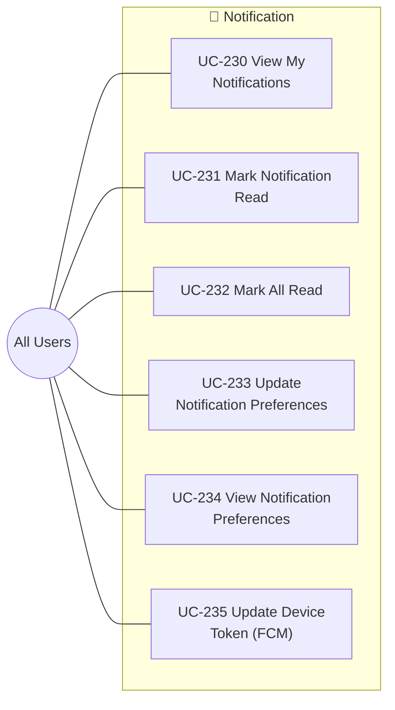

---

## UC-13: Map — Guest / Citizen

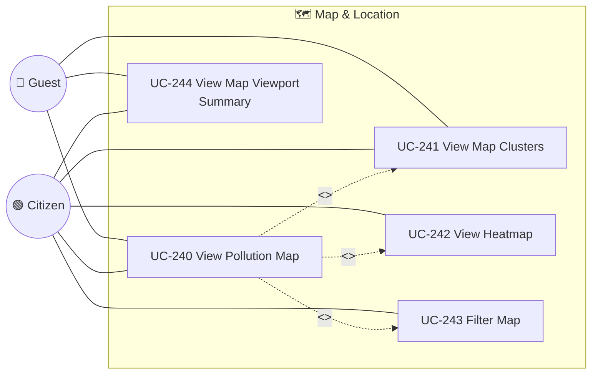

---

## UC-14: Administration — Admin

```mermaid
flowchart LR
    Admin((⚫ Admin))

    subgraph UC_ADMIN["⚙️ Administration"]
        direction TB

        subgraph UC_USER_MGMT["User Management"]
            UC250["UC-250 View All Users"]
            UC251["UC-251 Create Account"]
            UC252["UC-252 Update User"]
            UC253["UC-253 Update User Role"]
            UC254["UC-254 Delete User"]
            UC255["UC-255 Ban / Unban User"]
            UC256["UC-256 Lock Gamification<br/>Points"]
        end

        subgraph UC_CAT_MGMT["Catalog Management"]
            UC260["UC-260 Create Pollution<br/>Category"]
            UC261["UC-261 Update Pollution<br/>Category"]
            UC262["UC-262 Archive Category"]
            UC263["UC-263 Delete Category"]
            UC264["UC-264 Create Waste Tag"]
            UC265["UC-265 Update Waste Tag"]
            UC266["UC-266 Toggle Waste Tag"]
            UC267["UC-267 Delete Waste Tag"]
        end

        subgraph UC_CONFIG["Configuration"]
            UC270["UC-270 Manage Penalty<br/>Frameworks"]
            UC271["UC-271 Manage Gamification<br/>Config"]
            UC272["UC-272 Manage Blocked<br/>Words"]
            UC273["UC-273 Manage Notification<br/>Templates"]
        end

        subgraph UC_MODERATION["Content Moderation"]
            UC280["UC-280 Hide / Unhide<br/>Report"]
            UC281["UC-281 Force Update<br/>Report Status"]
            UC282["UC-282 View Spam<br/>Dashboard"]
        end

        subgraph UC_AUDIT["Audit & Reporting"]
            UC290["UC-290 View Audit Log"]
        end
    end

    Admin --- UC250
    Admin --- UC251
    Admin --- UC252
    Admin --- UC253
    Admin --- UC254
    Admin --- UC255
    Admin --- UC256
    Admin --- UC260
    Admin --- UC261
    Admin --- UC262
    Admin --- UC263
    Admin --- UC264
    Admin --- UC265
    Admin --- UC266
    Admin --- UC267
    Admin --- UC270
    Admin --- UC271
    Admin --- UC272
    Admin --- UC273
    Admin --- UC280
    Admin --- UC281
    Admin --- UC282
    Admin --- UC290
```

---

## UC-15: Dashboard & Analytics

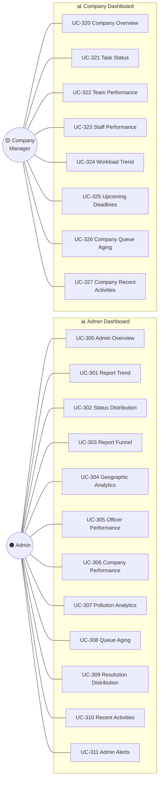

---

## UC-16: Media Upload

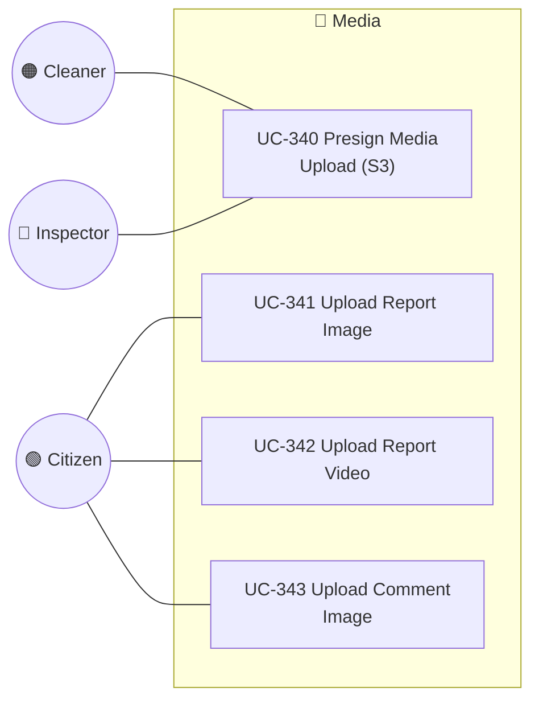

---

## Tổng hợp Use Cases theo Actor

| Actor                  | Use Cases (count) | Modules chính                                                                    |
| ---------------------- | :---------------: | -------------------------------------------------------------------------------- |
| 👤 **Guest**           |         8         | Auth (Register, Login, Google, Forgot, Reset, OTP), Map (Public View)            |
| 🟢 **Citizen**         |        38         | Report, Comment, Gamification, Community Cleanup, Map, Media, Notification       |
| 🔵 **LEO**             |        35         | Report Mgmt, Inspection, Community Cleanup, Team, Comment (mod), Organization    |
| 🟣 **DEO**             |        20         | Department, Company, Contract, Assignment                                        |
| 🟠 **Cleaner**         |        18         | Cleanup Task, Community Cleanup (Leader), Team                                   |
| 🔴 **Inspector**       |        22         | Inspection, Penalty, Violating Entity, Evidence                                  |
| 🟡 **Company Manager** |        23         | Company Staff, Company Team, Queue, Assignments, Dashboard                       |
| 🟤 **Company Staff**   |         8         | Cleanup Task (accept, progress, resolve)                                         |
| ⚫ **Admin**            |        35         | User CRUD, Catalog, Config, Content Moderation, Dashboard Analytics, Audit       |
| 🤖 **AI Service**      |         4         | Auto-classify, Duplicate Detection, Severity Estimation, Suspicious Flag         |
| **Tổng (unique)**      |      **~170**     |                                                                                  |

---

## So sánh v1.0 → v2.0

| Metric               | v1.0 (drawio) | v2.0            |
| --------------------- | :-----------: | :-------------: |
| Actors                |       8       | **9** (+Company Staff)    |
| Total use cases       |     ~120      | **~170** (+50)  |
| Community Cleanup UCs |       0       | **18** (NEW)    |
| Inspection UCs        |      12       | **28** (+16)    |
| Company Manager UCs   |       8       | **23** (+15)    |
| Dashboard/Analytics   |       0       | **20** (NEW)    |
| Comment Like          |       ❌      | ✅              |
| Reopen Request flow   |       1       | **3** (req/approve/reject) |
| Violation Recurrence  |       ❌      | **2** (NEW)     |
| Content Moderation    |       2       | **3** (+spam)   |
