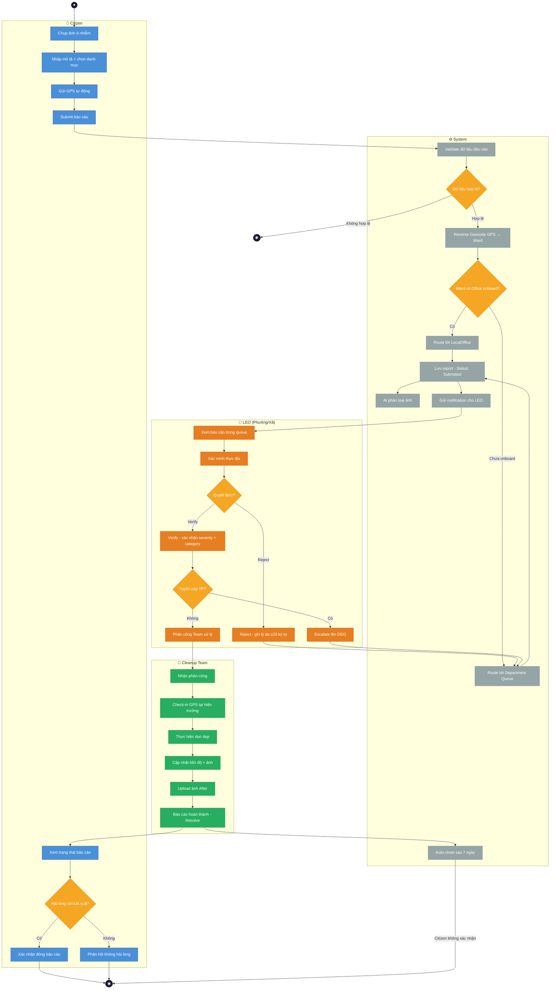
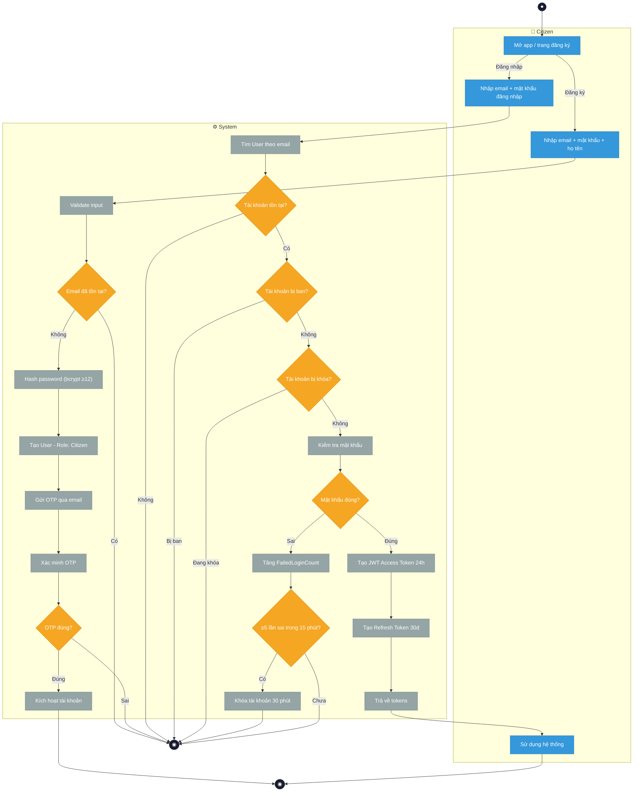
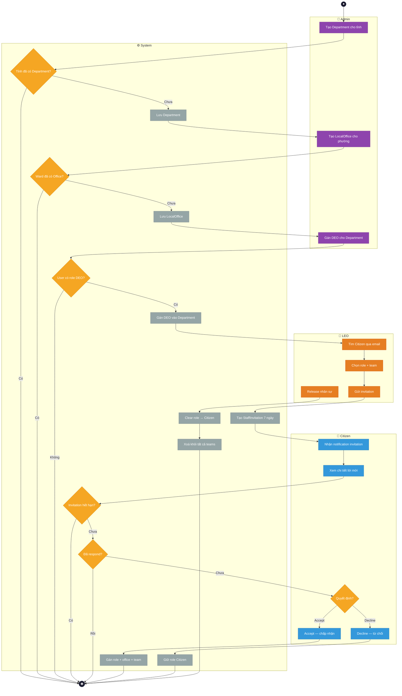
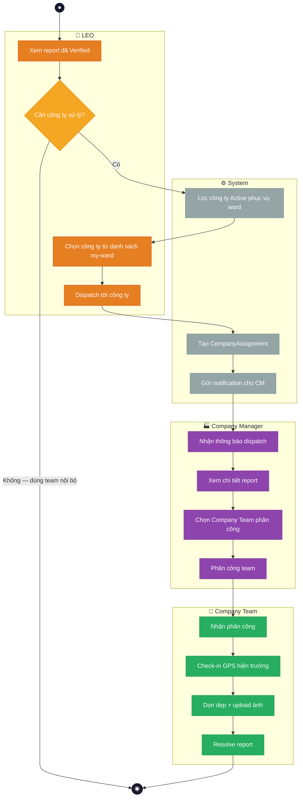
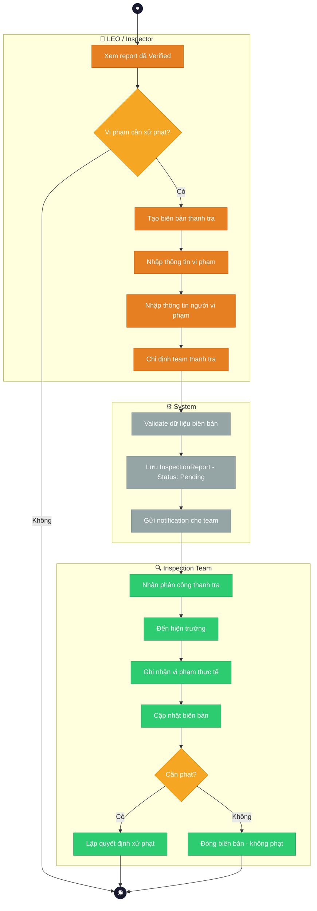
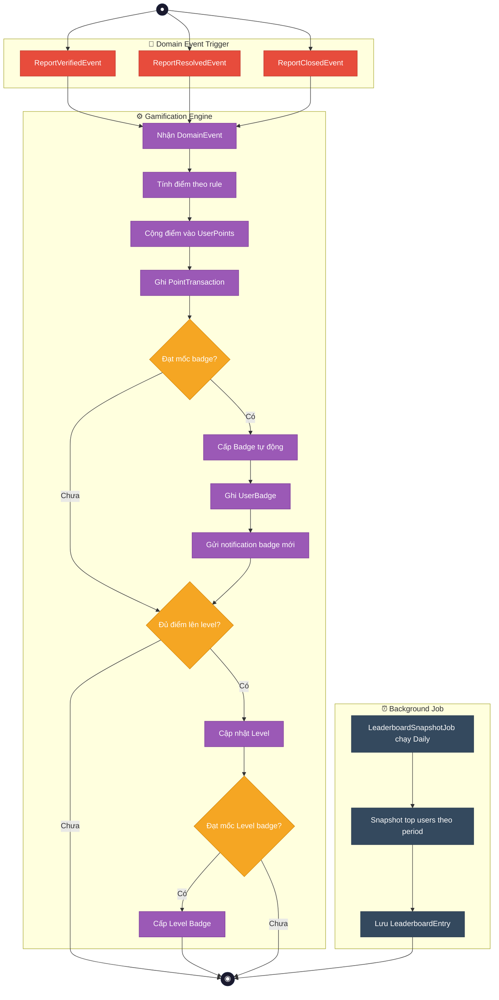

# GreenLens — Activity Diagrams (Luồng chính)

> **Dự án:** SU26SE049 — Crowdsourced Application for Reporting Environmental Pollution
> **Chuẩn:** UML Activity Diagram với Swimlanes

---

## Các luồng chính của hệ thống

| #   | Luồng                           | Actors tham gia                                 | Mô tả                                                      |
| --- | ------------------------------- | ----------------------------------------------- | ---------------------------------------------------------- |
| 1   | **Gửi & Xử lý báo cáo ô nhiễm** | Citizen → System → LEO → Cleanup Team → Citizen | Luồng core — từ submit → verify → assign → resolve → close |
| 2   | **Đăng ký & Xác thực**          | Citizen → System                                | Register, login, refresh token, lockout                    |
| 3   | **Quản lý tổ chức**             | Admin → System → LEO                            | Tạo Department → Office → Invitation → Accept              |
| 4   | **Dispatch công ty DVMT**       | LEO → System → Company Manager → Company Team   | Báo cáo nghiêm trọng → dispatch cho CITENCO/công ty        |
| 5   | **Thanh tra xử phạt**           | LEO/Inspector → System                          | Tạo biên bản thanh tra song song với dọn dẹp               |
| 6   | **Gamification**                | System → Citizen                                | Tự động cấp điểm, badge, leaderboard                       |

---

## Ký hiệu UML Activity Diagram

| Ký hiệu             | Mermaid       | Ý nghĩa                             |
| ------------------- | ------------- | ----------------------------------- |
| ● (filled circle)   | `((●))`       | **Initial Node** — Điểm bắt đầu     |
| ◉ (bullseye)        | `((◉))`       | **Final Node** — Điểm kết thúc      |
| ▭ (rounded rect)    | `[Action]`    | **Action/Activity** — Hành động     |
| ◇ (diamond)         | `{Decision?}` | **Decision Node** — Rẽ nhánh        |
| ═ (thick bar)       | `===`         | **Fork/Join** — Tách/Gộp song song  |
| ║ (swimlane border) | `subgraph`    | **Swimlane** — Phân vùng actor      |
| → (arrow)           | `-->`         | **Control Flow** — Luồng điều khiển |
| ⎙ (note)            | `:::note`     | **Note** — Ghi chú bổ sung          |

---

## 1. 📋 Gửi & Xử lý báo cáo ô nhiễm (Main Flow)

> Luồng cốt lõi nhất — từ khi Citizen submit đến khi report được Close.

---

## 2. 🔐 Đăng ký & Xác thực (Authentication Flow)

---

## 3. 🏢 Quản lý tổ chức & Invitation Flow

---

## 4. 🏭 Dispatch công ty DVMT (CITENCO Flow)

---

## 5. 🔍 Thanh tra xử phạt (Inspection Flow)

> Luồng song song với dọn dẹp — LEO/Inspector tạo biên bản thanh tra.

---

## 6. 🎮 Gamification (Tự động cấp điểm & badge)

---

## Tổng hợp Coverage

| Luồng                        | Actors   | Decision Points | Ký hiệu UML sử dụng                                   |
| ---------------------------- | -------- | :-------------: | ----------------------------------------------------- |
| 1. Submit & Process Report   | 4 actors |        6        | Initial, Final, Action, Decision, Swimlane            |
| 2. Authentication            | 2 actors |        7        | Initial, Final, Action, Decision, Swimlane            |
| 3. Organization & Invitation | 4 actors |        5        | Initial, Final, Action, Decision, Swimlane            |
| 4. Company Dispatch          | 4 actors |        1        | Initial, Final, Action, Decision, Swimlane            |
| 5. Inspection                | 3 actors |        2        | Initial, Final, Action, Decision, Swimlane            |
| 6. Gamification              | 2 actors |        3        | Initial, Final, Action, Decision, Fork/Join, Swimlane |
