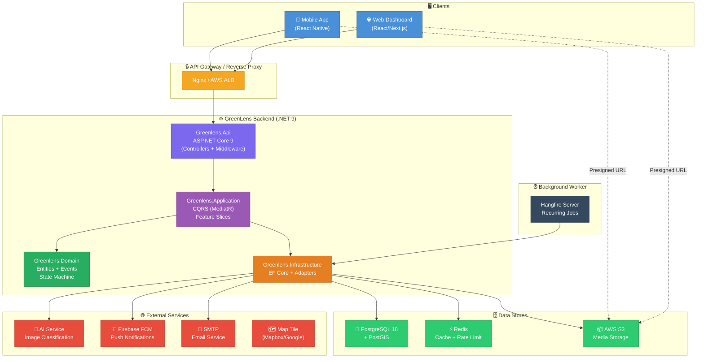
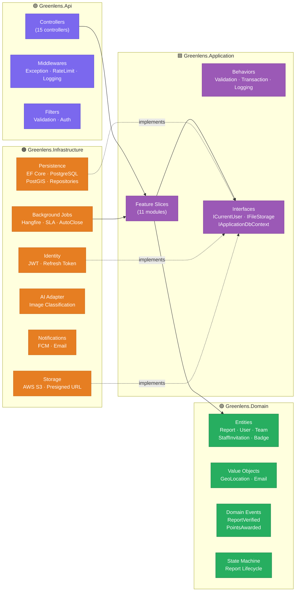
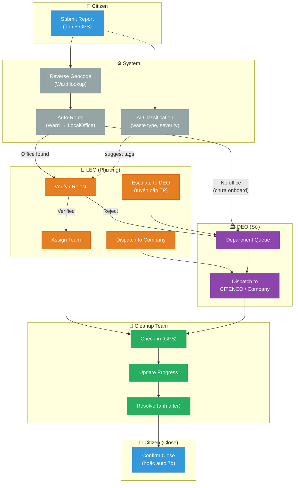
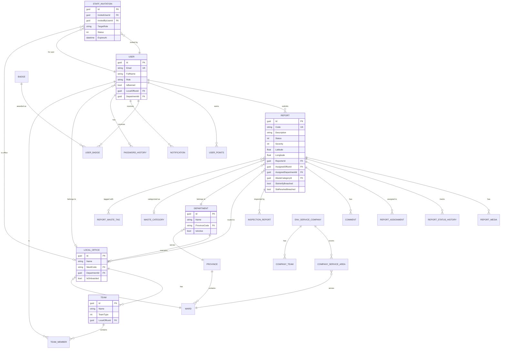
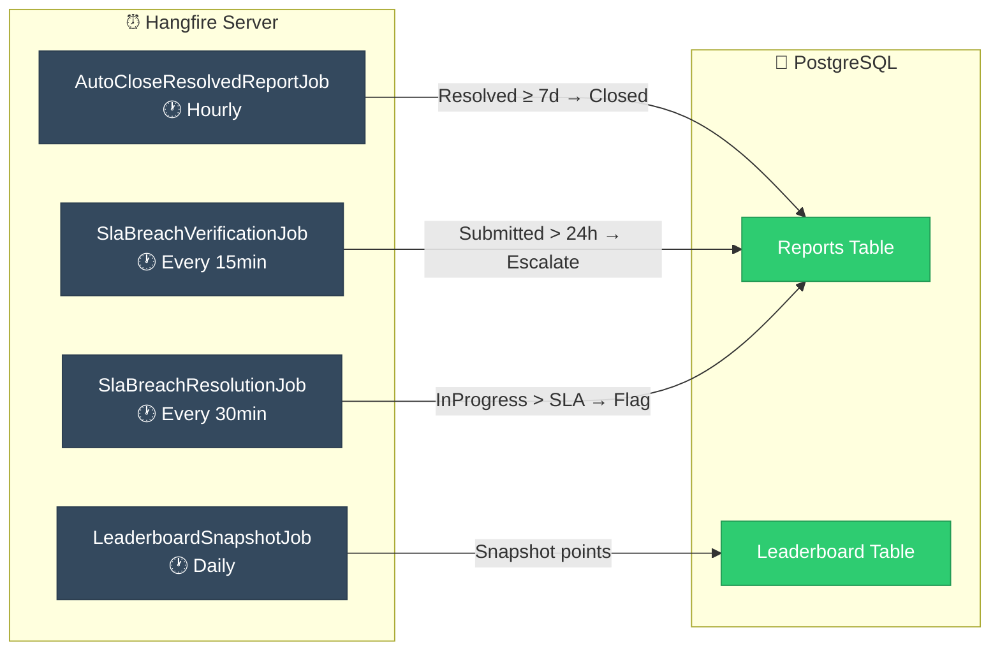
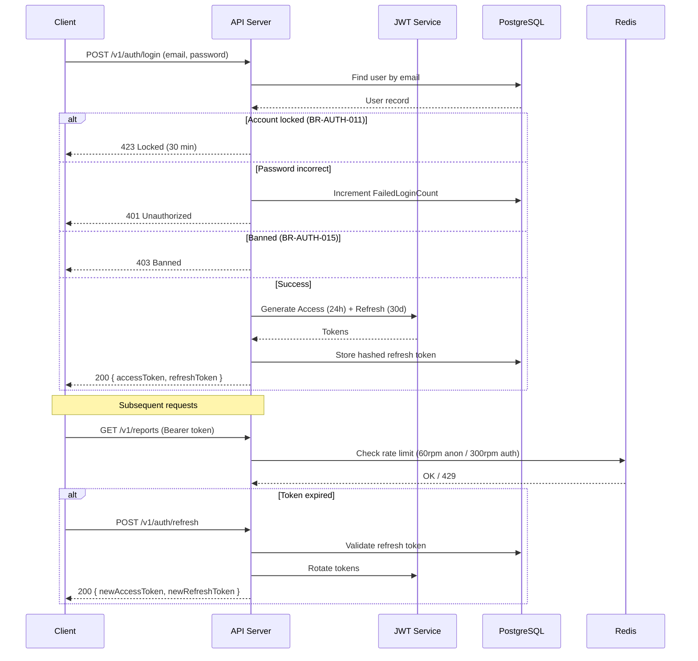
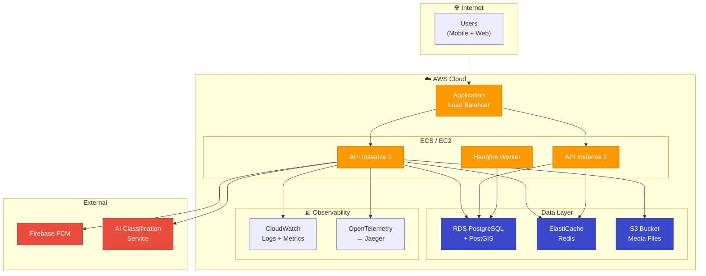

# GreenLens — System Architecture Diagram

> **Dự án:** SU26SE049 — Crowdsourced Application for Reporting Environmental Pollution
> **Stack:** .NET 9 · ASP.NET Core · EF Core 9 · PostgreSQL + PostGIS · Redis · AWS S3 · Hangfire · Firebase

---

## 1. High-Level Architecture

---

## 2. Clean Architecture Layers

---

## 3. Report Lifecycle & Actor Interactions

---

## 4. Data Model (Core Entities)

---

## 5. Background Jobs Architecture

---

## 6. Authentication & Authorization Flow

---

## 7. Deployment Architecture (Target)

---

## 8. Module Summary

| Module            | Controllers |                        Feature Slices                        | Key Entities                             |
| ----------------- | :---------: | :----------------------------------------------------------: | :--------------------------------------- |
| **Auth**          |      1      |    Login, Register, Refresh, ChangePassword, Lockout, Ban    | User, PasswordHistory                    |
| **Reports**       |      1      |   Submit, Verify, Reject, Assign, Resolve, Close, Escalate   | Report, ReportMedia, ReportAssignment    |
| **Organization**  |      3      | Department CRUD, Office CRUD, Invitation Flow, Release Staff | Department, LocalOffice, StaffInvitation |
| **Teams**         |      1      |          Team CRUD, Member CRUD, Check-in, Progress          | Team, TeamMember                         |
| **Companies**     |      1      |         Company CRUD, Staff, Dispatch, Service Area          | EnvServiceCompany, CompanyTeam           |
| **Inspection**    |      1      |               Create, Update, Get inspections                | InspectionReport                         |
| **Gamification**  |      1      |                 Points, Badges, Leaderboard                  | UserPoints, Badge, UserBadge             |
| **Notifications** |      1      |              List, Read, Preferences, FCM Token              | Notification, NotificationPreference     |
| **Map**           |      1      |                   Nearby, Heatmap, Hotspot                   | (PostGIS queries on Report)              |
| **Catalog**       |      1      |                    Categories, Waste Tags                    | WasteCategory, WasteTag                  |
| **Admin**         |      1      |                User management, Audit, Config                | User, AuditLog                           |
| **Media**         |      1      |                    Upload, Presigned URL                     | ReportMedia                              |
