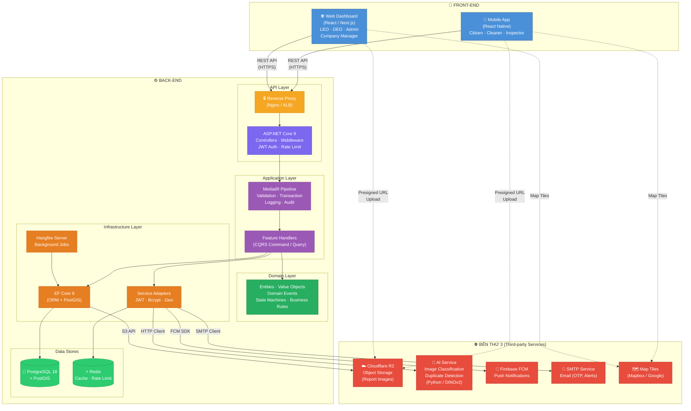
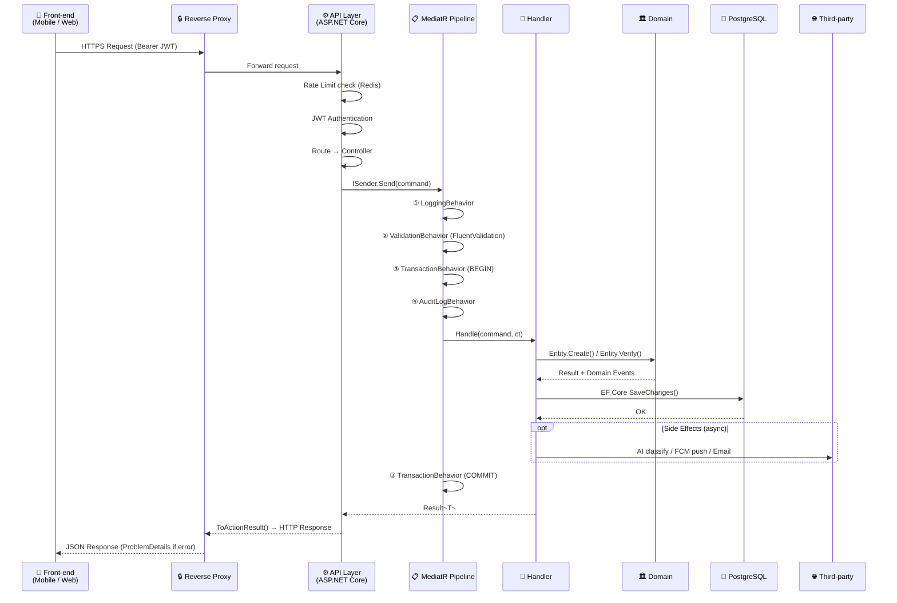
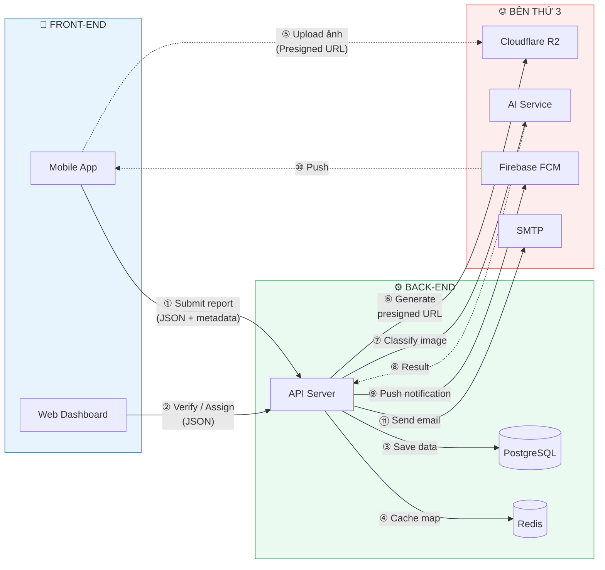
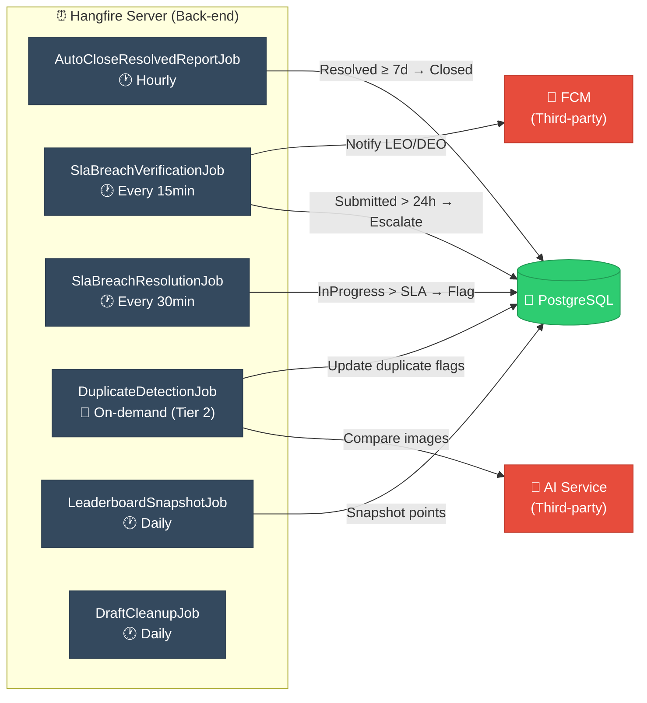
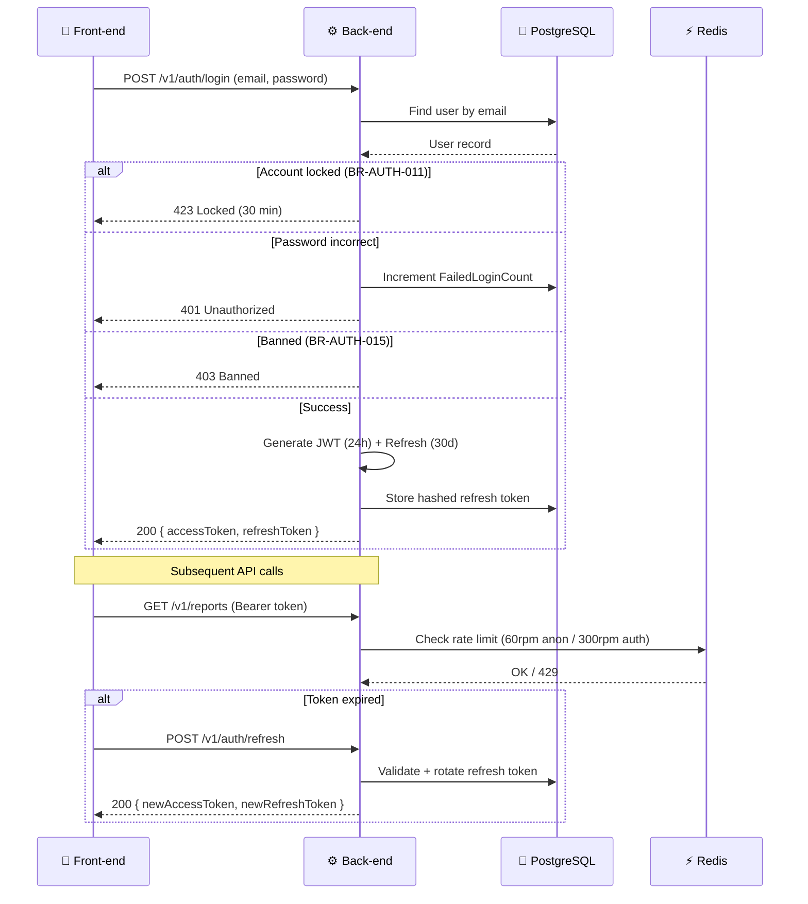
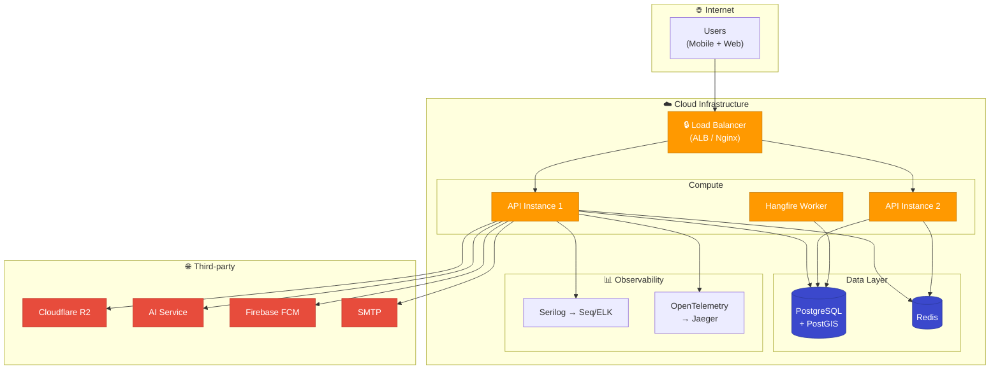

# GreenLens — System Architecture Diagram

> **Dự án:** SU26SE049 — Crowdsourced Application for Reporting Environmental Pollution  
> **Stack:** .NET 9 · ASP.NET Core · EF Core 9 · PostgreSQL + PostGIS · Redis · Cloudflare R2 · Hangfire · Firebase

---

## 1. System Architecture (3 khối chính)

---

## 2. Chi tiết từng khối

### 2.1 Front-end

| Component | Technology | Actor sử dụng | Chức năng chính |
|-----------|-----------|---------------|----------------|
| **Mobile App** | React Native | Citizen, Cleaner, Inspector | Submit report (ảnh + GPS), check-in, update progress, view map, gamification |
| **Web Dashboard** | React / Next.js | LEO, DEO, Admin, Company Manager | Verify/reject reports, assign teams, inspection, penalty, KPI dashboard, audit logs |

**Giao tiếp với Back-end:** REST API qua HTTPS (JSON)  
**Giao tiếp với Third-party:** Presigned URL upload trực tiếp lên R2, Map tiles từ Mapbox/Google

---

### 2.2 Back-end

| Layer | Project | Trách nhiệm | Technology |
|-------|---------|-------------|------------|
| **Reverse Proxy** | Nginx / AWS ALB | Load balancing, SSL termination, static files | Nginx |
| **API** | `Greenlens.Api` | Routing, JWT Auth, Rate Limit, Error Handling | ASP.NET Core 9, Kestrel |
| **Application** | `Greenlens.Application` | CQRS Handlers, Validation, Pipeline Behaviors | MediatR, FluentValidation |
| **Domain** | `Greenlens.Domain` | Entities, State Machines, Business Rules, Events | Pure C# (no framework) |
| **Infrastructure** | `Greenlens.Infrastructure` | ORM, Repository, External Adapters, Background Jobs | EF Core 9, Hangfire |
| **Database** | PostgreSQL 18 + PostGIS | Primary data store, spatial queries (ST_DWithin) | PostgreSQL, NetTopologySuite |
| **Cache** | Redis | Map cache (10'), rate limit counters, session | StackExchange.Redis |

---

### 2.3 Bên thứ 3 (Third-party)

| Service | Provider | Mục đích | Giao tiếp |
|---------|----------|---------|-----------|
| **Object Storage** | Cloudflare R2 (S3-compatible) | Lưu ảnh/video báo cáo (presigned URL upload) | S3 API |
| **AI Service** | Self-hosted (Python FastAPI) | Phân loại ảnh ô nhiễm, duplicate detection (DINOv2) | HTTP REST |
| **Push Notification** | Firebase FCM | Thông báo đẩy cho Mobile App | FCM SDK |
| **Email Service** | SMTP (SendGrid / SES) | Gửi OTP, thông báo SLA, digest | SMTP Client |
| **Map Tiles** | Mapbox / Google Maps | Bản đồ nền cho Mobile + Web | SDK / REST |

---

## 3. Request Flow (End-to-End)

---

## 4. Data Flow giữa 3 khối

---

## 5. Background Jobs

---

## 6. Authentication & Authorization Flow

---

## 7. Module Summary

| Module | Controllers | Feature Slices | Key Entities |
|--------|:-----------:|:--------------:|:-------------|
| **Auth** | 1 | Login, Register, Refresh, ChangePassword, Lockout, Ban | User, PasswordHistory |
| **Reports** | 1 | Submit, Verify, Reject, Assign, Resolve, Close, Escalate | Report, ReportMedia, ReportAssignment |
| **Organization** | 3 | Department CRUD, Office CRUD, Invitation Flow | Department, LocalOffice, StaffInvitation |
| **Teams** | 1 | Team CRUD, Member CRUD, Check-in, Progress | EnvironmentalTeam, TeamMember |
| **Companies** | 1 | Company CRUD, Staff, Dispatch, Service Area | EnvServiceCompany, ContractPeriod |
| **Inspection** | 1 | Create, Assign Team, Issue Penalty, Payment | InspectionReport, ViolatingEntity |
| **Gamification** | 1 | Points, Badges, Leaderboard | UserPoints, Badge, UserBadge |
| **Notifications** | 1 | List, Read, Preferences, FCM Token | Notification, NotificationPreference |
| **Map** | 1 | Nearby, Heatmap, Hotspot | (PostGIS queries on Report) |
| **Catalog** | 1 | Categories, Waste Tags | PollutionCategory, WasteTag |
| **Admin** | 1 | User management, Audit, Config | User, AuditLog |
| **Media** | 1 | Upload, Presigned URL, AI Analyze | ReportMedia |

---

## 8. Deployment Architecture (Target)

