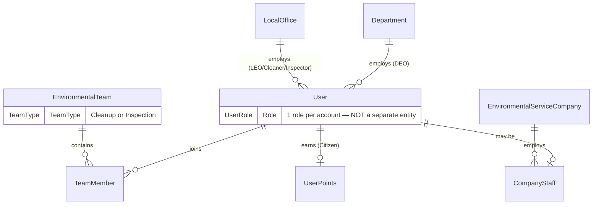

# GreenLens — Conceptual ERD (v2.1)

> **Dự án:** SU26SE049 — Crowdsourced Application for Reporting Environmental Pollution
> **Loại:** Conceptual model — domain entity + **User/Role** (không attribute chi tiết)
> **Cập nhật:** 2026-08-14 · **Nguồn:** Domain entities + BR v2.0 + `UserRole` enum
> **Tổng:** 48 domain entities · 8 roles · 7 use-case actors

---

## User & Role mapping

Mọi người dùng hệ thống là **một thực thể `User`**. Actor trong use case map tới **`UserRole`** (vai trò), không phải entity riêng.

| Actor (Use Case)              | `UserRole`                         | Liên kết tổ chức / tập thể                                      |
| ----------------------------- | ---------------------------------- | --------------------------------------------------------------- |
| 🟢 **Citizen**                | `Citizen`                          | —                                                               |
| 🔵 **LEO**                    | `LEO`                              | `LocalOffice` (cấp phường/xã)                                   |
| 🟣 **DEO**                    | `DEO`                              | `Department` (cấp tỉnh)                                         |
| 🟠 **Cleanup Team**           | `Cleaner`, `CompanyStaff`          | `EnvironmentalTeam` (`TeamType = Cleanup`) qua `TeamMember`     |
| 🔴 **Inspection Team**        | `Inspector`                        | `EnvironmentalTeam` (`TeamType = Inspection`) qua `TeamMember`    |
| 🟡 **Company Manager**        | `CompanyManager`                   | `CompanyStaff` (quản lý nhân sự công ty)                        |
| ⚫ **System Administrator**   | `Admin`                            | —                                                               |

> **Actor tập thể** (Cleanup Team, Inspection Team) không phải User entity riêng — mô hình hóa qua **`EnvironmentalTeam` + `TeamMember` → `User`**.

---

## Conceptual Model — User & Role (core)

---

## Conceptual Model — User, Role & Domain Interaction

> **`User`** là thực thể identity duy nhất. Nhãn `(Role)` trên cạnh mô tả hành vi theo vai trò.
> **`EnvironmentalTeam`** mô hình hóa actor tập thể (Cleanup / Inspection Team).

```mermaid
%%{init: {'flowchart': {'curve': 'stepBefore', 'nodeSpacing': 25, 'rankSpacing': 50, 'padding': 10}}}%%
flowchart TB
    subgraph IDENTITY["👤 Identity"]
        User["User\n«entity»"]
    end

    subgraph ROLES["«Role» UserRole — vai trò, không lưu trữ riêng"]
        direction LR
        roleCitizen["🟢 Citizen"]
        roleLEO["🔵 LEO"]
        roleDEO["🟣 DEO"]
        roleCleaner["🟠 Cleaner"]
        roleStaff["🟠 CompanyStaff"]
        roleInspector["🔴 Inspector"]
        roleCM["🟡 CompanyManager"]
        roleAdmin["⚫ Admin"]
    end

    subgraph COLLECTIVE["«Collective» Actor tập thể"]
        EnvTeam["EnvironmentalTeam\nCleanup | Inspection"]
        TeamMember["TeamMember"]
    end

    User -. "has exactly one role" .-> ROLES
    User --> TeamMember
    TeamMember --> EnvTeam

    subgraph REPORT_CORE["📝 Report"]
        Report["Report"]
        ReportMedia["ReportMedia"]
        ReportFlag["ReportFlag"]
        ReportSatisfaction["ReportSatisfaction"]
        ReportReopenRequest["ReportReopenRequest"]
        ReportDraft["ReportDraft"]
    end

    subgraph CLEANUP["🧹 Cleanup"]
        ReportAssignment["ReportAssignment"]
    end

    subgraph COMMUNITY["🤝 Community Cleanup"]
        CommunityCleanupEvent["CommunityCleanupEvent"]
        CommunityCleanupParticipant["CommunityCleanupParticipant"]
    end

    subgraph INSPECTION["⚖️ Inspection"]
        InspectionReport["InspectionReport"]
        InspectionEvidence["InspectionEvidence"]
        ViolatingEntity["ViolatingEntity"]
        PenaltyPayment["PenaltyPayment"]
    end

    subgraph COMMENT_MOD["💬 Comment"]
        Comment["Comment"]
        CommentLike["CommentLike"]
    end

    subgraph GAMIFICATION["🏆 Gamification"]
        UserPoints["UserPoints"]
        Badge["Badge"]
    end

    subgraph ORGANIZATION["🏛️ Organization"]
        Department["Department"]
        LocalOffice["LocalOffice"]
        StaffInvitation["StaffInvitation"]
    end

    subgraph COMPANY["🏢 Company"]
        ESC["EnvServiceCompany"]
        CompanyStaff["CompanyStaff"]
        ContractPeriod["ContractPeriod"]
    end

    subgraph ADMIN_MOD["⚙️ Administration"]
        AuditLog["AuditLog"]
        PenaltyFramework["PenaltyFramework"]
        BlockedWord["BlockedWord"]
        GamificationConfig["GamificationConfig"]
        NotificationTemplate["NotificationTemplate"]
    end

    %% ══════ User interactions by role ══════
    User -- "submits (Citizen)" --> Report
    User -- "uploads (Citizen)" --> ReportMedia
    User -- "flags (Citizen)" --> ReportFlag
    User -- "rates (Citizen)" --> ReportSatisfaction
    User -- "requests reopen (Citizen)" --> ReportReopenRequest
    User -- "saves draft (Citizen)" --> ReportDraft
    User -- "comments (Citizen)" --> Comment
    User -- "likes (Citizen)" --> CommentLike
    User -- "joins (Citizen)" --> CommunityCleanupParticipant
    User -- "earns (Citizen)" --> UserPoints
    User -- "receives (Citizen)" --> Badge

    User -- "verifies / rejects (LEO)" --> Report
    User -- "assigns team (LEO)" --> ReportAssignment
    User -- "creates inspection (LEO)" --> InspectionReport
    User -- "opens program (LEO)" --> CommunityCleanupEvent
    User -- "invites staff (LEO)" --> StaffInvitation
    User -- "hides (LEO/Admin)" --> Comment
    User -- "approves reopen (LEO)" --> ReportReopenRequest

    User -- "manages (DEO)" --> Department
    User -- "creates / manages (DEO)" --> ESC
    User -- "renews (DEO)" --> ContractPeriod

    User -- "manages staff (CompanyManager)" --> CompanyStaff
    User -- "accepts dispatch (CompanyManager)" --> ReportAssignment

    User -- "reviews (Admin)" --> AuditLog
    User -- "configures (Admin)" --> PenaltyFramework
    User -- "manages (Admin)" --> BlockedWord
    User -- "configures (Admin)" --> GamificationConfig
    User -- "manages (Admin)" --> NotificationTemplate
    User -- "manages offices (Admin)" --> LocalOffice

    User -- "investigates (Inspector)" --> InspectionReport
    User -- "uploads evidence (Inspector)" --> InspectionEvidence
    User -- "identifies (Inspector)" --> ViolatingEntity
    User -- "records payment (Inspector)" --> PenaltyPayment

    %% ══════ Collective team interactions ══════
    EnvTeam -- "executes (Cleanup Team)" --> ReportAssignment
    EnvTeam -- "leads (Cleanup Team)" --> CommunityCleanupEvent

    style IDENTITY fill:#e3f2fd,stroke:#1565c0,stroke-width:3px
    style ROLES fill:#f5f5f5,stroke:#757575,stroke-width:2px,stroke-dasharray:5
    style COLLECTIVE fill:#fff3e0,stroke:#e65100,stroke-width:2px
    style REPORT_CORE fill:#e8f5e9,stroke:#2e7d32,stroke-width:2px
    style CLEANUP fill:#e3f2fd,stroke:#1565c0,stroke-width:2px
    style COMMUNITY fill:#e0f2f1,stroke:#00695c,stroke-width:2px
    style INSPECTION fill:#fff3e0,stroke:#e65100,stroke-width:2px
    style COMMENT_MOD fill:#fce4ec,stroke:#c62828,stroke-width:2px
    style GAMIFICATION fill:#f3e5f5,stroke:#6a1b9a,stroke-width:2px
    style ORGANIZATION fill:#e8eaf6,stroke:#283593,stroke-width:2px
    style COMPANY fill:#fff9c4,stroke:#f57f17,stroke-width:2px
    style ADMIN_MOD fill:#efebe9,stroke:#4e342e,stroke-width:2px
```

---

## ER Diagram — Entity Relationships

> **Cách biểu diễn Actor trong ERD (theo yêu cầu GV):**
>
> | Cách | Ký hiệu trong diagram | Ý nghĩa |
> | ---- | --------------------- | ------- |
> | **Individual actor** | `User` + nhãn cạnh `(Citizen)`, `(LEO)`… | Actor = **`User` đang giữ `UserRole`** — không vẽ 7 entity User riêng |
> | **Collective actor** | `EnvironmentalTeam` + `TeamMember` → `User` | Cleanup Team / Inspection Team = tập thể, không phải bảng actor |
> | **Role storage** | `User { UserRole Role }` trong entity block | Role là **thuộc tính enum**, không phải entity/FK riêng |
>
> Diagram **2a** (dưới) tóm tắt actor ↔ entity. Diagram **2b** là ERD đầy đủ 48 entities — mọi nhãn `(Role)` trên cạnh chính là actor tương ứng.

### 2a. Actor-Entity Relationships (ERD view)

```mermaid
erDiagram
    User {
        UserRole Role "Citizen DEO LEO Cleaner CompanyManager CompanyStaff Inspector Admin"
    }
    EnvironmentalTeam {
        TeamType TeamType "Cleanup or Inspection"
    }

    User ||--o{ Report : "Citizen submits"
    User ||--o{ Report : "LEO verifies assigns"
    User ||--o{ ReportFlag : "Citizen flags"
    User ||--o{ ReportSatisfaction : "Citizen rates"
    User ||--o{ ReportReopenRequest : "Citizen requests LEO reviews"
    User ||--o{ ReportDraft : "Citizen drafts"
    User ||--o{ Comment : "Citizen authors LEO Admin hides"
    User ||--o{ CommentLike : "Citizen likes"
    User ||--o{ CommunityCleanupParticipant : "Citizen joins"
    User ||--o{ UserPoints : "Citizen earns"
    User ||--o{ UserBadge : "Citizen receives"

    User ||--o{ ReportAssignment : "LEO assigns CompanyManager accepts"
    User ||--o{ InspectionReport : "LEO creates Inspector investigates"
    User ||--o{ InspectionEvidence : "Inspector uploads"
    User ||--o{ PenaltyPayment : "Inspector records"
    User ||--o{ CommunityCleanupEvent : "LEO creates Cleaner leads"
    User ||--o{ StaffInvitation : "LEO invites"
    User ||--o{ Department : "DEO manages"
    User ||--o{ EnvironmentalServiceCompany : "DEO creates manages"
    User ||--o{ ContractPeriod : "DEO renews"
    User ||--o{ CompanyStaff : "CompanyManager manages"
    User ||--o{ AuditLog : "Admin all roles generate"
    User ||--o{ BlockedWord : "Admin manages"
    User ||--o{ GamificationConfig : "Admin configures"
    User ||--o{ PenaltyFramework : "Admin configures"
    User ||--o{ NotificationTemplate : "Admin manages"
    User ||--o{ LocalOffice : "Admin manages"

    EnvironmentalTeam ||--o{ TeamMember : "contains"
    TeamMember }o--|| User : "Cleaner Inspector CompanyStaff"
    EnvironmentalTeam ||--o{ ReportAssignment : "Cleanup Team executes"
    EnvironmentalTeam ||--o{ InspectionReport : "Inspection Team assigned"
    EnvironmentalTeam ||--o{ CommunityCleanupEvent : "Cleanup Team leads"
```

### 2b. Entity Relationships (full domain)

```mermaid
erDiagram

    User {
        UserRole Role "maps to use-case actor"
    }

    %% ════════════════════════════════════════════
    %% LOCATION (Administrative Division)
    %% ════════════════════════════════════════════

    AdministrativeRegion ||--o{ Province : "contains"
    AdministrativeUnit ||--o{ Province : "classifies"
    AdministrativeUnit ||--o{ Ward : "classifies"
    Province ||--o{ Ward : "contains"

    %% ════════════════════════════════════════════
    %% ORGANIZATION (Government Structure)
    %% Actor: DEO operates at Department level
    %% Actor: LEO operates at LocalOffice level
    %% ════════════════════════════════════════════

    Province ||--o| Department : "has"
    Department ||--o{ LocalOffice : "oversees"
    Department ||--o{ User : "employs DEO"
    Department ||--o{ EnvironmentalServiceCompany : "contracts"
    Department ||--o{ Report : "receives (fallback queue)"

    LocalOffice ||--|| Ward : "covers"
    LocalOffice ||--o{ EnvironmentalTeam : "manages"
    LocalOffice ||--o{ User : "employs LEO/Cleaner/Inspector"
    LocalOffice ||--o{ StaffInvitation : "invites to"
    LocalOffice ||--o{ Report : "routed to"
    LocalOffice }o--o| User : "has LEO officer"

    %% ════════════════════════════════════════════
    %% TEAM
    %% Actor: Cleanup Team & Inspection Team
    %% ════════════════════════════════════════════

    EnvironmentalTeam ||--o{ TeamMember : "contains"
    EnvironmentalTeam ||--o{ ReportAssignment : "assigned (Cleanup)"
    EnvironmentalTeam ||--o{ InspectionReport : "inspects (Inspection)"
    EnvironmentalTeam ||--o{ CommunityCleanupEvent : "leads (Leader)"
    EnvironmentalTeam ||--o{ StaffInvitation : "target team"
    TeamMember }o--|| User : "is"

    %% ════════════════════════════════════════════
    %% COMPANY (Environmental Service)
    %% Actor: DEO creates & manages companies
    %% ════════════════════════════════════════════

    EnvironmentalServiceCompany ||--o{ CompanyStaff : "employs"
    EnvironmentalServiceCompany ||--o{ CompanyServiceArea : "serves"
    EnvironmentalServiceCompany ||--o{ EnvironmentalTeam : "owns"
    EnvironmentalServiceCompany ||--o{ Report : "dispatched to"
    EnvironmentalServiceCompany ||--o{ ContractPeriod : "has contract history"
    CompanyStaff }o--|| User : "is"
    CompanyServiceArea }o--|| Ward : "covers"
    ContractPeriod }o--|| User : "renewed by (DEO)"

    %% ════════════════════════════════════════════
    %% USER & AUTH
    %% User = single identity entity; Role = UserRole enum (not a separate table)
    %% All use-case actors map to User.Role + optional TeamMember / CompanyStaff
    %% ════════════════════════════════════════════

    User ||--o{ RefreshToken : "authenticates"
    User ||--o{ PasswordHistory : "tracks"
    User ||--o{ OtpCode : "receives"
    User ||--o{ StaffInvitation : "invited by (LEO)"
    User ||--o{ StaffInvitation : "invited as"

    %% ════════════════════════════════════════════
    %% REPORT (Core Aggregate)
    %% Actor: Citizen submits, LEO verifies/assigns
    %% ════════════════════════════════════════════

    User ||--o{ Report : "submits (Citizen)"
    User ||--o{ ReportFlag : "flags (Citizen)"

    Report ||--o{ ReportMedia : "has media"
    Report ||--o{ ReportStatusHistory : "tracks status"
    Report ||--o{ ReportAssignment : "assigned to (Team)"
    Report ||--o{ ReportWasteTag : "tagged with"
    Report ||--o{ ReportFlag : "flagged"
    Report ||--o| ReportSatisfaction : "rated (Citizen)"
    Report ||--o{ ReportDraft : "drafted as"
    Report ||--o{ InspectionReport : "inspected"
    Report ||--o{ Report : "parent of duplicates"
    Report ||--o{ Comment : "discussed"
    Report ||--o{ ReportReopenRequest : "reopen requested"
    Report ||--o{ CommunityCleanupEvent : "community cleanup"
    Report }o--|| PollutionCategory : "categorized as"

    ReportAssignment }o--|| User : "assigned by (LEO/CM)"
    ReportSatisfaction }o--|| User : "rated by (Citizen)"
    ReportReopenRequest }o--|| User : "requested by (Citizen)"
    ReportReopenRequest }o--o| User : "reviewed by (LEO)"
    ReportReopenRequest ||--o{ ReportMedia : "evidence"
    ReportMedia }o--o| User : "uploaded by"

    %% ════════════════════════════════════════════
    %% COMMUNITY CLEANUP (NEW v2.0)
    %% Actor: LEO creates, Cleaner leads, Citizen joins
    %% ════════════════════════════════════════════

    CommunityCleanupEvent }o--|| User : "created by (LEO)"
    CommunityCleanupEvent }o--|| User : "led by (Cleaner)"
    CommunityCleanupEvent }o--o| User : "verified by (LEO)"
    CommunityCleanupEvent ||--o{ CommunityCleanupParticipant : "has participants"
    CommunityCleanupParticipant }o--|| User : "is (Citizen/Cleaner)"

    %% ════════════════════════════════════════════
    %% COMMENT
    %% Actor: Citizen creates, LEO/Admin can hide
    %% ════════════════════════════════════════════

    Comment }o--|| User : "authored by (Citizen)"
    Comment ||--o{ CommentMedia : "has media"
    Comment ||--o{ CommentLike : "liked"
    Comment ||--o{ Comment : "replies"
    CommentLike }o--|| User : "liked by (Citizen)"

    %% ════════════════════════════════════════════
    %% INSPECTION & PENALTY
    %% Actor: LEO creates, Inspection Team handles
    %% ════════════════════════════════════════════

    InspectionReport }o--|| User : "created by (LEO)"
    InspectionReport }o--o| User : "penalty issued by (Inspector)"
    InspectionReport }o--o| ViolatingEntity : "links to violator"
    InspectionReport ||--o{ InspectionEvidence : "has evidence"
    InspectionReport ||--o{ PenaltyPayment : "has payments"
    InspectionEvidence }o--|| User : "uploaded by (Inspector)"
    PenaltyPayment }o--|| User : "recorded by (Inspector)"

    %% ════════════════════════════════════════════
    %% CATALOG
    %% ════════════════════════════════════════════

    ReportWasteTag }o--|| WasteTag : "is"
    PenaltyFramework }o--|| PollutionCategory : "per category"

    %% ════════════════════════════════════════════
    %% GAMIFICATION
    %% Actor: Citizen earns points & badges
    %% ════════════════════════════════════════════

    User ||--o| UserPoints : "earns (Citizen)"
    UserPoints ||--o{ PointTransaction : "logs"
    User ||--o{ UserBadge : "receives (Citizen)"
    UserBadge }o--|| Badge : "is"

    %% ════════════════════════════════════════════
    %% NOTIFICATION
    %% All actors receive notifications
    %% ════════════════════════════════════════════

    User ||--o{ Notification : "receives"
    User ||--o{ NotificationPreference : "configures"
    Notification }o--o| NotificationTemplate : "rendered from"

    %% ════════════════════════════════════════════
    %% ADMINISTRATION
    %% Actor: System Administrator manages
    %% ════════════════════════════════════════════

    User ||--o{ AuditLog : "generates (all actors)"
```

---

## Legend

| Ký hiệu      | Nghĩa                          | Ví dụ                          |
| ------------ | ------------------------------ | ------------------------------ |
| `\|\|--o{`   | One-to-Many (1 → N)            | 1 User → N Report              |
| `\|\|--\|\|` | One-to-One (1 → 1)             | 1 LocalOffice → 1 Ward         |
| `}o--\|\|`   | Many-to-One (N → 1)            | N ReportMedia → 1 Report       |
| `}o--o\|`    | Many-to-Zero-or-One (N → 0..1) | N InspectionReport → 0..1 Team |
| `\|\|--o\|`  | One-to-Zero-or-One (1 → 0..1)  | 1 User → 0..1 UserPoints       |

### Role color legend (UserRole)

| Color | `UserRole` | Use-case actor        |
| ----- | ---------- | --------------------- |
| 🟢    | `Citizen`  | Citizen               |
| 🔵    | `LEO`      | LEO                   |
| 🟣    | `DEO`      | DEO                   |
| 🟠    | `Cleaner`, `CompanyStaff` | Cleanup Team |
| 🔴    | `Inspector`| Inspection Team       |
| 🟡    | `CompanyManager` | Company Manager |
| ⚫    | `Admin`    | System Administrator  |

### Conceptual notation

| Ký hiệu | Nghĩa |
| ------- | ----- |
| `User` «entity» | Thực thể identity duy nhất — lưu trữ trong DB |
| `«Role» UserRole` | Vai trò — enum trên `User`, **không** phải entity/bảng riêng |
| `«Collective» EnvironmentalTeam` | Actor tập thể — Cleanup / Inspection Team |
| `(Role)` trên cạnh | Hành vi của User khi giữ vai trò đó |

---

## Ghi chú quan hệ chi tiết theo từng module

### 🗺️ Module 1: Administrative & Location

| #   | Quan hệ                                 | Cardinality | FK / Cách liên kết                                            | Ghi chú                                                       |
| --- | --------------------------------------- | ----------- | ------------------------------------------------------------- | ------------------------------------------------------------- |
| 1   | **AdministrativeRegion** → **Province** | 1 : N       | `Province.AdministrativeRegionId` → `AdministrativeRegion.Id` | Vùng kinh tế (Đông Bắc, Tây Nguyên…) chứa nhiều tỉnh          |
| 2   | **AdministrativeUnit** → **Province**   | 1 : N       | `Province.AdministrativeUnitId` → `AdministrativeUnit.Id`     | Loại đơn vị HC (Tỉnh, Thành phố trực thuộc TW) phân loại tỉnh |
| 3   | **AdministrativeUnit** → **Ward**       | 1 : N       | `Ward.AdministrativeUnitId` → `AdministrativeUnit.Id`         | Loại đơn vị HC (Phường, Xã, Thị trấn) phân loại ward          |
| 4   | **Province** → **Ward**                 | 1 : N       | `Ward.ProvinceCode` → `Province.Code`                         | Tỉnh chứa nhiều phường/xã. PK là Code (2 chars / 5 chars)     |

### 🏢 Module 2: Organization (Government) — 🔵 LEO · 🟣 DEO

| #   | Quan hệ                                            | Cardinality | FK / Cách liên kết                                   | Actor | Ghi chú                                                          |
| --- | -------------------------------------------------- | ----------- | ---------------------------------------------------- | ----- | ---------------------------------------------------------------- |
| 5   | **Province** → **Department**                      | 1 : 0..1    | `Department.ProvinceCode` → `Province.Code`          | 🟣    | Mỗi tỉnh có tối đa 1 Sở TN&MT (có thể chưa onboard)              |
| 6   | **Department** → **LocalOffice**                   | 1 : N       | `LocalOffice.DepartmentId` → `Department.Id`         | 🟣🔵  | Sở quản lý nhiều Phòng cấp xã                                    |
| 7   | **Department** → **User** (DEO)                    | 1 : N       | `User.DepartmentId` → `Department.Id`                | 🟣    | DEO thuộc Sở. Nullable — Citizen/Cleaner không có DepartmentId   |
| 8   | **LocalOffice** → **Ward**                         | 1 : 1       | `LocalOffice.WardCode` → `Ward.Code`                 | 🔵    | Mỗi xã/phường có đúng 1 Phòng MT. Unique constraint              |
| 9   | **LocalOffice** → **User** (LEO/Cleaner/Inspector) | 1 : N       | `User.LocalOfficeId` → `LocalOffice.Id`              | 🔵    | Nhân sự cấp xã. Nullable — Citizen không có LocalOfficeId        |
| 10  | **LocalOffice** → **User** (Officer)               | 1 : 0..1    | `LocalOffice.OfficerId` → `User.Id`                  | 🔵    | LEO phụ trách chính. Có thể null nếu chưa assign                 |
| 11  | **LocalOffice** → **EnvironmentalTeam**            | 1 : N       | `EnvironmentalTeam.LocalOfficeId` → `LocalOffice.Id` | 🔵    | Community teams gắn cố định 1 phường. Nullable cho company teams |
| 12  | **LocalOffice** → **StaffInvitation**              | 1 : N       | `StaffInvitation.LocalOfficeId` → `LocalOffice.Id`   | 🔵    | Lời mời gia nhập nhân sự thuộc phường nào                        |

### 👥 Module 3: Team — 🟠 Cleanup · 🔴 Inspection

| #   | Quan hệ                                      | Cardinality | FK / Cách liên kết                                            | Actor | Ghi chú                                                                      |
| --- | -------------------------------------------- | ----------- | ------------------------------------------------------------- | ----- | ---------------------------------------------------------------------------- |
| 13  | **EnvironmentalTeam** → **TeamMember**       | 1 : N       | `TeamMember.TeamId` → `EnvironmentalTeam.Id`                  | 🟠🔴  | Team chứa nhiều thành viên. `TeamMember.IsLeader` đánh dấu team leader       |
| 14  | **TeamMember** → **User**                    | N : 1       | `TeamMember.UserId` → `User.Id`                               | 🟠🔴  | Mỗi TeamMember map tới 1 User                                                |
| 15  | **EnvironmentalTeam** → **ReportAssignment** | 1 : N       | `ReportAssignment.TeamId` → `EnvironmentalTeam.Id`            | 🟠    | Cleanup team nhận task qua assignment                                        |
| 16  | **EnvironmentalTeam** → **InspectionReport** | 1 : N       | `InspectionReport.AssignedTeamId` → `EnvironmentalTeam.Id`    | 🔴    | Inspection team nhận task xử phạt. Nullable (chưa assign)                    |
| 17  | **EnvironmentalTeam** → **CommunityCleanupEvent** | 1 : N  | `CommunityCleanupEvent.LeaderTeamId` → `EnvironmentalTeam.Id` | 🟠    | Leader team dẫn đầu community cleanup                                       |
| 18  | **EnvironmentalTeam** → **StaffInvitation**  | 1 : N       | `StaffInvitation.TeamId` → `EnvironmentalTeam.Id`             | 🔵    | Mời vào team cụ thể (nullable — có thể mời vào office mà chưa chỉ định team) |
| 19  | **EnvironmentalTeam** discriminator          | —           | `EnvironmentalTeam.TeamType` (enum: `Cleanup` / `Inspection`) | —     | Cùng entity, phân biệt bằng enum                                            |

### 🏭 Module 4: Company (Environmental Service) — 🟣 DEO · 🟡 Company Manager

| #   | Quan hệ                                          | Cardinality | FK / Cách liên kết                                                | Actor | Ghi chú                                                                |
| --- | ------------------------------------------------ | ----------- | ----------------------------------------------------------------- | ----- | ---------------------------------------------------------------------- |
| 20  | **Department** → **EnvironmentalServiceCompany** | 1 : N       | `EnvironmentalServiceCompany.DepartmentId` → `Department.Id`      | 🟣    | Sở ký hợp đồng với nhiều công ty                                       |
| 21  | **Company** → **CompanyStaff**                   | 1 : N       | `CompanyStaff.CompanyId` → `EnvironmentalServiceCompany.Id`       | 🟡    | Công ty có nhiều nhân viên hiện trường                                 |
| 22  | **CompanyStaff** → **User**                      | N : 1       | `CompanyStaff.UserId` → `User.Id`                                 | 🟡    | Mỗi CompanyStaff map tới 1 User (role = CompanyStaff)                  |
| 23  | **Company** → **CompanyServiceArea**             | 1 : N       | `CompanyServiceArea.CompanyId` → `EnvironmentalServiceCompany.Id` | 🟣    | Vùng phục vụ của công ty                                               |
| 24  | **CompanyServiceArea** → **Ward**                | N : 1       | `CompanyServiceArea.WardCode` → `Ward.Code`                       |       | Một ward có thể thuộc service area của nhiều công ty                   |
| 25  | **Company** → **EnvironmentalTeam**              | 1 : N       | `EnvironmentalTeam.CompanyId` → `EnvironmentalServiceCompany.Id`  | 🟡    | Company teams (CompanyId != null). Không có LocalOfficeId              |
| 26  | **Company** → **Report**                         | 1 : N       | `Report.AssignedCompanyId` → `EnvironmentalServiceCompany.Id`     | 🔵    | LEO dispatch report cho công ty xử lý. Nullable = community team xử lý |
| 27  | **Company** → **ContractPeriod**                 | 1 : N       | `ContractPeriod.CompanyId` → `EnvironmentalServiceCompany.Id`     | 🟣    | Lịch sử kỳ hợp đồng. DEO gia hạn/tái ký (BR-CMP-006)                  |
| 28  | **ContractPeriod** → **User** (RenewedBy)        | N : 1       | `ContractPeriod.RenewedByUserId` → `User.Id`                     | 🟣    | DEO/Admin thực hiện gia hạn                                             |

### 👤 Module 5: User & Auth — User + UserRole

| #   | Quan hệ                                     | Cardinality | FK / Cách liên kết                            | Ghi chú                                                              |
| --- | ------------------------------------------- | ----------- | --------------------------------------------- | -------------------------------------------------------------------- |
| —   | **User** → **UserRole** (attribute)         | 1 : 1       | `User.Role` (enum)                            | 8 roles; không tạo bảng role riêng. Actor = role + context tổ chức |
| 29  | **User** → **RefreshToken**                 | 1 : N       | `RefreshToken.UserId` → `User.Id`             | Mỗi device/session tạo 1 refresh token. Rotation: revoke cũ khi dùng |
| 30  | **User** → **PasswordHistory**              | 1 : N       | `PasswordHistory.UserId` → `User.Id`          | Lưu 3 password hash gần nhất. Chặn re-use (BR-AUTH-012)              |
| 31  | **User** → **OtpCode**                      | 1 : N       | `OtpCode.UserId` → `User.Id`                  | OTP cho xác thực email/phone. Có TTL + purpose                       |
| 32  | **User** → **StaffInvitation** (invited by) | 1 : N       | `StaffInvitation.InvitedByUserId` → `User.Id` | LEO gửi lời mời                                                      |
| 33  | **User** → **StaffInvitation** (invited as) | 1 : N       | `StaffInvitation.InvitedUserId` → `User.Id`   | Citizen nhận lời mời trở thành Cleaner/Inspector                     |

### 📋 Module 6: Report (Core Aggregate) — 🟢 Citizen · 🔵 LEO

| #   | Quan hệ                                 | Cardinality | FK / Cách liên kết                              | Actor | Ghi chú                                                                 |
| --- | ---------------------------------------- | ----------- | ----------------------------------------------- | ----- | ----------------------------------------------------------------------- |
| 34  | **User** → **Report**                   | 1 : N       | `Report.ReporterId` → `User.Id`                 | 🟢    | Citizen gửi báo cáo. Nullable (anonymous report, BR-AUTH-014)           |
| 35  | **Report** → **LocalOffice**            | N : 0..1    | `Report.AssignedOfficeId` → `LocalOffice.Id`    | 🔵    | Auto-route theo GPS/WardCode. Null nếu ward chưa onboard                |
| 36  | **Report** → **Department**             | N : 0..1    | `Report.AssignedDepartmentId` → `Department.Id` | 🟣    | Auto-route theo ProvinceCode. Fallback queue khi không match office     |
| 37  | **Report** → **PollutionCategory**      | N : 1       | `Report.CategoryId` → `PollutionCategory.Id`    |       | Mỗi report thuộc đúng 1 danh mục ô nhiễm                                |
| 38  | **Report** → **ReportMedia**            | 1 : N       | `ReportMedia.ReportId` → `Report.Id`            | 🟢    | Tối đa 5 ảnh/video. Ít nhất 1 ảnh bắt buộc (BR-REP-001)                |
| 39  | **Report** → **ReportStatusHistory**    | 1 : N       | `ReportStatusHistory.ReportId` → `Report.Id`    |       | Lịch sử mỗi lần chuyển status (audit trail)                             |
| 40  | **Report** → **ReportAssignment**       | 1 : N       | `ReportAssignment.ReportId` → `Report.Id`       | 🔵    | 1 report có thể assign cho nhiều team (cleanup song song)               |
| 41  | **ReportAssignment** → **User**         | N : 1       | `ReportAssignment.AssignedById` → `User.Id`     | 🔵    | LEO/CM nào assign task này                                              |
| 42  | **Report** → **ReportWasteTag**         | 1 : N       | `ReportWasteTag.ReportId` → `Report.Id`         |       | Join table: 1 report gắn N waste tags                                   |
| 43  | **ReportWasteTag** → **WasteTag**       | N : 1       | `ReportWasteTag.WasteTagId` → `WasteTag.Id`     |       | Many-to-many qua join table                                             |
| 44  | **Report** → **ReportFlag**             | 1 : N       | `ReportFlag.ReportId` → `Report.Id`             | 🟢    | Citizen flag báo cáo (spam, duplicate, invalid…)                        |
| 45  | **ReportFlag** → **User**              | N : 1       | `ReportFlag.FlaggerId` → `User.Id`              | 🟢    | Ai flag. Unique constraint: (ReportId, FlaggerId, FlagType)             |
| 46  | **Report** → **ReportSatisfaction**     | 1 : 0..1    | `ReportSatisfaction.ReportId` → `Report.Id`     | 🟢    | Citizen đánh giá mức hài lòng sau khi report Resolved                   |
| 47  | **ReportSatisfaction** → **User**      | N : 1       | `ReportSatisfaction.UserId` → `User.Id`         | 🟢    | Citizen nào rate                                                        |
| 48  | **Report** → **ReportDraft**            | 1 : N       | `ReportDraft.UserId` → `User.Id`                | 🟢    | Bản nháp chưa submit. Cleanup job xóa draft > 7 ngày                    |
| 49  | **Report** → **Report** (self-ref)      | 1 : N       | `Report.ParentReportId` → `Report.Id`           |       | Duplicate tracking. Report trùng trỏ về report gốc                      |
| 50  | **Report** → **User** (VerifiedBy)      | N : 0..1    | `Report.VerifiedBy` → `User.Id`                 | 🔵    | LEO nào xác minh report này                                             |
| 51  | **Report** → **ReportReopenRequest**    | 1 : N       | `ReportReopenRequest.ReportId` → `Report.Id`   | 🟢    | Citizen yêu cầu mở lại report Resolved (BR-REP-015). Max 1 approved     |
| 52  | **ReportReopenRequest** → **User** (RequestedBy) | N : 1 | `ReportReopenRequest.RequestedBy` → `User.Id`  | 🟢    | Citizen nào yêu cầu                                                     |
| 53  | **ReportReopenRequest** → **User** (ReviewedBy)  | N : 0..1 | `ReportReopenRequest.ReviewedBy` → `User.Id` | 🔵    | LEO duyệt/từ chối                                                       |
| 54  | **ReportReopenRequest** → **ReportMedia** | 1 : N    | `ReportMedia.ReopenRequestId` → `ReportReopenRequest.Id` | 🟢 | Bằng chứng đính kèm yêu cầu mở lại                               |
| 55  | **ReportMedia** → **User** (UploadedBy) | N : 0..1    | `ReportMedia.UploadedBy` → `User.Id`           | 🟢    | Ai upload media này                                                      |

### 🤝 Module 7: Community Cleanup — 🔵 LEO · 🟠 Cleanup · 🟢 Citizen

| #   | Quan hệ                                                   | Cardinality | FK / Cách liên kết                                              | Actor | Ghi chú                                                     |
| --- | --------------------------------------------------------- | ----------- | --------------------------------------------------------------- | ----- | ------------------------------------------------------------ |
| 56  | **Report** → **CommunityCleanupEvent**                    | 1 : N       | `CommunityCleanupEvent.ReportId` → `Report.Id`                 | 🔵    | LEO mở chương trình community cleanup trên report            |
| 57  | **CommunityCleanupEvent** → **User** (CreatedByLeo)       | N : 1       | `CommunityCleanupEvent.CreatedByLeoId` → `User.Id`             | 🔵    | LEO nào tạo chương trình                                     |
| 58  | **CommunityCleanupEvent** → **User** (LeaderUser)         | N : 1       | `CommunityCleanupEvent.LeaderUserId` → `User.Id`               | 🟠    | Cleaner được chỉ định làm trưởng nhóm                        |
| 59  | **CommunityCleanupEvent** → **EnvironmentalTeam**         | N : 1       | `CommunityCleanupEvent.LeaderTeamId` → `EnvironmentalTeam.Id`  | 🟠    | Team của leader                                              |
| 60  | **CommunityCleanupEvent** → **User** (VerifiedByLeo)      | N : 0..1    | `CommunityCleanupEvent.VerifiedByLeoId` → `User.Id`            | 🔵    | LEO xác minh hoàn thành                                      |
| 61  | **CommunityCleanupEvent** → **CommunityCleanupParticipant** | 1 : N     | `CommunityCleanupParticipant.EventId` → `CommunityCleanupEvent.Id` | 🟢 | Citizen tham gia                                            |
| 62  | **CommunityCleanupParticipant** → **User**                | N : 1       | `CommunityCleanupParticipant.UserId` → `User.Id`               | 🟢    | Citizen/Cleaner nào tham gia                                 |

### 💬 Module 8: Comment — 🟢 Citizen · 🔵 LEO (moderate)

| #   | Quan hệ                              | Cardinality | FK / Cách liên kết                      | Actor | Ghi chú                                                  |
| --- | ------------------------------------ | ----------- | --------------------------------------- | ----- | -------------------------------------------------------- |
| 63  | **Report** → **Comment**             | 1 : N       | `Comment.ReportId` → `Report.Id`        | 🟢    | Citizen bình luận trên báo cáo (BR-CMT-001)               |
| 64  | **Comment** → **User** (Author)      | N : 1       | `Comment.AuthorId` → `User.Id`          | 🟢    | Ai viết bình luận                                         |
| 65  | **Comment** → **CommentMedia**       | 1 : N       | `CommentMedia.CommentId` → `Comment.Id` | 🟢    | Tối đa 2 ảnh/comment (BR-CMT-002)                        |
| 66  | **Comment** → **CommentLike**        | 1 : N       | `CommentLike.CommentId` → `Comment.Id`  | 🟢    | Like bình luận. UK: (CommentId, UserId) — 1 like/user     |
| 67  | **CommentLike** → **User**           | N : 1       | `CommentLike.UserId` → `User.Id`        | 🟢    | Ai like                                                   |
| 68  | **Comment** → **Comment** (self-ref) | 1 : N       | `Comment.ParentCommentId` → `Comment.Id` | 🟢   | Reply threading (TikTok-style)                            |
| 69  | **Comment** → **User** (HiddenBy)    | N : 0..1    | `Comment.HiddenBy` → `User.Id`          | 🔵⚫  | LEO/Admin ẩn bình luận vi phạm                            |

### 🔍 Module 9: Inspection & Penalty — 🔵 LEO · 🔴 Inspection Team

| #   | Quan hệ                                         | Cardinality | FK / Cách liên kết                                          | Actor | Ghi chú                                                            |
| --- | ----------------------------------------------- | ----------- | ----------------------------------------------------------- | ----- | ------------------------------------------------------------------ |
| 70  | **Report** → **InspectionReport**               | 1 : N       | `InspectionReport.ReportId` → `Report.Id`                   | 🔵    | Sub-process song song. 1 report có thể có nhiều lần kiểm tra       |
| 71  | **InspectionReport** → **User** (CreatedBy)     | N : 1       | `InspectionReport.CreatedByOfficerId` → `User.Id`           | 🔵    | LEO tạo biên bản kiểm tra                                          |
| 72  | **InspectionReport** → **User** (IssuedBy)      | N : 0..1    | `InspectionReport.IssuedByInspectorId` → `User.Id`          | 🔴    | Inspector (Team Leader) ra quyết định xử phạt                      |
| 73  | **InspectionReport** → **EnvironmentalTeam**    | N : 0..1    | `InspectionReport.AssignedTeamId` → `EnvironmentalTeam.Id`  | 🔴    | Team kiểm tra được assign. Null nếu chưa assign                    |
| 74  | **InspectionReport** → **ViolatingEntity**      | N : 0..1    | `InspectionReport.ViolatingEntityId` → `ViolatingEntity.Id` | 🔴    | Liên kết đối tượng vi phạm (BR-INS-010, BR-INS-022)                |
| 75  | **InspectionReport** → **InspectionEvidence**   | 1 : N       | `InspectionEvidence.InspectionReportId` → `InspectionReport.Id` | 🔴 | Checklist evidence (ảnh/video/text) từ field investigation         |
| 76  | **InspectionEvidence** → **User** (UploadedBy)  | N : 1       | `InspectionEvidence.UploadedByUserId` → `User.Id`           | 🔴    | Inspector upload evidence                                          |
| 77  | **InspectionReport** → **PenaltyPayment**       | 1 : N       | `PenaltyPayment.InspectionReportId` → `InspectionReport.Id` | 🔴    | Partial payments. SUM(Amount) vs PenaltyAmount (BR-INS-020)         |
| 78  | **PenaltyPayment** → **User** (RecordedBy)      | N : 1       | `PenaltyPayment.RecordedByUserId` → `User.Id`               | 🔴    | Inspector ghi nhận khoản nộp phạt                                   |

### 🏷️ Module 10: Catalog

| #   | Quan hệ                                       | Cardinality | FK / Cách liên kết                                     | Actor | Ghi chú                                                                                     |
| --- | --------------------------------------------- | ----------- | ------------------------------------------------------ | ----- | ------------------------------------------------------------------------------------------- |
| 79  | **PollutionCategory** → **PenaltyFramework**  | 1 : N       | `PenaltyFramework.CategoryId` → `PollutionCategory.Id` | ⚫    | Khung phạt per category per violation level (BR-ADM-008)                                      |

### 🎮 Module 11: Gamification — 🟢 Citizen

| #   | Quan hệ                               | Cardinality | FK / Cách liên kết                                | Actor | Ghi chú                                                        |
| --- | ------------------------------------- | ----------- | ------------------------------------------------- | ----- | -------------------------------------------------------------- |
| 80  | **User** → **UserPoints**             | 1 : 0..1    | `UserPoints.UserId` → `User.Id`                   | 🟢    | Tách entity riêng (SRP). Chỉ tạo khi Citizen bắt đầu tích điểm |
| 81  | **UserPoints** → **PointTransaction** | 1 : N       | `PointTransaction.UserPointsId` → `UserPoints.Id` | 🟢    | Lịch sử +/- điểm. Tổng luôn bằng sum(Transactions)             |
| 82  | **User** → **UserBadge**              | 1 : N       | `UserBadge.UserId` → `User.Id`                    | 🟢    | Join table: User nhận Badge                                    |
| 83  | **Badge** → **UserBadge**             | 1 : N       | `UserBadge.BadgeId` → `Badge.Id`                  | 🟢    | Many-to-many qua join table. Badge là seed data                |

### 🔔 Module 12: Notification — All actors

| #   | Quan hệ                                       | Cardinality | FK / Cách liên kết                                              | Ghi chú                                                                              |
| --- | --------------------------------------------- | ----------- | --------------------------------------------------------------- | ------------------------------------------------------------------------------------ |
| 84  | **User** → **Notification**                   | 1 : N       | `Notification.RecipientId` → `User.Id`                          | User nhận thông báo. Có ReferenceId trỏ tới entity liên quan (polymorphic, không FK) |
| 85  | **User** → **NotificationPreference**         | 1 : N       | `NotificationPreference.UserId` → `User.Id`                    | Cấu hình bật/tắt kênh thông báo per-type. UK: (UserId, Type)                         |
| 86  | **Notification** → **NotificationTemplate**   | N : 0..1    | `Notification` rendered from `NotificationTemplate.TemplateKey` | Template-based rendering. Nullable (system-generated)                                |

### ⚙️ Module 13: Administration — ⚫ System Administrator

| #   | Quan hệ                              | Cardinality | FK / Cách liên kết                | Actor | Ghi chú                                                   |
| --- | ------------------------------------ | ----------- | --------------------------------- | ----- | --------------------------------------------------------- |
| 87  | **User** → **AuditLog**             | 1 : N       | `AuditLog.UserId` → `User.Id`    | ⚫    | Immutable. Mọi action nhạy cảm đều ghi log (BR-ADM-010)   |
| 88  | **GamificationConfig** (standalone) | —           | —                                 | ⚫    | Admin cấu hình điểm per action (BR-ADM-005)               |
| 89  | **BlockedWord** (standalone)        | —           | —                                 | ⚫    | Admin CRUD từ cấm (profanity filter). Cache in-memory      |
| 90  | **NotificationTemplate** (standalone) | —         | —                                 | ⚫    | Admin quản lý template thông báo. Publish/Unpublish        |

---

## Nhóm Entity theo Module (Tổng: 48 entities)

### 🗺️ Administrative & Location (4)

`AdministrativeRegion` · `AdministrativeUnit` · `Province` · `Ward`

### 🏢 Organization (5)

`Department` · `LocalOffice` · `EnvironmentalTeam` · `TeamMember` · `StaffInvitation`

### 🏭 Company (4)

`EnvironmentalServiceCompany` · `CompanyStaff` · `CompanyServiceArea` · `ContractPeriod`

### 👤 User & Auth (4)

`User` · `RefreshToken` · `PasswordHistory` · `OtpCode`

### 📋 Report — Core Aggregate (10)

`Report` · `ReportMedia` · `ReportStatusHistory` · `ReportAssignment` · `ReportReopenRequest` · `ReportWasteTag` · `ReportFlag` · `ReportSatisfaction` · `ReportDraft`

### 🤝 Community Cleanup (2)

`CommunityCleanupEvent` · `CommunityCleanupParticipant`

### 💬 Comment (3)

`Comment` · `CommentMedia` · `CommentLike`

### 🔍 Inspection & Penalty (4)

`InspectionReport` · `InspectionEvidence` · `ViolatingEntity` · `PenaltyPayment`

### 🏷️ Catalog (2)

`PollutionCategory` · `WasteTag`

### 🎮 Gamification (5)

`UserPoints` · `PointTransaction` · `Badge` · `UserBadge` · `GamificationConfig`

### 🔔 Notification (3)

`Notification` · `NotificationPreference` · `NotificationTemplate`

### ⚙️ Administration (3)

`AuditLog` · `PenaltyFramework` · `BlockedWord`

---

## Tổng hợp: User là "hub" trung tâm

`User` có quan hệ với **28 entities khác** — là node kết nối lớn nhất. **Actor** trong use case = **`User` + `UserRole`** (và tùy ngữ cảnh: `TeamMember`, `CompanyStaff`).

| `UserRole` / Actor tập thể | Entities liên quan                                                                                                                    |
| -------------------------- | ------------------------------------------------------------------------------------------------------------------------------------- |
| 🟢 **Citizen**             | Report (submitter), ReportMedia, ReportFlag, ReportSatisfaction, ReportReopenRequest, Comment, CommentLike, CommunityCleanupParticipant, ReportDraft |
| 🔵 **LEO**                 | Report (verifier, assigner), ReportAssignment, InspectionReport (creator), CommunityCleanupEvent, ReportReopenRequest (reviewer), StaffInvitation, Comment (hider) |
| 🟣 **DEO**                 | Department, EnvironmentalServiceCompany, ContractPeriod                                                                               |
| 🟠 **Cleaner / CompanyStaff** (+ Cleanup Team) | TeamMember, ReportAssignment, CommunityCleanupEvent (via EnvironmentalTeam)                                            |
| 🔴 **Inspector** (+ Inspection Team) | TeamMember, InspectionReport, InspectionEvidence, PenaltyPayment (via EnvironmentalTeam)                                      |
| 🟡 **CompanyManager**      | CompanyStaff, ReportAssignment (accepts dispatch)                                                                                     |
| ⚫ **Admin**                | AuditLog, BlockedWord, GamificationConfig, PenaltyFramework, NotificationTemplate, LocalOffice                                        |
| **Auth** (mọi role)        | RefreshToken, PasswordHistory, OtpCode                                                                                                |
| **Gamification**           | UserPoints, UserBadge                                                                                                                 |
| **Notification**           | Notification, NotificationPreference                                                                                                  |
| **Organization**           | Department (DEO), LocalOffice (LEO/Cleaner/Inspector)                                                                                 |
