# GreenLens — Conceptual ERD

> **Dự án:** SU26SE049 — Crowdsourced Application for Reporting Environmental Pollution
> **Loại:** Conceptual ERD — Object + Relationship (không attribute)
> **Cập nhật:** 2026-07-01

---

## ER Diagram

```mermaid
erDiagram

    %% ════════════════════════════════════════════
    %% LOCATION (Administrative Division)
    %% ════════════════════════════════════════════

    AdministrativeRegion ||--o{ Province : "contains"
    AdministrativeUnit ||--o{ Province : "classifies"
    AdministrativeUnit ||--o{ Ward : "classifies"
    Province ||--o{ Ward : "contains"

    %% ════════════════════════════════════════════
    %% ORGANIZATION (Government Structure)
    %% ════════════════════════════════════════════

    Province ||--o| Department : "has"
    Department ||--o{ LocalOffice : "oversees"
    Department ||--o{ User : "employs DEO"
    Department ||--o{ EnvironmentalServiceCompany : "contracts"
    Department ||--o{ Report : "receives"

    LocalOffice ||--|| Ward : "covers"
    LocalOffice ||--o{ EnvironmentalTeam : "manages"
    LocalOffice ||--o{ User : "employs LEO/Cleaner/Inspector"
    LocalOffice ||--o{ StaffInvitation : "invites to"
    LocalOffice ||--o{ Report : "routed to"
    LocalOffice }o--o| User : "has LEO officer"

    %% ════════════════════════════════════════════
    %% TEAM
    %% ════════════════════════════════════════════

    EnvironmentalTeam ||--o{ TeamMember : "contains"
    EnvironmentalTeam ||--o{ ReportAssignment : "assigned"
    EnvironmentalTeam ||--o{ InspectionReport : "inspects"
    EnvironmentalTeam ||--o{ StaffInvitation : "target team"
    TeamMember }o--|| User : "is"

    %% ════════════════════════════════════════════
    %% COMPANY (Environmental Service)
    %% ════════════════════════════════════════════

    EnvironmentalServiceCompany ||--o{ CompanyStaff : "employs"
    EnvironmentalServiceCompany ||--o{ CompanyServiceArea : "serves"
    EnvironmentalServiceCompany ||--o{ EnvironmentalTeam : "owns"
    EnvironmentalServiceCompany ||--o{ Report : "dispatched to"
    CompanyStaff }o--|| User : "is"
    CompanyServiceArea }o--|| Ward : "covers"

    %% ════════════════════════════════════════════
    %% USER & AUTH
    %% ════════════════════════════════════════════

    User ||--o{ RefreshToken : "authenticates"
    User ||--o{ PasswordHistory : "tracks"
    User ||--o{ OtpCode : "receives"
    User ||--o{ StaffInvitation : "invited by"
    User ||--o{ StaffInvitation : "invited as"

    %% ════════════════════════════════════════════
    %% REPORT (Core Aggregate)
    %% ════════════════════════════════════════════

    User ||--o{ Report : "submits"
    User ||--o{ ReportFlag : "flags"
    User ||--o{ ReportMedia : "uploads"

    Report ||--o{ ReportMedia : "has media"
    Report ||--o{ ReportStatusHistory : "tracks status"
    Report ||--o{ ReportAssignment : "assigned to"
    Report ||--o{ ReportWasteTag : "tagged with"
    Report ||--o{ ReportFlag : "flagged"
    Report ||--o| ReportSatisfaction : "rated"
    Report ||--o| ReportDraft : "drafted as"
    Report ||--o{ InspectionReport : "inspected"
    Report ||--o{ Report : "parent of duplicates"
    Report }o--|| PollutionCategory : "categorized as"

    ReportAssignment }o--|| User : "assigned by"
    ReportSatisfaction }o--|| User : "rated by"

    %% ════════════════════════════════════════════
    %% INSPECTION
    %% ════════════════════════════════════════════

    InspectionReport }o--|| User : "created by LEO"
    InspectionReport }o--o| User : "penalty issued by"

    %% ════════════════════════════════════════════
    %% CATALOG
    %% ════════════════════════════════════════════

    PollutionCategory ||--o{ WasteTag : "contains"
    ReportWasteTag }o--|| WasteTag : "is"

    %% ════════════════════════════════════════════
    %% GAMIFICATION
    %% ════════════════════════════════════════════

    User ||--o| UserPoints : "earns"
    UserPoints ||--o{ PointTransaction : "logs"
    User ||--o{ UserBadge : "receives"
    UserBadge }o--|| Badge : "is"

    %% ════════════════════════════════════════════
    %% NOTIFICATION
    %% ════════════════════════════════════════════

    User ||--o{ Notification : "receives"
    User ||--o| NotificationPreference : "configures"
```

---

## Legend

| Ký hiệu | Nghĩa | Ví dụ |
|----------|--------|-------|
| `\|\|--o{` | One-to-Many (1 → N) | 1 User → N Report |
| `\|\|--\|\|` | One-to-One (1 → 1) | 1 LocalOffice → 1 Ward |
| `}o--\|\|` | Many-to-One (N → 1) | N ReportMedia → 1 Report |
| `}o--o\|` | Many-to-Zero-or-One (N → 0..1) | N InspectionReport → 0..1 Team |
| `\|\|--o\|` | One-to-Zero-or-One (1 → 0..1) | 1 User → 0..1 UserPoints |

---

## Ghi chú quan hệ chi tiết theo từng module

### 🗺️ Module 1: Administrative & Location

| # | Quan hệ | Cardinality | FK / Cách liên kết | Ghi chú |
|---|---------|-------------|---------------------|---------|
| 1 | **AdministrativeRegion** → **Province** | 1 : N | `Province.AdministrativeRegionId` → `AdministrativeRegion.Id` | Vùng kinh tế (Đông Bắc, Tây Nguyên…) chứa nhiều tỉnh |
| 2 | **AdministrativeUnit** → **Province** | 1 : N | `Province.AdministrativeUnitId` → `AdministrativeUnit.Id` | Loại đơn vị HC (Tỉnh, Thành phố trực thuộc TW) phân loại tỉnh |
| 3 | **AdministrativeUnit** → **Ward** | 1 : N | `Ward.AdministrativeUnitId` → `AdministrativeUnit.Id` | Loại đơn vị HC (Phường, Xã, Thị trấn) phân loại ward |
| 4 | **Province** → **Ward** | 1 : N | `Ward.ProvinceCode` → `Province.Code` | Tỉnh chứa nhiều phường/xã. PK là Code (2 chars / 5 chars) |

### 🏢 Module 2: Organization (Government)

| # | Quan hệ | Cardinality | FK / Cách liên kết | Ghi chú |
|---|---------|-------------|---------------------|---------|
| 5 | **Province** → **Department** | 1 : 0..1 | `Department.ProvinceCode` → `Province.Code` | Mỗi tỉnh có tối đa 1 Sở TN&MT (có thể chưa onboard) |
| 6 | **Department** → **LocalOffice** | 1 : N | `LocalOffice.DepartmentId` → `Department.Id` | Sở quản lý nhiều Phòng cấp xã |
| 7 | **Department** → **User** (DEO) | 1 : N | `User.DepartmentId` → `Department.Id` | DEO thuộc Sở. Nullable — Citizen/Cleaner không có DepartmentId |
| 8 | **LocalOffice** → **Ward** | 1 : 1 | `LocalOffice.WardCode` → `Ward.Code` | Mỗi xã/phường có đúng 1 Phòng MT. Unique constraint |
| 9 | **LocalOffice** → **User** (LEO/Cleaner/Inspector) | 1 : N | `User.LocalOfficeId` → `LocalOffice.Id` | Nhân sự cấp xã. Nullable — Citizen không có LocalOfficeId |
| 10 | **LocalOffice** → **User** (Officer) | 1 : 0..1 | `LocalOffice.OfficerId` → `User.Id` | LEO phụ trách chính. Có thể null nếu chưa assign |
| 11 | **LocalOffice** → **EnvironmentalTeam** | 1 : N | `EnvironmentalTeam.LocalOfficeId` → `LocalOffice.Id` | Community teams gắn cố định 1 phường. Nullable cho company teams |
| 12 | **LocalOffice** → **StaffInvitation** | 1 : N | `StaffInvitation.LocalOfficeId` → `LocalOffice.Id` | Lời mời gia nhập nhân sự thuộc phường nào |

### 👥 Module 3: Team

| # | Quan hệ | Cardinality | FK / Cách liên kết | Ghi chú |
|---|---------|-------------|---------------------|---------|
| 13 | **EnvironmentalTeam** → **TeamMember** | 1 : N | `TeamMember.TeamId` → `EnvironmentalTeam.Id` | Team chứa nhiều thành viên. `TeamMember.IsLeader` đánh dấu team leader |
| 14 | **TeamMember** → **User** | N : 1 | `TeamMember.UserId` → `User.Id` | Mỗi TeamMember map tới 1 User |
| 15 | **EnvironmentalTeam** → **ReportAssignment** | 1 : N | `ReportAssignment.TeamId` → `EnvironmentalTeam.Id` | Team nhận nhiều task qua assignment |
| 16 | **EnvironmentalTeam** → **InspectionReport** | 1 : N | `InspectionReport.AssignedTeamId` → `EnvironmentalTeam.Id` | Inspection team nhận task xử phạt. Nullable (chưa assign) |
| 17 | **EnvironmentalTeam** → **StaffInvitation** | 1 : N | `StaffInvitation.TeamId` → `EnvironmentalTeam.Id` | Mời vào team cụ thể (nullable — có thể mời vào office mà chưa chỉ định team) |
| 18 | **EnvironmentalTeam** discriminator | — | `EnvironmentalTeam.TeamType` (enum: `Cleanup` / `Inspection`) | Cùng entity, phân biệt bằng enum. Inspection team không thể thuộc company |

### 🏭 Module 4: Company (Environmental Service)

| # | Quan hệ | Cardinality | FK / Cách liên kết | Ghi chú |
|---|---------|-------------|---------------------|---------|
| 19 | **Department** → **EnvironmentalServiceCompany** | 1 : N | `EnvironmentalServiceCompany.DepartmentId` → `Department.Id` | Sở ký hợp đồng với nhiều công ty |
| 20 | **Company** → **CompanyStaff** | 1 : N | `CompanyStaff.CompanyId` → `EnvironmentalServiceCompany.Id` | Công ty có nhiều nhân viên hiện trường |
| 21 | **CompanyStaff** → **User** | N : 1 | `CompanyStaff.UserId` → `User.Id` | Mỗi CompanyStaff map tới 1 User (role = CompanyStaff) |
| 22 | **Company** → **CompanyServiceArea** | 1 : N | `CompanyServiceArea.CompanyId` → `EnvironmentalServiceCompany.Id` | Vùng phục vụ của công ty |
| 23 | **CompanyServiceArea** → **Ward** | N : 1 | `CompanyServiceArea.WardCode` → `Ward.Code` | Một ward có thể thuộc service area của nhiều công ty |
| 24 | **Company** → **EnvironmentalTeam** | 1 : N | `EnvironmentalTeam.CompanyId` → `EnvironmentalServiceCompany.Id` | Company teams (CompanyId != null). Không có LocalOfficeId |
| 25 | **Company** → **Report** | 1 : N | `Report.AssignedCompanyId` → `EnvironmentalServiceCompany.Id` | LEO dispatch report cho công ty xử lý. Nullable = community team xử lý |

### 👤 Module 5: User & Auth

| # | Quan hệ | Cardinality | FK / Cách liên kết | Ghi chú |
|---|---------|-------------|---------------------|---------|
| 26 | **User** → **RefreshToken** | 1 : N | `RefreshToken.UserId` → `User.Id` | Mỗi device/session tạo 1 refresh token. Rotation: revoke cũ khi dùng |
| 27 | **User** → **PasswordHistory** | 1 : N | `PasswordHistory.UserId` → `User.Id` | Lưu 3 password hash gần nhất. Chặn re-use (BR-AUTH-012) |
| 28 | **User** → **OtpCode** | 1 : N | `OtpCode.UserId` → `User.Id` | OTP cho xác thực email/phone. Có TTL + purpose |
| 29 | **User** → **StaffInvitation** (invited by) | 1 : N | `StaffInvitation.InvitedByUserId` → `User.Id` | LEO gửi lời mời |
| 30 | **User** → **StaffInvitation** (invited as) | 1 : N | `StaffInvitation.InvitedUserId` → `User.Id` | Citizen nhận lời mời trở thành Cleaner/Inspector |

### 📋 Module 6: Report (Core Aggregate)

| # | Quan hệ | Cardinality | FK / Cách liên kết | Ghi chú |
|---|---------|-------------|---------------------|---------|
| 31 | **User** → **Report** | 1 : N | `Report.ReporterId` → `User.Id` | Citizen gửi báo cáo. Nullable (anonymous report, BR-AUTH-014) |
| 32 | **Report** → **LocalOffice** | N : 0..1 | `Report.AssignedOfficeId` → `LocalOffice.Id` | Auto-route theo GPS/WardCode. Null nếu ward chưa onboard |
| 33 | **Report** → **Department** | N : 0..1 | `Report.AssignedDepartmentId` → `Department.Id` | Auto-route theo ProvinceCode. Fallback queue khi không match office |
| 34 | **Report** → **PollutionCategory** | N : 1 | `Report.CategoryId` → `PollutionCategory.Id` | Mỗi report thuộc đúng 1 danh mục ô nhiễm |
| 35 | **Report** → **ReportMedia** | 1 : N | `ReportMedia.ReportId` → `Report.Id` | Tối đa 5 ảnh/video. Ít nhất 1 ảnh bắt buộc (BR-REP-001) |
| 36 | **ReportMedia** → **User** | N : 0..1 | `ReportMedia.UploadedBy` → `User.Id` | Ai upload (reporter hoặc team member khi resolve) |
| 37 | **Report** → **ReportStatusHistory** | 1 : N | `ReportStatusHistory.ReportId` → `Report.Id` | Lịch sử mỗi lần chuyển status (audit trail) |
| 38 | **Report** → **ReportAssignment** | 1 : N | `ReportAssignment.ReportId` → `Report.Id` | 1 report có thể assign cho nhiều team (cleanup + inspection song song) |
| 39 | **ReportAssignment** → **User** | N : 1 | `ReportAssignment.AssignedById` → `User.Id` | LEO/CM nào assign task này |
| 40 | **Report** → **ReportWasteTag** | 1 : N | `ReportWasteTag.ReportId` → `Report.Id` | Join table: 1 report gắn N waste tags |
| 41 | **ReportWasteTag** → **WasteTag** | N : 1 | `ReportWasteTag.WasteTagId` → `WasteTag.Id` | Many-to-many qua join table |
| 42 | **Report** → **ReportFlag** | 1 : N | `ReportFlag.ReportId` → `Report.Id` | Citizen flag báo cáo (spam, duplicate, invalid…) |
| 43 | **ReportFlag** → **User** | N : 1 | `ReportFlag.FlaggerId` → `User.Id` | Ai flag. Unique constraint: (ReportId, FlaggerId, FlagType) |
| 44 | **Report** → **ReportSatisfaction** | 1 : 0..1 | `ReportSatisfaction.ReportId` → `Report.Id` | Citizen đánh giá mức hài lòng sau khi report Resolved |
| 45 | **ReportSatisfaction** → **User** | N : 1 | `ReportSatisfaction.UserId` → `User.Id` | Citizen nào rate |
| 46 | **Report** → **ReportDraft** | 1 : 0..1 | `ReportDraft.ReportId` → `Report.Id` | Bản nháp chưa submit. Cleanup job xóa draft > 7 ngày |
| 47 | **Report** → **Report** (self-ref) | 1 : N | `Report.ParentReportId` → `Report.Id` | Duplicate tracking. Report trùng trỏ về report gốc |
| 48 | **Report** → **User** (VerifiedBy) | N : 0..1 | `Report.VerifiedBy` → `User.Id` | LEO nào xác minh report này |

### 🔍 Module 7: Inspection

| # | Quan hệ | Cardinality | FK / Cách liên kết | Ghi chú |
|---|---------|-------------|---------------------|---------|
| 49 | **Report** → **InspectionReport** | 1 : N | `InspectionReport.ReportId` → `Report.Id` | Sub-process song song. 1 report có thể có nhiều lần kiểm tra |
| 50 | **InspectionReport** → **User** (CreatedBy) | N : 1 | `InspectionReport.CreatedByOfficerId` → `User.Id` | LEO tạo biên bản kiểm tra |
| 51 | **InspectionReport** → **User** (IssuedBy) | N : 0..1 | `InspectionReport.IssuedByInspectorId` → `User.Id` | Inspector (Team Leader) ra quyết định xử phạt. Null nếu chưa issue |
| 52 | **InspectionReport** → **EnvironmentalTeam** | N : 0..1 | `InspectionReport.AssignedTeamId` → `EnvironmentalTeam.Id` | Team kiểm tra được assign. Null nếu chưa assign |

### 🏷️ Module 8: Catalog

| # | Quan hệ | Cardinality | FK / Cách liên kết | Ghi chú |
|---|---------|-------------|---------------------|---------|
| 53 | **PollutionCategory** → **WasteTag** | 1 : N | `WasteTag.CategoryId` → `PollutionCategory.Id` | Mỗi danh mục ô nhiễm chứa nhiều loại rác. Ví dụ: "Rác sinh hoạt" → ["Bao bì", "Thực phẩm"…] |

### 🎮 Module 9: Gamification

| # | Quan hệ | Cardinality | FK / Cách liên kết | Ghi chú |
|---|---------|-------------|---------------------|---------|
| 54 | **User** → **UserPoints** | 1 : 0..1 | `UserPoints.UserId` → `User.Id` | Tách entity riêng (SRP). Chỉ tạo khi Citizen bắt đầu tích điểm |
| 55 | **UserPoints** → **PointTransaction** | 1 : N | `PointTransaction.UserPointsId` → `UserPoints.Id` | Lịch sử +/- điểm. Tổng luôn bằng sum(Transactions) |
| 56 | **User** → **UserBadge** | 1 : N | `UserBadge.UserId` → `User.Id` | Join table: User nhận Badge |
| 57 | **Badge** → **UserBadge** | 1 : N | `UserBadge.BadgeId` → `Badge.Id` | Many-to-many qua join table. Badge là seed data |

### 🔔 Module 10: Notification

| # | Quan hệ | Cardinality | FK / Cách liên kết | Ghi chú |
|---|---------|-------------|---------------------|---------|
| 58 | **User** → **Notification** | 1 : N | `Notification.RecipientId` → `User.Id` | User nhận thông báo. Có ReferenceId trỏ tới entity liên quan (polymorphic, không FK) |
| 59 | **User** → **NotificationPreference** | 1 : 0..1 | `NotificationPreference.UserId` → `User.Id` | Cấu hình bật/tắt kênh thông báo per-type. Tạo khi user lần đầu cấu hình |

---

## Nhóm Entity theo Module (Tổng: 33 entities)

### 🗺️ Administrative & Location (4)
`AdministrativeRegion` · `AdministrativeUnit` · `Province` · `Ward`

### 🏢 Organization (5)
`Department` · `LocalOffice` · `EnvironmentalTeam` · `TeamMember` · `StaffInvitation`

### 🏭 Company (3)
`EnvironmentalServiceCompany` · `CompanyStaff` · `CompanyServiceArea`

### 👤 User & Auth (4)
`User` · `RefreshToken` · `PasswordHistory` · `OtpCode`

### 📋 Report — Core Aggregate (9)
`Report` · `ReportMedia` · `ReportStatusHistory` · `ReportAssignment` · `ReportWasteTag` · `ReportFlag` · `ReportSatisfaction` · `ReportDraft` · `InspectionReport`

### 🏷️ Catalog (2)
`PollutionCategory` · `WasteTag`

### 🎮 Gamification (4)
`UserPoints` · `PointTransaction` · `Badge` · `UserBadge`

### 🔔 Notification (2)
`Notification` · `NotificationPreference`

---

## Tổng hợp: User là "hub" trung tâm

`User` có quan hệ với **19 entities khác** — là node kết nối lớn nhất trong hệ thống:

| Vai trò của User | Entities liên quan |
|---|---|
| **Reporter** | Report (submitter), ReportMedia (uploader), ReportFlag (flagger), ReportSatisfaction (rater) |
| **Officer (LEO/DEO)** | Report (verifier, assigner), ReportAssignment (assigner), InspectionReport (creator, issuer), StaffInvitation (inviter) |
| **Staff** | TeamMember, CompanyStaff, StaffInvitation (invitee) |
| **Auth** | RefreshToken, PasswordHistory, OtpCode |
| **Gamification** | UserPoints, UserBadge |
| **Notification** | Notification (recipient), NotificationPreference |
| **Organization** | Department (DEO), LocalOffice (LEO/Cleaner/Inspector), LocalOffice.OfficerId |
