# GreenLens — Conceptual ERD

> **Dự án:** SU26SE049 — Crowdsourced Application for Reporting Environmental Pollution
> **Loại:** Conceptual ERD — Object + Relationship (không attribute)
> **Cập nhật:** 2026-07-15
> **Tổng:** 43 entities · 6 actors

---

## Actors

| Actor                      | Role                                                         | Entities chính tương tác                                           |
| -------------------------- | ------------------------------------------------------------ | ------------------------------------------------------------------ |
| 🟢 **Citizen**             | Gửi báo cáo, bình luận, flag, đánh giá, gamification       | Report, Comment, ReportFlag, ReportSatisfaction, UserPoints, Badge |
| 🔵 **LEO** (Local Env. Officer) | Xác minh, assign team, tạo biên bản kiểm tra, mời nhân sự | Report, ReportAssignment, InspectionReport, StaffInvitation        |
| 🟣 **DEO** (Dept Env. Officer) | Quản lý cấp tỉnh, tạo company, gia hạn hợp đồng           | Department, EnvironmentalServiceCompany, ContractPeriod            |
| 🟠 **Cleanup Team**        | Nhận task, check-in, cập nhật tiến độ, resolve               | ReportAssignment, EnvironmentalTeam, TeamMember                    |
| 🔴 **Inspection Team**     | Kiểm tra vi phạm, xử phạt, thu tiền phạt                    | InspectionReport, ViolatingEntity, PenaltyPayment                  |
| ⚫ **System Administrator** | Quản lý user/role, danh mục, cấu hình, audit, content mod  | AuditLog, PenaltyFramework, BlockedWord, GamificationConfig        |

---

## ER Diagram

```mermaid
erDiagram

    %% ════════════════════════════════════════════
    %% LOCATION (Administrative Division)
    %% ════════════════════════════════════════════

    AdministrativeRegion ||--o{ Province : "contains"
    AdministrativeUnit ||--o{ Province : "classifies"
    AdministrativeUnit ||--o{ Ward : "classifies"
    Province ||--o{ Ward : "contains"

    %% ════════════════════════════════════════════
    %% ORGANIZATION (Government Structure)
    %% Actor: DEO operates at Department level
    %% Actor: LEO operates at LocalOffice level
    %% ════════════════════════════════════════════

    Province ||--o| Department : "has"
    Department ||--o{ LocalOffice : "oversees"
    Department ||--o{ User : "employs DEO"
    Department ||--o{ EnvironmentalServiceCompany : "contracts"
    Department ||--o{ Report : "receives (fallback queue)"

    LocalOffice ||--|| Ward : "covers"
    LocalOffice ||--o{ EnvironmentalTeam : "manages"
    LocalOffice ||--o{ User : "employs LEO/Cleaner/Inspector"
    LocalOffice ||--o{ StaffInvitation : "invites to"
    LocalOffice ||--o{ Report : "routed to"
    LocalOffice }o--o| User : "has LEO officer"

    %% ════════════════════════════════════════════
    %% TEAM
    %% Actor: Cleanup Team & Inspection Team
    %% ════════════════════════════════════════════

    EnvironmentalTeam ||--o{ TeamMember : "contains"
    EnvironmentalTeam ||--o{ ReportAssignment : "assigned (Cleanup)"
    EnvironmentalTeam ||--o{ InspectionReport : "inspects (Inspection)"
    EnvironmentalTeam ||--o{ StaffInvitation : "target team"
    TeamMember }o--|| User : "is"

    %% ════════════════════════════════════════════
    %% COMPANY (Environmental Service)
    %% Actor: DEO creates & manages companies
    %% ════════════════════════════════════════════

    EnvironmentalServiceCompany ||--o{ CompanyStaff : "employs"
    EnvironmentalServiceCompany ||--o{ CompanyServiceArea : "serves"
    EnvironmentalServiceCompany ||--o{ EnvironmentalTeam : "owns"
    EnvironmentalServiceCompany ||--o{ Report : "dispatched to"
    EnvironmentalServiceCompany ||--o{ ContractPeriod : "has contract history"
    CompanyStaff }o--|| User : "is"
    CompanyServiceArea }o--|| Ward : "covers"
    ContractPeriod }o--|| User : "renewed by (DEO)"

    %% ════════════════════════════════════════════
    %% USER & AUTH
    %% All actors authenticate via this module
    %% ════════════════════════════════════════════

    User ||--o{ RefreshToken : "authenticates"
    User ||--o{ PasswordHistory : "tracks"
    User ||--o{ OtpCode : "receives"
    User ||--o{ StaffInvitation : "invited by (LEO)"
    User ||--o{ StaffInvitation : "invited as"

    %% ════════════════════════════════════════════
    %% REPORT (Core Aggregate)
    %% Actor: Citizen submits, LEO verifies/assigns
    %% ════════════════════════════════════════════

    User ||--o{ Report : "submits (Citizen)"
    User ||--o{ ReportFlag : "flags (Citizen)"

    Report ||--o{ ReportMedia : "has media"
    Report ||--o{ ReportStatusHistory : "tracks status"
    Report ||--o{ ReportAssignment : "assigned to (Team)"
    Report ||--o{ ReportWasteTag : "tagged with"
    Report ||--o{ ReportFlag : "flagged"
    Report ||--o| ReportSatisfaction : "rated (Citizen)"
    Report ||--o| ReportDraft : "drafted as"
    Report ||--o{ InspectionReport : "inspected"
    Report ||--o{ Report : "parent of duplicates"
    Report ||--o{ Comment : "discussed"
    Report }o--|| PollutionCategory : "categorized as"

    ReportAssignment }o--|| User : "assigned by (LEO/CM)"
    ReportSatisfaction }o--|| User : "rated by (Citizen)"

    %% ════════════════════════════════════════════
    %% COMMENT (Citizen discussion on reports)
    %% Actor: Citizen creates, LEO/Admin can hide
    %% ════════════════════════════════════════════

    Comment }o--|| User : "authored by (Citizen)"
    Comment ||--o{ CommentMedia : "has media"

    %% ════════════════════════════════════════════
    %% INSPECTION & PENALTY
    %% Actor: LEO creates, Inspection Team handles
    %% ════════════════════════════════════════════

    InspectionReport }o--|| User : "created by (LEO)"
    InspectionReport }o--o| User : "penalty issued by (Inspector)"
    InspectionReport }o--o| ViolatingEntity : "links to violator"
    InspectionReport ||--o{ PenaltyPayment : "has payments"
    PenaltyPayment }o--|| User : "recorded by (Inspector)"

    %% ════════════════════════════════════════════
    %% CATALOG
    %% ════════════════════════════════════════════

    PollutionCategory ||--o{ WasteTag : "contains"
    ReportWasteTag }o--|| WasteTag : "is"
    PenaltyFramework }o--|| PollutionCategory : "per category"

    %% ════════════════════════════════════════════
    %% GAMIFICATION
    %% Actor: Citizen earns points & badges
    %% ════════════════════════════════════════════

    User ||--o| UserPoints : "earns (Citizen)"
    UserPoints ||--o{ PointTransaction : "logs"
    User ||--o{ UserBadge : "receives (Citizen)"
    UserBadge }o--|| Badge : "is"

    %% ════════════════════════════════════════════
    %% NOTIFICATION
    %% All actors receive notifications
    %% ════════════════════════════════════════════

    User ||--o{ Notification : "receives"
    User ||--o| NotificationPreference : "configures"
    Notification }o--o| NotificationTemplate : "rendered from"

    %% ════════════════════════════════════════════
    %% ADMINISTRATION
    %% Actor: System Administrator manages
    %% ════════════════════════════════════════════

    User ||--o{ AuditLog : "generates (all actors)"
```

---

## Legend

| Ký hiệu      | Nghĩa                          | Ví dụ                          |
| ------------ | ------------------------------ | ------------------------------ |
| `\|\|--o{`   | One-to-Many (1 → N)            | 1 User → N Report              |
| `\|\|--\|\|` | One-to-One (1 → 1)             | 1 LocalOffice → 1 Ward         |
| `}o--\|\|`   | Many-to-One (N → 1)            | N ReportMedia → 1 Report       |
| `}o--o\|`    | Many-to-Zero-or-One (N → 0..1) | N InspectionReport → 0..1 Team |
| `\|\|--o\|`  | One-to-Zero-or-One (1 → 0..1)  | 1 User → 0..1 UserPoints       |

### Actor color legend (cho visual tools)

| Color | Actor                      |
| ----- | -------------------------- |
| 🟢    | Citizen                    |
| 🔵    | LEO (Local Env. Officer)   |
| 🟣    | DEO (Dept Env. Officer)    |
| 🟠    | Cleanup Team               |
| 🔴    | Inspection Team            |
| ⚫    | System Administrator       |

---

## Ghi chú quan hệ chi tiết theo từng module

### 🗺️ Module 1: Administrative & Location

| #   | Quan hệ                                 | Cardinality | FK / Cách liên kết                                            | Ghi chú                                                       |
| --- | --------------------------------------- | ----------- | ------------------------------------------------------------- | ------------------------------------------------------------- |
| 1   | **AdministrativeRegion** → **Province** | 1 : N       | `Province.AdministrativeRegionId` → `AdministrativeRegion.Id` | Vùng kinh tế (Đông Bắc, Tây Nguyên…) chứa nhiều tỉnh          |
| 2   | **AdministrativeUnit** → **Province**   | 1 : N       | `Province.AdministrativeUnitId` → `AdministrativeUnit.Id`     | Loại đơn vị HC (Tỉnh, Thành phố trực thuộc TW) phân loại tỉnh |
| 3   | **AdministrativeUnit** → **Ward**       | 1 : N       | `Ward.AdministrativeUnitId` → `AdministrativeUnit.Id`         | Loại đơn vị HC (Phường, Xã, Thị trấn) phân loại ward          |
| 4   | **Province** → **Ward**                 | 1 : N       | `Ward.ProvinceCode` → `Province.Code`                         | Tỉnh chứa nhiều phường/xã. PK là Code (2 chars / 5 chars)     |

### 🏢 Module 2: Organization (Government) — 🔵 LEO · 🟣 DEO

| #   | Quan hệ                                            | Cardinality | FK / Cách liên kết                                   | Actor | Ghi chú                                                          |
| --- | -------------------------------------------------- | ----------- | ---------------------------------------------------- | ----- | ---------------------------------------------------------------- |
| 5   | **Province** → **Department**                      | 1 : 0..1    | `Department.ProvinceCode` → `Province.Code`          | 🟣    | Mỗi tỉnh có tối đa 1 Sở TN&MT (có thể chưa onboard)              |
| 6   | **Department** → **LocalOffice**                   | 1 : N       | `LocalOffice.DepartmentId` → `Department.Id`         | 🟣🔵  | Sở quản lý nhiều Phòng cấp xã                                    |
| 7   | **Department** → **User** (DEO)                    | 1 : N       | `User.DepartmentId` → `Department.Id`                | 🟣    | DEO thuộc Sở. Nullable — Citizen/Cleaner không có DepartmentId   |
| 8   | **LocalOffice** → **Ward**                         | 1 : 1       | `LocalOffice.WardCode` → `Ward.Code`                 | 🔵    | Mỗi xã/phường có đúng 1 Phòng MT. Unique constraint              |
| 9   | **LocalOffice** → **User** (LEO/Cleaner/Inspector) | 1 : N       | `User.LocalOfficeId` → `LocalOffice.Id`              | 🔵    | Nhân sự cấp xã. Nullable — Citizen không có LocalOfficeId        |
| 10  | **LocalOffice** → **User** (Officer)               | 1 : 0..1    | `LocalOffice.OfficerId` → `User.Id`                  | 🔵    | LEO phụ trách chính. Có thể null nếu chưa assign                 |
| 11  | **LocalOffice** → **EnvironmentalTeam**            | 1 : N       | `EnvironmentalTeam.LocalOfficeId` → `LocalOffice.Id` | 🔵    | Community teams gắn cố định 1 phường. Nullable cho company teams |
| 12  | **LocalOffice** → **StaffInvitation**              | 1 : N       | `StaffInvitation.LocalOfficeId` → `LocalOffice.Id`   | 🔵    | Lời mời gia nhập nhân sự thuộc phường nào                        |

### 👥 Module 3: Team — 🟠 Cleanup · 🔴 Inspection

| #   | Quan hệ                                      | Cardinality | FK / Cách liên kết                                            | Actor | Ghi chú                                                                      |
| --- | -------------------------------------------- | ----------- | ------------------------------------------------------------- | ----- | ---------------------------------------------------------------------------- |
| 13  | **EnvironmentalTeam** → **TeamMember**       | 1 : N       | `TeamMember.TeamId` → `EnvironmentalTeam.Id`                  | 🟠🔴  | Team chứa nhiều thành viên. `TeamMember.IsLeader` đánh dấu team leader       |
| 14  | **TeamMember** → **User**                    | N : 1       | `TeamMember.UserId` → `User.Id`                               | 🟠🔴  | Mỗi TeamMember map tới 1 User                                                |
| 15  | **EnvironmentalTeam** → **ReportAssignment** | 1 : N       | `ReportAssignment.TeamId` → `EnvironmentalTeam.Id`            | 🟠    | Cleanup team nhận task qua assignment                                        |
| 16  | **EnvironmentalTeam** → **InspectionReport** | 1 : N       | `InspectionReport.AssignedTeamId` → `EnvironmentalTeam.Id`    | 🔴    | Inspection team nhận task xử phạt. Nullable (chưa assign)                    |
| 17  | **EnvironmentalTeam** → **StaffInvitation**  | 1 : N       | `StaffInvitation.TeamId` → `EnvironmentalTeam.Id`             | 🔵    | Mời vào team cụ thể (nullable — có thể mời vào office mà chưa chỉ định team) |
| 18  | **EnvironmentalTeam** discriminator          | —           | `EnvironmentalTeam.TeamType` (enum: `Cleanup` / `Inspection`) | —     | Cùng entity, phân biệt bằng enum. Inspection team không thể thuộc company    |

### 🏭 Module 4: Company (Environmental Service) — 🟣 DEO

| #   | Quan hệ                                          | Cardinality | FK / Cách liên kết                                                | Actor | Ghi chú                                                                |
| --- | ------------------------------------------------ | ----------- | ----------------------------------------------------------------- | ----- | ---------------------------------------------------------------------- |
| 19  | **Department** → **EnvironmentalServiceCompany** | 1 : N       | `EnvironmentalServiceCompany.DepartmentId` → `Department.Id`      | 🟣    | Sở ký hợp đồng với nhiều công ty                                       |
| 20  | **Company** → **CompanyStaff**                   | 1 : N       | `CompanyStaff.CompanyId` → `EnvironmentalServiceCompany.Id`       |       | Công ty có nhiều nhân viên hiện trường                                 |
| 21  | **CompanyStaff** → **User**                      | N : 1       | `CompanyStaff.UserId` → `User.Id`                                 |       | Mỗi CompanyStaff map tới 1 User (role = CompanyStaff)                  |
| 22  | **Company** → **CompanyServiceArea**             | 1 : N       | `CompanyServiceArea.CompanyId` → `EnvironmentalServiceCompany.Id` | 🟣    | Vùng phục vụ của công ty                                               |
| 23  | **CompanyServiceArea** → **Ward**                | N : 1       | `CompanyServiceArea.WardCode` → `Ward.Code`                       |       | Một ward có thể thuộc service area của nhiều công ty                   |
| 24  | **Company** → **EnvironmentalTeam**              | 1 : N       | `EnvironmentalTeam.CompanyId` → `EnvironmentalServiceCompany.Id`  |       | Company teams (CompanyId != null). Không có LocalOfficeId              |
| 25  | **Company** → **Report**                         | 1 : N       | `Report.AssignedCompanyId` → `EnvironmentalServiceCompany.Id`     | 🔵    | LEO dispatch report cho công ty xử lý. Nullable = community team xử lý |
| 26  | **Company** → **ContractPeriod**                 | 1 : N       | `ContractPeriod.CompanyId` → `EnvironmentalServiceCompany.Id`     | 🟣    | Lịch sử kỳ hợp đồng. DEO gia hạn/tái ký (BR-CMP-006)                  |
| 27  | **ContractPeriod** → **User** (RenewedBy)        | N : 1       | `ContractPeriod.RenewedByUserId` → `User.Id`                     | 🟣    | DEO/Admin thực hiện gia hạn                                             |

### 👤 Module 5: User & Auth — All actors

| #   | Quan hệ                                     | Cardinality | FK / Cách liên kết                            | Ghi chú                                                              |
| --- | ------------------------------------------- | ----------- | --------------------------------------------- | -------------------------------------------------------------------- |
| 28  | **User** → **RefreshToken**                 | 1 : N       | `RefreshToken.UserId` → `User.Id`             | Mỗi device/session tạo 1 refresh token. Rotation: revoke cũ khi dùng |
| 29  | **User** → **PasswordHistory**              | 1 : N       | `PasswordHistory.UserId` → `User.Id`          | Lưu 3 password hash gần nhất. Chặn re-use (BR-AUTH-012)              |
| 30  | **User** → **OtpCode**                      | 1 : N       | `OtpCode.UserId` → `User.Id`                  | OTP cho xác thực email/phone. Có TTL + purpose                       |
| 31  | **User** → **StaffInvitation** (invited by) | 1 : N       | `StaffInvitation.InvitedByUserId` → `User.Id` | LEO gửi lời mời                                                      |
| 32  | **User** → **StaffInvitation** (invited as) | 1 : N       | `StaffInvitation.InvitedUserId` → `User.Id`   | Citizen nhận lời mời trở thành Cleaner/Inspector                     |

### 📋 Module 6: Report (Core Aggregate) — 🟢 Citizen · 🔵 LEO

| #   | Quan hệ                              | Cardinality | FK / Cách liên kết                              | Actor | Ghi chú                                                                |
| --- | ------------------------------------ | ----------- | ----------------------------------------------- | ----- | ---------------------------------------------------------------------- |
| 33  | **User** → **Report**                | 1 : N       | `Report.ReporterId` → `User.Id`                 | 🟢    | Citizen gửi báo cáo. Nullable (anonymous report, BR-AUTH-014)          |
| 34  | **Report** → **LocalOffice**         | N : 0..1    | `Report.AssignedOfficeId` → `LocalOffice.Id`    | 🔵    | Auto-route theo GPS/WardCode. Null nếu ward chưa onboard               |
| 35  | **Report** → **Department**          | N : 0..1    | `Report.AssignedDepartmentId` → `Department.Id` | 🟣    | Auto-route theo ProvinceCode. Fallback queue khi không match office    |
| 36  | **Report** → **PollutionCategory**   | N : 1       | `Report.CategoryId` → `PollutionCategory.Id`    |       | Mỗi report thuộc đúng 1 danh mục ô nhiễm                               |
| 37  | **Report** → **ReportMedia**         | 1 : N       | `ReportMedia.ReportId` → `Report.Id`            | 🟢    | Tối đa 5 ảnh/video. Ít nhất 1 ảnh bắt buộc (BR-REP-001)                |
| 38  | **Report** → **ReportStatusHistory** | 1 : N       | `ReportStatusHistory.ReportId` → `Report.Id`    |       | Lịch sử mỗi lần chuyển status (audit trail)                            |
| 39  | **Report** → **ReportAssignment**    | 1 : N       | `ReportAssignment.ReportId` → `Report.Id`       | 🔵    | 1 report có thể assign cho nhiều team (cleanup + inspection song song) |
| 40  | **ReportAssignment** → **User**      | N : 1       | `ReportAssignment.AssignedById` → `User.Id`     | 🔵    | LEO/CM nào assign task này                                             |
| 41  | **Report** → **ReportWasteTag**      | 1 : N       | `ReportWasteTag.ReportId` → `Report.Id`         |       | Join table: 1 report gắn N waste tags                                  |
| 42  | **ReportWasteTag** → **WasteTag**    | N : 1       | `ReportWasteTag.WasteTagId` → `WasteTag.Id`     |       | Many-to-many qua join table                                            |
| 43  | **Report** → **ReportFlag**          | 1 : N       | `ReportFlag.ReportId` → `Report.Id`             | 🟢    | Citizen flag báo cáo (spam, duplicate, invalid…)                       |
| 44  | **ReportFlag** → **User**            | N : 1       | `ReportFlag.FlaggerId` → `User.Id`              | 🟢    | Ai flag. Unique constraint: (ReportId, FlaggerId, FlagType)            |
| 45  | **Report** → **ReportSatisfaction**  | 1 : 0..1    | `ReportSatisfaction.ReportId` → `Report.Id`     | 🟢    | Citizen đánh giá mức hài lòng sau khi report Resolved                  |
| 46  | **ReportSatisfaction** → **User**    | N : 1       | `ReportSatisfaction.UserId` → `User.Id`         | 🟢    | Citizen nào rate                                                       |
| 47  | **Report** → **ReportDraft**         | 1 : 0..1    | `ReportDraft.ReportId` → `Report.Id`            | 🟢    | Bản nháp chưa submit. Cleanup job xóa draft > 7 ngày                   |
| 48  | **Report** → **Report** (self-ref)   | 1 : N       | `Report.ParentReportId` → `Report.Id`           |       | Duplicate tracking. Report trùng trỏ về report gốc                     |
| 49  | **Report** → **User** (VerifiedBy)   | N : 0..1    | `Report.VerifiedBy` → `User.Id`                 | 🔵    | LEO nào xác minh report này                                            |

### 💬 Module 7: Comment — 🟢 Citizen · 🔵 LEO (moderate)

| #   | Quan hệ                            | Cardinality | FK / Cách liên kết                    | Actor | Ghi chú                                                 |
| --- | ---------------------------------- | ----------- | ------------------------------------- | ----- | ------------------------------------------------------- |
| 50  | **Report** → **Comment**           | 1 : N       | `Comment.ReportId` → `Report.Id`      | 🟢    | Citizen bình luận trên báo cáo (BR-CMT-001)              |
| 51  | **Comment** → **User** (Author)    | N : 1       | `Comment.AuthorId` → `User.Id`        | 🟢    | Ai viết bình luận                                        |
| 52  | **Comment** → **CommentMedia**     | 1 : N       | `CommentMedia.CommentId` → `Comment.Id`| 🟢    | Tối đa 2 ảnh/comment (BR-CMT-002)                       |

### 🔍 Module 8: Inspection & Penalty — 🔵 LEO · 🔴 Inspection Team

| #   | Quan hệ                                      | Cardinality | FK / Cách liên kết                                         | Actor | Ghi chú                                                            |
| --- | -------------------------------------------- | ----------- | ---------------------------------------------------------- | ----- | ------------------------------------------------------------------ |
| 53  | **Report** → **InspectionReport**            | 1 : N       | `InspectionReport.ReportId` → `Report.Id`                  | 🔵    | Sub-process song song. 1 report có thể có nhiều lần kiểm tra       |
| 54  | **InspectionReport** → **User** (CreatedBy)  | N : 1       | `InspectionReport.CreatedByOfficerId` → `User.Id`          | 🔵    | LEO tạo biên bản kiểm tra                                          |
| 55  | **InspectionReport** → **User** (IssuedBy)   | N : 0..1    | `InspectionReport.IssuedByInspectorId` → `User.Id`         | 🔴    | Inspector (Team Leader) ra quyết định xử phạt. Null nếu chưa issue |
| 56  | **InspectionReport** → **EnvironmentalTeam** | N : 0..1    | `InspectionReport.AssignedTeamId` → `EnvironmentalTeam.Id` | 🔴    | Team kiểm tra được assign. Null nếu chưa assign                    |
| 57  | **InspectionReport** → **ViolatingEntity**   | N : 0..1    | `InspectionReport.ViolatingEntityId` → `ViolatingEntity.Id`| 🔴    | Liên kết đối tượng vi phạm (BR-INS-010, BR-INS-022)                |
| 58  | **InspectionReport** → **PenaltyPayment**    | 1 : N       | `PenaltyPayment.InspectionReportId` → `InspectionReport.Id`| 🔴    | Partial payments. SUM(Amount) vs PenaltyAmount (BR-INS-020)         |
| 59  | **PenaltyPayment** → **User** (RecordedBy)   | N : 1       | `PenaltyPayment.RecordedByUserId` → `User.Id`              | 🔴    | Inspector ghi nhận khoản nộp phạt                                   |

### 🏷️ Module 9: Catalog

| #   | Quan hệ                                    | Cardinality | FK / Cách liên kết                             | Actor | Ghi chú                                                                                     |
| --- | ------------------------------------------ | ----------- | ---------------------------------------------- | ----- | ------------------------------------------------------------------------------------------- |
| 60  | **PollutionCategory** → **WasteTag**       | 1 : N       | `WasteTag.CategoryId` → `PollutionCategory.Id` |       | Mỗi danh mục ô nhiễm chứa nhiều loại rác. Ví dụ: "Rác sinh hoạt" → ["Bao bì", "Thực phẩm"…] |
| 61  | **PollutionCategory** → **PenaltyFramework** | 1 : N     | `PenaltyFramework.CategoryId` → `PollutionCategory.Id` | ⚫  | Khung phạt per category per violation level (BR-ADM-008)                                      |

### 🎮 Module 10: Gamification — 🟢 Citizen

| #   | Quan hệ                               | Cardinality | FK / Cách liên kết                                | Actor | Ghi chú                                                        |
| --- | ------------------------------------- | ----------- | ------------------------------------------------- | ----- | -------------------------------------------------------------- |
| 62  | **User** → **UserPoints**             | 1 : 0..1    | `UserPoints.UserId` → `User.Id`                   | 🟢    | Tách entity riêng (SRP). Chỉ tạo khi Citizen bắt đầu tích điểm |
| 63  | **UserPoints** → **PointTransaction** | 1 : N       | `PointTransaction.UserPointsId` → `UserPoints.Id` | 🟢    | Lịch sử +/- điểm. Tổng luôn bằng sum(Transactions)             |
| 64  | **User** → **UserBadge**              | 1 : N       | `UserBadge.UserId` → `User.Id`                    | 🟢    | Join table: User nhận Badge                                    |
| 65  | **Badge** → **UserBadge**             | 1 : N       | `UserBadge.BadgeId` → `Badge.Id`                  | 🟢    | Many-to-many qua join table. Badge là seed data                |

### 🔔 Module 11: Notification — All actors

| #   | Quan hệ                                    | Cardinality | FK / Cách liên kết                          | Ghi chú                                                                              |
| --- | ------------------------------------------ | ----------- | ------------------------------------------- | ------------------------------------------------------------------------------------ |
| 66  | **User** → **Notification**                | 1 : N       | `Notification.RecipientId` → `User.Id`      | User nhận thông báo. Có ReferenceId trỏ tới entity liên quan (polymorphic, không FK) |
| 67  | **User** → **NotificationPreference**      | 1 : 0..1    | `NotificationPreference.UserId` → `User.Id` | Cấu hình bật/tắt kênh thông báo per-type. Tạo khi user lần đầu cấu hình              |
| 68  | **Notification** → **NotificationTemplate** | N : 0..1   | `Notification.TemplateKey` → `NotificationTemplate.TemplateKey` | Rendered from template. Nullable (system-generated)                                |

### ⚙️ Module 12: Administration — ⚫ System Administrator

| #   | Quan hệ                              | Cardinality | FK / Cách liên kết                | Actor | Ghi chú                                                   |
| --- | ------------------------------------ | ----------- | --------------------------------- | ----- | --------------------------------------------------------- |
| 69  | **User** → **AuditLog**             | 1 : N       | `AuditLog.UserId` → `User.Id`    | ⚫    | Immutable. Mọi action nhạy cảm đều ghi log (BR-ADM-010)   |
| 70  | **GamificationConfig** (standalone) | —           | —                                 | ⚫    | Admin cấu hình điểm per action (BR-ADM-009)               |
| 71  | **BlockedWord** (standalone)        | —           | —                                 | ⚫    | Admin CRUD từ cấm (profanity filter). Cache in-memory      |

---

## Nhóm Entity theo Module (Tổng: 43 entities)

### 🗺️ Administrative & Location (4)

`AdministrativeRegion` · `AdministrativeUnit` · `Province` · `Ward`

### 🏢 Organization (5)

`Department` · `LocalOffice` · `EnvironmentalTeam` · `TeamMember` · `StaffInvitation`

### 🏭 Company (4)

`EnvironmentalServiceCompany` · `CompanyStaff` · `CompanyServiceArea` · `ContractPeriod`

### 👤 User & Auth (4)

`User` · `RefreshToken` · `PasswordHistory` · `OtpCode`

### 📋 Report — Core Aggregate (9)

`Report` · `ReportMedia` · `ReportStatusHistory` · `ReportAssignment` · `ReportWasteTag` · `ReportFlag` · `ReportSatisfaction` · `ReportDraft` · `InspectionReport`

### 💬 Comment (2)

`Comment` · `CommentMedia`

### 🔍 Inspection & Penalty (3)

`ViolatingEntity` · `PenaltyPayment` · `PenaltyFramework`

### 🏷️ Catalog (2)

`PollutionCategory` · `WasteTag`

### 🎮 Gamification (5)

`UserPoints` · `PointTransaction` · `Badge` · `UserBadge` · `GamificationConfig`

### 🔔 Notification (3)

`Notification` · `NotificationPreference` · `NotificationTemplate`

### ⚙️ Administration (2)

`AuditLog` · `BlockedWord`

---

## Tổng hợp: User là "hub" trung tâm

`User` có quan hệ với **23 entities khác** — là node kết nối lớn nhất trong hệ thống:

| Vai trò của User (Actor) | Entities liên quan                                                                                                       |
| ------------------------ | ------------------------------------------------------------------------------------------------------------------------ |
| 🟢 **Citizen**           | Report (submitter), ReportMedia, ReportFlag (flagger), ReportSatisfaction (rater), Comment (author), ReportDraft          |
| 🔵 **LEO**               | Report (verifier, assigner), ReportAssignment (assigner), InspectionReport (creator), StaffInvitation (inviter)           |
| 🟣 **DEO**               | Department, EnvironmentalServiceCompany (creator), ContractPeriod (renewer)                                              |
| 🟠 **Cleanup Team**      | TeamMember, ReportAssignment (executor)                                                                                  |
| 🔴 **Inspection Team**   | TeamMember, InspectionReport (issuer), PenaltyPayment (recorder)                                                         |
| ⚫ **Admin**              | AuditLog, BlockedWord, GamificationConfig, PenaltyFramework, NotificationTemplate                                        |
| **Auth** (all actors)    | RefreshToken, PasswordHistory, OtpCode                                                                                   |
| **Gamification**         | UserPoints, UserBadge                                                                                                    |
| **Notification**         | Notification (recipient), NotificationPreference                                                                         |
| **Organization**         | Department (DEO), LocalOffice (LEO/Cleaner/Inspector), LocalOffice.OfficerId                                             |
