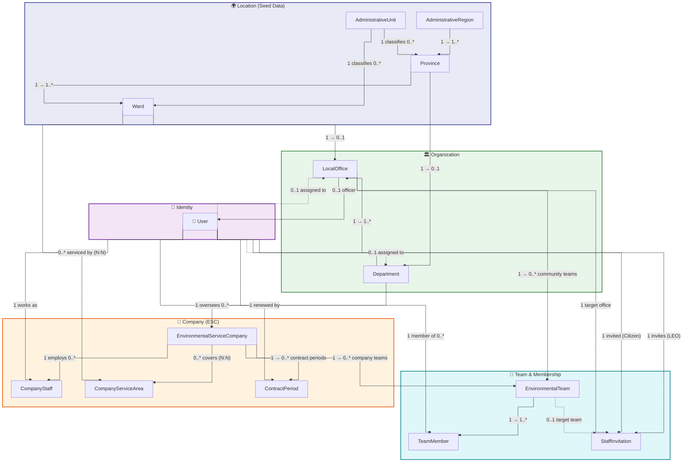
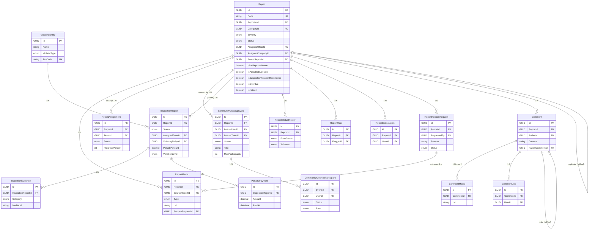
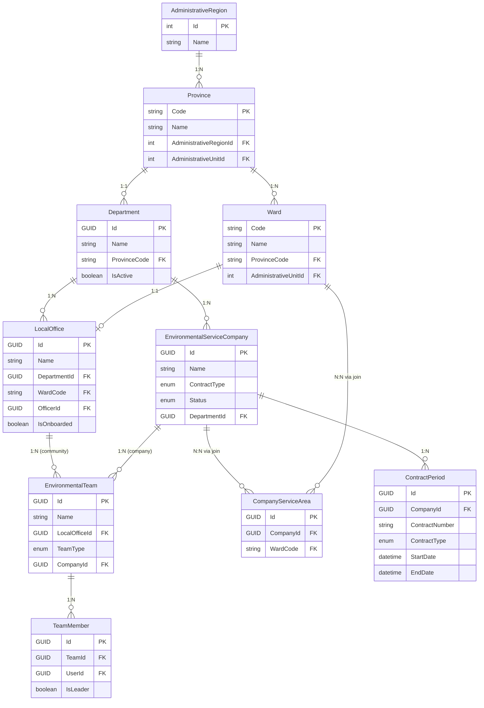
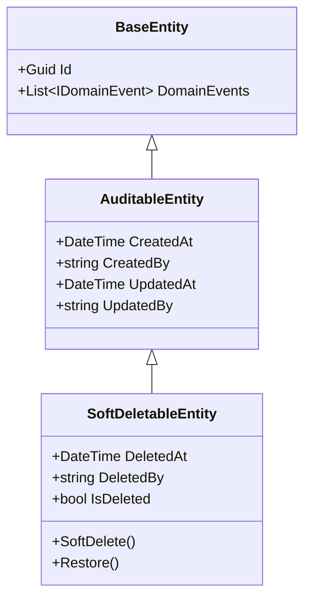

# GreenLens — Logical ERD (v2.0)

> **Dự án:** SU26SE049 — Crowdsourced Application for Reporting Environmental Pollution
> **Ngày tạo:** 2026-06-30 · **Cập nhật:** 2026-08-07 · **Nguồn:** Domain entities + BR v2.0
> **Phiên bản:** v2.0 — đồng bộ toàn bộ src code thực tế

---

## Quy ước ký hiệu

| Ký hiệu    | Ý nghĩa                     |
| ---------- | --------------------------- |
| **PK**     | Primary Key                 |
| **FK**     | Foreign Key                 |
| **UK**     | Unique Key                  |
| **NN**     | Not Null                    |
| _(italic)_ | Nullable                    |
| `«enum»`   | Giá trị từ enum             |

---

# Module 1: Identity & Authentication 🟢

## User 🟢

| Key | Attribute              | Data Type  | Constraint          |
| --- | ---------------------- | ---------- | ------------------- |
| PK  | Id                     | GUID       | NN                  |
|     | Email                  | String     | NN, UK              |
|     | PasswordHash           | String     | NN                  |
|     | FullName               | String     | NN                  |
|     | _PhoneNumber_          | String     | UK                  |
|     | _AvatarUrl_            | String     |                     |
|     | Role                   | «UserRole» | NN                  |
|     | IsEmailVerified        | Boolean    | NN                  |
|     | IsPhoneVerified        | Boolean    | NN                  |
|     | MustChangePassword     | Boolean    | NN                  |
|     | FailedLoginAttempts    | Integer    | NN                  |
|     | _LockoutEnd_           | DateTime   |                     |
|     | _GoogleId_             | String     |                     |
|     | IsBanned               | Boolean    | NN                  |
|     | HasDataConsent         | Boolean    | NN                  |
|     | _ConsentAcceptedAt_    | DateTime   |                     |
|     | _FcmDeviceToken_       | String     |                     |
|     | Language               | String     | NN, default "vi-VN" |
|     | CommentViolationCount  | Integer    | NN                  |
|     | _CommentBannedUntil_   | DateTime   |                     |
|     | _FeaturedBadgeId_      | GUID       |                     |
| FK  | _DepartmentId_         | GUID       | → Department        |
| FK  | _LocalOfficeId_        | GUID       | → LocalOffice       |
|     | CreatedAt              | DateTime   | NN                  |
|     | _CreatedBy_            | String     |                     |
|     | _UpdatedAt_            | DateTime   |                     |
|     | _UpdatedBy_            | String     |                     |
|     | _DeletedAt_            | DateTime   | Soft delete         |
|     | _DeletedBy_            | String     |                     |

> **«UserRole»**: Citizen, DEO, LEO, Cleaner, CompanyManager, CompanyStaff, Inspector, Admin

---

## RefreshToken 🟢

| Key | Attribute             | Data Type | Constraint |
| --- | --------------------- | --------- | ---------- |
| PK  | Id                    | GUID      | NN         |
| FK  | UserId                | GUID      | NN → User  |
|     | TokenHash             | String    | NN         |
|     | ExpiresAt             | DateTime  | NN         |
|     | CreatedAt             | DateTime  | NN         |
|     | IsRevoked             | Boolean   | NN         |
|     | _RevokedAt_           | DateTime  |            |
|     | _ReplacedByTokenHash_ | String    |            |

---

## OtpCode 🟢

| Key | Attribute     | Data Type    | Constraint |
| --- | ------------- | ------------ | ---------- |
| PK  | Id            | GUID         | NN         |
|     | Email         | String       | NN         |
|     | _PhoneNumber_ | String       |            |
|     | CodeHash      | String       | NN         |
|     | Purpose       | «OtpPurpose» | NN         |
|     | ExpiresAt     | DateTime     | NN         |
|     | CreatedAt     | DateTime     | NN         |
|     | IsUsed        | Boolean      | NN         |
|     | AttemptCount  | Integer      | NN         |

> **«OtpPurpose»**: EmailVerification, PasswordReset, PhoneVerification

---

## PasswordHistory 🟢

| Key | Attribute    | Data Type | Constraint |
| --- | ------------ | --------- | ---------- |
| PK  | Id           | GUID      | NN         |
| FK  | UserId       | GUID      | NN → User  |
|     | PasswordHash | String    | NN         |
|     | CreatedAt    | DateTime  | NN         |

---

# Module 2: Organization & Routing 🟢

## Department 🟢

| Key | Attribute    | Data Type | Constraint    |
| --- | ------------ | --------- | ------------- |
| PK  | Id           | GUID      | NN            |
|     | Name         | String    | NN            |
| FK  | ProvinceCode | String(2) | NN → Province |
|     | IsActive     | Boolean   | NN            |
|     | CreatedAt    | DateTime  | NN            |
|     | _CreatedBy_  | String    |               |
|     | _UpdatedAt_  | DateTime  |               |
|     | _UpdatedBy_  | String    |               |

---

## LocalOffice 🟢

| Key | Attribute    | Data Type | Constraint      |
| --- | ------------ | --------- | --------------- |
| PK  | Id           | GUID      | NN              |
|     | Name         | String    | NN              |
| FK  | DepartmentId | GUID      | NN → Department |
| FK  | WardCode     | String(5) | NN → Ward       |
| FK  | _OfficerId_  | GUID      | → User (LEO)    |
|     | IsOnboarded  | Boolean   | NN              |
|     | CreatedAt    | DateTime  | NN              |
|     | _CreatedBy_  | String    |                 |
|     | _UpdatedAt_  | DateTime  |                 |
|     | _UpdatedBy_  | String    |                 |

---

## EnvironmentalTeam 🟢

| Key | Attribute       | Data Type  | Constraint                    |
| --- | --------------- | ---------- | ----------------------------- |
| PK  | Id              | GUID       | NN                            |
|     | Name            | String     | NN                            |
| FK  | _LocalOfficeId_ | GUID       | → LocalOffice                 |
|     | TeamType        | «TeamType» | NN                            |
|     | IsActive        | Boolean    | NN                            |
| FK  | _CompanyId_     | GUID       | → EnvironmentalServiceCompany |
|     | CreatedAt       | DateTime   | NN                            |
|     | _CreatedBy_     | String     |                               |
|     | _UpdatedAt_     | DateTime   |                               |
|     | _UpdatedBy_     | String     |                               |

> **«TeamType»**: Cleanup, Inspection
> **BR-ORG-003:** Team chỉ thuộc 1 chủ thể (LocalOffice HOẶC Company) tại một thời điểm.

---

## TeamMember 🟢

| Key | Attribute | Data Type | Constraint             |
| --- | --------- | --------- | ---------------------- |
| PK  | Id        | GUID      | NN                     |
| FK  | TeamId    | GUID      | NN → EnvironmentalTeam |
| FK  | UserId    | GUID      | NN → User              |
|     | IsLeader  | Boolean   | NN                     |
|     | JoinedAt  | DateTime  | NN                     |

---

## StaffInvitation 🟢

| Key | Attribute       | Data Type          | Constraint          |
| --- | --------------- | ------------------ | ------------------- |
| PK  | Id              | GUID               | NN                  |
| FK  | InvitedByUserId | GUID               | NN → User (LEO)     |
| FK  | InvitedUserId   | GUID               | NN → User (Citizen) |
| FK  | LocalOfficeId   | GUID               | NN → LocalOffice    |
| FK  | _TeamId_        | GUID               | → EnvironmentalTeam |
|     | TargetRole      | «UserRole»         | NN                  |
|     | Status          | «InvitationStatus» | NN                  |
|     | ExpiresAt       | DateTime           | NN                  |
|     | _RespondedAt_   | DateTime           |                     |
|     | Token           | String             | NN, UK              |
|     | CreatedAt       | DateTime           | NN                  |
|     | _CreatedBy_     | String             |                     |
|     | _UpdatedAt_     | DateTime           |                     |
|     | _UpdatedBy_     | String             |                     |

> **«InvitationStatus»**: Pending, Accepted, Declined, Cancelled, Expired

---

# Module 3: Company Management 🟢

## EnvironmentalServiceCompany 🟢

| Key | Attribute            | Data Type       | Constraint      |
| --- | -------------------- | --------------- | --------------- |
| PK  | Id                   | GUID            | NN              |
|     | Name                 | String          | NN              |
|     | _TaxCode_            | String          |                 |
|     | _Address_            | String          |                 |
|     | _Phone_              | String          |                 |
|     | _Email_              | String          |                 |
|     | ContractNumber       | String          | NN              |
|     | ContractStartDate    | DateTime        | NN              |
|     | _ContractEndDate_    | DateTime        |                 |
|     | ContractType         | «ContractType»  | NN              |
|     | Status               | «CompanyStatus» | NN              |
|     | _ActivatedAt_        | DateTime        |                 |
|     | _LastExpiryWarningAt_| DateTime        |                 |
| FK  | DepartmentId         | GUID            | NN → Department |
|     | CreatedAt            | DateTime        | NN              |
|     | _CreatedBy_          | String          |                 |
|     | _UpdatedAt_          | DateTime        |                 |
|     | _UpdatedBy_          | String          |                 |
|     | _DeletedAt_          | DateTime        | Soft delete     |
|     | _DeletedBy_          | String          |                 |

> **«ContractType»**: Subsidiary, Bidding (BR-CMP-001, BR-CMP-003)
> **«CompanyStatus»**: PendingActivation, Active, Suspended, Expired, Terminated (BR-CMP-004)

---

## CompanyStaff 🟢

| Key | Attribute   | Data Type | Constraint                       |
| --- | ----------- | --------- | -------------------------------- |
| PK  | Id          | GUID      | NN                               |
| FK  | UserId      | GUID      | NN → User                        |
| FK  | CompanyId   | GUID      | NN → EnvironmentalServiceCompany |
|     | _Position_  | String    |                                  |
|     | IsActive    | Boolean   | NN                               |
|     | CreatedAt   | DateTime  | NN                               |
|     | _CreatedBy_ | String    |                                  |
|     | _UpdatedAt_ | DateTime  |                                  |
|     | _UpdatedBy_ | String    |                                  |

---

## CompanyServiceArea 🟢

| Key | Attribute   | Data Type | Constraint                       |
| --- | ----------- | --------- | -------------------------------- |
| PK  | Id          | GUID      | NN                               |
| FK  | CompanyId   | GUID      | NN → EnvironmentalServiceCompany |
| FK  | WardCode    | String(5) | NN → Ward                        |
|     | CreatedAt   | DateTime  | NN                               |
|     | _CreatedBy_ | String    |                                  |
|     | _UpdatedAt_ | DateTime  |                                  |
|     | _UpdatedBy_ | String    |                                  |

> **BR-CMP-014**: Company ↔ Ward là N–N

---

## ContractPeriod 🟢

> **BR-CMP-006**: Mỗi lần gia hạn/tái ký tạo 1 record. Kỳ đầu tiên tự động tạo khi DEO tạo Company.

| Key | Attribute        | Data Type      | Constraint                       |
| --- | ---------------- | -------------- | -------------------------------- |
| PK  | Id               | GUID           | NN                               |
| FK  | CompanyId        | GUID           | NN → EnvironmentalServiceCompany |
|     | ContractNumber   | String         | NN                               |
|     | ContractType     | «ContractType» | NN                               |
|     | StartDate        | DateTime       | NN                               |
|     | _EndDate_        | DateTime       |                                  |
| FK  | RenewedByUserId  | GUID           | NN → User                        |
|     | _Note_           | String         |                                  |
|     | CreatedAt        | DateTime       | NN                               |

---

# Module 4: Pollution Report (Core) 🟢

## Report 🟢

| Key | Attribute                       | Data Type        | Constraint                     |
| --- | ------------------------------- | ---------------- | ------------------------------ |
| PK  | Id                              | GUID             | NN                             |
|     | Code                            | String           | NN, UK                         |
| FK  | _ReporterId_                    | GUID             | → User                         |
|     | HideReporterName                | Boolean          | NN                             |
| FK  | CategoryId                      | GUID             | NN → PollutionCategory         |
|     | Severity                        | «Severity»       | NN                             |
|     | SeveritySetBy                   | «SeveritySource» | NN                             |
|     | _Description_                   | String           |                                |
|     | Latitude                        | Decimal          | NN                             |
|     | Longitude                       | Decimal          | NN                             |
|     | _Address_                       | String           |                                |
|     | _WardCode_                      | String(5)        |                                |
|     | _ProvinceCode_                  | String(2)        |                                |
|     | Status                          | «ReportStatus»   | NN                             |
| FK  | _AssignedOfficeId_              | GUID             | → LocalOffice                  |
| FK  | _AssignedDepartmentId_          | GUID             | → Department                   |
| FK  | _VerifiedBy_                    | GUID             | → User (LEO)                   |
| FK  | _AssignedByOfficerId_           | GUID             | → User                         |
| FK  | _AssignedCompanyId_             | GUID             | → EnvironmentalServiceCompany  |
|     | _DispatchedToCompanyAt_         | DateTime         |                                |
| FK  | _ParentReportId_                | GUID             | → Report (self-ref, duplicate) |
|     | ReporterCount                   | Integer          | NN, default 1                  |
|     | IsPossibleDuplicate             | Boolean          | NN                             |
| FK  | _PossibleDuplicateOfReportId_   | GUID             | → Report                       |
|     | _DuplicateDetectionSource_      | String           |                                |
|     | _AiSimilarityScore_             | Decimal          |                                |
|     | IsSuspectedViolationRecurrence  | Boolean          | NN                             |
| FK  | _SuspectedRecurrenceOfReportId_ | GUID             | → Report                       |
|     | IsSuspicious                    | Boolean          | NN                             |
|     | _SuspiciousReasons_             | String           |                                |
|     | AiPending                       | Boolean          | NN                             |
|     | _AiClassifiedType_              | String           |                                |
|     | _AiConfidence_                  | Decimal          |                                |
|     | _AiEstimatedSeverity_           | «Severity»       |                                |
|     | PriorityScore                   | Decimal          | NN                             |
|     | _VerifiedAt_                    | DateTime         |                                |
|     | _RejectedReason_                | String           |                                |
|     | _StartedAt_                     | DateTime         |                                |
|     | _ResolvedAt_                    | DateTime         |                                |
|     | _ClosedAt_                      | DateTime         |                                |
|     | ReopenedCount                   | Integer          | NN                             |
|     | HasPendingReopenRequest         | Boolean          | NN                             |
|     | _SlaVerifyDueAt_                | DateTime         |                                |
|     | _SlaResolveDueAt_               | DateTime         |                                |
|     | SlaVerifyBreached               | Boolean          | NN                             |
|     | SlaResolveBreached              | Boolean          | NN                             |
|     | IsOverdue                       | Boolean          | NN                             |
|     | IsHidden                        | Boolean          | NN                             |
|     | _HiddenAt_                      | DateTime         |                                |
|     | _HiddenBy_                      | GUID             |                                |
|     | _HiddenReason_                  | String           |                                |
|     | CreatedAt                       | DateTime         | NN                             |
|     | _CreatedBy_                     | String           |                                |
|     | _UpdatedAt_                     | DateTime         |                                |
|     | _UpdatedBy_                     | String           |                                |
|     | _DeletedAt_                     | DateTime         | Soft delete                    |
|     | _DeletedBy_                     | String           |                                |

> **«ReportStatus»**: Submitted, Verified, InProgress, Resolved, Reopened, Closed, Rejected, Duplicate
> **«Severity»**: Low, Medium, High, Critical
> **«SeveritySource»**: User, Officer, AI
> **BR-REP-020:** Report chỉ 'Closed' khi nhánh dọn dẹp hoàn tất VÀ mọi InspectionReport liên kết đã kết thúc.

---

## ReportMedia 🟢

| Key | Attribute         | Data Type   | Constraint               |
| --- | ----------------- | ----------- | ------------------------ |
| PK  | Id                | GUID        | NN                       |
| FK  | ReportId          | GUID        | NN → Report              |
|     | _SourceReportId_  | GUID        | (origin before merge)    |
|     | Type              | «MediaType» | NN                       |
|     | Url               | String      | NN                       |
|     | _ThumbnailUrl_    | String      |                          |
|     | MimeType          | String      | NN                       |
|     | SizeBytes         | Long        | NN                       |
|     | _Width_           | Integer     |                          |
|     | _Height_          | Integer     |                          |
|     | _DurationSeconds_ | Integer     |                          |
|     | _PHash_           | String      |                          |
|     | _ExifData_        | String      |                          |
| FK  | _UploadedBy_      | GUID        | → User                   |
|     | UploadedAt        | DateTime    | NN                       |
| FK  | _ReopenRequestId_ | GUID        | → ReportReopenRequest    |
|     | CreatedAt         | DateTime    | NN                       |
|     | _CreatedBy_       | String      |                          |
|     | _UpdatedAt_       | DateTime    |                          |
|     | _UpdatedBy_       | String      |                          |
|     | _DeletedAt_       | DateTime    | Soft delete              |
|     | _DeletedBy_       | String      |                          |

> **«MediaType»**: Image, Video (+ Before, After variants per code)

---

## ReportStatusHistory 🟢

| Key | Attribute    | Data Type      | Constraint  |
| --- | ------------ | -------------- | ----------- |
| PK  | Id           | GUID           | NN          |
| FK  | ReportId     | GUID           | NN → Report |
|     | _FromStatus_ | «ReportStatus» |             |
|     | ToStatus     | «ReportStatus» | NN          |
| FK  | _ChangedBy_  | GUID           | → User      |
|     | _Reason_     | String         |             |
|     | _Metadata_   | String         |             |
|     | CreatedAt    | DateTime       | NN          |

---

## ReportAssignment 🟢

> Đóng vai trò **CleanupTask** — LEO gán đội dọn dẹp bằng cách tạo ReportAssignment.

| Key | Attribute                 | Data Type          | Constraint             |
| --- | ------------------------- | ------------------ | ---------------------- |
| PK  | Id                        | GUID               | NN                     |
| FK  | ReportId                  | GUID               | NN → Report            |
| FK  | TeamId                    | GUID               | NN → EnvironmentalTeam |
| FK  | AssignedById              | GUID               | NN → User              |
|     | Status                    | «AssignmentStatus» | NN                     |
|     | _Note_                    | String             |                        |
|     | _DeclineReason_           | String             |                        |
|     | AssignedAt                | DateTime           | NN                     |
|     | _StartedAt_               | DateTime           |                        |
|     | _CompletedAt_             | DateTime           |                        |
|     | ProgressPercent           | Integer            | NN                     |
|     | _ProgressNote_            | String             |                        |
|     | _ProgressUpdatedAt_       | DateTime           |                        |
| FK  | _ProgressUpdatedByUserId_ | GUID               | → User                 |
|     | CreatedAt                 | DateTime           | NN                     |
|     | _CreatedBy_               | String             |                        |
|     | _UpdatedAt_               | DateTime           |                        |
|     | _UpdatedBy_               | String             |                        |
|     | _DeletedAt_               | DateTime           | Soft delete            |
|     | _DeletedBy_               | String             |                        |

> **«AssignmentStatus»**: Assigned, InProgress, Completed, Declined

---

## ReportReopenRequest 🟢

> **BR-REP-015**: Citizen request to reopen a Resolved report. LEO reviews before approval.

| Key | Attribute         | Data Type            | Constraint  |
| --- | ----------------- | -------------------- | ----------- |
| PK  | Id                | GUID                 | NN          |
| FK  | ReportId          | GUID                 | NN → Report |
| FK  | RequestedBy       | GUID                 | NN → User   |
|     | Reason            | String               | NN          |
|     | Status            | «ReopenRequestStatus»| NN          |
| FK  | _ReviewedBy_      | GUID                 | → User      |
|     | _ReviewedAt_      | DateTime             |             |
|     | _RejectionReason_ | String               |             |
|     | RequestedAt       | DateTime             | NN          |

> **«ReopenRequestStatus»**: Pending, Approved, Rejected
> Media đính kèm qua ReportMedia.ReopenRequestId.

---

## ReportFlag 🟢

| Key | Attribute | Data Type  | Constraint  |
| --- | --------- | ---------- | ----------- |
| PK  | Id        | GUID       | NN          |
| FK  | ReportId  | GUID       | NN → Report |
| FK  | FlaggerId | GUID       | NN → User   |
|     | FlagType  | «FlagType» | NN          |
|     | _Reason_  | String     |             |
|     | CreatedAt | DateTime   | NN          |

> UK: (ReportId, FlaggerId, FlagType) — BR-REP-033

---

## ReportSatisfaction 🟢

| Key | Attribute   | Data Type | Constraint  |
| --- | ----------- | --------- | ----------- |
| PK  | Id          | GUID      | NN          |
| FK  | ReportId    | GUID      | NN → Report |
| FK  | UserId      | GUID      | NN → User   |
|     | IsSatisfied | Boolean   | NN          |
|     | _Rating_    | Integer   |             |
|     | _Comment_   | String    |             |
|     | CreatedAt   | DateTime  | NN          |

> **BR-REP-015, BR-REP-018**

---

## ReportDraft 🟢

| Key | Attribute | Data Type     | Constraint |
| --- | --------- | ------------- | ---------- |
| PK  | Id        | GUID          | NN         |
| FK  | UserId    | GUID          | NN → User  |
|     | Payload   | String (JSON) | NN         |
|     | CreatedAt | DateTime      | NN         |
|     | UpdatedAt | DateTime      | NN         |

> **BR-REP-019**: Tối đa 3 nháp/user, tự xóa sau 7 ngày.

---

# Module 5: Catalog / Lookup 🟢

## PollutionCategory 🟢

| Key | Attribute | Data Type | Constraint |
| --- | --------- | --------- | ---------- |
| PK  | Id        | GUID      | NN         |
|     | Code      | String    | NN, UK     |
|     | NameVi    | String    | NN         |
|     | NameEn    | String    | NN         |
|     | _IconUrl_ | String    |            |
|     | IsActive  | Boolean   | NN         |
|     | CreatedAt | DateTime  | NN         |

> **BR-REP-005**: 3 loại: Rác thải (`TRASH`), Nước thải (`WASTEWATER`), Hóa chất (`CHEMICAL`).

---

## WasteTag 🟢

| Key | Attribute     | Data Type | Constraint |
| --- | ------------- | --------- | ---------- |
| PK  | Id            | GUID      | NN         |
|     | Code          | String    | NN, UK     |
|     | NameVi        | String    | NN         |
|     | NameEn        | String    | NN         |
|     | _IconUrl_     | String    |            |
|     | _Description_ | String    |            |
|     | DisplayOrder  | Integer   | NN         |
|     | IsActive      | Boolean   | NN         |
|     | CreatedAt     | DateTime  | NN         |

---

## ReportWasteTag _(Join Table)_ 🟢

| Key | Attribute  | Data Type | Constraint    |
| --- | ---------- | --------- | ------------- |
| FK  | ReportId   | GUID      | NN → Report   |
| FK  | WasteTagId | GUID      | NN → WasteTag |
| FK  | TaggedById | GUID      | NN → User     |
|     | TaggedAt   | DateTime  | NN            |

> PK: (ReportId, WasteTagId) — composite

---

# Module 6: Inspection (Penalty Enforcement) 🟢

## InspectionReport 🟢

| Key | Attribute                         | Data Type          | Constraint          |
| --- | --------------------------------- | ------------------ | ------------------- |
| PK  | Id                                | GUID               | NN                  |
| FK  | ReportId                          | GUID               | NN → Report         |
|     | Status                            | «InspectionStatus» | NN                  |
| FK  | _AssignedTeamId_                  | GUID               | → EnvironmentalTeam |
|     | _ViolationDescription_            | String             |                     |
|     | _ViolatorName_                    | String             |                     |
|     | _ViolatorAddress_                 | String             |                     |
|     | _ViolatorIdentity_                | String             |                     |
| FK  | _ViolatingEntityId_               | GUID               | → ViolatingEntity   |
|     | _ViolationLevel_                  | «ViolationLevel»   |                     |
|     | _PenaltyAmount_                   | Decimal            |                     |
|     | _PaidAmount_                      | Decimal            |                     |
|     | _PenaltyDecisionNumber_           | String             |                     |
|     | _PenaltyIssuedAt_                 | DateTime           |                     |
|     | _PenaltyDueDate_                  | DateTime           |                     |
|     | _AdditionalPenaltyMeasures_       | String             |                     |
|     | IsRepeatOffender                  | Boolean            | NN                  |
| FK  | CreatedByOfficerId                | GUID               | NN → User (LEO)     |
| FK  | _IssuedByInspectorId_             | GUID               | → User (Inspector)  |
|     | _ClosedAt_                        | DateTime           |                     |
|     | _ClosedReason_                    | String             |                     |
|     | _SlaInspectionDueAt_              | DateTime           |                     |
|     | SlaInspectionBreached             | Boolean            | NN                  |
|     | _CheckedInAt_                     | DateTime           |                     |
|     | _CheckedInLatitude_               | Decimal            |                     |
|     | _CheckedInLongitude_              | Decimal            |                     |
|     | _CheckedInNote_                   | String             |                     |
|     | ProgressPercent                   | Integer            | NN                  |
|     | _ProgressNote_                    | String             |                     |
|     | _ProgressUpdatedAt_               | DateTime           |                     |
|     | _AcceptedAt_                      | DateTime           |                     |
| FK  | _AcceptedByUserId_                | GUID               | → User              |
|     | _ArrivalConfirmedAt_              | DateTime           |                     |
|     | _ArrivalLatitude_                 | Decimal            |                     |
|     | _ArrivalLongitude_                | Decimal            |                     |
|     | _ArrivalNote_                     | String             |                     |
|     | _FieldInvestigationSubmittedAt_   | DateTime           |                     |
| FK  | _FieldInvestigationSubmittedByUserId_ | GUID           | → User              |
|     | CreatedAt                         | DateTime           | NN                  |
|     | _CreatedBy_                       | String             |                     |
|     | _UpdatedAt_                       | DateTime           |                     |
|     | _UpdatedBy_                       | String             |                     |
|     | _DeletedAt_                       | DateTime           | Soft delete         |
|     | _DeletedBy_                       | String             |                     |

> **«InspectionStatus»**: Draft, InProgress, PenaltyIssued, Paid, PartiallyPaid, Overdue, Closed, ClosedNoViolation
> **«ViolationLevel»**: Minor, Moderate, Severe, Critical
> **BR-INS-033:** Checklist workflow: AcceptTask → ConfirmArrival → SubmitFieldInvestigation → IssuePenalty/CloseNoViolation

---

## InspectionEvidence 🟢

> **BR-INS-033**: Checklist evidence items for field investigation.

| Key | Attribute          | Data Type                      | Constraint            |
| --- | ------------------ | ------------------------------ | --------------------- |
| PK  | Id                 | GUID                           | NN                    |
| FK  | InspectionReportId | GUID                           | NN → InspectionReport |
|     | Category           | «InspectionEvidenceCategory»   | NN                    |
|     | _MediaUrl_         | String                         |                       |
|     | _MimeType_         | String                         |                       |
|     | _SizeBytes_        | Long                           |                       |
|     | _Description_      | String                         |                       |
|     | _DurationSeconds_  | Integer                        |                       |
| FK  | UploadedByUserId   | GUID                           | NN → User             |
|     | UploadedAt         | DateTime                       | NN                    |
|     | CreatedAt          | DateTime                       | NN                    |
|     | _CreatedBy_        | String                         |                       |
|     | _UpdatedAt_        | DateTime                       |                       |
|     | _UpdatedBy_        | String                         |                       |

> **«InspectionEvidenceCategory»**: ViolationStatus, ScenePhoto, Video, Audio, Other

---

## ViolatingEntity 🟢

| Key | Attribute        | Data Type      | Constraint    |
| --- | ---------------- | -------------- | ------------- |
| PK  | Id               | GUID           | NN            |
|     | Name             | String         | NN            |
|     | _Address_        | String         |               |
|     | _TaxCode_        | String         | UK (filtered) |
|     | _IdentityNumber_ | String         |               |
|     | _PhoneNumber_    | String         |               |
|     | Type             | «ViolatorType» | NN            |
|     | CreatedAt        | DateTime       | NN            |
|     | _CreatedBy_      | String         |               |
|     | _UpdatedAt_      | DateTime       |               |
|     | _UpdatedBy_      | String         |               |
|     | _DeletedAt_      | DateTime       | Soft delete   |
|     | _DeletedBy_      | String         |               |

> **«ViolatorType»**: Individual (cá nhân/hộ gia đình), Business (doanh nghiệp)
> **BR-INS-022**: Tái phạm — cùng ViolatingEntity bị lập biên bản ≥ 2 lần / 12 tháng.

---

## PenaltyPayment 🟢

| Key | Attribute          | Data Type | Constraint            |
| --- | ------------------ | --------- | --------------------- |
| PK  | Id                 | GUID      | NN                    |
| FK  | InspectionReportId | GUID      | NN → InspectionReport |
|     | Amount             | Decimal   | NN                    |
|     | PaidAt             | DateTime  | NN                    |
|     | _EvidenceUrl_      | String    |                       |
|     | _Note_             | String    |                       |
| FK  | RecordedByUserId   | GUID      | NN → User             |
|     | CreatedAt          | DateTime  | NN                    |
|     | _CreatedBy_        | String    |                       |
|     | _UpdatedAt_        | DateTime  |                       |
|     | _UpdatedBy_        | String    |                       |
|     | _DeletedAt_        | DateTime  | Soft delete           |
|     | _DeletedBy_        | String    |                       |

> **BR-INS-020**: SUM(Amount) vs PenaltyAmount → Paid hay PartiallyPaid.

---

# Module 7: Community Cleanup 🟢 (NEW v2.0)

## CommunityCleanupEvent 🟢

> **BR-CMU-001~015**: LEO mở chương trình dọn dẹp cộng đồng trên Verified report.

| Key | Attribute           | Data Type                   | Constraint             |
| --- | ------------------- | --------------------------- | ---------------------- |
| PK  | Id                  | GUID                        | NN                     |
| FK  | ReportId            | GUID                        | NN → Report            |
| FK  | CreatedByLeoId      | GUID                        | NN → User (LEO)        |
| FK  | LeaderUserId        | GUID                        | NN → User (Cleaner)    |
| FK  | LeaderTeamId        | GUID                        | NN → EnvironmentalTeam |
|     | Status              | «CommunityCleanupStatus»    | NN                     |
|     | Title               | String                      | NN                     |
|     | _Description_       | String                      |                        |
|     | JoinOpensAt         | DateTime                    | NN                     |
|     | _JoinClosesAt_      | DateTime                    |                        |
|     | StartsAt            | DateTime                    | NN                     |
|     | _EndsAt_            | DateTime                    |                        |
|     | MaxParticipants     | Integer                     | NN, default 50         |
|     | _MeetingNote_       | String                      |                        |
|     | _MeetingLatitude_   | Decimal                     |                        |
|     | _MeetingLongitude_  | Decimal                     |                        |
|     | ProgressPercent     | Integer                     | NN                     |
|     | _ProgressNote_      | String                      |                        |
|     | _ProgressUpdatedAt_ | DateTime                    |                        |
|     | _SubmittedAt_       | DateTime                    |                        |
|     | _VerifiedAt_        | DateTime                    |                        |
| FK  | _VerifiedByLeoId_   | GUID                        | → User (LEO)           |
|     | _RejectionReason_   | String                      |                        |
|     | _CancelledAt_       | DateTime                    |                        |
|     | _CancelReason_      | String                      |                        |
|     | CreatedAt           | DateTime                    | NN                     |
|     | _CreatedBy_         | String                      |                        |
|     | _UpdatedAt_         | DateTime                    |                        |
|     | _UpdatedBy_         | String                      |                        |
|     | _DeletedAt_         | DateTime                    | Soft delete            |
|     | _DeletedBy_         | String                      |                        |

> **«CommunityCleanupStatus»**: OpenForJoin, JoinClosed, InProgress, PendingVerification, Completed, Cancelled

---

## CommunityCleanupParticipant 🟢

| Key | Attribute              | Data Type                             | Constraint                    |
| --- | ---------------------- | ------------------------------------- | ----------------------------- |
| PK  | Id                     | GUID                                  | NN                            |
| FK  | EventId                | GUID                                  | NN → CommunityCleanupEvent    |
| FK  | UserId                 | GUID                                  | NN → User                     |
|     | Status                 | «CommunityCleanupParticipantStatus»   | NN                            |
|     | Role                   | «CommunityCleanupParticipantRole»     | NN                            |
|     | JoinedAt               | DateTime                              | NN                            |
|     | _CheckedInAt_          | DateTime                              |                               |
|     | _CheckInLatitude_      | Decimal                               |                               |
|     | _CheckInLongitude_     | Decimal                               |                               |
|     | IsCheckInOverridden    | Boolean                               | NN                            |
|     | _CheckInOverrideReason_| String                                |                               |

> **«CommunityCleanupParticipantStatus»**: Joined, CheckedIn, Withdrawn, NoShow
> **«CommunityCleanupParticipantRole»**: Leader, Member
> **BR-CMU-007**: Check-in GPS distance ≤ 200m.

---

# Module 8: Comment 🟢

## Comment 🟢

| Key | Attribute        | Data Type   | Constraint         |
| --- | ---------------- | ----------- | ------------------ |
| PK  | Id               | GUID        | NN                 |
| FK  | ReportId         | GUID        | NN → Report        |
| FK  | AuthorId         | GUID        | NN → User          |
|     | Content          | String(500) | NN, 1–500 chars    |
|     | IsHidden         | Boolean     | NN, default false  |
|     | _HiddenReason_   | String      |                    |
| FK  | _HiddenBy_       | GUID        | → User (LEO/Admin) |
|     | _HiddenAt_       | DateTime    |                    |
| FK  | _ParentCommentId_| GUID        | → Comment (reply)  |
|     | CreatedAt        | DateTime    | NN                 |
|     | _CreatedBy_      | String      |                    |
|     | _UpdatedAt_      | DateTime    |                    |
|     | _UpdatedBy_      | String      |                    |
|     | _DeletedAt_      | DateTime    | Soft delete        |
|     | _DeletedBy_      | String      |                    |

> **BR-CMT-004**: Sửa/xóa trong 15 phút. LEO/Admin ẩn bất kỳ lúc nào.
> Self-ref: ParentCommentId → Comment (TikTok-style replies).

---

## CommentMedia 🟢

> **BR-CMT-002**: Đính kèm tối đa 2 ảnh (≤ 5MB/ảnh) cho mỗi bình luận.

| Key | Attribute   | Data Type | Constraint   |
| --- | ----------- | --------- | ------------ |
| PK  | Id          | GUID      | NN           |
| FK  | CommentId   | GUID      | NN → Comment |
|     | Url         | String    | NN           |
|     | MimeType    | String    | NN           |
|     | SizeBytes   | Long      | NN           |
|     | CreatedAt   | DateTime  | NN           |
|     | _CreatedBy_ | String    |              |
|     | _UpdatedAt_ | DateTime  |              |
|     | _UpdatedBy_ | String    |              |

---

## CommentLike 🟢

> One like per user per comment (TikTok-style).

| Key | Attribute | Data Type | Constraint   |
| --- | --------- | --------- | ------------ |
| PK  | Id        | GUID      | NN           |
| FK  | CommentId | GUID      | NN → Comment |
| FK  | UserId    | GUID      | NN → User    |
|     | CreatedAt | DateTime  | NN           |

> UK: (CommentId, UserId)

---

# Module 9: Gamification 🟢

## UserPoints 🟢

| Key | Attribute      | Data Type | Constraint    |
| --- | -------------- | --------- | ------------- |
| PK  | Id             | GUID      | NN            |
| FK  | UserId         | GUID      | NN, UK → User |
|     | TotalPoints    | Integer   | NN            |
|     | IsLocked       | Boolean   | NN            |
|     | _LockedUntil_  | DateTime  |               |
|     | _LockedReason_ | String    |               |
|     | CreatedAt      | DateTime  | NN            |

---

## PointTransaction 🟢

| Key | Attribute    | Data Type     | Constraint      |
| --- | ------------ | ------------- | --------------- |
| PK  | Id           | GUID          | NN              |
| FK  | UserPointsId | GUID          | NN → UserPoints |
|     | Points       | Integer       | NN              |
|     | Reason       | «PointReason» | NN              |
| FK  | _ReportId_   | GUID          | → Report        |
|     | CreatedAt    | DateTime      | NN              |

> **«PointReason»**: ReportVerified (+10), ReportResolved (+20), PenaltyIssued (+20), DuplicateReport (+5), ReportRejected (-5), FraudPenalty, CommunityCleanupParticipation (+15)

---

## Badge 🟢

| Key | Attribute             | Data Type | Constraint |
| --- | --------------------- | --------- | ---------- |
| PK  | Id                    | GUID      | NN         |
|     | Code                  | String    | NN, UK     |
|     | NameVi                | String    | NN         |
|     | NameEn                | String    | NN         |
|     | _Description_         | String    |            |
|     | _IconUrl_             | String    |            |
|     | IsActive              | Boolean   | NN         |
|     | _RequiredPoints_      | Integer   |            |
|     | _RequiredReportCount_ | Integer   |            |
|     | CreatedAt             | DateTime  | NN         |

---

## UserBadge 🟢

| Key | Attribute  | Data Type | Constraint |
| --- | ---------- | --------- | ---------- |
| PK  | Id         | GUID      | NN         |
| FK  | UserId     | GUID      | NN → User  |
| FK  | BadgeId    | GUID      | NN → Badge |
|     | AwardedAt  | DateTime  | NN         |
| FK  | _ReportId_ | GUID      | → Report   |

> UK: (UserId, BadgeId)

---

## GamificationConfig 🟢

> **BR-ADM-005**: Admin-configurable point amounts per action.

| Key | Attribute   | Data Type     | Constraint |
| --- | ----------- | ------------- | ---------- |
| PK  | Id          | GUID          | NN         |
|     | ActionType  | «PointReason» | NN, UK     |
|     | Points      | Integer       | NN         |
|     | IsActive    | Boolean       | NN         |
|     | Description | String        | NN         |
|     | CreatedAt   | DateTime      | NN         |
|     | _CreatedBy_ | String        |            |
|     | _UpdatedAt_ | DateTime      |            |
|     | _UpdatedBy_ | String        |            |

---

# Module 10: Notification 🟢

## Notification 🟢

| Key | Attribute          | Data Type             | Constraint |
| --- | ------------------ | --------------------- | ---------- |
| PK  | Id                 | GUID                  | NN         |
| FK  | RecipientId        | GUID                  | NN → User  |
|     | Type               | «NotificationType»    | NN         |
|     | Title              | String                | NN         |
|     | Message            | String                | NN         |
| FK  | _ReferenceId_      | GUID                  |            |
|     | Channel            | «NotificationChannel» | NN         |
|     | IsRead             | Boolean               | NN         |
|     | _ReadAt_           | DateTime              |            |
|     | _PushDispatchedAt_ | DateTime              |            |
|     | _EmailDispatchedAt_| DateTime              |            |
|     | CreatedAt          | DateTime              | NN         |
|     | _CreatedBy_        | String                |            |
|     | _UpdatedAt_        | DateTime              |            |
|     | _UpdatedBy_        | String                |            |

> **«NotificationType»**: ReportStatusChanged, NewComment, BadgeEarned, LevelUp, SlaBreachWarning, SlaVerificationBreachedLeo, SlaVerificationEscalatedDeo, SlaResolutionBreached, SlaInspectionBreached, InspectionTaskAssigned, InspectionTaskDeclined, InspectionTaskAccepted, InspectionProgressUpdated, ... (40+ types)
> **«NotificationChannel»**: Push, Email, Both
> **PushDispatchedAt / EmailDispatchedAt**: Idempotency guard cho Hangfire retry.

---

## NotificationPreference 🟢

| Key | Attribute    | Data Type          | Constraint |
| --- | ------------ | ------------------ | ---------- |
| PK  | Id           | GUID               | NN         |
| FK  | UserId       | GUID               | NN → User  |
|     | Type         | «NotificationType» | NN         |
|     | PushEnabled  | Boolean            | NN         |
|     | EmailEnabled | Boolean            | NN         |
|     | CreatedAt    | DateTime           | NN         |
|     | _CreatedBy_  | String             |            |
|     | _UpdatedAt_  | DateTime           |            |
|     | _UpdatedBy_  | String             |            |

> UK: (UserId, Type)

---

## NotificationTemplate 🟢

> **BR-ADM-004**: Admin-managed templates with placeholders. Must be published before use.

| Key | Attribute   | Data Type             | Constraint |
| --- | ----------- | --------------------- | ---------- |
| PK  | Id          | GUID                  | NN         |
|     | TemplateKey | String                | NN, UK     |
|     | TitleVi     | String                | NN         |
|     | BodyVi      | String                | NN         |
|     | _TitleEn_   | String                |            |
|     | _BodyEn_    | String                |            |
|     | Channel     | «NotificationChannel» | NN         |
|     | Type        | «NotificationType»    | NN         |
|     | IsPublished | Boolean               | NN         |
|     | IsActive    | Boolean               | NN         |
|     | CreatedAt   | DateTime              | NN         |
|     | _CreatedBy_ | String                |            |
|     | _UpdatedAt_ | DateTime              |            |
|     | _UpdatedBy_ | String                |            |

---

# Module 11: Administration 🟢

## AuditLog 🟢

> **BR-ADM-010**: Log hành động nhạy cảm. Giữ ≥ 12 tháng. Immutable.

| Key | Attribute   | Data Type     | Constraint |
| --- | ----------- | ------------- | ---------- |
| PK  | Id          | GUID          | NN         |
| FK  | UserId      | GUID          | NN → User  |
|     | Action      | String        | NN         |
|     | EntityType  | String        | NN         |
|     | _EntityId_  | String        |            |
|     | _OldValues_ | String (JSON) |            |
|     | _NewValues_ | String (JSON) |            |
|     | IpAddress   | String        | NN         |
|     | _UserAgent_ | String        |            |
|     | CreatedAt   | DateTime      | NN         |

---

## PenaltyFramework 🟢

> **BR-ADM-008, BR-INS-011**: Admin cấu hình khung mức phạt cho 4 cấp vi phạm theo loại ô nhiễm.

| Key | Attribute      | Data Type        | Constraint          |
| --- | -------------- | ---------------- | ------------------- |
| PK  | Id             | GUID             | NN                  |
| FK  | CategoryId     | GUID             | NN → PollutionCategory |
|     | ViolationLevel | «ViolationLevel» | NN                  |
|     | MinAmount      | Decimal          | NN                  |
|     | MaxAmount      | Decimal          | NN                  |
|     | Currency       | String           | NN, default "VND"   |
|     | EffectiveFrom  | DateTime         | NN                  |
|     | _EffectiveTo_  | DateTime         |                     |
|     | IsActive       | Boolean          | NN                  |
|     | CreatedAt      | DateTime         | NN                  |
|     | _CreatedBy_    | String           |                     |
|     | _UpdatedAt_    | DateTime         |                     |
|     | _UpdatedBy_    | String           |                     |

---

## BlockedWord 🟢

> **BR-REP-004, BR-CMT-003, BR-ADM-010**: Admin-managed profanity filter.

| Key | Attribute   | Data Type | Constraint |
| --- | ----------- | --------- | ---------- |
| PK  | Id          | GUID      | NN         |
|     | Word        | String    | NN, UK     |
|     | _Note_      | String    |            |
|     | IsActive    | Boolean   | NN         |
|     | CreatedAt   | DateTime  | NN         |
|     | _CreatedBy_ | String    |            |
|     | _UpdatedAt_ | DateTime  |            |
|     | _UpdatedBy_ | String    |            |

---

# Module 12: Location (Seed Data) 🟢

## AdministrativeRegion 🟢

| Key | Attribute | Data Type | Constraint |
| --- | --------- | --------- | ---------- |
| PK  | Id        | Integer   | NN         |
|     | Name      | String    | NN         |

---

## AdministrativeUnit 🟢

| Key | Attribute    | Data Type | Constraint |
| --- | ------------ | --------- | ---------- |
| PK  | Id           | Integer   | NN         |
|     | Name         | String    | NN         |
|     | Abbreviation | String    | NN         |

---

## Province 🟢

| Key | Attribute              | Data Type | Constraint                |
| --- | ---------------------- | --------- | ------------------------- |
| PK  | Code                   | String(2) | NN                        |
|     | Name                   | String    | NN                        |
| FK  | AdministrativeRegionId | Integer   | NN → AdministrativeRegion |
| FK  | AdministrativeUnitId   | Integer   | NN → AdministrativeUnit   |
|     | _BoundaryUrl_          | String    |                           |

---

## Ward 🟢

| Key | Attribute            | Data Type | Constraint              |
| --- | -------------------- | --------- | ----------------------- |
| PK  | Code                 | String(5) | NN                      |
|     | Name                 | String    | NN                      |
| FK  | ProvinceCode         | String(2) | NN → Province           |
| FK  | AdministrativeUnitId | Integer   | NN → AdministrativeUnit |
|     | _BoundaryUrl_        | String    |                         |

---

# ER Diagram — Relationships (Orthogonal Layout)

> **Ký hiệu cardinality** trên nhãn: `1` = exactly one, `0..1` = zero or one, `1..*` = one or many, `0..*` = zero or many

---

## Diagram 1/4 — Report Core & Xử lý (Dọn dẹp + Xử phạt + Community Cleanup)

```mermaid
%%{init: {'flowchart': {'curve': 'stepBefore', 'nodeSpacing': 30, 'rankSpacing': 60, 'padding': 15}}}%%
flowchart TB
    subgraph IDENTITY["🔐 Identity"]
        User["👤 User"]
    end

    subgraph CATALOG["📂 Catalog"]
        PollutionCategory["PollutionCategory"]
        WasteTag["WasteTag"]
    end

    subgraph REPORT_CORE["📝 Report Core"]
        Report["📋 Report"]
        ReportMedia["ReportMedia"]
        ReportStatusHistory["ReportStatusHistory"]
        ReportWasteTag["ReportWasteTag"]
        ReportFlag["ReportFlag"]
        ReportSatisfaction["ReportSatisfaction"]
        ReportDraft["ReportDraft"]
        ReportReopenRequest["ReportReopenRequest"]
    end

    subgraph CLEANUP["🧹 Cleanup"]
        ReportAssignment["ReportAssignment"]
    end

    subgraph COMMUNITY["🤝 Community Cleanup"]
        CommunityCleanupEvent["CommunityCleanupEvent"]
        CommunityCleanupParticipant["CommunityCleanupParticipant"]
    end

    subgraph INSPECTION["⚖️ Inspection"]
        InspectionReport["InspectionReport"]
        InspectionEvidence["InspectionEvidence"]
        PenaltyPayment["PenaltyPayment"]
        ViolatingEntity["ViolatingEntity"]
    end

    subgraph COMMENT_MOD["💬 Comment"]
        Comment["Comment"]
        CommentMedia["CommentMedia"]
        CommentLike["CommentLike"]
    end

    subgraph TEAM["👥 Team"]
        EnvironmentalTeam["EnvironmentalTeam"]
    end

    %% ── User → Report ──
    User -- "1..* submits" --> Report
    User -- "0..* saves" --> ReportDraft

    %% ── Catalog → Report ──
    PollutionCategory -- "1 categorizes 0..*" --> Report
    WasteTag -- "0..* tagged via" --> ReportWasteTag
    Report -- "0..* tagged with" --> ReportWasteTag

    %% ── Report children ──
    Report -- "1 → 0..*" --> ReportMedia
    Report -- "1 → 0..*" --> ReportStatusHistory
    Report -- "1 → 0..*" --> ReportFlag
    Report -- "1 → 0..1" --> ReportSatisfaction
    Report -- "1 → 0..*" --> ReportReopenRequest
    Report -- "0..1 duplicate of" -.-> Report

    %% ── Cleanup branch ──
    Report -- "1 → 0..* cleanup" --> ReportAssignment
    EnvironmentalTeam -- "1 works on 0..*" --> ReportAssignment

    %% ── Community Cleanup branch ──
    Report -- "1 → 0..*" --> CommunityCleanupEvent
    CommunityCleanupEvent -- "1 → 0..*" --> CommunityCleanupParticipant
    User -- "0..* joins" --> CommunityCleanupParticipant

    %% ── Inspection branch ──
    Report -- "1 → 0..* penalty" --> InspectionReport
    InspectionReport -- "1 → 0..*" --> InspectionEvidence
    InspectionReport -- "1 → 0..*" --> PenaltyPayment
    ViolatingEntity -- "1 → 0..*" --> InspectionReport
    EnvironmentalTeam -- "0..1 assigned to" --> InspectionReport

    %% ── Comment branch ──
    Report -- "1 → 0..*" --> Comment
    User -- "1 writes 0..*" --> Comment
    Comment -- "1 → 0..2" --> CommentMedia
    Comment -- "1 → 0..*" --> CommentLike
    Comment -- "0..1 reply to" -.-> Comment

    style REPORT_CORE fill:#e8f5e9,stroke:#2e7d32,stroke-width:2px
    style CLEANUP fill:#e3f2fd,stroke:#1565c0,stroke-width:2px
    style COMMUNITY fill:#e0f2f1,stroke:#00695c,stroke-width:2px
    style INSPECTION fill:#fff3e0,stroke:#e65100,stroke-width:2px
    style COMMENT_MOD fill:#fce4ec,stroke:#c62828,stroke-width:2px
    style IDENTITY fill:#f3e5f5,stroke:#6a1b9a,stroke-width:2px
    style CATALOG fill:#fff9c4,stroke:#f57f17,stroke-width:2px
    style TEAM fill:#e0f7fa,stroke:#00838f,stroke-width:2px
```

---

## Diagram 2/4 — Organization, Company & Location Hierarchy



---

## Diagram 3/4 — Gamification, Notification & Admin

```mermaid
%%{init: {'flowchart': {'curve': 'stepBefore', 'nodeSpacing': 30, 'rankSpacing': 60, 'padding': 15}}}%%
flowchart TB
    subgraph IDENTITY["🔐 Identity"]
        User["👤 User"]
        RefreshToken["RefreshToken"]
        OtpCode["OtpCode"]
        PasswordHistory["PasswordHistory"]
    end

    subgraph GAMIFICATION["🏆 Gamification"]
        UserPoints["UserPoints"]
        PointTransaction["PointTransaction"]
        Badge["Badge"]
        UserBadge["UserBadge"]
        GamificationConfig["GamificationConfig"]
    end

    subgraph NOTIFICATION["🔔 Notification"]
        Notification["Notification"]
        NotificationPreference["NotificationPreference"]
        NotificationTemplate["NotificationTemplate"]
    end

    subgraph ADMIN["⚙️ Administration"]
        AuditLog["AuditLog"]
        PenaltyFramework["PenaltyFramework"]
        BlockedWord["BlockedWord"]
    end

    subgraph CATALOG["📂 Catalog"]
        PollutionCategory["PollutionCategory"]
    end

    %% ── Identity ──
    User -- "1 → 0..*" --> RefreshToken
    User -- "1 → 0..*" --> OtpCode
    User -- "1 → 0..*" --> PasswordHistory

    %% ── Gamification ──
    User -- "1 → 0..1" --> UserPoints
    UserPoints -- "1 → 0..*" --> PointTransaction
    User -- "0..* earns" --> UserBadge
    Badge -- "1 awarded as 0..*" --> UserBadge

    %% ── Notification ──
    User -- "1 receives 0..*" --> Notification
    User -- "1 configures 0..*" --> NotificationPreference

    %% ── Admin ──
    User -- "0..* performed by" --> AuditLog
    PollutionCategory -- "1 applies to 0..*" --> PenaltyFramework

    style IDENTITY fill:#f3e5f5,stroke:#6a1b9a,stroke-width:2px
    style GAMIFICATION fill:#e8f5e9,stroke:#2e7d32,stroke-width:2px
    style NOTIFICATION fill:#e3f2fd,stroke:#1565c0,stroke-width:2px
    style ADMIN fill:#fff3e0,stroke:#e65100,stroke-width:2px
    style CATALOG fill:#fff9c4,stroke:#f57f17,stroke-width:2px
```



---

## Diagram 4/4 — Report & Assignment Detail (ER Diagram)



---

## Chi tiết — Organization Hierarchy



---

## Chi tiết — Gamification

```mermaid
erDiagram
    UserPoints {
        GUID Id PK
        GUID UserId FK_UK
        int TotalPoints
        boolean IsLocked
        datetime LockedUntil
    }

    PointTransaction {
        GUID Id PK
        GUID UserPointsId FK
        int Points
        enum Reason
        GUID ReportId FK
    }

    Badge {
        GUID Id PK
        string Code UK
        string NameVi
        string NameEn
        int RequiredPoints
        int RequiredReportCount
    }

    UserBadge {
        GUID Id PK
        GUID UserId FK
        GUID BadgeId FK
        datetime AwardedAt
        GUID ReportId FK
    }

    GamificationConfig {
        GUID Id PK
        enum ActionType UK
        int Points
        boolean IsActive
    }

    UserPoints ||--o{ PointTransaction : "1:N"
    Badge ||--o{ UserBadge : "1:N"
```

---

# Bảng tổng kết Entities

| #   | Entity                        | Module              | PK Type   | Base Class          | Soft Delete | Status |
| --- | ----------------------------- | ------------------- | --------- | ------------------- | :---------: | :----: |
| 1   | User                          | Identity            | GUID      | SoftDeletableEntity |     ✅      |   🟢   |
| 2   | RefreshToken                  | Identity            | GUID      | BaseEntity          |     ❌      |   🟢   |
| 3   | OtpCode                       | Identity            | GUID      | BaseEntity          |     ❌      |   🟢   |
| 4   | PasswordHistory               | Identity            | GUID      | BaseEntity          |     ❌      |   🟢   |
| 5   | Department                    | Organization        | GUID      | AuditableEntity     |     ❌      |   🟢   |
| 6   | LocalOffice                   | Organization        | GUID      | AuditableEntity     |     ❌      |   🟢   |
| 7   | EnvironmentalTeam             | Organization        | GUID      | AuditableEntity     |     ❌      |   🟢   |
| 8   | TeamMember                    | Organization        | GUID      | BaseEntity          |     ❌      |   🟢   |
| 9   | StaffInvitation               | Organization        | GUID      | AuditableEntity     |     ❌      |   🟢   |
| 10  | EnvironmentalServiceCompany   | Company             | GUID      | SoftDeletableEntity |     ✅      |   🟢   |
| 11  | CompanyStaff                  | Company             | GUID      | AuditableEntity     |     ❌      |   🟢   |
| 12  | CompanyServiceArea            | Company             | GUID      | AuditableEntity     |     ❌      |   🟢   |
| 13  | ContractPeriod                | Company             | GUID      | BaseEntity          |     ❌      |   🟢   |
| 14  | Report                        | Report              | GUID      | SoftDeletableEntity |     ✅      |   🟢   |
| 15  | ReportMedia                   | Report              | GUID      | SoftDeletableEntity |     ✅      |   🟢   |
| 16  | ReportStatusHistory           | Report              | GUID      | BaseEntity          |     ❌      |   🟢   |
| 17  | ReportAssignment              | Report              | GUID      | SoftDeletableEntity |     ✅      |   🟢   |
| 18  | ReportReopenRequest           | Report              | GUID      | BaseEntity          |     ❌      |   🟢   |
| 19  | ReportFlag                    | Report              | GUID      | BaseEntity          |     ❌      |   🟢   |
| 20  | ReportSatisfaction            | Report              | GUID      | BaseEntity          |     ❌      |   🟢   |
| 21  | ReportDraft                   | Report              | GUID      | BaseEntity          |     ❌      |   🟢   |
| 22  | ReportWasteTag                | Report              | Composite | —                   |     ❌      |   🟢   |
| 23  | PollutionCategory             | Catalog             | GUID      | BaseEntity          |     ❌      |   🟢   |
| 24  | WasteTag                      | Catalog             | GUID      | BaseEntity          |     ❌      |   🟢   |
| 25  | InspectionReport              | Inspection          | GUID      | SoftDeletableEntity |     ✅      |   🟢   |
| 26  | InspectionEvidence            | Inspection          | GUID      | AuditableEntity     |     ❌      |   🟢   |
| 27  | ViolatingEntity               | Inspection          | GUID      | SoftDeletableEntity |     ✅      |   🟢   |
| 28  | PenaltyPayment                | Inspection          | GUID      | SoftDeletableEntity |     ✅      |   🟢   |
| 29  | CommunityCleanupEvent         | Community Cleanup   | GUID      | SoftDeletableEntity |     ✅      |   🟢   |
| 30  | CommunityCleanupParticipant   | Community Cleanup   | GUID      | BaseEntity          |     ❌      |   🟢   |
| 31  | Comment                       | Comment             | GUID      | SoftDeletableEntity |     ✅      |   🟢   |
| 32  | CommentMedia                  | Comment             | GUID      | AuditableEntity     |     ❌      |   🟢   |
| 33  | CommentLike                   | Comment             | GUID      | BaseEntity          |     ❌      |   🟢   |
| 34  | UserPoints                    | Gamification        | GUID      | BaseEntity          |     ❌      |   🟢   |
| 35  | PointTransaction              | Gamification        | GUID      | BaseEntity          |     ❌      |   🟢   |
| 36  | Badge                         | Gamification        | GUID      | BaseEntity          |     ❌      |   🟢   |
| 37  | UserBadge                     | Gamification        | GUID      | BaseEntity          |     ❌      |   🟢   |
| 38  | GamificationConfig            | Gamification        | GUID      | AuditableEntity     |     ❌      |   🟢   |
| 39  | Notification                  | Notification        | GUID      | AuditableEntity     |     ❌      |   🟢   |
| 40  | NotificationPreference        | Notification        | GUID      | AuditableEntity     |     ❌      |   🟢   |
| 41  | NotificationTemplate          | Notification        | GUID      | AuditableEntity     |     ❌      |   🟢   |
| 42  | AuditLog                      | Admin               | GUID      | BaseEntity          |     ❌      |   🟢   |
| 43  | PenaltyFramework              | Admin               | GUID      | AuditableEntity     |     ❌      |   🟢   |
| 44  | BlockedWord                   | Admin               | GUID      | AuditableEntity     |     ❌      |   🟢   |
| 45  | AdministrativeRegion          | Location            | Integer   | —                   |     ❌      |   🟢   |
| 46  | AdministrativeUnit            | Location            | Integer   | —                   |     ❌      |   🟢   |
| 47  | Province                      | Location            | String(2) | —                   |     ❌      |   🟢   |
| 48  | Ward                          | Location            | String(5) | —                   |     ❌      |   🟢   |

> **Tổng: 48 entities — tất cả đã implement.** Không còn entity 🔴 nào.

---

# Kế thừa (Inheritance Hierarchy)



---

# Report State Machine (BR-REP-020, Phụ lục A)

## Nhánh dọn dẹp (umbrella)

```
Submitted ──► Verified ──► InProgress ──► Resolved ──┬──► Closed
    │              │                          │       │
    ├──► Rejected   ├──► Duplicate             │       │
    │              │                           └──► Reopened ──► InProgress
    └──────────────┘                            (max 1 lần, citizen request + LEO approve)
```

## Nhánh xử phạt (InspectionReport) — song song

```
Draft ──► InProgress ──► PenaltyIssued ──┬──► Paid ──► Closed
    │                                     ├──► PartiallyPaid
    │                                     └──► Overdue ──► (escalate)
    └──► ClosedNoViolation
```

## Nhánh dọn dẹp cộng đồng (CommunityCleanupEvent)

```
OpenForJoin ──► JoinClosed ──► InProgress ──► PendingVerification ──┬──► Completed
                                                                     └──► (LEO reject → InProgress)
    └──► Cancelled (bất kỳ lúc nào trước Completed)
```

> **BR-REP-020 v2.0**: Report umbrella chỉ 'Closed' khi nhánh dọn dẹp hoàn tất **VÀ** mọi InspectionReport liên kết đã kết thúc.
