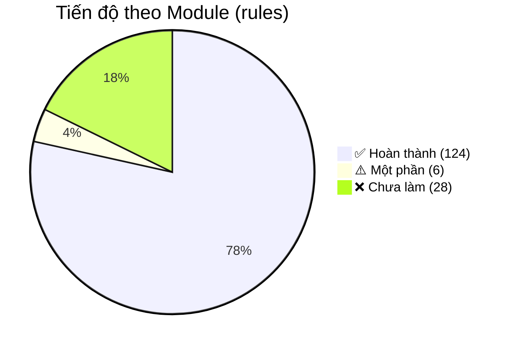

# 📊 Báo cáo Tiến độ — GreenLens Backend

> **Cập nhật:** 2026-07-11 17:15 · **Phiên:** 17 · **Tổng tiến độ ước tính: ~79%**

---

## Dashboard tổng quan

| Module                     |  Rules  |  Done   | Partial | Missing |    %     |
| -------------------------- | :-----: | :-----: | :-----: | :-----: | :------: |
| **Auth & Account**         |   21    |   20    |    0    |    1    |   95%    |
| **Organization & Routing** |   14    |   14    |    0    |    0    | **100%** |
| **Report**                 |   23    |   17    |    0    |    6    |   74%    |
| **Map**                    |    8    |    0    |    3    |    5    |    0%    |
| **Officer**                |   12    |   12    |    0    |    0    | **100%** |
| **Cleanup**                |    8    |    8    |    0    |    0    | **100%** |
| **Inspection**             |   14    |   14    |    0    |    0    | **100%** |
| **Company**                |   14    |   14    |    0    |    0    | **100%** |
| **Notifications**          |    4    |   3    |    1    |    0    |   88%    |
| **Comments**               |    4    |    0    |    0    |    4    |    0%    |
| **Gamification**           |    6    |    4    |    2    |    0    |   83%    |
| **AI Service**             |    7    |    1    |    0    |    6    |   14%    |
| **Administration**         |   12    |   12    |    0    |    0    | **100%** |
| **Data Privacy**           |    5    |    5    |    0    |    0    | **100%** |
| **Non-functional**         |    6    |    0    |    0    |    6    |    0%    |
| **TỔNG**                   | **158** | **124** | **6**  | **28**  | **~79%** |

---

## ✅ Modules hoàn thành 100%

### Organization & Routing (BR-ORG) — 14/14

GPS → Ward → LEO routing, department common queue, conflict of interest, SLA escalation, invitation flow (7d expiry), reject re-queue, manual escalate to DEO, release staff, company service areas.

### Officer (BR-OFF) — 12/12

SLA verification 24h + resolution (severity-based), priority score formula, workload limit 6/team, KPI query (custom+preset), report export CSV+XLSX, triage, reassign.

### Company (BR-CMP) — 14/14

Full lifecycle (5 status: PendingActivation/Active/Suspended/Expired/Terminated), contract renewal (ContractPeriod entity), auto-expire job + 30/7/1d warnings, cascade suspend/terminate, KPI query, CM data isolation audit.

### Administration (BR-ADM) — 12/12 ⭐ **MỚI (phiên 16)**

PenaltyFramework CRUD, AuditLog pipeline (MediatR behavior), content moderation (hide/unhide), spam dashboard heuristic, GamificationConfig CRUD, NotificationTemplate CRUD+publish+test-send, DEO province scoping, company monitoring.

### Data Privacy (BR-DAT) — 5/5

bcrypt 12 rounds, DataRetentionJob (S3 2 năm + audit 12 tháng), ExportMyData (JSON+CSV), consent flow + migration.

### Cleanup (BR-CLN) — 8/8 ⭐ **MỚI (phiên 17)**

Phạm vi tiếp nhận, chỉ xem task được gán, Check-in GPS PostGIS ≤ 200m bắt đầu task, cập nhật tiến độ (SLA 24h/48h), ≥ 2 ảnh after khi Resolve (không kiểm tra góc chụp), leo thang (Escalate) lên LEO, từ chối task 24h, kiểm tra hiệu lực hợp đồng đối với đội công ty.

### Inspection (BR-INS) — 14/14 ⭐ **MỚI (phiên 17)**

Phạm vi xử lý mọi loại ô nhiễm, scope check theo team, từ chối task 24h, check-in hiện trường PostGIS ≤ 200m, lập biên bản vi phạm, khung tiền phạt configurable, ban hành quyết định xử phạt, đóng hồ sơ không vi phạm (lý do ≥ 50 ký tự), ghi nhận nộp phạt, tự động phạt quá hạn, tự động kiểm tra tái phạm nâng khung phạt, SLA xử lý theo mức độ vi phạm, cập nhật tiến độ hàng ngày, Dashboard KPI Inspection Team.

---

## ⚠️ Modules implement phần lớn

### Auth & Account (BR-AUTH) — 20/21

| Còn thiếu   | Chi tiết                                                             |
| ----------- | -------------------------------------------------------------------- |
| BR-AUTH-014 | Brute-force lock 30' + CAPTCHA từ lần 3 (sliding window + Turnstile) |

### Report (BR-REP) — 17/23

| Còn thiếu       | Chi tiết                                           |
| --------------- | -------------------------------------------------- |
| BR-REP-004      | Word filter tục tĩu                                |
| BR-REP-010      | Rate limit 5/h, 20/24h (Redis sorted set)          |
| BR-REP-011      | EXIF metadata validation                           |
| BR-REP-030..033 | Duplicate detection (**plan đã tạo, chờ approve**) |

### Notifications (BR-NTF) — 3/4

| Còn thiếu  | Chi tiết                             |
| ---------- | ------------------------------------ |
| BR-NTF-004 | i18n en-US (hardcode vi-VN hiện tại) |

### Gamification (BR-GAM) — 4/6 (+2 partial)

| Partial    | Chi tiết                                                         |
| ---------- | ---------------------------------------------------------------- |
| BR-GAM-002 | Anonymous opt-out — entity sẵn, thiếu cột `IsAnonymous`          |
| BR-GAM-004 | Badges `hotspot_hunter` + `streak_7d` seed nhưng chưa auto-award |

---

## ❌ Modules chưa/ít implement

### Comments (BR-CMT) — 0/4

Chưa có entity Comment. Cần: CRUD, moderation, file attachment.

### Map (BR-MAP) — 0/8

Có `GetPublicMapReports/` nhưng chưa verify. Thiếu: nearby 5km, clustering, hotspot, heatmap, GPS rounding, Redis cache 10'.

### AI Service (BR-AI) — 1/7

Có: AnalyzeReportImage + AiClassificationService. Thiếu: fallback retry job, AI config cho 3 loại.

### Non-functional (BR-SYS) — 0/6

Rate limiting chưa implement. Còn lại: infra/DevOps concern.

---

## 📦 Infrastructure Stats

| Hạng mục                       | Số lượng                            |
| ------------------------------ | ----------------------------------- |
| **Background Jobs (Hangfire)** | 12/13 registered (thiếu AiRetryJob) |
| **Domain Entities**            | ~35+ entities                       |
| **Feature Slices**             | ~90+ (Command/Query)                |
| **API Endpoints**              | ~105+                               |
| **Unit Tests**                 | ~150+                               |
| **Migrations**                 | ~16+                                |

### Background Jobs Status

| Job                          | Cron             | Status |
| ---------------------------- | ---------------- | :----: |
| AutoCloseResolvedReportJob   | Hourly           |   ✅   |
| SlaBreachVerificationJob     | Every 15'        |   ✅   |
| SlaBreachResolutionJob       | Every 30'        |   ✅   |
| OverdueReportNotificationJob | Hourly           |   ✅   |
| PriorityScoreRefreshJob      | Every 30'        |   ✅   |
| DraftCleanupJob              | Daily 03:00      |   ✅   |
| DataRetentionJob             | Weekly Sun 04:00 |   ✅   |
| AccountHardDeleteJob         | Daily            |   ✅   |
| LeaderboardSnapshotJob       | Daily 00:05      |   ✅   |
| CompanyContractExpiryJob     | Daily 02:00      |   ✅   |
| SlaBreachInspectionJob       | Every 30'        |   ✅   |
| CleanupProgressSlaJob        | Hourly           |   ✅   |
| AiRetryJob                   | Every 5'         |   ❌   |

---

## 🗂️ Commit Guide (phiên 17)

Branch: `feature/cleanup-inspection-brs` — các commits theo phase:

| #   | Message                                                                                  | Files |
| --- | ---------------------------------------------------------------------------------------- | :---: |
| 1   | `feat(cleanup-inspection): add check-in, progress and SLA tracking properties to domain`  |  ~10  |
| 2   | `feat(cleanup-inspection): implement Cleanup features and endpoints`                     |  ~12  |
| 3   | `feat(cleanup-inspection): implement Inspection features, SLA jobs and team KPI query`   |  ~15  |
| 4   | `feat(cleanup-inspection): register recurring jobs and add EF Core migration`            |  ~5   |

---

## 📋 Ưu tiên tiếp theo

### P1 — Core Business (cần sớm)

1. **Duplicate Detection** (BR-REP-030..033) — plan đã tạo, chờ approve
2. **Comments** (BR-CMT-001..004) — entity + CRUD + moderation
3. **Brute-force** (BR-AUTH-014) — sliding window + CAPTCHA
4. **Rate Limiting** (BR-SYS-004, BR-REP-010) — Redis + middleware

### P2 — Enhancement

1. **Map module** (BR-MAP) — nearby, clustering, hotspot, heatmap, cache
2. **AI retry** (BR-AI-006) — AiRetryJob
3. **Word filter** (BR-REP-004) — profanity check

### P3 — Hardening

1. **Integration tests** (Testcontainers Postgres)
2. **EXIF validation** (BR-REP-011)
3. **i18n en-US** (BR-NTF-004)
4. **API Documentation v2.0**

---

## Tài liệu tham khảo

| File                                                                                                                             | Nội dung                             |
| -------------------------------------------------------------------------------------------------------------------------------- | ------------------------------------ |
| [br_v12_comparison_report.md](file:///d:/LEARNING/S9SU26/SEP490/greenlens-service/docs/BusinessRule/br_v12_comparison_report.md) | So sánh chi tiết BR v1.2 vs codebase |
| [api-admin-module.md](file:///d:/LEARNING/S9SU26/SEP490/greenlens-service/docs/api-admin-module.md)                              | API docs Admin module (15 endpoints) |
| [SESSION_HANDOFF.md](file:///d:/LEARNING/S9SU26/SEP490/greenlens-service/.agents/memory/SESSION_HANDOFF.md)                      | File bàn giao liên-phiên             |
| [HANDOFF_LOG.md](file:///d:/LEARNING/S9SU26/SEP490/greenlens-service/.agents/memory/HANDOFF_LOG.md)                              | Nhật ký tóm tắt mỗi phiên            |
