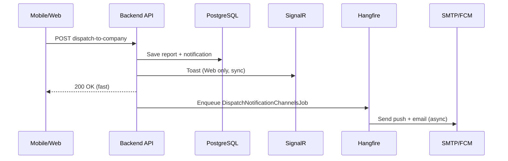

# FE Guide — Async Notifications & Auth OTP Email

> **Phiên bản:** 2026-08-01 · **Backend:** GreenLens API v1 · **Liên quan:** BR-SYS-001, BR-NTF-001..003, BR-AUTH-013

Tài liệu này mô tả thay đổi hành vi backend sau refactor **async notification dispatch** (Phase 1) và **auth OTP email qua Hangfire** (Phase 2). FE/Mobile **không cần đổi contract request** cho hầu hết API — chỉ cần hiểu timing và xử lý edge case mới.

---

## 1. Tóm tắt thay đổi

| Trước | Sau |
|-------|-----|
| API chờ SMTP (~3–6s) + FCM trong cùng HTTP request | API trả về **ngay** sau khi lưu DB (+ SignalR cho Web) |
| Push/email gửi đồng bộ | Push/email gửi **background** (Hangfire), thường trễ 1–5 giây |
| Register fail 500 nếu SMTP lỗi dù user đã tạo | Register **201** khi user+OTP OK; SMTP retry background |
| Không có mã lỗi enqueue email | `EMAIL_DISPATCH_UNAVAILABLE` (503) khi Hangfire enqueue fail |

---

## 2. In-app notifications (Phase 1)

### 2.1 Luồng mới

```
HTTP mutation (verify, dispatch, submit report, …)
  → Backend lưu notification row (PostgreSQL)
  → SignalR toast (Web LEO/DEO/Admin/CM) — vẫn gần như tức thì
  → HTTP response trả về (nhanh, thường < 500ms local)
  → Hangfire job gửi FCM (mobile) + SMTP (email) — async
```

### 2.2 FE cần làm gì

**Web (LEO, DEO, CompanyManager, Admin)**

- Giữ nguyên **SignalR hub** `ReceiveNotification` — toast/badge vẫn hoạt động như cũ ngay khi API success.
- Danh sách notification (`GET /v1/notifications`) có row **ngay** sau API success — không cần polling thêm.
- Email có thể đến **vài giây sau** — không block UI chờ email.

**Mobile (Citizen, Cleaner, Inspector, CompanyStaff)**

- Sau API success, **FCM push có thể trễ 1–5 giây** — bình thường.
- Pull-to-refresh notification list nếu user không thấy push (optional UX).
- Deep link payload FCM không đổi: `notificationId`, `type`, `referenceId` (optional).

### 2.3 API bị ảnh hưởng (TTFB nhanh hơn)

Tất cả endpoint gọi `INotificationService` — ví dụ:

| Nhóm | Endpoints |
|------|-----------|
| Report workflow | `POST /v1/reports`, `PUT …/verify`, `reject`, `resolve`, `POST …/assign`, `dispatch-to-company`, `assign-company-team`, `reassign`, `confirm-duplicate`, `flag`, reopen-requests/* |
| Social | `POST …/comments`, `POST …/community-cleanups` |
| Org | `POST /v1/offices/my/staff`, `POST /v1/invitations/{id}/accept|decline`, company suspend/terminate |
| Inspection | `PUT /v1/inspections/{id}/issue-penalty` |

**Không đổi:** request body, response envelope `{ code, message, status, data }`, status code success.

**Admin test template** (`POST /v1/admin/notification-templates/{id}/test`): email cũng async — admin có thể thấy email vài giây sau; notification row + SignalR vẫn ngay.

---

## 3. Auth OTP email (Phase 2)

### 3.1 Nguyên tắc HTTP vs delivery

Backend tách hai khái niệm:

1. **Business success** — user/OTP đã lưu DB → API success.
2. **Delivery success** — SMTP thực sự gửi email → xử lý background, **không** ảnh hưởng response đã trả.

### 3.2 Bảng hành vi theo endpoint

#### `POST /v1/auth/register`

| Tình huống | HTTP | `code` | FE xử lý |
|------------|------|--------|----------|
| Email trùng, password yếu, … | 4xx | `EMAIL_TAKEN`, … | Hiển thị lỗi validation |
| User + OTP lưu OK, email job enqueued | **201** | `SUCCESS` | Chuyển màn **Nhập OTP** |
| User + OTP lưu OK, **enqueue fail** | **503** | `EMAIL_DISPATCH_UNAVAILABLE` | Xem mục 3.4 |
| SMTP fail **sau** 201 | *(không đổi)* | — | User không nhận mail → **Gửi lại OTP** |

Response success (201) — không đổi shape:

```json
{
  "code": "SUCCESS",
  "message": "Created",
  "status": 201,
  "data": {
    "userId": "uuid",
    "email": "user@example.com",
    "message": "Đăng ký thành công. Mã OTP đã được gửi đến email của bạn."
  }
}
```

#### `POST /v1/auth/request-otp`

| Tình huống | HTTP | `code` |
|------------|------|--------|
| User không tồn tại | 404 | `NOT_FOUND` |
| OTP mới + enqueue OK | 200 | `SUCCESS` |
| OTP lưu OK, enqueue fail | **503** | `EMAIL_DISPATCH_UNAVAILABLE` |

Body request không đổi (`email`, `purpose`).

#### `POST /v1/auth/forgot-password`

| Tình huống | HTTP | Ghi chú |
|------------|------|---------|
| Mọi trường hợp | **200** | Anti-enumeration — message chung |

```json
{
  "code": "SUCCESS",
  "message": "OK",
  "status": 200,
  "data": {
    "message": "Nếu email tồn tại, mã OTP sẽ được gửi."
  }
}
```

Kể cả enqueue fail hoặc SMTP fail sau đó — **vẫn 200**. Chỉ log phía server.

#### `POST /v1/auth/verify-otp`, `POST /v1/auth/reset-password`

**Không đổi** — vẫn verify OTP hash trong DB.

---

## 4. FE implementation checklist — Auth

### 4.1 Màn đăng ký → xác thực OTP

- [ ] Sau **201 register**: navigate tới OTP screen (giữ email trong state).
- [ ] Hiển thị copy: *"Mã OTP đã được gửi…"* — email có thể đến trễ vài giây.
- [ ] Nút **「Không nhận được email? Gửi lại」** → `POST /v1/auth/request-otp` với `purpose: "EmailVerification"`.
- [ ] Cooldown resend (khuyến nghị 60s) — phía client, tránh spam.

### 4.2 Xử lý `EMAIL_DISPATCH_UNAVAILABLE` (503)

Account **đã được tạo** / OTP **đã lưu** — không bắt user đăng ký lại (sẽ 409 `EMAIL_TAKEN`).

**UX đề xuất:**

```
Tiêu đề: Không gửi được email tạm thời
Nội dung: Tài khoản đã được tạo. Vui lòng bấm "Gửi lại mã" để nhận OTP qua email.
Primary: Gửi lại mã OTP  → POST /request-otp
Secondary: Thử lại sau
```

Vẫn cho phép vào màn nhập OTP nếu user biết mã từ nguồn khác (edge case).

### 4.3 Quên mật khẩu

- [ ] Luôn hiển thị message success chung sau submit — **không** phân biệt email có tồn tại.
- [ ] Nút resend OTP trên màn reset password → cùng endpoint `forgot-password` hoặc `request-otp` với `PasswordReset` (nếu product cho phép).

### 4.4 Không cần làm

- ❌ Polling trạng thái "email đã gửi chưa" — backend không có webhook delivery MVP.
- ❌ Rollback UI register khi chỉ SMTP background fail (API đã 201).
- ❌ Hiển thị lỗi SMTP chi tiết cho user.

---

## 5. Timing kỳ vọng (QA)

| Thao tác | TTFB API (local dev) | Push/Email |
|----------|----------------------|------------|
| `dispatch-to-company` | < 500ms (trước ~6s) | Email CM +1–5s |
| `POST /reports` | < 1s | FCM/email background |
| `POST /auth/register` | < 300ms | OTP email +1–5s |
| SignalR toast (Web) | Ngay sau API OK | — |

---

## 6. Error code mới

| Code | HTTP | Ý nghĩa | Áp dụng |
|------|------|---------|---------|
| `EMAIL_DISPATCH_UNAVAILABLE` | **503** | Hangfire không enqueue được job email (hạ tầng) | `register`, `request-otp` |

Envelope lỗi chuẩn RFC 7807-style:

```json
{
  "code": "EMAIL_DISPATCH_UNAVAILABLE",
  "message": "Tạm thời không thể gửi email. Vui lòng thử 'Gửi lại mã OTP' sau vài phút.",
  "status": 503,
  "data": null
}
```

---

## 7. Kiến trúc (tham khảo — không bắt buộc cho FE)



Auth OTP tương tự với `SendAuthEmailJob` thay vì notification job.

---

## 8. Migration DB (DevOps)

Migration mới: `push_dispatched_at`, `email_dispatched_at` trên bảng `notifications` (idempotency Hangfire retry).

```bash
dotnet ef database update --project src/Greenlens.Infrastructure --startup-project src/Greenlens.Api
```

Hangfire server phải **chạy cùng API** (đã cấu hình trong `Program.cs`) — nếu tắt Hangfire, notification/email sẽ không gửi dù API success.

---

## 9. Dev local — tắt SMTP

Set `Smtp:Enabled: false` trong user-secrets hoặc env → backend dùng `NoOpEmailSender` (log only, không gửi mail). OTP vẫn lưu DB — FE test verify bằng cách đọc log hoặc DB dev.

---

## 10. Liên hệ / câu hỏi thường gặp

**Q: API success nhưng không nhận email/push?**  
A: Kiểm tra Hangfire dashboard (`/hangfire`), SMTP config, FCM token. User Auth: dùng **Gửi lại OTP**.

**Q: Register trả 503 — user có tồn tại không?**  
A: Có — gọi `request-otp`, không register lại.

**Q: Forgot-password luôn 200 dù email sai?**  
A: Đúng — anti-enumeration by design.

---

**File liên quan backend:**  
`NotificationService.cs`, `DispatchNotificationChannelsJob.cs`, `SendAuthEmailJob.cs`, `RegisterCommandHandler.cs`, `RequestOtpCommandHandler.cs`, `ForgotPasswordCommandHandler.cs`
