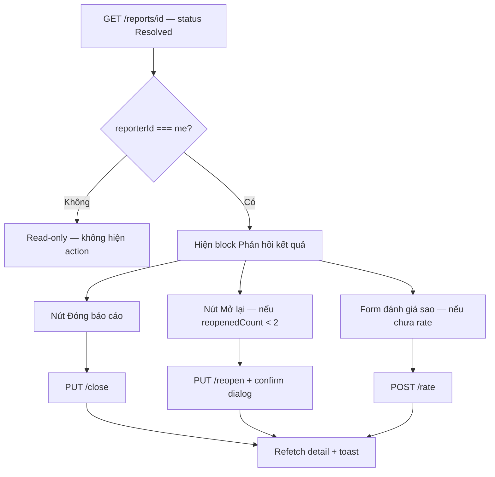

# FE — Citizen Satisfaction & Post-Resolution API Guide

> **Prefix:** `/v1` · **Envelope:** `{ code, message, status, data }`  
> **Business rules:** BR-REP-015 (xác nhận), BR-REP-016 (auto-close), BR-REP-018 (đánh giá)  
> **Liên quan:** [`fe-citizen-map-report-detail.md`](../fe-citizen-map-report-detail.md), [`fe-citizen-reports-tab-detail.md`](../fe-citizen-reports-tab-detail.md), [`fe-comments-api-guide.md`](./fe-comments-api-guide.md)

---

## 1. Tổng quan

Sau khi báo cáo được xử lý xong (`Resolved`), Citizen có **hai luồng độc lập**:

| Luồng | Mục đích | API | Ảnh hưởng status |
|-------|----------|-----|------------------|
| **Xác nhận kết quả** | Hài lòng → đóng; không hài lòng → mở lại | `PUT /close`, `PUT /reopen` | Có (`Resolved` → `Closed` / `InProgress`) |
| **Đánh giá chất lượng** | Sao + nhận xét (analytics) | `POST /rate` | Không — lưu vào `report_satisfactions` |

Thêm: hệ thống **tự đóng** sau 7 ngày không phản hồi (`AutoCloseResolvedReportJob`, BR-REP-016). Citizen vẫn có thể **đánh giá** khi status đã `Closed`.

**Giao tiếp tại địa điểm** (bình luận công khai) dùng Comments module — xem [`fe-comments-api-guide.md`](./fe-comments-api-guide.md).

---

## 2. Endpoint tóm tắt

| Endpoint | Method | Auth | BR | Mô tả |
|----------|--------|------|-----|--------|
| `/v1/reports/{id}/close` | PUT | Bearer (reporter) | BR-REP-015 | Xác nhận hài lòng → `Closed` |
| `/v1/reports/{id}/reopen` | PUT | Bearer (reporter) | BR-REP-015 | Chưa hài lòng → `InProgress` (max 2 lần, 7 ngày) |
| `/v1/reports/{id}/rate` | POST | Bearer (reporter) | BR-REP-018 | Đánh giá 1–5 sao + comment (1 lần/report) |

Tất cả yêu cầu role đăng nhập (`Citizen`+). Server kiểm tra `reporterId === currentUser.id`.

---

## 3. Đánh giá chất lượng — `POST /v1/reports/{id}/rate`

### Request

```http
POST /v1/reports/{id}/rate
Authorization: Bearer {token}
Content-Type: application/json
```

```json
{
  "isSatisfied": true,
  "rating": 5,
  "comment": "Đội dọn dẹp xử lý nhanh, khu vực sạch sẽ."
}
```

| Field | Type | Bắt buộc | Rule |
|-------|------|----------|------|
| `isSatisfied` | boolean | Có | `true` = hài lòng, `false` = không hài lòng |
| `rating` | int? | Không | 1–5 sao (nếu gửi) |
| `comment` | string? | Không | Tối đa 500 ký tự |

### Response 200

```json
{
  "code": "SUCCESS",
  "message": "Thành công",
  "status": 200,
  "data": {
    "satisfactionId": "3fa85f64-5717-4562-b3fc-2c963f66afa6"
  }
}
```

### Điều kiện BE

- `status` ∈ `{ Resolved, Closed }`
- Chỉ **người gửi báo cáo** (`reporterId`)
- **Một lần duy nhất** mỗi report/user

### Lỗi thường gặp

| `code` | HTTP | Khi nào |
|--------|------|---------|
| `REPORT_NOT_FOUND` | 404 | ID không tồn tại hoặc báo cáo bị ẩn |
| `NOT_REPORT_OWNER` | 403 | User không phải người gửi |
| `INVALID_STATUS_TRANSITION` | 422 | Status không phải `Resolved` / `Closed` |
| `ALREADY_RATED` | 409 | Đã đánh giá rồi |
| `VALIDATION_ERROR` | 400 | `rating` ngoài 1–5 hoặc `comment` > 500 ký tự |

> **Lưu ý:** `isSatisfied: false` **không** tự động mở lại báo cáo. FE cần gọi riêng `PUT /reopen` nếu citizen muốn xử lý lại.

---

## 4. Xác nhận hài lòng — `PUT /v1/reports/{id}/close`

```http
PUT /v1/reports/{id}/close
Authorization: Bearer {token}
```

Không có body. Response envelope `200` với `message: "Đã đóng báo cáo."`, `data: null`.

| Điều kiện | Giá trị |
|-----------|---------|
| Status hiện tại | Chỉ `Resolved` |
| Actor | Reporter |

| `code` | HTTP |
|--------|------|
| `INVALID_STATUS_TRANSITION` | 422 |
| `NOT_REPORT_OWNER` | 403 |

---

## 5. Mở lại báo cáo — `PUT /v1/reports/{id}/reopen`

```http
PUT /v1/reports/{id}/reopen
Authorization: Bearer {token}
```

Không có body (không gửi `reason` — BR hiện tại không yêu cầu lý do reopen). Response `200`, `message: "Đã mở lại báo cáo."`.

| Điều kiện | Giá trị |
|-----------|---------|
| Status | `Resolved` |
| Cửa sổ thời gian | ≤ 7 ngày kể từ `resolvedAt` |
| Số lần | `reopenedCount < 2` (tối đa 2 lần) |
| Actor | Reporter |

| `code` | HTTP | Message gợi ý FE |
|--------|------|------------------|
| `REOPEN_LIMIT_REACHED` | 422 | "Đã hết số lần mở lại (tối đa 2 lần)." |
| `REOPEN_WINDOW_EXPIRED` | 422 | "Đã quá 7 ngày kể từ khi báo cáo được giải quyết." |
| `INVALID_STATUS_TRANSITION` | 422 | Status không phải `Resolved` |
| `NOT_REPORT_OWNER` | 403 | — |

Sau reopen thành công: `status` → `InProgress`, `reopenedCount` tăng 1.

---

## 6. Luồng UX đề xuất (Mobile / Web)



### Khi nào hiện UI gì?

| `status` | Owner? | UI gợi ý |
|----------|--------|----------|
| `Resolved` | Có | **Đóng** + **Mở lại** (nếu `reopenedCount < 2` và trong 7 ngày từ `resolvedAt`) + **Đánh giá** |
| `Closed` | Có | Chỉ **Đánh giá** (nếu chưa rate) — không còn Đóng/Mở lại |
| Khác | Có | Không hiện block satisfaction |
| Bất kỳ | Không | Read-only |

### Copy gợi ý

| Action | Confirm message |
|--------|-----------------|
| Đóng | "Xác nhận bạn hài lòng với kết quả xử lý? Báo cáo sẽ được đóng." |
| Mở lại | "Báo cáo sẽ được gửi xử lý lại. Bạn còn {2 - reopenedCount} lần mở lại." |
| Đánh giá | "Cảm ơn phản hồi của bạn! Mỗi báo cáo chỉ đánh giá được một lần." |

### Dữ liệu từ `GET /v1/reports/{id}`

Response hiện có các field hữu ích:

| Field | Dùng cho |
|-------|----------|
| `reporterId` | So sánh với `currentUser.id` |
| `status` | Bật/tắt action |
| `reopenedCount` | Ẩn nút Mở lại khi `>= 2` |
| `resolvedAt` | Tính còn bao nhiêu ngày trong cửa sổ 7 ngày |
| `closedAt` | Hiển thị "Đã đóng …" |
| `satisfaction` | Feedback của reporter (nếu đã rate): `isSatisfied`, `rating`, `comment`, `ratedAt` |
| `hasCurrentUserRated` | Ẩn form rate khi `true` |

> **Cập nhật 2026-07-17:** `GET /reports/{id}` **đã trả** `satisfaction` + `hasCurrentUserRated`.
> Handoff full Citizen + Team: [`mobile-citizen-and-cleanup-handoff.md`](../mobile-citizen-and-cleanup-handoff.md).

---

## 7. Auto-close 7 ngày (BR-REP-016)

- Job nền chạy định kỳ: `Resolved` quá 7 ngày không có `close`/`reopen` → tự `Closed`
- Citizen **không** bấm gì — nhận notification `ReportAutoClosed` (nếu đã bật push)
- Sau auto-close: vẫn có thể `POST /rate` trong trạng thái `Closed`

FE: nếu user mở báo cáo đã `Closed` mà chưa đánh giá → vẫn hiện form rating.

---

## 8. Tích hợp với tab Báo cáo & Map

| Màn hình | Tài liệu | Ghi chú |
|----------|----------|---------|
| Map pin → Chi tiết | [`fe-citizen-map-report-detail.md`](../fe-citizen-map-report-detail.md) | Block action khi `Resolved`/`Closed` |
| Tab Báo cáo → `/my` → Chi tiết | [`fe-citizen-reports-tab-detail.md`](../fe-citizen-reports-tab-detail.md) | Cùng API, refetch list sau close/reopen |
| Bình luận tại địa điểm | [`fe-comments-api-guide.md`](./fe-comments-api-guide.md) | Tách khỏi satisfaction |

Sau `close` / `reopen` / `rate` thành công: **refetch** `GET /reports/{id}` và invalidate cache list `/my`.

---

## 9. Test cases (QA / FE)

| # | Scenario | Expected |
|---|----------|----------|
| 1 | Owner, `Resolved`, POST rate lần 1 | 200 + `satisfactionId` |
| 2 | Owner, `Resolved`, POST rate lần 2 | 409 `ALREADY_RATED` |
| 3 | Owner, `InProgress`, POST rate | 422 `INVALID_STATUS_TRANSITION` |
| 4 | User khác, POST rate | 403 `NOT_REPORT_OWNER` |
| 5 | Owner, `Resolved`, PUT close | 200 → status `Closed` |
| 6 | Owner, `Closed`, PUT close | 422 |
| 7 | Owner, `Resolved`, PUT reopen (lần 1) | 200 → `InProgress`, `reopenedCount` = 1 |
| 8 | Owner, `reopenedCount` = 2, PUT reopen | 422 `REOPEN_LIMIT_REACHED` |
| 9 | Owner, `resolvedAt` > 7 ngày, PUT reopen | 422 `REOPEN_WINDOW_EXPIRED` |
| 10 | Owner, `Closed` (auto-close), POST rate | 200 — vẫn rate được |
| 11 | `rating: 0` hoặc `6` | 400 validation |
| 12 | `isSatisfied: false` + không gọi reopen | Status không đổi |

---

## 10. Backlog BE (không chặn FE phase 1)

| Item | Mô tả | Status |
|------|--------|--------|
| `satisfaction` trong `GET /reports/{id}` | `{ hasCurrentUserRated, satisfaction }` | ✅ Done (2026-07) |
| Unique index DB `(report_id, user_id)` | Chống double-submit race | Pending |
| Profanity filter trên `comment` rate | Đồng bộ với BR-REP-004 / blocked words | Pending |

---

**Phiên bản:** 1.0 — 2026-07-15  
**Backend:** `RateReport/`, `CloseReport/`, `ReopenReport/` · `ReportsController` · `ReportSatisfaction` entity
