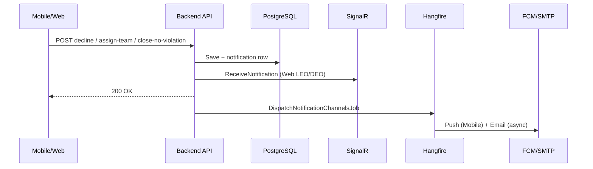

# FE Guide — Inspection Workflow Notifications

> **Phiên bản:** 2026-08-04 · **Backend:** GreenLens API v1 · **Branch:** `develop`  
> **Business rules:** BR-INS-001, BR-INS-013, BR-INS-021, BR-INS-030, BR-NTF-002  
> **Audience:** LEO/DEO Web · Inspector Mobile · Citizen Mobile  
> **Liên quan:** [`fe-leo-inspection-workflow-guide.md`](./fe-leo-inspection-workflow-guide.md) · [`fe-async-notifications-auth-otp-guide.md`](./fe-async-notifications-auth-otp-guide.md) · [`../fe-inspection-api-guide.md`](../fe-inspection-api-guide.md)

Tài liệu mô tả **4 loại notification mới** (seed template tiếng Việt) trong luồng **Inspection / xử phạt**, cách đọc qua `GET /v1/notifications`, SignalR, FCM và gợi ý **deep link** theo từng app.

---

## 1. Tóm tắt nhanh

| `type` (JSON) | Ai nhận | App | Khi nào gửi |
|---------------|---------|-----|-------------|
| `InspectionTaskAssigned` | Mọi thành viên **active** của Inspection Team | **Inspector Mobile** | LEO gán team lúc tạo hồ sơ hoặc `assign-team` |
| `InspectionTaskDeclined` | LEO tạo hồ sơ (`CreatedByOfficerId`) | **LEO Web** | Inspector team leader `decline` (Draft, trong 24h) |
| `InspectionClosedNoViolation` | Citizen **reporter** (`Report.ReporterId`) | **Citizen Mobile** | Inspector `close-no-violation` **hoặc** job SLA auto-close |
| `PenaltyPaymentOverdue` | LEO phường + DEO sở + LEO tạo hồ sơ | **LEO Web**, **DEO Web** | Job hàng giờ khi quá `penaltyDueDate` |

**Chung cho cả 4 loại:**

- `referenceId` = **`reportId`** (Guid báo cáo umbrella), **không** phải `inspectionId`.
- `GET /v1/notifications` enrich thêm `categoryName`, `thumbnailUrl` (cùng pattern report-linked khác).
- Push FCM / email **async** 1–5 giây sau khi row lưu DB — xem [`fe-async-notifications-auth-otp-guide.md`](./fe-async-notifications-auth-otp-guide.md).
- Báo cáo **ẩn danh** (`ReporterId` null): **không** gửi `InspectionClosedNoViolation`.

---

## 2. API đọc notification

### 2.1 Danh sách

```http
GET /v1/notifications?page=1&pageSize=20&isRead=false
Authorization: Bearer {token}
```

**Envelope item** (rút gọn):

```json
{
  "code": "SUCCESS",
  "status": 200,
  "data": {
    "items": [
      {
        "id": "a1b2c3d4-e5f6-7890-abcd-ef1234567890",
        "type": "InspectionTaskAssigned",
        "title": "Nhiệm vụ thanh tra mới",
        "message": "Báo cáo R-2026-0042 tại Phường Bến Nghé vừa được giao cho đội Thanh tra Môi trường 1. Vui lòng kiểm tra hàng đợi nhiệm vụ thanh tra.",
        "referenceId": "f47ac10b-58cc-4372-a567-0e02b2c3d479",
        "isRead": false,
        "readAt": null,
        "createdAt": "2026-08-04T10:15:00Z",
        "categoryName": "Rác thải sinh hoạt",
        "thumbnailUrl": "https://cdn.example.com/reports/thumb.jpg"
      }
    ],
    "totalCount": 12,
    "unreadCount": 3
  }
}
```

**Enum `type`:** string PascalCase (`JsonStringEnumConverter`) — ví dụ `"InspectionTaskDeclined"`, không phải snake_case.

### 2.2 Đánh dấu đã đọc

```http
PUT /v1/notifications/{id}/read
PUT /v1/notifications/read-all
```

### 2.3 SignalR (Web)

Hub: `/hubs/notifications` · event: `ReceiveNotification`

Payload (camelCase khi serialize JSON):

| Field | Kiểu | Ghi chú |
|-------|------|---------|
| `id` | Guid | Notification row id |
| `type` | string | Cùng enum như REST |
| `title` | string | Đã render template |
| `message` | string | Đã render template |
| `referenceId` | Guid? | `reportId` |
| `createdAt` | datetime | UTC |

Toast/badge Web nhận **ngay** khi mutation API success (trước FCM).

### 2.4 FCM data payload (Mobile)

Hangfire job gửi kèm `data`:

| Key | Ví dụ |
|-----|--------|
| `notificationId` | `a1b2c3d4-...` |
| `type` | `InspectionTaskAssigned` |
| `referenceId` | `f47ac10b-...` (optional nếu có) |

Title/body push = `title` / `message` đã render tiếng Việt (theo `Accept-Language`, mặc định `vi-VN`).

---

## 3. Ma trận chi tiết theo loại

### 3.1 `InspectionTaskAssigned`

| | |
|--|--|
| **Template key** | `inspection_task_assigned` |
| **Người nhận** | User id của mọi **active member** team được gán |
| **Trigger API** | `POST /v1/reports/{reportId}/inspections` (body có `assignedTeamId`) · `PUT /v1/inspections/{id}/assign-team` |
| **Không gửi khi** | Tạo hồ sơ **không** gán team; team không có member active; team id không tồn tại |

**Title (vi):** `Nhiệm vụ thanh tra mới`

**Body (vi):** `Báo cáo {report_code} tại {ward_name} vừa được giao cho đội {team_name}. Vui lòng kiểm tra hàng đợi nhiệm vụ thanh tra.`

| Placeholder | Nguồn |
|-------------|--------|
| `{report_code}` | `Report.Code` |
| `{team_name}` | Tên Environmental Team |
| `{ward_name}` | Enrich từ report → ward (có thể rỗng nếu thiếu địa phương) |

**FE Inspector Mobile — deep link gợi ý:**

1. Tap notification → màn **Hàng đợi thanh tra** (`GET /v1/inspections/queue`), highlight item có `reportId === referenceId`.
2. Hoặc gọi `GET /v1/reports/{referenceId}/inspections` → lấy `inspectionId` active → `GET /v1/inspections/{id}`.

**UI:** Badge tab queue; banner “Nhiệm vụ mới” trên Draft tasks.

---

### 3.2 `InspectionTaskDeclined`

| | |
|--|--|
| **Template key** | `inspection_task_declined` |
| **Người nhận** | LEO đã tạo hồ sơ (`InspectionReport.CreatedByOfficerId`) |
| **Trigger API** | `POST /v1/inspections/{id}/decline` (team leader, Draft, lý do ≥20 ký tự, trong 24h kể từ tạo) |
| **Hậu quả nghiệp vụ** | Team bị clear; hồ sơ về Draft chờ LEO **re-gán** |

**Title (vi):** `Đội thanh tra từ chối nhiệm vụ`

**Body (vi):** `Đội thanh tra đã từ chối hồ sơ xử phạt liên quan báo cáo {report_code} tại {ward_name}. Lý do: {decline_reason}. Vui lòng gán lại đội khác.`

| Placeholder | Nguồn |
|-------------|--------|
| `{report_code}` | Report |
| `{ward_name}` | Enrich locality |
| `{decline_reason}` | Body `reason` từ API decline (plain text, đã trim) |

**FE LEO Web — deep link gợi ý:**

1. Toast + badge notification.
2. Navigate → **Hàng đợi xử phạt** `GET /v1/inspections/officer-queue?search={report_code}` hoặc tab **Hồ sơ xử phạt** trên Report detail.
3. Hiển thị CTA **Đổi đội thanh tra** → `PUT /v1/inspections/{id}/assign-team` (prefill report từ `referenceId`).

**Checklist LEO:** Mục “Alert khi team decline → prompt re-gán” trong [`fe-leo-inspection-workflow-guide.md`](./fe-leo-inspection-workflow-guide.md) §11.

---

### 3.3 `InspectionClosedNoViolation`

| | |
|--|--|
| **Template key** | `inspection_closed_no_violation` |
| **Người nhận** | Citizen reporter (`Report.ReporterId`) |
| **Trigger** | (1) `PUT /v1/inspections/{id}/close-no-violation` · (2) `SlaBreachInspectionJob` auto `ForceCloseNoViolation` (BR-INS-030) |

**Title (vi):** `Kết luận không phát hiện vi phạm`

**Body (vi):** `Hồ sơ xử phạt liên quan báo cáo {report_code} đã được kết luận không đủ căn cứ xử phạt. Lý do: {reason}`

| Placeholder | Nguồn |
|-------------|--------|
| `{report_code}` | Report |
| `{reason}` | Lý do Inspector nhập **hoặc** chuỗi cố định SLA (xem bên dưới) |

**Lý do SLA (job, không do Inspector nhập):**

```text
Hết hạn SLA điều tra theo BR-INS-030. Hệ thống tự động đóng hồ sơ vì Inspection Team chưa ban hành kết luận xử phạt hoặc biên bản không vi phạm trong thời hạn quy định.
```

Citizen có thể nhận notification này **cùng lúc** LEO nhận `SlaInspectionBreached` (loại **khác**, cùng `referenceId`) — đó là expected.

**FE Citizen Mobile — deep link:**

- Tap → **Chi tiết báo cáo** `GET /v1/reports/{referenceId}`.
- Tab trạng thái: inspection sub-process `ClosedNoViolation`; umbrella report có thể vẫn `InProgress` nếu nhánh dọn dẹp chưa xong.

**Lưu ý copy UX:** Giải thích ngắn “Thanh tra kết luận không đủ căn cứ xử phạt” — **không** đồng nghĩa báo cáo umbrella đã `Closed`.

---

### 3.4 `PenaltyPaymentOverdue`

| | |
|--|--|
| **Template key** | `penalty_payment_overdue` |
| **Người nhận** | LEO tạo hồ sơ + mọi LEO thuộc `AssignedOfficeId` + mọi DEO thuộc `AssignedDepartmentId` |
| **Trigger** | `PenaltyPaymentOverdueJob` (Hangfire, **mỗi giờ**) |
| **Điều kiện** | `InspectionStatus` = `PenaltyIssued` hoặc `PartiallyPaid`, `penaltyDueDate <= now` → chuyển `Overdue` |

**Title (vi):** `Quá hạn nộp phạt`

**Body (vi):** `Hồ sơ xử phạt liên quan báo cáo {report_code} tại {ward_name} đã quá hạn nộp phạt (quyết định số {decision_number}). Vui lòng phối hợp xử lý.`

| Placeholder | Nguồn |
|-------------|--------|
| `{report_code}` | Report |
| `{ward_name}` | Enrich locality |
| `{decision_number}` | `PenaltyDecisionNumber` hoặc `"chưa có"` |

**FE LEO / DEO Web:**

- Filter officer queue: `GET /v1/inspections/officer-queue?status=Overdue`.
- Deep link từ notification → inspection detail qua `GET /v1/reports/{referenceId}/inspections` hoặc search `report_code` trên officer-queue.
- Badge “Quá hạn nộp phạt” trên dashboard KPI.

**Dedup:** Job chỉ notify khi lần đầu transition sang `Overdue` trong run đó; FE không cần dedup thêm trừ khi user pull refresh list.

---

## 4. Luồng thời gian (timing)



**Job-only** (`PenaltyPaymentOverdue`, SLA auto-close citizen notify): không có HTTP từ client — notification xuất hiện khi job chạy (30 phút / 1 giờ).

---

## 5. Phân vai FE — checklist

### Inspector Mobile

- [ ] Map `type === "InspectionTaskAssigned"` → queue / detail inspection.
- [ ] List item dùng `categoryName`, `thumbnailUrl` nếu có.
- [ ] FCM tap handler đọc `referenceId` (reportId) + resolve inspection id.
- [ ] Không xử lý `InspectionTaskDeclined` / `PenaltyPaymentOverdue` (role Inspector không nhận).

### LEO Web

- [ ] Map `InspectionTaskDeclined` → officer-queue + modal re-assign team.
- [ ] Map `PenaltyPaymentOverdue` → filter `status=Overdue` + inspection detail.
- [ ] SignalR toast với action “Xem hồ sơ”.
- [ ] Phân biệt với `SlaInspectionBreached` (cùng luồng SLA, copy khác).

### DEO Web

- [ ] Chỉ `PenaltyPaymentOverdue` trong 4 loại mới (read-only giám sát).
- [ ] Deep link officer-queue scope sở (`GET /v1/inspections/officer-queue`).

### Citizen Mobile

- [ ] Map `InspectionClosedNoViolation` → report detail `{referenceId}`.
- [ ] Hiển thị `message` (có lý do dài từ SLA) — cho phép expand/collapse.
- [ ] Anonymous report: không expect notification loại này.

---

## 6. Endpoints mutation liên quan (không đổi contract)

| Method | Endpoint | Notification |
|--------|----------|--------------|
| POST | `/v1/reports/{reportId}/inspections` | `InspectionTaskAssigned` nếu có `assignedTeamId` |
| PUT | `/v1/inspections/{id}/assign-team` | `InspectionTaskAssigned` |
| POST | `/v1/inspections/{id}/decline` | `InspectionTaskDeclined` |
| PUT | `/v1/inspections/{id}/close-no-violation` | `InspectionClosedNoViolation` |

Request/response envelope **không đổi** so với guide inspection hiện có — chỉ thêm side-effect notification.

---

## 7. Loại notification inspection **khác** (đã có trước)

Để tránh nhầm enum khi implement filter:

| `type` | Ai nhận | Khác biệt |
|--------|---------|-----------|
| `SlaInspectionBreached` | LEO tạo hồ sơ | SLA hết hạn, **chưa** mô tả kết luận citizen |
| `PenaltyIssued` | (nếu bật) | Sau ban hành QĐ — khác overdue |
| `InspectionClosedNoViolation` | **Citizen** | Kết luận không vi phạm |

---

## 8. Test local

1. Seed templates: chạy migration + seeder (dev startup) — key `inspection_task_assigned`, `inspection_task_declined`, `inspection_closed_no_violation`, `penalty_payment_overdue`.
2. Hangfire phải chạy cùng API — nếu không, in-app list vẫn có row nhưng không push.
3. **Decline flow:** Inspector decline → login LEO → `GET /v1/notifications` thấy `InspectionTaskDeclined`.
4. **Assign flow:** LEO assign-team → login Inspector member → `InspectionTaskAssigned`.
5. **Overdue:** set `penalty_due_date` trong quá khứ + status `PenaltyIssued` → đợi job hoặc trigger manual Hangfire `PenaltyPaymentOverdueJob`.

Tài khoản seed: [`SEED_ACCOUNTS.md`](./SEED_ACCOUNTS.md).

---

## 9. Tài liệu liên quan

| File | Nội dung |
|------|----------|
| [`fe-leo-inspection-workflow-guide.md`](./fe-leo-inspection-workflow-guide.md) | Luồng LEO end-to-end, officer-queue |
| [`fe-inspection-checklist-guide.md`](./fe-inspection-checklist-guide.md) | Inspector accept/decline/close-no-violation |
| [`fe-async-notifications-auth-otp-guide.md`](./fe-async-notifications-auth-otp-guide.md) | Async FCM/email, SignalR |
| [`../fe-inspection-api-guide.md`](../fe-inspection-api-guide.md) | API Inspector queue & detail |
| [`../API_COVERAGE_CHECKLIST.md`](../API_COVERAGE_CHECKLIST.md) | §6 Inspector, §8 LEO inspection |

---

**Cập nhật:** 2026-08-04 · 4 notification types Sprint inspection workflow + template VI 100%.
