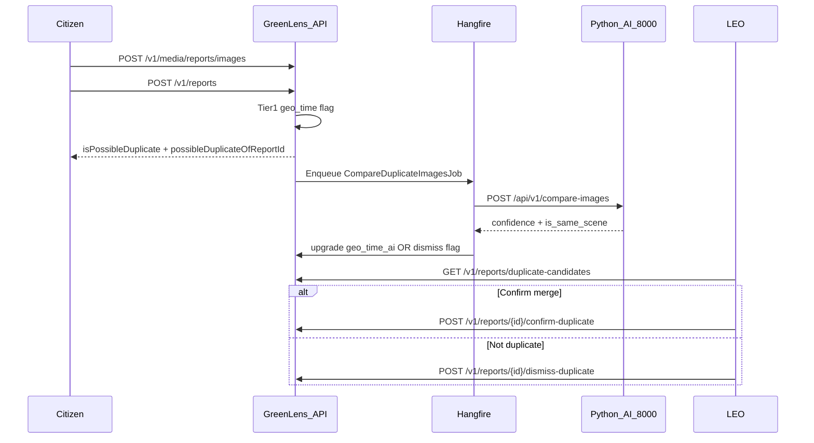

# LEO — Duplicate Detection API Guide (Web Dashboard)

> **Prefix:** `/v1` · **Envelope:** `{ code, message, status, data }`  
> **Controller:** `ReportsController` · **Roles LEO:** `LEO`, `DEO`, `Admin`  
> **Business rules:** BR-REP-030..033, BR-AI-002, BR-AI-006  
> **Seed QA:** `leo.27145@greenlens.dev` / `Officer@123` — xem [`SEED_ACCOUNTS.md`](./SEED_ACCOUNTS.md)

---

## 1. Tổng quan

Hệ thống phát hiện báo cáo trùng lặp theo **2 tầng**:

| Tầng | Khi nào | Cơ chế | FE cần làm gì |
|------|---------|--------|----------------|
| **Tier 1** | Ngay khi Citizen submit | Geo ≤50m + cùng category + ≤24h | Citizen app đọc `isPossibleDuplicate` trong response submit |
| **Tier 2** | Nền (Hangfire, ~5–15s) | Python AI `POST /api/v1/compare-images` (DINOv2) | **LEO không gọi AI** — chỉ đọc `duplicateDetectionSource` + `aiSimilarityScore` |
| **LEO review** | Sau Tier 1/2 | 3 API dưới đây | Queue "Nghi ngờ trùng" trên LEO Dashboard |



**Quan trọng:** LEO **không** gọi Python AI (`localhost:8000`). Backend tự gọi qua Hangfire; LEO chỉ xem kết quả trên queue.

---

## 2. Citizen context (ngữ cảnh end-to-end)

Các bước Citizen **đi trước** queue LEO. FE LEO nên hiểu để debug và hiển thị badge nguồn phát hiện.

### 2.1 Upload ảnh — `POST /v1/media/reports/images`

**Auth:** Bearer (Citizen) · **Content-Type:** `multipart/form-data`

| Field | Rule |
|-------|------|
| `file` | jpg / png / webp / heic, max 10MB |

**Response 200 `data`:**

```json
{
  "url": "https://pub-xxx.r2.dev/reports/images/abc_IMG_0536.HEIC",
  "key": "reports/images/abc_IMG_0536.HEIC",
  "message": "Tải ảnh báo cáo thành công.",
  "mimeType": "image/heic",
  "sizeBytes": 4713854
}
```

Dùng `url`, `mimeType`, `sizeBytes` khi submit báo cáo (manual flow).

### 2.2 Submit báo cáo — `POST /v1/reports`

**Auth:** Bearer (Citizen)

**Body (manual flow — ảnh đã upload):**

```json
{
  "categoryId": "e9acbc04-45cd-4dba-91f8-5e700c855516",
  "severity": "Medium",
  "description": "Mô tả ô nhiễm",
  "latitude": 10.77691,
  "longitude": 106.70091,
  "address": "Địa chỉ",
  "wardCode": "27145",
  "provinceCode": "79",
  "tempImageId": null,
  "images": [
    {
      "url": "https://pub-xxx.r2.dev/reports/images/abc_IMG_0536.HEIC",
      "mimeType": "image/heic",
      "sizeBytes": 4713854
    }
  ],
  "wasteTagIds": null
}
```

**Response 201 `data` — fields liên quan duplicate:**

```json
{
  "id": "49b8f7c9-4e19-460f-ac7d-f139d2d454e7",
  "code": "RPT-260714-40DD21",
  "status": "Submitted",
  "isPossibleDuplicate": true,
  "possibleDuplicateOfReportId": "f22137c2-7977-42ed-a0e4-4d52e7185954",
  "images": [ { "id": "...", "url": "...", "mimeType": "image/heic", "sizeBytes": 4713854 } ]
}
```

- `isPossibleDuplicate: true` → Tier 1 đã flag; item sẽ xuất hiện trên queue LEO sau vài giây (Tier 2 có thể cập nhật thêm).
- Citizen app có thể hiển thị banner: *"Báo cáo có thể trùng với báo cáo gần đây — đang chờ cán bộ xem xét."*

### 2.3 Citizen flag (khác auto duplicate) — `POST /v1/reports/{id}/flag`

**Auth:** Bearer (Citizen) · **BR-REP-033**

```json
{
  "type": "Duplicate",
  "reason": "Trùng với báo cáo bên cạnh"
}
```

| `type` | Ý nghĩa |
|--------|---------|
| `Duplicate` | Nghi trùng |
| `Invalid` | Không hợp lệ |
| `Spam` | Spam |
| `Inappropriate` | Nội dung không phù hợp |

≥ 3 citizen flag **cùng loại** → notify LEO. Luồng này **độc lập** với Tier 1/2 tự động.

---

## 3. `duplicateDetectionSource` — badge UI

| Value | Badge gợi ý | Ý nghĩa |
|-------|-------------|---------|
| `geo_time` | "Vị trí + thời gian" | Tier 1: ≤50m, cùng category, ≤24h. Tier 2 chưa xác nhận hoặc AI timeout |
| `geo_time_ai` | "AI xác nhận" + score % | Tier 1 + AI `is_same_scene: true`. Hiển thị `aiSimilarityScore` (0–1 → nhân 100%) |
| `null` | — | Không nghi ngờ / LEO đã dismiss / AI dismiss (khác cảnh) |

**Lưu ý Tier 2:**

- AI timeout hoặc service down → giữ `geo_time` (LEO vẫn review được).
- AI trả `is_same_scene: false` → cờ tự **dismiss**, item **biến mất** khỏi queue (không cần LEO dismiss).

---

## 4. API LEO — Danh sách nghi ngờ trùng

### `GET /v1/reports/duplicate-candidates`

**Auth:** Bearer · Roles: `LEO`, `DEO`, `Admin`

**Query:**

| Param | Default | Max |
|-------|---------|-----|
| `page` | 1 | — |
| `pageSize` | 20 | 100 |

**Response 200 `data`:**

```json
{
  "items": [
    {
      "id": "49b8f7c9-4e19-460f-ac7d-f139d2d454e7",
      "code": "RPT-260714-40DD21",
      "categoryName": "Rác thải sinh hoạt",
      "severity": "Medium",
      "status": "Submitted",
      "latitude": 10.77691,
      "longitude": 106.70091,
      "address": "Test address HCM",
      "createdAt": "2026-07-14T18:02:40Z",
      "duplicateDetectionSource": "geo_time_ai",
      "aiSimilarityScore": 0.8135,
      "primary": {
        "id": "f22137c2-7977-42ed-a0e4-4d52e7185954",
        "code": "RPT-260714-FEE90F",
        "address": "Test address HCM",
        "createdAt": "2026-07-14T18:00:38Z"
      }
    }
  ],
  "pagination": {
    "page": 1,
    "pageSize": 20,
    "totalItems": 1,
    "totalPages": 1,
    "hasNext": false,
    "hasPrev": false
  }
}
```

**Filter logic (BE):** chỉ báo cáo `isPossibleDuplicate = true` và `status` ∉ `{ Duplicate, Rejected }`.

**FE gợi ý:**

- Tab **"Nghi ngờ trùng"** trên LEO Dashboard; poll 30–60s hoặc refresh khi có notification.
- Card side-by-side: **Candidate** (item) vs **Primary** (`primary`).
- Deep-link chi tiết ảnh: `GET /v1/reports/{id}` cho cả hai ID để so sánh media.

---

## 5. API LEO — Xác nhận gộp (merge)

### `POST /v1/reports/{id}/confirm-duplicate`

**Auth:** Bearer · Roles: `LEO`, `DEO`, `Admin` · **BR-REP-032**

| Path param | Ý nghĩa |
|------------|---------|
| `{id}` | Báo cáo **trùng** (candidate) — thường là `items[].id` từ queue |

**Body:**

```json
{
  "primaryReportId": "f22137c2-7977-42ed-a0e4-4d52e7185954"
}
```

`primaryReportId` = báo cáo **gốc** — mặc định pre-fill từ `primary.id` hoặc `possibleDuplicateOfReportId`.

**Response 204** — `message`: `"Đã gộp báo cáo trùng lặp."`

**Side effects (BE tự xử lý, FE chỉ toast):**

| Hiệu ứng | Chi tiết |
|----------|----------|
| Candidate `status` | → `Duplicate` |
| Ảnh candidate | Merge sang primary (`ReportMedia.ReassignToReport`) |
| Primary `reporterCount` | +1 |
| Gamification | Citizen gửi duplicate được **+50%** điểm `ReportVerified` (làm tròn) |
| Notification | Gửi cho citizen duplicate |

**Điều kiện:** candidate `status` ∈ `{ Submitted, Verified }`.

---

## 6. API LEO — Bác bỏ cờ

### `POST /v1/reports/{id}/dismiss-duplicate`

**Auth:** Bearer · Roles: `LEO`, `DEO`, `Admin` · **BR-REP-031**

**Body:** không có

**Response 204** — `message`: `"Đã bác bỏ cờ nghi ngờ trùng lặp."`

Xóa `isPossibleDuplicate`, `possibleDuplicateOfReportId`, `duplicateDetectionSource`, `aiSimilarityScore`. Báo cáo tiếp tục luồng bình thường (verify / assign).

---

## 7. Error codes (LEO actions)

| `code` | HTTP | Endpoint | Khi nào |
|--------|------|----------|---------|
| `REPORT_NOT_FOUND` | 404 | confirm / dismiss | `{id}` không tồn tại |
| `PRIMARY_REPORT_NOT_FOUND` | 404 | confirm | `primaryReportId` không tồn tại |
| `NOT_POSSIBLE_DUPLICATE` | 422 | dismiss | Báo cáo không còn cờ nghi ngờ |
| `CANNOT_MERGE_INTO_SELF` | 422 | confirm | `primaryReportId` = `{id}` |
| `INVALID_STATE_TRANSITION` | 422 | confirm | Candidate không ở `Submitted` / `Verified` |
| `UNAUTHORIZED` | 401 | tất cả | Thiếu token hoặc sai role |

---

## 8. Gợi ý UI LEO Dashboard

```
LEO Dashboard
├── Tab "Nghi ngờ trùng"     ← GET /duplicate-candidates
│   └── Card [Candidate | Primary]
│       ├── Badge: geo_time | geo_time_ai (+ 81% nếu có score)
│       ├── Ảnh thumbnail (GET /reports/{id} × 2)
│       ├── [Xác nhận gộp]   → POST /{candidateId}/confirm-duplicate
│       └── [Bác bỏ]         → POST /{candidateId}/dismiss-duplicate
└── Tab "Hàng đợi"           ← GET /reports/queue (luồng verify/assign thường)
```

1. Sau **confirm** → remove card khỏi queue (candidate `status = Duplicate`).
2. Sau **dismiss** → remove card; candidate về queue verify bình thường.
3. Nếu `duplicateDetectionSource = geo_time` lâu (>30s) → có thể Tier 2 đang chạy hoặc AI timeout; vẫn cho LEO quyết định thủ công.

---

## 9. Test nhanh (local dev)

**Prerequisites:**

- API: `https://localhost:7041`
- Python AI: `http://localhost:8000` (warm-up 1 lần trước test Tier 2)
- Config: mặc định `CompareTimeoutSeconds: 15` trong code (`AiOptions`); override qua user-secrets nếu cần: `dotnet user-secrets set "Ai:CompareTimeoutSeconds" "15"`

**Sequence:**

1. Login Citizen → upload 2 ảnh → `POST /v1/media/reports/images`
2. `POST /v1/reports` — report 1 tại GPS A
3. `POST /v1/reports` — report 2 tại GPS A (lệch ≤50m), **cùng category**
4. Đợi Hangfire ~10–15s (xem log hoặc Hangfire Dashboard)
5. Login LEO `leo.27145@greenlens.dev` → `GET /v1/reports/duplicate-candidates`
6. `POST /v1/reports/{candidateId}/confirm-duplicate` với `primaryReportId` từ `primary.id`

**Kiểm tra Tier 2 thành công:** `duplicateDetectionSource = "geo_time_ai"`, `aiSimilarityScore` ≈ 0.8.

---

## 10. Tài liệu kỹ thuật (backend / AI)

| Doc | Nội dung |
|-----|----------|
| [`dotnet-compare-images-client.md`](./ImageCompareAi/dotnet-compare-images-client.md) | Contract Python ↔ .NET (`confidence`, timeout) |
| [`implementation_plan_compare_ai.md`](./ImageCompareAi/implementation_plan_compare_ai.md) | Tier 1/2, state machine, DB fields |
| [`ai-compare-images-spec.md`](./ImageCompareAi/ai-compare-images-spec.md) | Spec endpoint Python |
| [`REPORT_LIFECYCLE.md`](./REPORT_LIFECYCLE.md) | Vòng đời báo cáo tổng thể |
