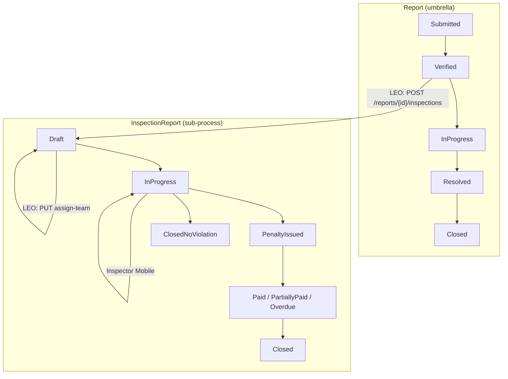
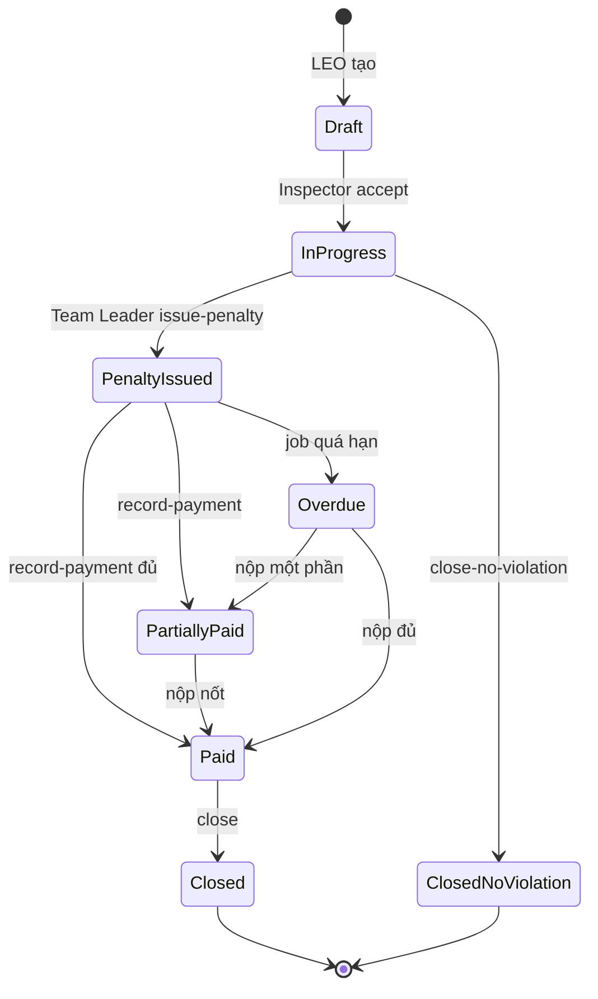

# FE Guide — LEO Inspection Workflow (Web Dashboard)

> **Audience:** LEO Web App (chính) · DEO Web App (giám sát)  
> **Backend branch:** `develop` · **Prefix API:** `/v1` · **Envelope:** `{ code, message, status, data }`  
> **Business rules:** BR-INS-001..033, BR-OFF-005, BR-ORG-013, BR-REP-034 (cổng vào)  
> **Inspector Mobile:** xem [`fe-inspection-checklist-guide.md`](./fe-inspection-checklist-guide.md) · [`../fe-inspection-api-guide.md`](../fe-inspection-api-guide.md)

---

## 1. Tổng quan kiến trúc

GreenLens tách **2 nhánh xử lý độc lập** trên cùng một báo cáo ô nhiễm (Report — “umbrella”):

| Nhánh | Entity | Actor thực thi | Mục đích |
|-------|--------|------------------|----------|
| **Dọn dẹp** | `Report` + `CleanupAssignment` | Cleaner / CompanyStaff | Thu gom rác, ảnh before/after, Resolved → Closed |
| **Xử phạt** | `InspectionReport` (liên kết `ReportId`) | **LEO lập** → **Inspector Team** điều tra | Biên bản hiện trường, QĐ xử phạt, thu phạt |

Một báo cáo có thể **chạy song song** cả hai nhánh (BR-ORG-013, BR-OFF-005).  
Report umbrella chỉ `Closed` khi nhánh dọn dẹp xong **và** mọi `InspectionReport` liên kết đã kết thúc (`Closed` / `ClosedNoViolation`) — hoặc không có nhánh xử phạt.



**Phân vai FE:**

| Actor | App | Inspection |
|-------|-----|------------|
| **LEO** | Web | Tạo hồ sơ, gán/re-gán team, giám sát tiến độ, xử lý tái phát → mở hồ sơ, xem KPI/thanh toán |
| **Inspector** | Mobile | Nhận task, checklist hiện trường, ban hành QĐ / đóng không vi phạm, ghi nhận nộp phạt |
| **DEO** | Web | Giám sát toàn tỉnh (read-only inspection detail, KPI, export) |

---

## 2. Luồng end-to-end (happy path)

### 2.1. Giai đoạn A — Citizen → LEO xác minh (cổng vào)

```
Citizen submit → LEO verify (PUT verify)
    ├─ Cần dọn dẹp → gán Cleanup Team (BR-OFF-011)          [ngoài scope doc này]
    └─ Có chủ thể vi phạm → LEO lập InspectionReport         [LEO Web — §3]
```

**Điều kiện tạo inspection:**

- Report ở trạng thái `Verified` hoặc `InProgress`
- **Chưa** có `InspectionReport` active (status ≠ `Closed` / `ClosedNoViolation`)
- Team gán (nếu có) phải `TeamType = Inspection`

**Cổng phụ — Nghi tái phát (BR-REP-034):**

Citizen submit mới gần case `Closed` (≤25m, cùng category, 30 ngày) → cờ `isSuspectedViolationRecurrence`.  
LEO **không bắt buộc** tạo inspection, nhưng đây là tín hiệu để mở hồ sơ xử phạt. Chi tiết: [`fe-leo-violation-recurrence-guide.md`](./fe-leo-violation-recurrence-guide.md).

### 2.2. Giai đoạn B — LEO tạo & gán team

```
POST /v1/reports/{reportId}/inspections  (Draft)
    → (optional) gán team ngay trong body assignedTeamId
    → hoặc PUT /v1/inspections/{id}/assign-team sau
```

- Nếu gán team khi Report còn `Verified` → Report tự chuyển `InProgress` (gán việc cho cả nhánh dọn dẹp nếu chưa assign)
- SLA inspection (`slaInspectionDueAt`) tính từ severity: Critical 3d / High 5d / Medium 7d / Low 10d (BR-INS-030)

### 2.3. Giai đoạn C — Inspector Mobile (LEO chỉ theo dõi)

```
Draft
  → POST /accept                    (Inspector — Draft → InProgress)
  → POST /confirm-arrival           (GPS mềm ≤200m, optional)
  → PUT /checklist + POST /evidence (≥2 ScenePhoto bắt buộc)
  → PUT /submit-field-report        (Team Leader khóa checklist)
  → PUT /issue-penalty              HOẶC  PUT /close-no-violation (lý do ≥50 ký tự)
```

Sau `PenaltyIssued`:

```
  → PUT /record-payment (multipart + biên lai)
  → khi Paid đủ → PUT /close
```

**LEO Web:** đọc tiến độ qua `GET /v1/inspections/{id}` — **không** gọi mutation Inspector.

### 2.4. Giai đoạn D — Kết thúc & ảnh hưởng Report umbrella

| Kết quả Inspection | Status cuối | Report umbrella |
|--------------------|-------------|-----------------|
| Có vi phạm, nộp đủ phạt | `Closed` | Chờ nhánh dọn dẹp (nếu có) rồi mới `Closed` |
| Không đủ căn cứ | `ClosedNoViolation` | Tương tự |
| Hết SLA, team chưa kết luận | `ClosedNoViolation` (job auto) | LEO nhận notification breach |

---

## 3. State machine InspectionReport

| Status | Mô tả | Ai chuyển |
|--------|-------|-----------|
| `Draft` | LEO vừa tạo; có thể chưa có team | LEO tạo |
| `InProgress` | Team đã accept / đang điều tra | Inspector |
| `PenaltyIssued` | Đã ban hành QĐ xử phạt | Inspector Team Leader |
| `PartiallyPaid` | Nộp một phần | Inspector |
| `Overdue` | Quá hạn nộp (job) | System |
| `Paid` | Nộp đủ | Inspector |
| `Closed` | Đóng sau nộp đủ | Inspector |
| `ClosedNoViolation` | Không đủ căn cứ / auto SLA | Inspector hoặc job |



---

## 4. Checklist việc LEO cần làm (cho FE Web)

> **Nguyên tắc UI:** Mỗi hàng = 1 hành động LEO trên Web. Cột **API** = endpoint backend hiện có.  
> Cột **Màn hình gợi ý** = gợi ý layout cho FE.

### 4.1. Trước & trong xác minh báo cáo

| # | Việc LEO cần làm | Khi nào | API / Data | Màn hình gợi ý |
|---|------------------|---------|------------|------------------|
| L1 | Xem báo cáo trong hàng đợi phường | Hàng ngày | `GET /v1/reports/queue` | Tab **Hàng đợi** |
| L2 | Xem chi tiết báo cáo (ảnh, GPS, timeline) | Trước verify | `GET /v1/reports/{id}` | **Report detail** |
| L3 | Quyết định triage: dọn dẹp / xử phạt / cả hai / reject | Lúc verify | Verify API + cleanup assign (ngoài scope) | Modal **Quyết định xử lý** trên report Verified |
| L4 | Reject nếu không có hành động hợp lệ | Không đủ căn cứ | Reject API (BR-REP-022, lý do ≥20 ký tự) | Form reject |

### 4.2. Cổng vào từ nghi tái phát (BR-REP-034)

| # | Việc LEO cần làm | Khi nào | API / Data | Màn hình gợi ý |
|---|------------------|---------|------------|------------------|
| L5 | Lọc báo cáo nghi tái phát | Notification / queue | `GET /v1/reports/queue?isSuspectedViolationRecurrence=true` | Tab **Nghi tái phát** |
| L6 | Xem danh sách candidate tập trung | Review batch | `GET /v1/reports/violation-recurrence-candidates` | Trang **Nghi tái phạm** |
| L7 | So sánh báo cáo mới vs Closed trước | Trước quyết định | `GET /v1/reports/{id}/violation-recurrence-comparison` | Split view 2 cột (ảnh, mô tả, timeline) |
| L8 | Bác cờ nếu chỉ là rác tái phát thông thường | Sau review | `POST /v1/reports/{id}/dismiss-violation-recurrence` | Nút **Bác cờ tái phát** |
| L9 | **Tạo InspectionReport** nếu nghi vi phạm tái phạm | Sau review / sau verify | `POST /v1/reports/{id}/inspections` | Nút **Lập hồ sơ xử phạt** (prefill từ comparison) |

### 4.3. Tạo & quản lý hồ sơ xử phạt

| # | Việc LEO cần làm | Khi nào | API / Data | Màn hình gợi ý |
|---|------------------|---------|------------|------------------|
| L10 | **Tạo hồ sơ xử phạt** | Report Verified/InProgress, chưa có inspection active | `POST /v1/reports/{id}/inspections` | Form **Lập hồ sơ xử phạt** |
| L11 | Nhập thông tin sơ bộ violator (optional lúc tạo) | Cùng form L10 | Body: `violationDescription`, `violatorName`, `violatorAddress`, `violatorIdentity` | Các field text trong form |
| L12 | Gán Inspection Team ngay hoặc để sau | L10 hoặc sau | `assignedTeamId` trong POST **hoặc** `PUT /v1/inspections/{id}/assign-team` | Dropdown team (chỉ `TeamType=Inspection`) |
| L13 | Xem danh sách hồ sơ của một báo cáo | Report detail | `GET /v1/reports/{id}/inspections` | Tab **Hồ sơ xử phạt** trên report |
| L14 | Xem chi tiết hồ sơ (read-only) | Giám sát | `GET /v1/inspections/{id}` | Trang **Chi tiết inspection** |
| L15 | **Re-gán team** khi team từ chối / chưa accept | Draft, team null hoặc sau decline | `PUT /v1/inspections/{id}/assign-team` | Nút **Đổi đội thanh tra** |
| L16 | Theo dõi SLA inspection | `slaInspectionDueAt`, `slaInspectionBreached` | Field trong GET detail / list | Badge **SLA** + countdown |
| L17 | Theo dõi checklist & evidence (read-only) | InProgress | `checklistEvidence[]` trong GET detail | Gallery ảnh / video / audio |
| L18 | Theo dõi trạng thái thanh toán | Sau PenaltyIssued | `GET /v1/inspections/{id}/payments` | Bảng **Lịch sử nộp phạt** |
| L19 | Xóa khoản nộp phạt ghi nhầm (hiếm) | Sửa lỗi Inspector | `DELETE /v1/inspections/payments/{paymentId}` | Nút xóa trên row payment (confirm) |
| L20 | Xem KPI đội thanh tra phường | Dashboard tháng | `GET /v1/inspections/kpi?teamId=&from=&to=` | Widget **KPI Inspection** |

### 4.4. Giám sát & xử lý ngoại lệ

| # | Việc LEO cần làm | Khi nào | Hành vi BE | Màn hình gợi ý |
|---|------------------|---------|------------|----------------|
| L21 | Xử lý team **từ chối** task | Inspector `POST /decline` trong 24h | Hồ sơ về Draft, `assignedTeamId = null` → LEO re-gán (L15) | Alert **Đội từ chối** + lý do |
| L22 | Xử lý **SLA breach** | Job đánh dấu + có thể auto-close | Notification; status có thể → `ClosedNoViolation` | Banner đỏ trên detail |
| L23 | Xử lý **Overdue** nộp phạt | Job BR-INS-021 | Status `Overdue` — escalate phối hợp cơ quan | Tab/filter **Quá hạn nộp phạt** |
| L24 | Theo dõi **Repeat Offender** | Sau issue-penalty | `isRepeatOffender` + `violatingEntity` trên detail | Badge **Tái phạm** |
| L25 | Export / báo cáo | Cuối tháng | `GET /v1/reports/export` (cột report); KPI inspection riêng | Nút Export |

---

## 5. API reference — phần LEO gọi

### 5.1. Tạo hồ sơ xử phạt

```http
POST /v1/reports/{reportId}/inspections
Authorization: Bearer {token}
Idempotency-Key: {uuid}   # optional, khuyến nghị
Content-Type: application/json
```

**Body:**

```json
{
  "assignedTeamId": "uuid-or-null",
  "violationDescription": "Mô tả sơ bộ vi phạm",
  "violatorName": "Cơ sở / cá nhân",
  "violatorAddress": "Địa chỉ",
  "violatorIdentity": "MST hoặc CCCD"
}
```

**Response 200:** `data` = `Guid` inspection id mới.

**Lỗi thường gặp:**

| HTTP | code | Ý nghĩa FE |
|------|------|------------|
| 404 | `REPORT_NOT_FOUND` | Report không tồn tại |
| 422 | `REPORT_NOT_VERIFIED` | Chưa Verified/InProgress |
| 409 | `INSPECTION_ALREADY_EXISTS` | Đã có hồ sơ active |
| 422 | `TEAM_NOT_INSPECTION_TYPE` | Team không phải Inspection |

### 5.2. Gán / đổi Inspection Team

```http
PUT /v1/inspections/{inspectionId}/assign-team
Content-Type: application/json

{ "teamId": "uuid" }
```

- Cho phép khi inspection `Draft` hoặc `InProgress`
- Nếu Report parent còn `Verified` → chuyển `InProgress`

**Nguồn dropdown team:** `GET /v1/teams?teamType=Inspection&localOfficeId={officeId}` (TeamsController).

### 5.3. Danh sách & chi tiết (LEO read)

| Method | Route | Role |
|--------|-------|------|
| GET | `/v1/reports/{reportId}/inspections` | LEO, Inspector, Admin |
| GET | `/v1/inspections/{id}` | LEO, Inspector, Admin |
| GET | `/v1/inspections/{id}/payments` | LEO, Inspector, Admin |
| GET | `/v1/inspections/kpi` | LEO, Inspector, Admin |

**Lưu ý:** `GET /v1/inspections/queue` chỉ dành **Inspector Mobile** — LEO Web **không** có API queue inspection toàn phường; dùng:

- Tab inspection trên **Report detail** (`GET .../inspections`)
- Lọc report queue + badge SLA
- Trang violation-recurrence-candidates

### 5.4. Chi tiết inspection — field quan trọng cho LEO UI

Từ `GET /v1/inspections/{id}`:

| Nhóm | Fields | Ghi chú UI |
|------|--------|------------|
| Liên kết | `reportId`, `reportCode` | Link về report detail |
| Trạng thái | `status` | Badge màu theo §3 |
| Team | `assignedTeamId`, `assignedTeamName` | Hiện “Chưa gán” nếu null |
| Violator | `violatorName`, `violatorAddress`, `violatorIdentity`, `violatingEntity` | Card thông tin cơ sở |
| QĐ phạt | `violationLevel`, `penaltyAmount`, `penaltyDecisionNumber`, `penaltyDueDate` | Sau PenaltyIssued |
| Thanh toán | `paidAmount`, `payments[]` | Progress bar nộp phạt |
| SLA | `slaInspectionDueAt`, `slaInspectionBreached` | Cảnh báo |
| Checklist | `checklistEvidence[]`, timestamps accept/arrival/submit | Timeline read-only |
| Flags Inspector | `canAcceptTask`, `canIssuePenalty`, … | **Ẩn nút action trên LEO** — chỉ hiển thị trạng thái “Đang chờ Inspector” |

---

## 6. Gợi ý cấu trúc màn hình LEO Web

### 6.1. Report detail — tab “Xử phạt”

```
┌─────────────────────────────────────────────────────────┐
│ Report REP-xxx  [Verified]  [Badge: Nghi tái phát]      │
├─────────────────────────────────────────────────────────┤
│ [Tổng quan] [Dọn dẹp] [Xử phạt] [Timeline] [Comment]   │
├─────────────────────────────────────────────────────────┤
│  + Lập hồ sơ xử phạt          (nếu chưa có active)      │
│  ┌──────────────────────────────────────────────────┐  │
│  │ INS-001  Draft   SLA: 2 ngày   Team: Chưa gán     │  │
│  │ [Gán đội] [Xem chi tiết]                          │  │
│  └──────────────────────────────────────────────────┘  │
└─────────────────────────────────────────────────────────┘
```

### 6.2. Trang chi tiết Inspection (LEO — read-only)

```
┌─────────────────────────────────────────────────────────┐
│ Hồ sơ xử phạt INS-xxx          Status: InProgress       │
│ Báo cáo: REP-xxx (link)        SLA: 2026-08-05 ⚠       │
├─────────────────────────────────────────────────────────┤
│ Timeline:                                               │
│   ✓ LEO tạo — 01/08                                     │
│   ✓ Gán đội ABC — 01/08                                 │
│   ✓ Inspector accept — 02/08                            │
│   ○ Chờ nộp biên bản hiện trường                        │
├─────────────────────────────────────────────────────────┤
│ Violator | Checklist evidence (gallery) | Payments      │
│ [Đổi đội thanh tra]  (chỉ Draft / sau decline)         │
└─────────────────────────────────────────────────────────┘
```

### 6.3. Luồng nghi tái phát → inspection

```
Queue filter "Nghi tái phát"
    → Row click
    → Comparison 2 cột
    → [Bác cờ] hoặc [Lập hồ sơ xử phạt]
```

### 6.4. Widget Dashboard LEO

| Widget | Nguồn data |
|--------|------------|
| Số hồ sơ inspection Draft chưa gán team | Aggregate từ reports queue + tab inspections (FE derive) |
| SLA inspection sắp hết hạn (< 24h) | `slaInspectionDueAt` |
| Hồ sơ Overdue nộp phạt | Filter `status=Overdue` trên list per-report |
| KPI tháng | `GET /v1/inspections/kpi` |

---

## 7. Song song với nhánh dọn dẹp

| Tình huống | Inspection | Cleanup | LEO UI |
|------------|------------|---------|--------|
| Chỉ xử phạt, không dọn | Có | Không | Chỉ tab Xử phạt |
| Chỉ dọn, không xử phạt | Không | Có | Tab Dọn dẹp |
| Cả hai | Có | Có | 2 tab active; 2 SLA độc lập |
| Rác đặc thù (y tế, hóa chất…) | Thường có inspection | **Không** giao cleaner thường | Cảnh báo BR-ORG-013 |

Report `Closed` chỉ khi **cả hai nhánh** (nếu có) đã xong.

---

## 8. Inspector làm gì (LEO cần biết để hiển thị trạng thái)

LEO **không** implement các API sau trên Web — chỉ hiển thị tiến độ:

| Bước | API Inspector | Điều kiện |
|------|---------------|-----------|
| Nhận task | `POST .../accept` | Draft + đã gán team |
| Từ chối | `POST .../decline` | Draft, trong 24h kể từ tạo |
| Xác nhận đến hiện trường | `POST .../confirm-arrival` | InProgress |
| Checklist text | `PUT .../checklist` | InProgress, chưa submit field report |
| Upload evidence | `POST .../evidence` | ScenePhoto ≥2 ảnh bắt buộc |
| Nộp biên bản | `PUT .../submit-field-report` | Team Leader |
| Ban hành QĐ | `PUT .../issue-penalty` | Sau submit field report |
| Không vi phạm | `PUT .../close-no-violation` | Lý do ≥50 ký tự |
| Ghi nhận nộp phạt | `PUT .../record-payment` | Multipart + biên lai |
| Đóng hồ sơ | `PUT .../close` | Paid đủ |

Deprecated (410): `POST .../check-in`, `PUT .../progress`.

---

## 9. SLA & notification (LEO nhận)

| Sự kiện | Job / trigger | Hành động LEO trên UI |
|---------|---------------|------------------------|
| SLA inspection breach | `SlaBreachInspectionJob` (30 phút) | Badge breach; có thể auto `ClosedNoViolation` |
| Team decline | Inspector decline | Re-gán team |
| Penalty overdue | Payment due job | Filter Overdue, liên hệ vi phạm |
| Violation recurrence | Submit report | Tab nghi tái phát |

---

## 10. Enum & checklist evidence (tham chiếu UI read-only)

**`InspectionStatus`:** `Draft`, `InProgress`, `PenaltyIssued`, `PartiallyPaid`, `Overdue`, `Paid`, `Closed`, `ClosedNoViolation`

**Checklist categories (Inspector upload — LEO xem):**

| Category | Bắt buộc | Loại |
|----------|----------|------|
| `ViolationStatus` | Text | Mô tả tình trạng vi phạm |
| `ScenePhoto` | ≥ 2 ảnh | Multipart |
| `Video` | Không | ≤30MB |
| `Audio` | Không | ≤10MB |
| `Other` | Không | Text + file optional |

---

## 11. Checklist triển khai FE LEO (tick list)

### Must-have (MVP)

- [ ] Form **Lập hồ sơ xử phạt** từ report Verified (`POST .../inspections`)
- [ ] Dropdown gán Inspection Team + **Đổi đội** (`assign-team`)
- [ ] Tab **Hồ sơ xử phạt** trên report detail (`GET .../inspections`)
- [ ] Trang **Chi tiết inspection** read-only (`GET .../inspections/{id}`)
- [ ] Badge SLA + trạng thái inspection
- [ ] Tab/filter **Nghi tái phát** + comparison + dismiss + shortcut tạo inspection
- [ ] Alert khi team decline → prompt re-gán

### Should-have

- [ ] Bảng **Lịch sử nộp phạt** (`GET .../payments`)
- [ ] Widget **KPI inspection** (`GET .../kpi`)
- [ ] Gallery checklist evidence trên detail
- [ ] Link 2 chiều Report ↔ Inspection

### Nice-to-have

- [ ] Aggregate view “Tất cả inspection phường” (hiện **chưa có API** — cần derive từ report list hoặc BE backlog)
- [ ] Export Excel inspection riêng (hiện dùng report export + KPI)

---

## 12. Tài liệu liên quan

| File | Nội dung |
|------|----------|
| [`fe-leo-violation-recurrence-guide.md`](./fe-leo-violation-recurrence-guide.md) | Cổng vào nghi tái phát → inspection |
| [`fe-inspection-checklist-guide.md`](./fe-inspection-checklist-guide.md) | Checklist workflow Inspector Mobile |
| [`../fe-inspection-api-guide.md`](../fe-inspection-api-guide.md) | API chi tiết Inspector (capability flags) |
| [`fe-leo-duplicate-detection-guide.md`](./fe-leo-duplicate-detection-guide.md) | Cờ trùng lặp (loại trừ lẫn nhau với tái phát) |
| `docs/BusinessRule/SU26SE049_BusinessRules_v1_2.md` | BR-INS-001..033, BR-OFF-005 |
| `docs/API_COVERAGE_CHECKLIST.md` | §8.4 LEO-22..26, §6 Inspector |

---

**Cập nhật:** 2026-08-03 · Đồng bộ checklist workflow BR-INS-033, GPS 25m recurrence, decline window 24h (implementation).
