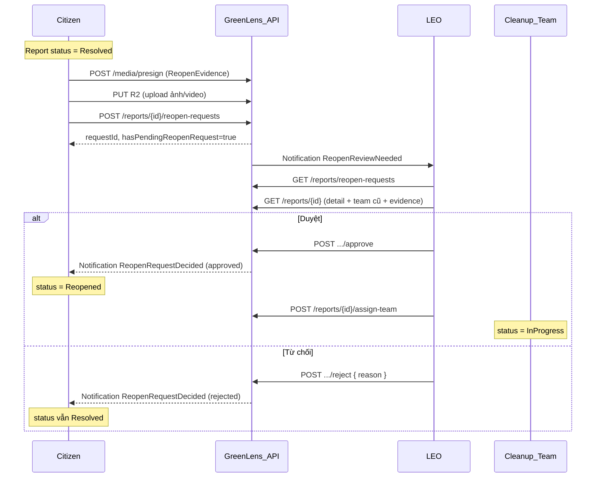

# Citizen Reopen Request + LEO Approval — API Guide

> **Ngày:** 2026-07-27  
> **Prefix:** `/v1` · **Envelope:** `{ code, message, status, data }`  
> **Business rules:** BR-REP-015, BR-REP-016, BR-REP-018, BR-REP-020, BR-REP-021, BR-REP-022, BR-OFF-011  
> **BR doc:** [`SU26SE049_BusinessRules_v1_2.md`](../BusinessRule/SU26SE049_BusinessRules_v1_2.md)  
> **Migration:** `202607271930_AddReportReopenRequest`

---

## FE summary — breaking change (2026-07-27)

Luồng reopen **không còn** citizen tự mở lại trực tiếp (`Resolved → InProgress`). Thay bằng **3 bước** có LEO duyệt:

| Bước | Ai | Status report | Hành động |
|------|-----|---------------|-----------|
| 1 | Citizen | `Resolved` (+ badge chờ duyệt) | Gửi yêu cầu kèm **lý do + ≥1 ảnh** (video optional) |
| 2 | LEO | `Resolved` → **`Reopened`** hoặc giữ `Resolved` | Duyệt / từ chối yêu cầu |
| 3 | LEO | `Reopened` → `InProgress` | Phân công team (giống `Verified`) |

### Checklist FE (bắt buộc)

**Citizen app**

1. **Bỏ** gọi `PUT /v1/reports/{id}/reopen` — endpoint deprecated, trả `422` + code `REOPEN_USE_REQUEST_ENDPOINT`.
2. **Thêm** màn/form “Yêu cầu mở lại”: lý do ≥ 20 ký tự, ≥ 1 ảnh, video tùy chọn (max 5 ảnh).
3. Upload ảnh/video: `POST /v1/media/presign` với `purpose: ReopenEvidence`, `reportId` = id báo cáo → PUT R2 → gửi `publicUrl` trong body.
4. Gọi `POST /v1/reports/{id}/reopen-requests` với `{ reason, imageUrls, videoUrl? }`.
5. Sau khi gửi: UI hiển thị **“Chờ LEO xử lý”** — status API vẫn `Resolved`, đọc `hasPendingReopenRequest: true` từ `GET /v1/reports/{id}`.
6. **Không bắt buộc** gọi `POST /rate` trước khi reopen (BR-REP-018 độc lập).
7. Map status mới **`Reopened`** trên timeline (“LEO đã chấp nhận, đang chờ dọn lại”).
8. Lắng nghe notification `ReopenRequestDecided` (duyệt / từ chối).

**LEO Web Dashboard**

1. Tab/queue **“Yêu cầu mở lại”**: `GET /v1/reports/reopen-requests?status=Pending`.
2. Hoặc filter officer queue: `GET /v1/reports/queue?hasPendingReopenRequest=true`.
3. Chi tiết báo cáo: `GET /v1/reports/{id}` — xem `pendingReopenRequest` (lý do + evidence) + assignments cũ (team đã Completed).
4. Nút **Duyệt**: `POST .../reopen-requests/{requestId}/approve` → report → `Reopened`.
5. Nút **Từ chối**: `POST .../reject` + `{ reason }` ≥ 20 ký tự → report vẫn `Resolved`.
6. Màn **phân công**: lấy report `Verified` **và** `Reopened` (`GET /v1/reports/queue` đã include `Reopened`).
7. `POST /v1/reports/{id}/assign-team` và `dispatch-to-company` chấp nhận cả `Verified` lẫn `Reopened`.

---

## 1. Tổng quan luồng

Trước đây (deprecated): Citizen bấm reopen → ngay lập tức `InProgress`, không có minh chứng, không qua LEO.

Luồng mới: Citizen cung cấp bằng chứng → LEO xem xét → mới mở lại và phân công.



### State machine (umbrella report)

```
Submitted → Verified → InProgress → Resolved → Closed
                              ↑            │
                              │            ├─ (citizen request, giữ Resolved + pending flag)
                              │            ├─ LEO approve → Reopened
                              └────────────┘ LEO assign → InProgress (từ Reopened)
```

| Status | Ý nghĩa với Citizen | Ý nghĩa với LEO |
|--------|---------------------|-----------------|
| `Resolved` | Đã dọn xong; có thể gửi yêu cầu reopen trong 7 ngày | Chờ citizen xác nhận / auto-close |
| `Resolved` + `hasPendingReopenRequest` | “Đã gửi yêu cầu, chờ LEO” | Cần duyệt queue reopen |
| `Reopened` | “LEO đã đồng ý mở lại, sắp có team quay lại” | Cần phân công (như Verified) |
| `InProgress` | Team đang dọn lại | Theo dõi assignment |

---

## 2. Endpoint tóm tắt

| Endpoint | Method | Auth | Mô tả |
|----------|--------|------|--------|
| `/v1/media/presign` | POST | Bearer | Presign upload evidence (`purpose=ReopenEvidence`) |
| `/v1/reports/{id}/reopen-requests` | POST | Bearer (reporter) | Citizen gửi yêu cầu reopen |
| `/v1/reports/reopen-requests` | GET | LEO, Admin | Danh sách yêu cầu reopen |
| `/v1/reports/{id}/reopen-requests/{requestId}/approve` | POST | LEO, Admin | LEO duyệt → `Reopened` |
| `/v1/reports/{id}/reopen-requests/{requestId}/reject` | POST | LEO, Admin | LEO từ chối → vẫn `Resolved` |
| `/v1/reports/{id}` | GET | Bearer / public | Chi tiết + `hasPendingReopenRequest`, `pendingReopenRequest` |
| `/v1/reports/queue` | GET | LEO | Queue gồm `Verified` + **`Reopened`**; filter `hasPendingReopenRequest` |
| `/v1/reports/{id}/assign-team` | POST | LEO | `Verified` **hoặc** `Reopened` → `InProgress` |
| `/v1/reports/{id}/reopen` | PUT | Bearer | **Deprecated** — không dùng |

Luồng độc lập (không đổi):

| Endpoint | Ghi chú |
|----------|---------|
| `PUT /v1/reports/{id}/close` | Citizen hài lòng → `Closed` |
| `POST /v1/reports/{id}/rate` | Đánh giá — **không** bắt buộc trước reopen |

---

## 3. Citizen — gửi yêu cầu reopen

### 3.1 Upload minh chứng (presign)

```http
POST /v1/media/presign
Authorization: Bearer {token}
Content-Type: application/json
```

```json
{
  "fileName": "reopen-evidence-1.jpg",
  "contentType": "image/jpeg",
  "purpose": "ReopenEvidence",
  "reportId": "{reportGuid}",
  "fileSizeBytes": 2048000
}
```

| Field | Rule |
|-------|------|
| `purpose` | `"ReopenEvidence"` (enum số `6`) |
| `reportId` | Bắt buộc — report phải `Resolved`, user là reporter |
| Max size | 10 MB / ảnh (folder `reports/{reportId}/reopen`) |

Video (optional): dùng flow upload video hiện có của app (presign + PUT), gửi `publicUrl` trong field `videoUrl`.

### 3.2 Submit request

```http
POST /v1/reports/{id}/reopen-requests
Authorization: Bearer {token}
Content-Type: application/json
```

```json
{
  "reason": "Vẫn còn rác cồng kềnh ở lối đi phía sau, team chưa thu gom hết.",
  "imageUrls": [
    "https://cdn.example.com/reports/abc/reopen/photo1.jpg",
    "https://cdn.example.com/reports/abc/reopen/photo2.jpg"
  ],
  "videoUrl": "https://cdn.example.com/reports/abc/reopen/clips.mp4"
}
```

| Field | Bắt buộc | Rule |
|-------|----------|------|
| `reason` | Có | 20–2000 ký tự |
| `imageUrls` | Có | ≥ 1 URL, tối đa 5; URL phải thuộc CDN/R2 của hệ thống |
| `videoUrl` | Không | 0–1 video |

### Response 200

```json
{
  "code": "SUCCESS",
  "message": "Success",
  "status": 200,
  "data": "3fa85f64-5717-4562-b3fc-2c963f66afa6"
}
```

`data` = **requestId** (Guid) — LEO dùng khi approve/reject.

### Điều kiện nghiệp vụ

| Rule | Chi tiết |
|------|----------|
| Status | Chỉ từ **`Resolved`** |
| Actor | Chỉ **người gửi** (`reporterId`) |
| Cửa sổ | ≤ **7 ngày** kể từ `resolvedAt` |
| Số lần | Tối đa **1 lần được LEO duyệt** (`reopenedCount < 1`) |
| Pending | **1** yêu cầu pending / report — không gửi trùng khi đang chờ |
| Rate | **Không** yêu cầu `POST /rate` trước |
| Closed | **Không** reopen từ `Closed` |

### GET detail sau khi gửi

`GET /v1/reports/{id}` bổ sung:

```json
{
  "status": "Resolved",
  "hasPendingReopenRequest": true,
  "pendingReopenRequest": {
    "requestId": "...",
    "reason": "...",
    "requestedAt": "2026-07-27T10:00:00Z",
    "evidenceMedia": [
      { "id": "...", "mediaType": "ReopenEvidence", "url": "...", "mimeType": "image/jpeg", "sizeBytes": 0 }
    ]
  }
}
```

Khi không có pending: `hasPendingReopenRequest: false`, `pendingReopenRequest: null`.

---

## 4. LEO — duyệt / từ chối

### 4.1 Queue yêu cầu reopen

```http
GET /v1/reports/reopen-requests?page=1&pageSize=20&status=Pending
Authorization: Bearer {leo_token}
```

| Query | Default | Ghi chú |
|-------|---------|---------|
| `status` | `Pending` | `Pending` \| `Approved` \| `Rejected` |
| `page` / `pageSize` | 1 / 20 | Max 100 |

**Scope:** LEO chỉ thấy report thuộc `assignedOfficeId` của mình. Admin thấy toàn bộ.

Response item:

```json
{
  "requestId": "...",
  "reportId": "...",
  "reportCode": "REP-2026-001234",
  "reportStatus": "Resolved",
  "reason": "...",
  "status": "Pending",
  "requestedAt": "...",
  "firstEvidenceImageUrl": "https://...",
  "evidenceImageCount": 2,
  "hasVideo": true
}
```

**Filter thay thế** trên officer queue:

```http
GET /v1/reports/queue?hasPendingReopenRequest=true
```

### 4.2 Xem chi tiết trước khi quyết định

`GET /v1/reports/{id}` — kết hợp:

- `pendingReopenRequest` — lý do + ảnh/video citizen
- `assignments[]` — team cũ (thường `Completed`) để LEO biết ai đã xử lý lần trước
- Media gốc (`before` / `after`) từ lần resolve trước

### 4.3 Duyệt

```http
POST /v1/reports/{id}/reopen-requests/{requestId}/approve
Authorization: Bearer {leo_token}
```

Body: **không** cần.

Kết quả:

- Report: `Resolved` → **`Reopened`**
- `reopenedCount++`
- `hasPendingReopenRequest = false`
- `resolvedAt` cleared (chu kỳ resolve mới)
- Citizen nhận notification **“Yêu cầu mở lại đã được chấp nhận”**

### 4.4 Từ chối

```http
POST /v1/reports/{id}/reopen-requests/{requestId}/reject
Authorization: Bearer {leo_token}
Content-Type: application/json
```

```json
{
  "reason": "Ảnh minh chứng không khớp vị trí báo cáo ban đầu, không đủ căn cứ mở lại."
}
```

| Field | Rule |
|-------|------|
| `reason` | 20–2000 ký tự (BR-REP-022) |

Kết quả:

- Report **vẫn `Resolved`**
- `hasPendingReopenRequest = false`
- Citizen nhận notification kèm lý do từ chối

### 4.5 Phân công sau duyệt

Sau approve, report ở **`Reopened`** — xử lý **giống `Verified`**:

```http
POST /v1/reports/{id}/assign-team
```

Hoặc dispatch công ty:

```http
POST /v1/reports/{id}/dispatch-to-company
```

→ `Reopened` → **`InProgress`**, tạo **assignment mới** (assignment cũ `Completed` giữ nguyên làm lịch sử).

Officer queue mặc định đã include status `Reopened` cùng `Verified` để LEO phân công.

---

## 5. Mã lỗi thường gặp

| HTTP | Code | Khi nào |
|------|------|---------|
| 422 | `REOPEN_USE_REQUEST_ENDPOINT` | Gọi `PUT /reopen` cũ |
| 422 | `REOPEN_WINDOW_EXPIRED` | Quá 7 ngày từ `resolvedAt` |
| 422 | `REOPEN_LIMIT_REACHED` | Đã duyệt reopen 1 lần |
| 409 | `PENDING_REOPEN_REQUEST_EXISTS` | Đang có yêu cầu chờ duyệt |
| 422 | `REOPEN_EVIDENCE_REQUIRED` | Thiếu ảnh minh chứng |
| 422 | `REASON_TOO_SHORT` / validation | Lý do < 20 ký tự |
| 403 | `NOT_REPORT_OWNER` | Không phải reporter |
| 403 | `OUTSIDE_JURISDICTION` | LEO duyệt/từ chối report ngoài office |
| 403 | `REOPEN_REVIEW_FORBIDDEN` | Citizen hoặc role không được xem/xử lý queue reopen |
| 404 | `REOPEN_REQUEST_NOT_FOUND` | Sai `requestId` |
| 404 | `OFFICE_NOT_FOUND` | LEO chưa gắn local office |
| 422 | `CANNOT_REOPEN_FROM_CLOSED` | Report đã `Closed` |
| 422 | `CANNOT_REOPEN_NOT_RESOLVED` | Report không phải `Resolved` (presign/submit) |
| 422 | `REPORT_NOT_RESOLVED_FOR_REOPEN_APPROVAL` | LEO approve khi report đã đổi status |
| 422 | `REOPEN_REQUEST_NOT_PENDING` | Đã duyệt/từ chối rồi |
| 409 | `PENDING_REOPEN_REQUEST_EXISTS` | Đang có yêu cầu chờ duyệt (hoặc race concurrent submit) |

---

## 6. Notification

| Type | Ai nhận | Khi nào |
|------|---------|---------|
| `ReopenReviewNeeded` | LEO (office của report) | Citizen vừa gửi yêu cầu |
| `ReopenRequestDecided` | Citizen (reporter) | LEO duyệt hoặc từ chối |

Deep link gợi ý: `referenceId` = `reportId`.

---

## 7. Auto-close & edge cases

| Tình huống | Hành vi |
|------------|---------|
| Pending reopen + 7 ngày `Resolved` | **Không** auto-close (BR-REP-016 skip khi `hasPendingReopenRequest`) |
| LEO reject | Countdown auto-close tiếp tục từ `resolvedAt` |
| Citizen `PUT /close` khi pending | Vẫn có thể đóng nếu hài lòng — product có thể disable nút reopen/close khi pending (FE quyết định UX) |
| `reopenedCount` | Chỉ tăng khi LEO **approve**, không tăng lúc citizen gửi request |

---

## 8. Deprecated

| Cũ | Mới |
|----|-----|
| `PUT /v1/reports/{id}/reopen` (body rỗng) | `POST /v1/reports/{id}/reopen-requests` |
| `Resolved → InProgress` ngay | `Resolved` → *(pending)* → `Reopened` → `InProgress` |
| Không có minh chứng | Lý do + ≥1 ảnh bắt buộc |

Cập nhật doc cũ: [`fe-citizen-satisfaction-api-guide.md`](./fe-citizen-satisfaction-api-guide.md) **§1–2** mô tả luồng reopen cũ — tham chiếu file này thay thế.

---

## 9. DB / migration (BE ops)

```bash
dotnet ef database update --project src/Greenlens.Infrastructure --startup-project src/Greenlens.Api
```

Bảng mới: `report_reopen_requests`. Cột mới: `reports.has_pending_reopen_request`, `report_media.reopen_request_id`. Enum status: **`Reopened`**.
