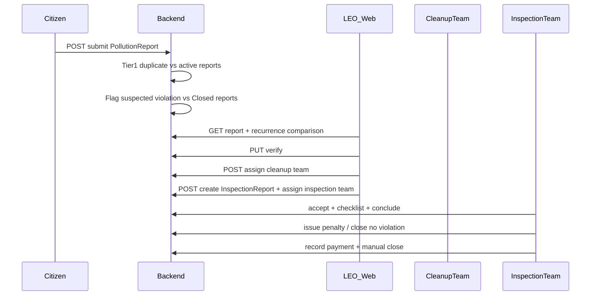
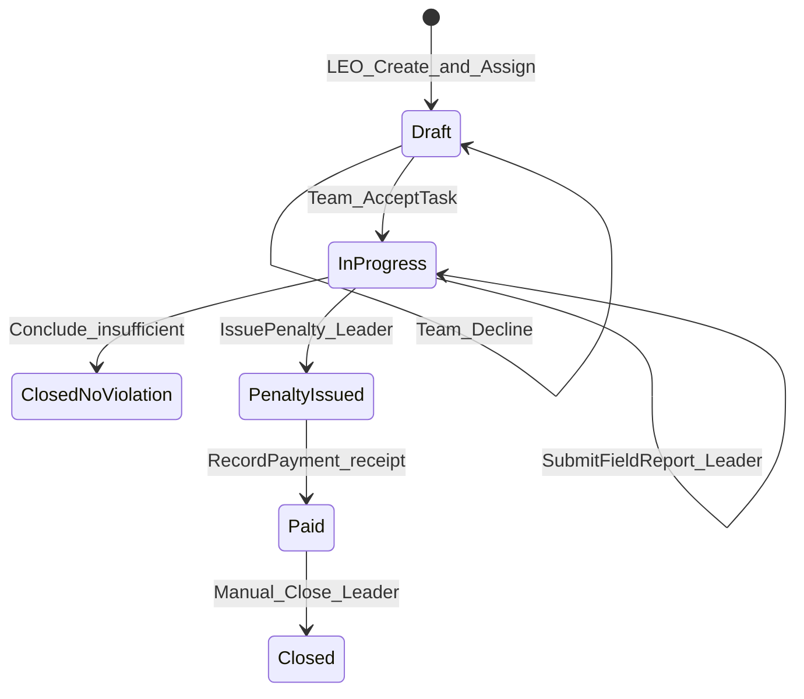

# Inspection Workflow + Cờ nghi ngờ vi phạm tái phát

## Quyết định đã chốt (từ user)

| # | Quyết định |
|---|------------|
| 1 | **Inspector: chỉ checklist bằng chứng + kết luận điều tra** — **KHÔNG** cập nhật % tiến độ (`PUT /progress` deprecated) |
| 2 | **InspectionReport do LEO quyết định** khi thấy cần điều tra/xử phạt — **không** tự sinh từ báo cáo citizen |
| 3 | **Cờ nghi ngờ vi phạm tái phát** gắn lúc citizen submit nếu khớp 3 điều kiện (xem §2) |
| 4 | LEO xem/so sánh báo cáo hiện tại vs báo cáo Closed trước → **tự quyết** có lập InspectionReport hay không |
| 5 | Sau verify: LEO có thể **assign Cleanup + tạo InspectionReport + assign Inspection team** song song |
| 6 | Báo cáo Closed tham chiếu: **bất kỳ** PollutionReport `Closed` (không yêu cầu có InspectionReport trước) |
| 7 | Nhiều Closed khớp: chọn **ClosedAt mới nhất** trong vòng 1 tháng |
| 8 | Nộp phạt: upload biên lai + **đóng thủ công** (`Paid` → `PUT /close`) |

---

## §1 — End-to-end flow (PollutionReport + Inspection)



**Nguyên tắc phân nhánh:**

- **Cleanup** = dọn vật lý (rác/ô nhiễm)
- **Inspection** = điều tra chủ thể + xử phạt hành chính
- Hai nhánh **độc lập**, LEO khởi tạo theo quyết định nghiệp vụ (BR-OFF-005)

---

## §2 — Cờ nghi ngờ vi phạm tái phát (BR-REP-034 — mới)

### Mục đích

Gợi ý cho LEO: *"điểm này từng có báo cáo đã đóng gần đây, cùng loại — có thể tái phát vi phạm"*. **Không** tự tạo InspectionReport.

### Điều kiện (cả 3 phải đúng)

| # | Điều kiện | Chi tiết |
|---|-----------|----------|
| A | **Category** | `CategoryId` trùng |
| B | **GPS ≤ 50m** | Haversine/PostGIS, cùng ngưỡng BR-REP-030 |
| C | **Thời gian** | Báo cáo tham chiếu có `Status = Closed` và `ClosedAt >= now - 30 days` |

**Chọn primary:** trong các Closed khớp A+B+C → **`ClosedAt` mới nhất**.

### Khác với duplicate detection (BR-REP-030)

| | Duplicate (hiện tại) | Violation recurrence (mới) |
|---|---------------------|---------------------------|
| So sánh với | Report **đang active** (loại trừ Closed) | Report **Closed** |
| Mục đích | Gộp báo cáo trùng | Gợi ý tái phát vi phạm → LEO cân nhắc Inspection |
| Cờ | `IsPossibleDuplicate` | `IsSuspectedViolationRecurrence` (đề xuất tên) |
| FK | `PossibleDuplicateOfReportId` | `SuspectedRecurrenceOfReportId` |
| Tier 2 AI | Có (ảnh) | **Không** (MVP) |

**Cả hai cờ có thể cùng true** trên một báo cáo mới (ví dụ: vừa trùng active vừa gần điểm Closed cũ).

### Implementation (inline tại submit)

Tái sử dụng pattern [`SubmitPollutionReportCommandHandler.FlagPossibleDuplicateAsync`](src/Greenlens.Application/Features/Reports/SubmitPollutionReport/SubmitPollutionReportCommandHandler.cs):

```csharp
// Sau Tier1 duplicate, thêm:
await FlagSuspectedViolationRecurrenceAsync(report, ct);
```

Query candidates:

```csharp
.Where(r => r.Status == ReportStatus.Closed)
.Where(r => r.ClosedAt >= DateTime.UtcNow.AddDays(-30))
.Where(r => r.CategoryId == report.CategoryId)
// bbox prefilter + Haversine ≤50m
.OrderByDescending(r => r.ClosedAt)
```

Domain method trên [`Report.cs`](src/Greenlens.Domain/Entities/Report.cs):

```csharp
public void MarkSuspectedViolationRecurrence(Guid priorClosedReportId);
public void DismissViolationRecurrence(); // LEO bác cờ (mirror DismissDuplicate)
```

### API cho LEO UI

| Method | Route | Mô tả |
|--------|-------|-------|
| GET | `/v1/reports/{id}/violation-recurrence-comparison` | Side-by-side: report hiện tại vs `SuspectedRecurrenceOfReportId` (media, mô tả, timeline, inspection history của báo cáo cũ nếu có) |
| POST | `/v1/reports/{id}/dismiss-violation-recurrence` | LEO bác cờ (audit log BR-ADM-010) |
| GET | `/v1/reports/officer-queue?isSuspectedViolationRecurrence=true` | Filter queue LEO |

Bổ sung vào `GetReportById` / officer list DTO:

- `isSuspectedViolationRecurrence`
- `suspectedRecurrenceOfReportId`
- `priorClosedReportSummary` (code, closedAt, category, có inspection trước không)

---

## §3 — Inspector workflow (checklist, KHÔNG % tiến độ)

### Xác nhận cứng

- **`PUT /inspections/{id}/progress` → 410 Gone** — không thay thế bằng checklist completion %
- Inspector UI: wizard checklist + nút "Kết luận điều tra" — **không** slider/progress bar
- BR-INS-031 (cập nhật tiến độ/ngày) → **thay thế** bằng BR-INS-033 (checklist completion) trong BR doc

### GPS — Ghi nhận có mặt (không giống Cleanup)

| Cleanup | Inspection |
|---------|------------|
| Check-in bắt buộc ≤200m → InProgress | **Accept task** → InProgress |
| % tiến độ hàng ngày | **Checklist + kết luận** |
| GPS gate cứng | **ConfirmArrival** GPS mềm: ≤200m OK; >200m cần `note` |

### State machine Inspection



**Permissions:**

- **Member:** Accept, ConfirmArrival, upload checklist
- **Team Leader:** SubmitFieldReport, IssuePenalty, CloseNoViolation, RecordPayment, Close

### Checklist cố định (MVP hardcoded)

| Category | Bắt buộc | Loại |
|----------|----------|------|
| `ViolationStatus` | Có | Text |
| `ScenePhoto` | Có (≥2) | Image |
| `Video` | Không | Video ≤30MB |
| `Audio` | Không | Audio ≤10MB |
| `Other` | Không | Text + optional file |

---

## §4 — Rủi ro và mitigations (bổ sung)

### R10 — Nhầm lẫn Duplicate vs Violation Recurrence

- Citizen submit có thể có **2 badge** trên UI LEO
- **Mitigation:** tên cờ + tooltip rõ; API trả cả hai field; FE guide riêng

### R11 — Closed report không có `ClosedAt`

- Auto-close job set `ClosedAt` — cần verify mọi path → Closed đều set timestamp
- **Mitigation:** migration backfill `ClosedAt` từ status history nếu null; index `(status, closed_at, category_id)`

### R12 — Báo cáo Closed sau dọn nhưng chưa xử phạt

- User chọn **any Closed** — cờ vẫn bật dù lần trước không có InspectionReport
- **Mitigation:** comparison API hiển thị `hadPriorInspection: false` để LEO đánh giá

### R13 — Performance submit p95

- Thêm 1 query geo bbox (tương tự duplicate) — chấp nhận được nếu dùng bbox + limit 20
- **Mitigation:** GIST index trên location; không chạy Tier 2 AI

### R14 — LEO bỏ qua cờ

- Cờ chỉ gợi ý — LEO vẫn có thể verify + tạo Inspection **không** cần cờ (phát hiện trực tiếp)
- Cờ **không** bắt buộc tạo InspectionReport

### R15 — BR doc thiếu BR-REP-034

- Cần user xác nhận BR ID trong doc v1.2 hoặc changelog
- **Mitigation:** implement với XML `BR-REP-034` + test name pattern

### R16 — Dismiss recurrence chưa có UX

- Mirror `DismissDuplicate` — LEO bác cờ nếu chỉ là rác tái phát thông thường, không phải vi phạm
- Audit log bắt buộc

### R17 — Re-verify / reopen edge case

- Report Reopened: có cần re-run recurrence flag? **Đề xuất:** không — chỉ flag lúc submit lần đầu

---

## §5 — Schema migration (tổng hợp)

```text
reports:
  + is_suspected_violation_recurrence (bool, default false)
  + suspected_recurrence_of_report_id (uuid, nullable, FK reports)
  index (is_suspected_violation_recurrence) WHERE true
  index (status, closed_at, category_id)  -- cho recurrence query

inspection_reports:
  + accepted_at, accepted_by_user_id
  + arrival_confirmed_at, arrival_latitude, arrival_longitude, arrival_note
  + field_investigation_completed_at, field_investigation_completed_by

inspection_evidences (new):
  id, inspection_report_id, category, media_url, mime_type, size_bytes,
  description, duration_seconds, uploaded_by, uploaded_at
```

---

## §6 — API changes tổng hợp

### Reports (LEO + citizen submit side effects)

| Method | Route | Mới/Sửa |
|--------|-------|---------|
| POST | `/v1/reports` (submit) | Sửa — thêm recurrence flag inline |
| GET | `/v1/reports/{id}/violation-recurrence-comparison` | **Mới** |
| POST | `/v1/reports/{id}/dismiss-violation-recurrence` | **Mới** |
| GET | officer queue | Sửa — filter `isSuspectedViolationRecurrence` |

### Inspections (Inspector)

| Method | Route | Mới/Sửa |
|--------|-------|---------|
| POST | `/{id}/accept` | **Mới** |
| POST | `/{id}/confirm-arrival` | **Mới** (thay check-in) |
| PUT | `/{id}/checklist` | **Mới** |
| POST | `/{id}/evidence` | Sửa — category + video/audio |
| PUT | `/{id}/submit-field-report` | **Mới** |
| PUT | `/{id}/issue-penalty` | Sửa — gate checklist |
| PUT | `/{id}/record-payment` | Sửa — receipt upload |
| PUT | `/{id}/close` | Giữ — manual |
| POST | `/{id}/check-in` | **410 Gone** |
| PUT | `/{id}/progress` | **410 Gone** |

---

## §7 — Phân phase triển khai

### Phase 0 — Violation recurrence flag (có thể ship trước)

- Domain fields + migration + submit inline detection
- `GetViolationRecurrenceComparison` query
- `DismissViolationRecurrence` command
- Officer queue filter + FE guide LEO
- Tests: `SubmitReport_NearClosedWithin30Days_FlagsRecurrence_BR_REP_034`

### Phase 1 — Inspection domain + checklist schema

- `InspectionEvidence` + state machine Accept/ConfirmArrival/CompleteFieldInvestigation
- Deprecate progress/check-in

### Phase 2 — Checklist handlers + gates

- Upload evidence multi-type
- SubmitFieldReport, IssuePenalty gates
- GetInspectionReportById overhaul

### Phase 3 — Payment receipt + SLA job

- Receipt multipart
- SlaBreachInspectionJob auto close-no-violation

### Phase 4 — Docs + diagrams

- `fe-inspection-checklist-guide.md`, `fe-leo-violation-recurrence-guide.md`
- Cập nhật SD-28..34, BR v1.2 (REP-034, INS-033)

---

## §8 — Out of scope

- Admin-configurable checklist template
- Chữ ký số Team Leader (BR-INS-010e)
- PenaltyFramework validation (BR-INS-011 gap)
- Thanh toán online
- PDF biên bản
- AI so sánh ảnh giữa 2 báo cáo recurrence (P2)

---

## §9 — Files chính

| Layer | Files |
|-------|-------|
| Domain | [`Report.cs`](src/Greenlens.Domain/Entities/Report.cs), [`InspectionReport.cs`](src/Greenlens.Domain/Entities/InspectionReport.cs), `InspectionEvidence.cs` |
| Application | `SubmitPollutionReport/` (recurrence), `GetViolationRecurrenceComparison/`, `DismissViolationRecurrence/`, `Features/Inspection/*` |
| Infrastructure | Migration, GIST index, [`SlaBreachInspectionJob`](src/Greenlens.Infrastructure/BackgroundJobs/SlaBreachInspectionJob.cs) |
| Api | [`ReportsController`](src/Greenlens.Api/Controllers/ReportsController.cs), [`InspectionsController`](src/Greenlens.Api/Controllers/InspectionsController.cs) |
| Tests | Domain + Application unit tests với BR IDs |
| Docs | BR v1.2, SEQUENCE_DIAGRAMS, Changelogs |
