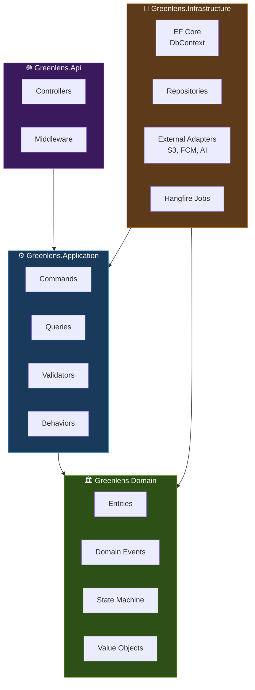

# GreenLens — Giải thích Kiến trúc & Framework

> **Dự án:** SU26SE049 · **.NET 9** · **Clean Architecture** · **CQRS**
> Tài liệu dùng cho thuyết trình — giải thích chi tiết từng layer và framework

---

## Tổng quan: Clean Architecture (4 layers)



**Nguyên tắc chính:** Dependency đi từ ngoài vào trong. Domain ở trung tâm, không phụ thuộc gì cả. Infrastructure implement các interface mà Application định nghĩa.

```
Api ──► Application ──► Domain    (compile-time dependency)
 │           │
 └──► Infrastructure ──► Application ──► Domain
```

---

## Layer 1: 🏛️ Greenlens.Domain — Entities + Events + State Machine

### Framework: Không có framework — Pure C#

**Domain layer KHÔNG phụ thuộc bất kỳ framework nào.** Đây là nguyên tắc quan trọng nhất của Clean Architecture:
- ❌ Không có `using Microsoft.EntityFrameworkCore`
- ❌ Không có `using MediatR`
- ❌ Không có NuGet package nào
- ✅ Chỉ dùng .NET BCL (Base Class Library) thuần

### Tại sao?

> Domain chứa **logic nghiệp vụ cốt lõi** — những rule không bao giờ thay đổi dù ta đổi database, đổi web framework, hay đổi message queue. Nếu Domain phụ thuộc EF Core, khi đổi sang Dapper hoặc MongoDB thì phải sửa lại business logic — vi phạm nguyên tắc.

### Các thành phần:

#### 1.1 Entities (Thực thể)

```csharp
// Entity = object có identity (Id) + behavior (methods)
// KHÔNG phải DTO — có logic nghiệp vụ bên trong
public sealed class Report : SoftDeletableEntity
{
    // ❌ KHÔNG có public setter — bảo vệ invariant
    public ReportStatus Status { get; private set; }
    
    // ✅ Thay đổi state CHỈ qua method có validation
    public Result Verify(Guid officerId) { ... }
    public Result Reject(Guid officerId, string reason) { ... }
}
```

**Tại sao `private set`?**
- Đảm bảo entity luôn ở trạng thái hợp lệ (valid state)
- Không ai có thể set `report.Status = Resolved` trực tiếp — phải gọi `report.Resolve()` → method validate trước khi cho phép

#### 1.2 State Machine (Máy trạng thái)

```
                   ┌─► Rejected   (LEO, reason ≥ 20 chars)
Submitted ─────────┼─► Verified ──► InProgress ──► Resolved ──┬─► Closed
                   └─► Duplicate  (LEO/AI)                    └─► InProgress (reopen, max 2)
```

```csharp
// State machine NẰM TRONG entity — không phải ở handler hay controller
public Result Verify(Guid officerId)
{
    // Guard: chỉ cho phép chuyển từ Submitted → Verified
    if (Status != ReportStatus.Submitted)
        return Result.Failure(new Error(
            "INVALID_TRANSITION",
            $"Cannot verify from status {Status}",
            ErrorType.BusinessRule));

    Status = ReportStatus.Verified;
    VerifiedBy = officerId;
    VerifiedAt = DateTime.UtcNow;
    
    // Raise domain event (xem phần 1.3)
    AddDomainEvent(new ReportVerifiedEvent(Id, officerId));
    return Result.Success();
}
```

**Tại sao state machine nằm trong Entity?**
- Nếu đặt ở handler (Application layer), khi có 5 handler cùng thay đổi status → logic rải rác, dễ miss validation
- Entity tự bảo vệ chính nó: "Tôi đang ở Submitted, chỉ có thể Verify hoặc Reject, không thể nhảy thẳng sang Resolved"

#### 1.3 Domain Events (Sự kiện miền)

```csharp
// Event = "thông báo rằng điều gì đó đã xảy ra"
public sealed record ReportVerifiedEvent(Guid ReportId, Guid OfficerId) 
    : IDomainEvent;
```

**Flow hoạt động:**
```
Entity.Verify() 
  → AddDomainEvent(new ReportVerifiedEvent(...))
  → SaveChanges (Infrastructure)
  → MediatR.Publish (sau khi commit DB thành công)
  → Handler nhận event → gửi notification, cấp điểm, v.v.
```

**Tại sao dùng Event?**
- **Loose coupling:** Report entity không biết về Notification hay Gamification
- **Khi verify report:** Report chỉ raise event "tôi đã verified". Notification module tự lắng nghe và gửi push. Gamification module tự cộng điểm. Report không cần biết.

#### 1.4 Result Pattern (thay vì throw Exception)

```csharp
public sealed class Result<T>
{
    public bool IsSuccess { get; }
    public T? Value { get; }
    public Error? Error { get; }
}

public sealed record Error(string Code, string Message, ErrorType Type);
```

**Tại sao không dùng Exception?**
- Exception = **lỗi bất ngờ** (DB down, null reference) — ngoại lệ
- Business rule violation = **lỗi dự kiến** (sai mật khẩu, không có quyền) — **không phải ngoại lệ**, mà là kết quả bình thường
- Exception tốn hiệu suất (stack trace), Result thì không
- Result bắt buộc caller phải xử lý (compiler check), Exception có thể bị quên catch

---

## Layer 2: ⚙️ Greenlens.Application — CQRS + MediatR + FluentValidation

### Framework 1: MediatR

**MediatR** là thư viện mediator pattern cho .NET. Thay vì controller gọi service trực tiếp, controller gửi "request" qua MediatR, MediatR tìm đúng handler và gọi.

#### Không có MediatR:
```csharp
// Controller phụ thuộc trực tiếp vào từng service
public class ReportsController
{
    private readonly ReportService _reportService;      // 20+ methods
    private readonly NotificationService _notifService;
    private readonly GamificationService _gamifService;
    
    public async Task<IActionResult> Submit(SubmitDto dto)
    {
        var report = await _reportService.Submit(dto);
        await _notifService.NotifyOfficer(report);
        await _gamifService.AwardPoints(report);
        return Ok(report);
    }
}
```

**Vấn đề:** Controller biết quá nhiều — phải biết cả notification lẫn gamification. Service class phình to (God Service).

#### Với MediatR:
```csharp
// Controller chỉ biết "gửi command" — không biết ai xử lý
public class ReportsController : ControllerBase
{
    private readonly ISender _sender;  // Chỉ 1 dependency

    [HttpPost]
    public async Task<IActionResult> Submit(SubmitReportCommand cmd)
        => (await _sender.Send(cmd)).ToHttp();  // 1 dòng
}
```

```csharp
// Handler xử lý — tách riêng, 1 class = 1 use case
public sealed class SubmitReportCommandHandler 
    : IRequestHandler<SubmitReportCommand, Result<Guid>>
{
    public async Task<Result<Guid>> Handle(
        SubmitReportCommand cmd, CancellationToken ct)
    {
        // Logic submit report
    }
}
```

**Lợi ích:**
- Controller **mỏng** (thin controller) — chỉ nhận HTTP request và gửi đi
- Mỗi handler là **1 class riêng**, **1 file riêng** — dễ tìm, dễ test
- Thêm feature mới = thêm file mới, **không sửa file cũ** (Open/Closed Principle)

### Framework 2: CQRS (Command Query Responsibility Segregation)

**CQRS** = tách logic **đọc** (Query) và **ghi** (Command) thành 2 luồng riêng biệt.

```
┌─────────────────────────────────────────────────┐
│                    CLIENT                        │
│  POST /reports (tạo mới)   GET /reports (danh sách)│
└──────────┬─────────────────────────┬────────────┘
           │                         │
    ┌──────▼──────┐          ┌───────▼─────┐
    │   Command   │          │    Query    │
    │ (Write/Mutate)│         │ (Read Only) │
    ├─────────────┤          ├─────────────┤
    │ Validation  │          │ AsNoTracking│
    │ Transaction │          │ Projection  │
    │ Domain Logic│          │ Caching     │
    │ Save to DB  │          │ Direct DTO  │
    └─────────────┘          └─────────────┘
```

```csharp
// COMMAND — thay đổi dữ liệu
public sealed record SubmitReportCommand(
    decimal Latitude,
    decimal Longitude,
    Guid CategoryId,
    string? Description
) : IRequest<Result<Guid>>;

// QUERY — chỉ đọc dữ liệu
public sealed record GetNearbyReportsQuery(
    decimal Latitude,
    decimal Longitude,
    int RadiusMeters = 1000
) : IRequest<Result<List<ReportDto>>>;
```

**Tại sao tách?**
- **Read path** tối ưu khác: dùng `AsNoTracking()`, projection trực tiếp ra DTO, có thể cache
- **Write path** cần full validation, transaction, domain event
- Tách cho phép scale đọc/ghi độc lập (vd: 90% request là đọc → cache mạnh tay)

### Vertical Slice Architecture (Feature Slices)

```
Application/Features/
├── Reports/
│   ├── SubmitReport/
│   │   ├── SubmitReportCommand.cs        ← Request (input)
│   │   ├── SubmitReportCommandHandler.cs ← Logic
│   │   ├── SubmitReportCommandValidator.cs ← Validation
│   │   └── SubmitReportResponse.cs       ← DTO (output)
│   ├── VerifyReport/
│   │   ├── VerifyReportCommand.cs
│   │   ├── VerifyReportCommandHandler.cs
│   │   └── VerifyReportCommandValidator.cs
│   └── GetNearbyReports/
│       ├── GetNearbyReportsQuery.cs
│       └── GetNearbyReportsQueryHandler.cs
```

**Tại sao không tổ chức theo layer (Service/Repository/DTO)?**
```
❌ Truyền thống:              ✅ Vertical Slice:
Services/                    Features/SubmitReport/
  ReportService.cs (500 LOC)   SubmitReportCommand.cs
Validators/                    SubmitReportHandler.cs
  ReportValidator.cs           SubmitReportValidator.cs
DTOs/                        Features/VerifyReport/
  ReportDto.cs                 VerifyReportCommand.cs
                               VerifyReportHandler.cs
```

- **Thay đổi 1 feature = thay đổi 1 thư mục** — không phải mở 4 folder khác nhau
- **Dễ review:** PR cho "Submit Report" chỉ đụng 4 file trong 1 folder
- **Dễ xóa:** feature không cần nữa → xóa cả folder

### Framework 3: FluentValidation

```csharp
// Validation TÁCH RIÊNG khỏi handler — chạy tự động qua MediatR pipeline
public sealed class SubmitReportCommandValidator 
    : AbstractValidator<SubmitReportCommand>
{
    public SubmitReportCommandValidator()
    {
        // BR-REP-003: Vietnam GPS bounds
        RuleFor(x => x.Latitude)
            .InclusiveBetween(8.0m, 24.0m)
            .WithMessage("Vĩ độ phải trong phạm vi Việt Nam (8°-24°)");

        RuleFor(x => x.Longitude)
            .InclusiveBetween(102.0m, 110.0m)
            .WithMessage("Kinh độ phải trong phạm vi Việt Nam (102°-110°)");

        // BR-REP-005: Category required
        RuleFor(x => x.CategoryId)
            .NotEmpty()
            .WithMessage("Danh mục ô nhiễm là bắt buộc");
    }
}
```

**Tại sao không validate trong handler?**
- **Separation of Concerns:** Handler lo business logic, Validator lo input validation
- **Tái sử dụng:** cùng 1 validator cho API request và background job
- **Pipeline Behavior:** MediatR tự động chạy validator TRƯỚC handler — handler luôn nhận data đã valid

### Pipeline Behaviors (Cross-cutting concerns)

```
Request → [ValidationBehavior] → [LoggingBehavior] → [TransactionBehavior] → Handler
                  ↑                      ↑                     ↑
            FluentValidation       Serilog log            EF Core transaction
            auto-validate          request/response       auto commit/rollback
```

```csharp
// Validation tự động chạy TRƯỚC mỗi handler
public sealed class ValidationBehavior<TRequest, TResponse> 
    : IPipelineBehavior<TRequest, TResponse>
{
    public async Task<TResponse> Handle(TRequest request, ...)
    {
        // 1. Chạy tất cả validator cho request này
        var failures = validators.Select(v => v.Validate(request))...
        
        if (failures.Any())
            return Result.Failure(validationErrors); // Trả lỗi, KHÔNG gọi handler
        
        // 2. Validation pass → tiếp tục pipeline
        return await next();
    }
}
```

---

## Layer 3: 🔌 Greenlens.Infrastructure — EF Core + Adapters

### Framework 1: Entity Framework Core 9 (ORM)

**EF Core** = Object-Relational Mapper — ánh xạ C# class ↔ database table.

```csharp
// Thay vì viết SQL thủ công:
// SELECT * FROM reports WHERE status = 'Verified' AND latitude BETWEEN ...

// EF Core cho phép viết bằng LINQ (C#):
var reports = await dbContext.Reports
    .Where(r => r.Status == ReportStatus.Verified)
    .Where(r => r.Latitude >= 10.0m && r.Latitude <= 11.0m)
    .OrderByDescending(r => r.CreatedAt)
    .Take(20)
    .ToListAsync(ct);
// → EF Core tự generate SQL tối ưu cho PostgreSQL
```

#### Entity Configuration (Fluent API)

```csharp
// Map C# entity → database table. Tách riêng file, không dùng attribute
public sealed class ReportConfiguration : IEntityTypeConfiguration<Report>
{
    public void Configure(EntityTypeBuilder<Report> builder)
    {
        builder.ToTable("reports");  // snake_case DB convention
        
        builder.HasKey(r => r.Id);
        
        // Quan hệ 1:N
        builder.HasMany(r => r.Media)
               .WithOne(m => m.Report)
               .HasForeignKey(m => m.ReportId);
        
        // Index cho performance
        builder.HasIndex(r => new { r.Status, r.CreatedAt });
        
        // Soft delete filter — tự động WHERE deleted_at IS NULL
        builder.HasQueryFilter(r => r.DeletedAt == null);
    }
}
```

#### Migrations (Quản lý schema DB)

```bash
# Tạo migration khi thay đổi entity
dotnet ef migrations add AddInspectionReport \
  --project src/Greenlens.Infrastructure \
  --startup-project src/Greenlens.Api

# Migration tự generate SQL:
# CREATE TABLE inspection_reports (
#     id UUID PRIMARY KEY,
#     report_id UUID NOT NULL REFERENCES reports(id),
#     status INTEGER NOT NULL,
#     ...
# );
```

**Tại sao dùng EF Core?**
- Type-safe query (compiler check, refactor-friendly)
- Migration tự động (không viết SQL migration thủ công)
- Hỗ trợ PostGIS cho geo queries (`ST_DWithin`)
- Change tracking + Unit of Work pattern built-in

### Framework 2: PostgreSQL + PostGIS

```csharp
// Geo query: tìm báo cáo trong bán kính 1km (BR-MAP-001)
// EF Core + NetTopologySuite → generate SQL PostGIS
var nearbyReports = await dbContext.Reports
    .Where(r => r.Location.IsWithinDistance(
        userLocation, 1000))  // meters
    .ToListAsync(ct);

// → SQL: SELECT * FROM reports 
//        WHERE ST_DWithin(location, ST_MakePoint(lng, lat)::geography, 1000)
```

### Adapter Pattern (Dependency Inversion)

```csharp
// Application ĐỊNH NGHĨA interface (không biết implement bằng gì)
public interface IFileStorage
{
    Task<string> UploadAsync(Stream file, string key, CancellationToken ct);
    Task<string> GetPresignedUrlAsync(string key, CancellationToken ct);
}

// Infrastructure IMPLEMENT bằng AWS S3
public sealed class S3FileStorage : IFileStorage
{
    private readonly IAmazonS3 _s3Client;
    
    public async Task<string> UploadAsync(Stream file, string key, CancellationToken ct)
    {
        await _s3Client.PutObjectAsync(new PutObjectRequest
        {
            BucketName = "greenlens-media",
            Key = key,
            InputStream = file
        }, ct);
        return $"https://greenlens-media.s3.amazonaws.com/{key}";
    }
}
```

**Tại sao dùng Adapter Pattern?**
- Application layer gọi `IFileStorage.Upload()` — **không biết** đó là S3, Azure Blob, hay local disk
- Đổi cloud provider = chỉ sửa 1 class trong Infrastructure, **không đụng Application**
- Unit test: mock `IFileStorage` mà không cần S3 thật

### Các adapter trong dự án:

| Interface (Application) | Implementation (Infrastructure) | Dùng cho |
|---|---|---|
| `IApplicationDbContext` | `ApplicationDbContext` (EF Core) | Database access |
| `IFileStorage` | `S3FileStorage` | Upload ảnh/video |
| `INotificationSender` | `FcmNotificationSender` | Push notification |
| `ICurrentUser` | `CurrentUserService` | Lấy user từ JWT |

### Framework 3: Hangfire (Background Jobs)

```csharp
// Recurring job: tự chạy mỗi 15 phút
RecurringJob.AddOrUpdate<SlaBreachVerificationJob>(
    "sla-breach-verification",
    job => job.ExecuteAsync(CancellationToken.None),
    "*/15 * * * *"  // cron expression: mỗi 15 phút
);
```

**Dùng cho:** Auto-close report, SLA breach detection, draft cleanup, AI retry

---

## Layer 4: 🌐 Greenlens.Api — Controllers + Middleware

### Framework: ASP.NET Core 9

#### Controllers (API Endpoints)

```csharp
[ApiController]
[Route("v1/reports")]
[Produces("application/json")]
public sealed class ReportsController : ControllerBase
{
    private readonly ISender _sender;

    public ReportsController(ISender sender) => _sender = sender;

    /// <summary>Submit a new pollution report.</summary>
    [HttpPost]
    [Authorize(Roles = "Citizen")]
    [ProducesResponseType(typeof(Guid), StatusCodes.Status201Created)]
    [ProducesResponseType(typeof(ProblemDetails), StatusCodes.Status400BadRequest)]
    public async Task<IActionResult> SubmitAsync(
        [FromBody] SubmitReportCommand cmd, 
        CancellationToken ct)
        => (await _sender.Send(cmd, ct)).ToHttpCreated();
}
```

**Controller nguyên tắc "MỎNG" (thin):**
- ❌ Không có business logic
- ❌ Không có validation (FluentValidation tự chạy)
- ❌ Không có try/catch (Middleware xử lý)
- ✅ Chỉ: nhận request → gửi qua MediatR → trả response

#### Middleware Pipeline

```
Client Request
    │
    ▼
┌─────────────────────────────┐
│ ExceptionHandlingMiddleware │  ← Bắt mọi exception → ProblemDetails JSON
│ RequestLoggingMiddleware    │  ← Log request/response (Serilog)
│ RateLimitMiddleware         │  ← 60 rpm anon, 300 rpm authed (BR-SYS-004)
│ Authentication (JWT Bearer) │  ← Verify JWT token
│ Authorization ([Authorize]) │  ← Check role/policy
│ Controller Action           │  ← Xử lý request
└─────────────────────────────┘
    │
    ▼
Client Response
```

**Middleware = "ống nước"** — request đi qua từng lớp middleware theo thứ tự. Mỗi middleware có thể:
- Xử lý và **tiếp tục** (gọi next)
- **Chặn** request (trả 401, 429, 500) mà không cần đi tiếp

---

## Tổng kết: Luồng xử lý 1 request

```
[Mobile App]  POST /v1/reports  { latitude: 10.8, longitude: 106.6, ... }
      │
      ▼
┌─ Api Layer ─────────────────────────────────────────────────────┐
│ 1. Middleware: auth JWT ✅, rate limit ✅                        │
│ 2. ReportsController.SubmitAsync()                              │
│ 3. _sender.Send(new SubmitReportCommand(...))                   │
└─────────────────────────┬───────────────────────────────────────┘
                          │
┌─ Application Layer ─────▼───────────────────────────────────────┐
│ 4. ValidationBehavior → FluentValidation (GPS bounds? ✅)       │
│ 5. TransactionBehavior → BEGIN TRANSACTION                      │
│ 6. SubmitReportCommandHandler.Handle()                          │
│    → Report.Submit(lat, lng, category)  // gọi Domain           │
│    → dbContext.Reports.Add(report)                              │
│    → SaveChanges() → COMMIT                                    │
│ 7. Domain Events dispatched: ReportSubmittedEvent               │
│    → NotificationHandler: gửi push cho LEO                     │
│    → GamificationHandler: +10 điểm cho Citizen                 │
│ 8. Return Result<Guid>(reportId)                                │
└─────────────────────────┬───────────────────────────────────────┘
                          │
┌─ Api Layer ─────────────▼───────────────────────────────────────┐
│ 9. .ToHttpCreated() → HTTP 201 { "value": "report-guid" }      │
└─────────────────────────────────────────────────────────────────┘
```

---

## Bảng tổng hợp Framework

| Layer | Framework / Library | Phiên bản | Vai trò |
|-------|---------------------|-----------|---------|
| **Domain** | Pure C# (.NET 9) | — | Entities, State Machine, Domain Events, Value Objects |
| **Application** | **MediatR** | 12.x | Mediator pattern: tách Controller ↔ Handler |
| | **FluentValidation** | 11.x | Input validation tự động qua pipeline |
| | **Mapster** | 7.x | Object mapping (Entity → DTO) nhanh hơn AutoMapper |
| **Infrastructure** | **EF Core 9** | 9.0 | ORM — C# ↔ PostgreSQL, migrations, change tracking |
| | **Npgsql + PostGIS** | 9.x | PostgreSQL driver + geo queries (ST_DWithin, heatmap) |
| | **Hangfire** | 1.8 | Background jobs (SLA, auto-close, retry) |
| | **AWS SDK S3** | 3.x | Object storage cho ảnh/video |
| | **Firebase Admin** | 3.x | Push notification (FCM) |
| | **Serilog** | 4.x | Structured logging → Seq/ELK |
| **Api** | **ASP.NET Core 9** | 9.0 | HTTP pipeline, routing, auth, middleware |
| | **Swashbuckle** | 6.x | OpenAPI/Swagger docs tự động |
| **Testing** | **xUnit** | 2.x | Test framework |
| | **FluentAssertions** | 7.x | Readable assertion syntax |
| | **NSubstitute** | 5.x | Mocking (chỉ mock boundary: S3, FCM) |
| | **Testcontainers** | 3.x | Real PostgreSQL trong Docker cho integration test |
