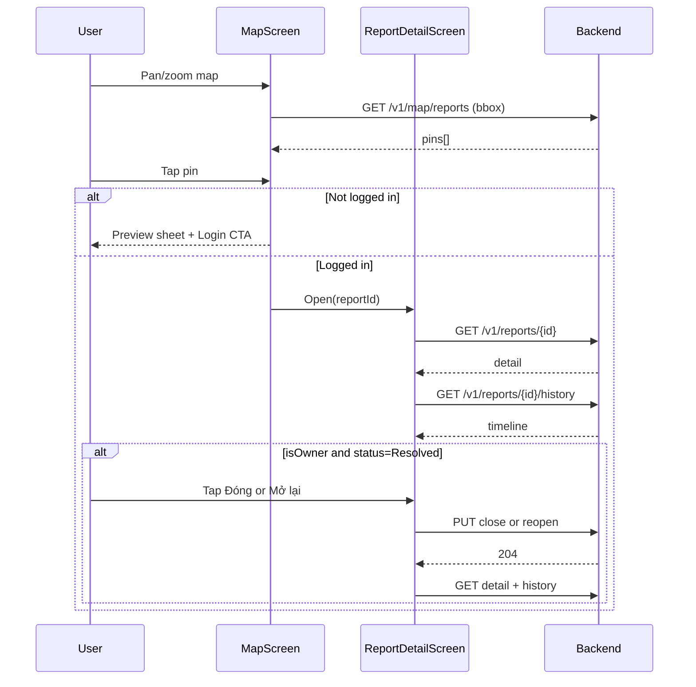

# Citizen — Map pin → Màn chi tiết báo cáo (FE guide)

Tài liệu cho **mobile/web FE** implement màn **chi tiết báo cáo** khi user chạm pin trên **bản đồ công khai**.

> **Trạng thái hiện tại:** FE đã có **load pin** (`GET /v1/map/reports`). **Chưa có** màn/route chi tiết + gọi API detail/history/actions.  
> **Tài liệu map viewport (load pin):** xem thêm [`PUBLIC_MAP_VIEWPORT_PLAN.md`](./PUBLIC_MAP_VIEWPORT_PLAN.md).  
> **Card "Khu vực đang xem" (số báo cáo + chart):** [`fe-citizen-map-viewport-summary.md`](./fe-citizen-map-viewport-summary.md).

---

## 1. User story (đọc trước khi code)

| Ai | Làm gì |
|----|--------|
| **Khách / chưa login** | Xem map, chạm pin → thấy **preview** (callout). Muốn xem đầy đủ → **đăng nhập**. |
| **Citizen đã login** | Chạm pin → màn **chi tiết**: xem tiến độ cộng đồng; nếu **là báo cáo của mình** và đã **xử lý xong** → có thể **Đóng** hoặc **Mở lại**. |
| **Mọi citizen** | Từ map vẫn có nút **Tạo báo cáo mới** (flow riêng, không gắn pin cũ). |

**Không có trên map/detail (phase hiện tại):** bình luận, like, báo trùng, sửa pin người khác, phân công team.

---

## 2. Luồng màn hình (đề xuất UX)

```
[Map]
  │  pan/zoom → GET /v1/map/reports (đã có)
  │
  ├─ tap pin (chưa login)
  │     → Bottom sheet PREVIEW (dùng data pin, không gọi detail)
  │     → CTA: "Đăng nhập để xem chi tiết"
  │
  ├─ tap pin (đã login)
  │     → Navigate: ReportDetailScreen(reportId)
  │     → GET /v1/reports/{id}
  │     → GET /v1/reports/{id}/history (optional, tab hoặc section timeline)
  │     → Render nút theo isOwner + status
  │
  └─ FAB "Báo cáo mới"
        → flow CREATE_POLLUTION_REPORT (docs/CREATE_POLLUTION_REPORT_FLOW.md)
```

**Preview vs Detail**

| | Preview (callout) | Detail (màn mới) |
|--|-------------------|------------------|
| Nguồn data | Response pin từ `GET /map/reports` | `GET /reports/{id}` |
| Auth | Không bắt buộc | **Bearer bắt buộc** |
| GPS | Đã làm tròn (~11 m) | Tọa độ **chính xác** trong DB |
| Hành động | Không | Close / Reopen (có điều kiện) |

---

## 3. API contract

Base URL: theo [`00_API_CONVENTIONS.md`](../00_API_CONVENTIONS.md) — envelope `{ code, message, status, data }`.

Headers chung:

```
Authorization: Bearer {accessToken}   // bắt buộc cho detail + actions
Accept-Language: vi-VN
```

### 3.1 Load pin (đã có)

```http
GET /v1/map/reports?minLat=&maxLat=&minLng=&maxLng=&mode=detail&limit=200&categoryId=
```

- `mode=detail` → `data.mode === "detail"`, `data.items[]` là danh sách pin.
- `limit`: default 200, max 500.
- Pin **không** hiển thị `Submitted`, `Rejected`, `Duplicate` (chỉ báo cáo đã công khai trở đi).

**Pin item (`data.items[]`) — field FE cần:**

| Field | Kiểu | UI gợi ý |
|-------|------|----------|
| `id` | uuid | Dùng navigate detail |
| `code` | string | Mã hiển thị (vd. `GL-2026-00123`) |
| `latitude`, `longitude` | decimal | Marker (đã làm tròn) |
| `severity` | enum | Màu pin |
| `title` | string | Tên loại ô nhiễm (VI) |
| `categoryCode`, `categoryIconUrl` | string | Icon chip |
| `description`, `address` | string? | Callout |
| `imageUrl` | string? | Ảnh thumbnail callout |
| `reporterCount` | int | "N người đã báo cáo tại đây" |
| `status` | enum | Badge trạng thái |
| `createdAt` | datetime | Thời gian |

### 3.2 Chi tiết (màn mới — bắt buộc implement)

```http
GET /v1/reports/{reportId}
Authorization: Bearer {token}
```

**Response `data` — các field quan trọng cho UI:**

| Field | Ghi chú FE |
|-------|------------|
| `id`, `code` | Header |
| `reporterId` | So với `currentUser.id` → `isOwner` |
| `status` | Quyết định badge + nút hành động |
| `categoryName`, `severity`, `description`, `address` | Thông tin chính |
| `latitude`, `longitude` | Mini map / "Chỉ đường" (không share PII ra ngoài app) |
| `reporterCount`, `reopenedCount` | Copy UX |
| `media[]` | Gallery (`url`, `mediaType`) |
| `assignments[]` | Block "Đang xử lý": `teamName`, `status`, `progressPercent`, `progressNote` |
| `wasteTags[]` | Chip loại rác |
| `createdAt`, `verifiedAt`, `startedAt`, `resolvedAt`, `closedAt` | Mốc thời gian |
| `slaVerifyDueAt`, `slaResolveDueAt` | Optional countdown (owner) |

**Lỗi:**

| HTTP | `code` | Xử lý UI |
|------|--------|----------|
| 404 | `REPORT_NOT_FOUND` | "Báo cáo không tồn tại" + back |
| 401 | `UNAUTHORIZED` | Redirect login |

### 3.3 Timeline (khuyến nghị có)

```http
GET /v1/reports/{reportId}/history
Authorization: Bearer {token}
```

`data.items[]`: `fromStatus`, `toStatus`, `changedByName`, `reason`, `createdAt`.

Dùng cho section **"Lịch sử xử lý"** (vertical timeline).

### 3.4 Hành động citizen (chỉ khi `isOwner`)

#### Đóng báo cáo (hài lòng)

```http
PUT /v1/reports/{reportId}/close
Authorization: Bearer {token}
```

- Body: **không có**.
- Success: **204** (no content).
- Chỉ khi `status` ∈ `Resolved`, `PenaltyIssued`.

#### Mở lại (chưa hài lòng)

```http
PUT /v1/reports/{reportId}/reopen
Authorization: Bearer {token}
```

- Body: **không có**.
- Success: **204**.
- Chỉ khi `status === Resolved` và `reopenedCount < 2`.

**Lỗi hành động:**

| HTTP | `code` | Hiển thị |
|------|--------|----------|
| 422 | `INVALID_STATUS_TRANSITION` | "Không thể thực hiện ở trạng thái hiện tại" |
| 422 | `REOPEN_LIMIT_REACHED` | "Đã hết 2 lần mở lại" |
| 404 | `REPORT_NOT_FOUND` | — |

> **Lưu ý BE (tạm thời):** Server **chưa** chặn `reporterId` trên `close`/`reopen`. FE **bắt buộc** chỉ hiện nút khi `data.reporterId === currentUser.id` để tránh user bấm nhầm trên pin người khác.

---

## 4. Logic nút trên màn Detail (`isOwner`)

Tính trên client:

```ts
const isOwner = detail.reporterId != null && detail.reporterId === currentUser.id;
```

### 4.1 Pin **không phải** của mình (`!isOwner`)

- **Chỉ đọc:** gallery, mô tả, địa chỉ, status, assignments (tiến độ công khai), history.
- **Ẩn:** Đóng, Mở lại.
- Có thể hiện banner: *"Đây là báo cáo từ cộng đồng"*.

### 4.2 Pin **của mình** (`isOwner`)

| `status` | Nút hiển thị | API |
|----------|--------------|-----|
| `Submitted`, `Verified`, `Dispatched`, `Assigned`, `InProgress` | Không (chỉ badge "Đang xử lý") | — |
| `Rejected`, `Duplicate` | Không | — |
| `Resolved` | **Đóng** + **Mở lại** | `close`, `reopen` |
| `PenaltyIssued` | Chỉ **Đóng** | `close` |
| `Closed`, `ClosedNoViolation` | Không | — |

**Copy nút gợi ý (VI):**

| Nút | Confirm dialog |
|-----|----------------|
| Đóng | "Xác nhận bạn hài lòng với kết quả xử lý?" |
| Mở lại | "Báo cáo sẽ được gửi xử lý lại. Bạn còn {2 - reopenedCount} lần mở lại." |

Sau `close` / `reopen` thành công: **refetch** `GET /reports/{id}` + `history` (hoặc optimistic + invalidate cache).

---

## 5. Nhãn trạng thái (UI copy)

Map enum JSON thường là PascalCase (`InProgress`). Hiển thị user-friendly:

| `status` | Label gợi ý |
|----------|-------------|
| `Submitted` | Đã gửi — chờ xác minh |
| `Verified` | Đã xác minh |
| `Dispatched` | Đã điều phối |
| `Assigned` | Đã phân công |
| `InProgress` | Đang xử lý |
| `Resolved` | Đã xử lý xong — chờ bạn xác nhận |
| `PenaltyIssued` | Đã xử phạt — chờ bạn xác nhận |
| `Closed` | Đã đóng |
| `Rejected` | Bị từ chối |
| `Duplicate` | Trùng báo cáo |
| `ClosedNoViolation` | Đã đóng — không vi phạm |

Với **owner** + `Resolved`: nhấn mạnh CTA **Đóng / Mở lại** ở footer sticky.

---

## 6. Cấu trúc màn hình (checklist implement)

### Route / params

- Route ví dụ: `/map/report/:reportId` hoặc modal full-screen.
- `reportId` lấy từ `pin.id` khi tap.

### Sections (thứ tự trên)

1. **Header:** `code`, badge `status`, `severity`
2. **Ảnh:** carousel `media` (fallback `imageUrl` từ pin nếu detail chưa load)
3. **Thông tin:** `categoryName`, `description`, `address`, `reporterCount`
4. **Tiến độ xử lý** (nếu `assignments.length > 0`): list team + `progressPercent` + note
5. **Loại rác:** chips `wasteTags`
6. **Timeline:** `history` (collapse nếu dài)
7. **Footer actions:** theo mục 4 (chỉ `isOwner`)

### Loading / error

- Skeleton khi fetch detail.
- Nếu mất mạng: retry.
- Pin trên map có thể **cũ hơn** detail sau khi officer cập nhật → luôn ưu tiên data từ `GET /reports/{id}` sau khi mở màn.

---

## 7. Điều hướng từ Tab "Báo cáo của tôi"

Cùng **một component** `ReportDetailScreen` dùng cho:

| Nguồn vào | List API | Detail API |
|-----------|----------|------------|
| Map pin | `GET /map/reports` | `GET /reports/{id}` |
| Tab Reports | `GET /reports/my` | `GET /reports/{id}` |

Logic `isOwner` + nút **giống hệt** — chỉ khác cách vào màn.

**FE guide tab Reports (list + bấm Chi tiết):** [`fe-citizen-reports-tab-detail.md`](./fe-citizen-reports-tab-detail.md).

---

## 8. Sequence diagram (FE ↔ BE)



---

## 9. Out of scope (đừng chờ API)

| Tính năng | Trạng thái BE |
|-----------|----------------|
| Comment trên báo cáo | Chưa có API |
| Đánh giá sao / satisfaction | Entity DB có, **chưa** HTTP |
| Báo trùng từ map | Officer/AI flow |
| Sửa/xóa báo cáo sau khi gửi | Chưa có |
| Auto-close 7 ngày | Job nền (user không bấm) |

---

## 10. Test cases (QA / FE)

| # | Scenario | Expected |
|---|----------|----------|
| 1 | Tap pin, chưa login | Preview only, không gọi `/reports/{id}` |
| 2 | Tap pin, đã login, pin người khác | Detail read-only, không nút Đóng/Mở lại |
| 3 | Tap pin báo cáo của mình, `InProgress` | Detail, không nút action |
| 4 | Owner, `Resolved` | Có Đóng + Mở lại; reopen thành công → status `InProgress` |
| 5 | Owner, `Resolved`, đã reopen 2 lần | Ẩn Mở lại; API reopen → `REOPEN_LIMIT_REACHED` |
| 6 | Owner, `Resolved`, bấm Đóng | 204 → status `Closed` |
| 7 | Owner, `PenaltyIssued` | Chỉ Đóng |
| 8 | `GET /reports/{id}` 404 | Back + toast |

---

## 11. Tài liệu liên quan

| File | Nội dung |
|------|----------|
| [`PUBLIC_MAP_VIEWPORT_PLAN.md`](./PUBLIC_MAP_VIEWPORT_PLAN.md) | Load pin, debounce bbox, aggregate zoom |
| [`CREATE_POLLUTION_REPORT_FLOW.md`](./CREATE_POLLUTION_REPORT_FLOW.md) | Tạo báo cáo mới từ map |
| [`MOBILE_AUTH_INTEGRATION.md`](./MOBILE_AUTH_INTEGRATION.md) | JWT, role `Citizen` |
| [`report_workflow_v2_NEW.md`](./report_workflow_v2_NEW.md) | State machine đầy đủ (PM/BA) |
| [`fe-citizen-reports-tab-detail.md`](./fe-citizen-reports-tab-detail.md) | Tab Báo cáo → list `/my` → Chi tiết |

---

**Phiên bản:** 1.0 — 2026-06-01  
**Backend:** `ReportsController`, `MapController` — branch hiện tại của repo `greenlens-service`.
