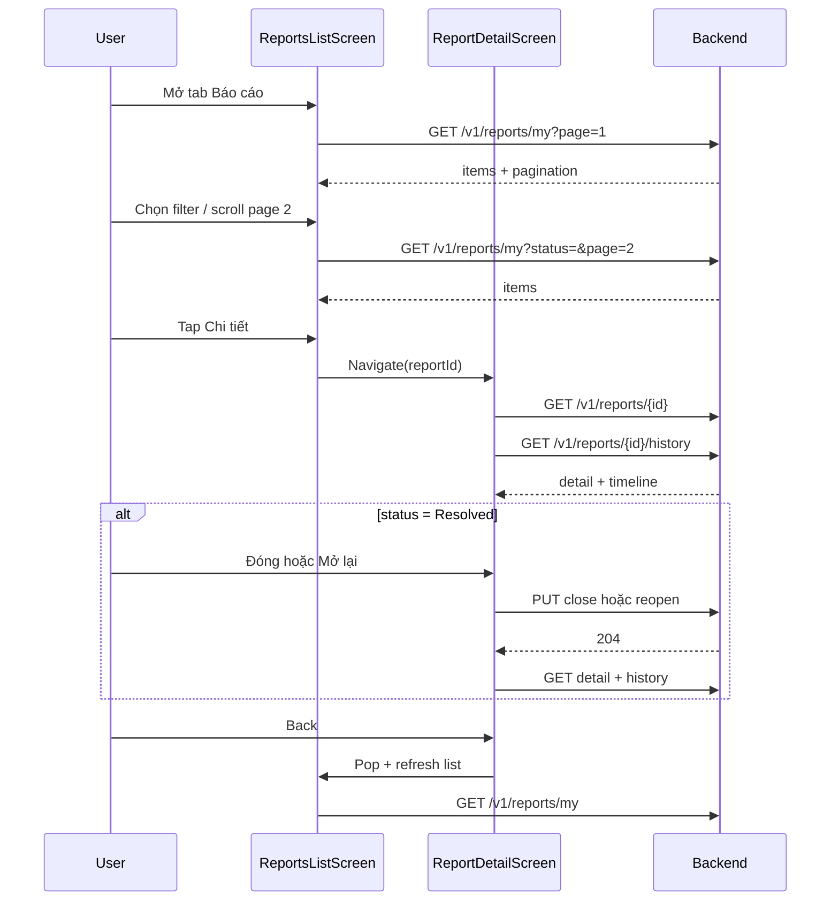

# Citizen — Tab Báo cáo → Danh sách → Chi tiết (FE guide)

Tài liệu cho **mobile/web FE** implement luồng **Tab Reports / Báo cáo của tôi**: danh sách báo cáo user đã gửi → bấm **Chi tiết** → màn theo dõi + hành động (đóng / mở lại).

> **Khác với map:** Tab này **luôn** là báo cáo **của chính user** (`GET /reports/my`). Không cần check `isOwner` — mọi item trong list đều là của họ.  
> **Map pin → detail:** xem [`fe-citizen-map-report-detail.md`](./fe-citizen-map-report-detail.md).  
> **Component dùng chung:** Nên dùng **một** `ReportDetailScreen(reportId)` cho cả Map và Tab Reports (chỉ khác màn trước đó khi Back).

---

## 1. User story

| Bước | User làm gì |
|------|-------------|
| 1 | Vào tab **Báo cáo** (cần đăng nhập) |
| 2 | Xem **danh sách** báo cáo đã gửi + **trạng thái** từng dòng |
| 3 | (Tuỳ chọn) Lọc theo trạng thái |
| 4 | Bấm một dòng → **Chi tiết** |
| 5 | Xem ảnh, mô tả, tiến độ team, timeline |
| 6 | Khi báo cáo **đã xử lý xong** → bấm **Đóng** (hài lòng) hoặc **Mở lại** (chưa ổn, tối đa 2 lần) |

**Không có trong tab này (phase hiện tại):** sửa nội dung báo cáo, xóa báo cáo, bình luận, đánh giá sao.

---

## 2. Luồng màn hình

```
[Tab Reports]  (auth required)
  │
  ├─ on mount / pull refresh
  │     → GET /v1/reports/my?page=&pageSize=&status=
  │
  ├─ filter chip (optional)
  │     → gọi lại /my với status=Submitted | InProgress | Resolved | ...
  │
  ├─ tap row / "Chi tiết"
  │     → Navigate: ReportDetailScreen(reportId)
  │     → GET /v1/reports/{id}
  │     → GET /v1/reports/{id}/history
  │     → Footer: Đóng / Mở lại theo status (mục 5)
  │
  └─ FAB hoặc header "+" (tuỳ design)
        → Tạo báo cáo mới (docs/CREATE_POLLUTION_REPORT_FLOW.md)
```

**Back stack gợi ý:** `ReportsList` → `ReportDetail` → Back về list → **refresh list** nếu vừa close/reopen.

---

## 3. API — Danh sách (Tab list)

### 3.1 Báo cáo của tôi

```http
GET /v1/reports/my?page=1&pageSize=20&status={optional}
Authorization: Bearer {token}
Accept-Language: vi-VN
```

| Query | Mặc định | Ghi chú |
|-------|----------|---------|
| `page` | 1 | 1-based |
| `pageSize` | 20 | Max **100** (convention chung) |
| `status` | (bỏ trống = tất cả) | Lọc một trạng thái |

**Response `data`:**

```json
{
  "items": [
    {
      "id": "uuid",
      "code": "GL-2026-00123",
      "categoryName": "Rác thải sinh hoạt",
      "severity": "Medium",
      "status": "InProgress",
      "address": "123 Đường ABC, Phường ...",
      "createdAt": "2026-05-01T10:00:00Z",
      "resolvedAt": null,
      "closedAt": null
    }
  ],
  "pagination": {
    "page": 1,
    "pageSize": 20,
    "totalItems": 42,
    "totalPages": 3,
    "hasNext": true,
    "hasPrev": false
  }
}
```

**Field hiển thị trên card/row:**

| Field | UI |
|-------|-----|
| `code` | Subtitle hoặc title phụ |
| `categoryName` | Title chính |
| `status` | Badge màu (mục 4) |
| `severity` | Icon/chip nhỏ |
| `address` | 1 dòng, truncate |
| `createdAt` | "Gửi lúc …" |
| `resolvedAt` / `closedAt` | Optional: "Hoàn thành …" / "Đóng …" |

**Pagination:** infinite scroll hoặc nút "Xem thêm" khi `pagination.hasNext === true`.

**Lỗi list:**

| HTTP | Xử lý |
|------|--------|
| 401 | Redirect login |
| Khác | Toast + retry |

> **Không dùng** `GET /v1/reports` cho tab citizen — endpoint đó trả **toàn bộ** báo cáo hệ thống (officer/admin), không phải "của tôi".

---

## 4. Filter trạng thái (UI gợi ý)

Chip / tab filter gọi lại `GET /my?status=...`:

| Chip label (VI) | `status` query |
|-----------------|----------------|
| Tất cả | *(không gửi param)* |
| Chờ xử lý | `Submitted` |
| Đang xử lý | `InProgress` *(hoặc gộp thêm `Verified`, `Dispatched`, `Assigned` nếu muốn 1 chip "đang chạy" — khi đó FE filter client-side hoặc nhiều request)* |
| Chờ bạn xác nhận | `Resolved`, `PenaltyIssued` — **2 chip riêng** hoặc 1 chip "Cần xác nhận" (FE filter 2 status trên list đã load, hoặc 2 tab) |
| Đã đóng | `Closed`, `ClosedNoViolation` |
| Bị từ chối | `Rejected` |
| Trùng | `Duplicate` |

**Gợi ý đơn giản (MVP):** Tất cả | Đang xử lý | Cần xác nhận | Đã xong | Bị từ chối.

---

## 5. API — Chi tiết (sau bấm Details)

Dùng **cùng contract** với map detail — xem đầy đủ field trong [`fe-citizen-map-report-detail.md` §3.2–3.4](./fe-citizen-map-report-detail.md#32-chi-tiết-màn-mới--bắt-buộc-implement).

Tóm tắt:

```http
GET /v1/reports/{reportId}
GET /v1/reports/{reportId}/history
Authorization: Bearer {token}
```

```http
PUT /v1/reports/{reportId}/close    # 204, no body
PUT /v1/reports/{reportId}/reopen   # 204, no body
```

### 5.1 Nút hành động (Tab Reports — luôn owner)

**Không cần** `isOwner = reporterId === me` — user chỉ vào detail từ list của mình.

| `status` | Footer actions |
|----------|----------------|
| `Submitted`, `Verified`, `Dispatched`, `Assigned`, `InProgress` | Không nút — hiện text *"Đang được xử lý, vui lòng chờ"* |
| `Rejected` | Không nút — hiện `reason` từ **history** (item `toStatus = Rejected`) |
| `Duplicate` | Không nút — giải thích trùng báo cáo |
| `Resolved` | **Đóng** + **Mở lại** |
| `PenaltyIssued` | Chỉ **Đóng** |
| `Closed`, `ClosedNoViolation` | Không nút — *"Báo cáo đã kết thúc"* |

**`reopenedCount`:** Hiển thị *"Đã mở lại {n}/2 lần"* khi `n > 0`. Ẩn nút **Mở lại** khi `reopenedCount >= 2`.

**Confirm trước khi gọi API:**

| Nút | Dialog |
|-----|--------|
| Đóng | "Bạn xác nhận hài lòng với kết quả xử lý?" |
| Mở lại | "Báo cáo sẽ được gửi xử lý lại. Còn {2 - reopenedCount} lần mở lại." |

**Sau success (204):** Refetch detail + history; khi Back → refresh `GET /my`.

---

## 6. Cấu trúc màn hình

### 6.1 ReportsListScreen

| Thành phần | Mô tả |
|------------|--------|
| Header | "Báo cáo của tôi" + nút tạo mới |
| Filter chips | Mục 4 |
| List | `FlatList` + pagination |
| Empty state | "Bạn chưa gửi báo cáo nào" + CTA tạo mới |
| Pull-to-refresh | Reset `page=1` |

### 6.2 ReportDetailScreen (shared)

| Section | Nguồn |
|---------|--------|
| Header | `code`, badge `status` |
| Gallery | `media[]` |
| Thông tin | `categoryName`, `severity`, `description`, `address` |
| Tiến độ | `assignments[]` — team, %, note |
| Loại rác | `wasteTags[]` |
| Mốc thời gian | `createdAt`, `verifiedAt`, `resolvedAt`, `closedAt` |
| Timeline | `history.items[]` |
| Footer sticky | Nút mục 5.1 |

**Tuỳ chọn:** Link **"Xem trên bản đồ"** → navigate Map centered tại `latitude`/`longitude` (pin có thể chưa hiện nếu status còn `Submitted`).

---

## 7. Nhãn trạng thái (list + detail)

Dùng chung bảng copy với map doc:

| `status` | Label (VI) |
|----------|------------|
| `Submitted` | Đã gửi — chờ xác minh |
| `Verified` | Đã xác minh |
| `Dispatched` | Đã điều phối |
| `Assigned` | Đã phân công |
| `InProgress` | Đang xử lý |
| `Resolved` | **Đã xử lý — cần bạn xác nhận** |
| `PenaltyIssued` | **Đã xử phạt — cần bạn xác nhận** |
| `Closed` | Đã đóng |
| `ClosedNoViolation` | Đã đóng (không vi phạm) |
| `Rejected` | Bị từ chối |
| `Duplicate` | Trùng báo cáo |

Trên list, highlight badge **vàng/cam** cho `Resolved` và `PenaltyIssued` để user biết cần vào detail bấm Đóng/Mở lại.

---

## 8. So sánh Tab Reports vs Map detail

| | Tab Reports | Map pin |
|--|-------------|---------|
| List API | `GET /reports/my` | `GET /map/reports` |
| Vào detail từ | Row list | Tap pin |
| Luôn owner? | **Có** | Chỉ khi `reporterId === me` |
| Check `isOwner` | Không | **Có** |
| Status trên list | Mọi status (kể cả `Submitted`, `Rejected`) | Pin chỉ status công khai |
| Nút Đóng/Mở lại | Theo bảng mục 5.1 | Chỉ khi owner + đúng status |
| Screen detail | **Cùng component** | **Cùng component** |

---

## 9. Sequence diagram



---

## 10. Test cases

| # | Scenario | Expected |
|---|----------|----------|
| 1 | Tab chưa login | Redirect login |
| 2 | List empty | Empty state + CTA tạo báo cáo |
| 3 | Filter `status=Resolved` | Chỉ item Resolved |
| 4 | Pagination `hasNext` | Load page 2 nối list |
| 5 | Detail `InProgress` | Không nút Đóng/Mở lại |
| 6 | Detail `Resolved` | Có Đóng + Mở lại |
| 7 | Reopen lần 3 | API `REOPEN_LIMIT_REACHED`, ẩn nút Mở lại |
| 8 | Close success | Status `Closed`, list refresh badge |
| 9 | `Rejected` | Timeline có reason, không nút action |
| 10 | Back từ detail | List cập nhật status mới |

---

## 11. Tài liệu liên quan

| File | Nội dung |
|------|----------|
| [`fe-citizen-map-report-detail.md`](./fe-citizen-map-report-detail.md) | Chi tiết từ map, field API đầy đủ |
| [`CREATE_POLLUTION_REPORT_FLOW.md`](./CREATE_POLLUTION_REPORT_FLOW.md) | Tạo báo cáo mới |
| [`MOBILE_AUTH_INTEGRATION.md`](./MOBILE_AUTH_INTEGRATION.md) | JWT |
| [`report_workflow_v2_NEW.md`](./report_workflow_v2_NEW.md) | State machine (BA) |

---

**Phiên bản:** 1.0 — 2026-06-01  
**Backend:** `GET /v1/reports/my`, `GET|PUT /v1/reports/{id}*`
