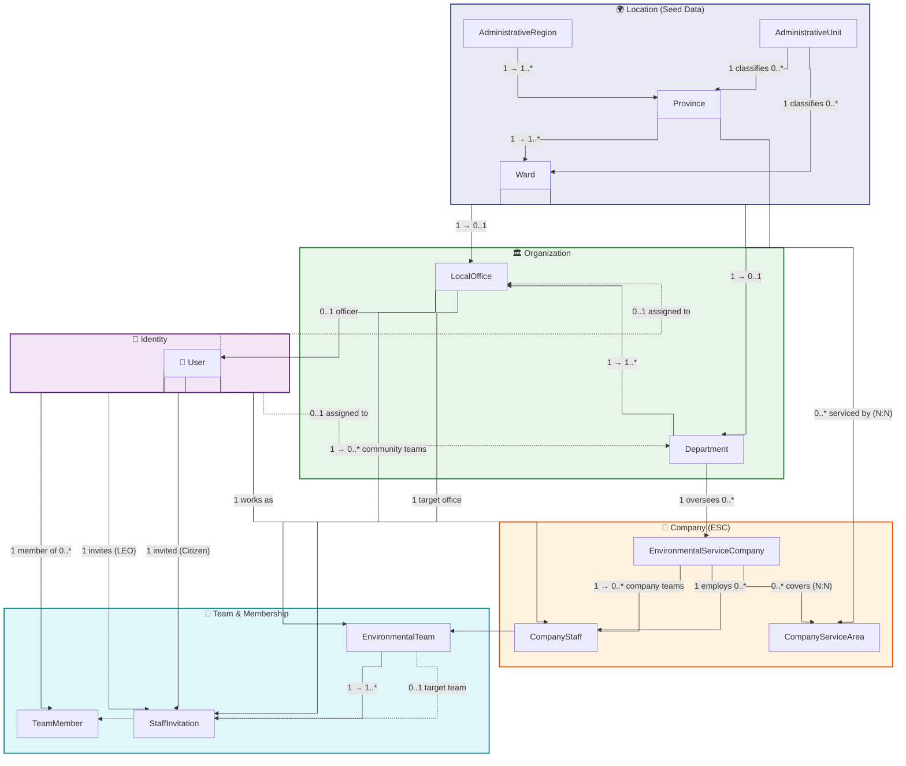
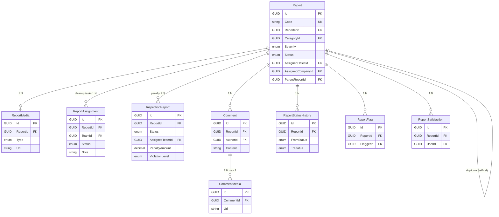
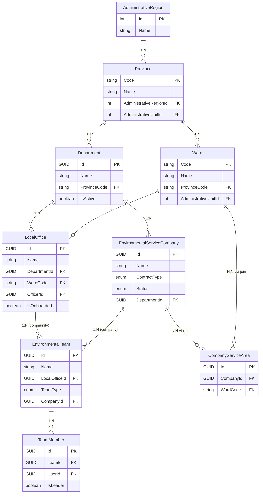
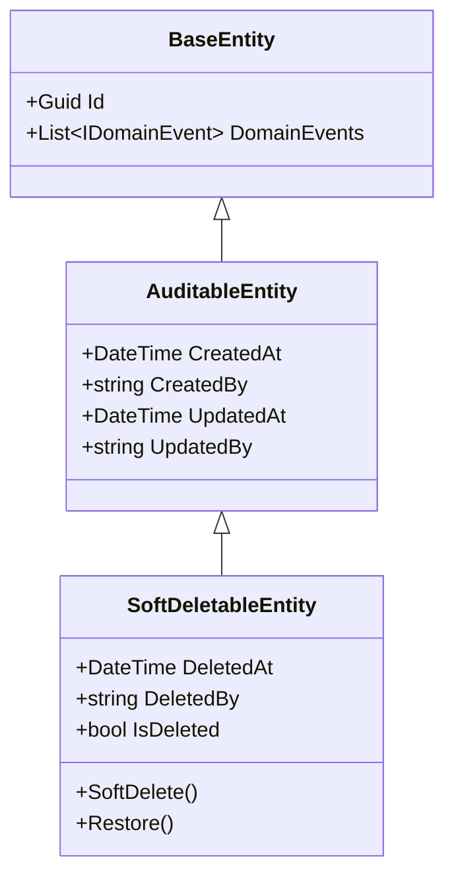

# GreenLens — Logical ERD (v1.2 Aligned)

> **Dự án:** SU26SE049 — Crowdsourced Application for Reporting Environmental Pollution
> **Ngày tạo:** 2026-06-30 · **Nguồn:** Domain entities + BR v1.2
> **Cập nhật:** Bổ sung entities chưa implement theo BR v1.2

---

## Quy ước ký hiệu

| Ký hiệu | Ý nghĩa |
|----------|---------|
| **PK** | Primary Key |
| **FK** | Foreign Key |
| **UK** | Unique Key |
| **NN** | Not Null |
| *(italic)* | Nullable |
| `«enum»` | Giá trị từ enum |
| 🟢 | Đã implement trong codebase |
| 🔴 | **CHƯA implement** — cần tạo mới |

---

# Module 1: Identity & Authentication 🟢

## User 🟢

| Key | Attribute | Data Type | Constraint |
|-----|-----------|-----------|------------|
| PK | Id | GUID | NN |
| | Email | String | NN, UK |
| | PasswordHash | String | NN |
| | FullName | String | NN |
| | *PhoneNumber* | String | UK |
| | *AvatarUrl* | String | |
| | Role | «UserRole» | NN |
| | IsEmailVerified | Boolean | NN |
| | IsPhoneVerified | Boolean | NN |
| | MustChangePassword | Boolean | NN |
| | FailedLoginAttempts | Integer | NN |
| | *LockoutEnd* | DateTime | |
| | *GoogleId* | String | |
| | IsBanned | Boolean | NN |
| | *FcmDeviceToken* | String | |
| | Language | String | NN, default "vi-VN" |
| FK | *DepartmentId* | GUID | → Department |
| FK | *LocalOfficeId* | GUID | → LocalOffice |
| | CreatedAt | DateTime | NN |
| | *CreatedBy* | String | |
| | *UpdatedAt* | DateTime | |
| | *UpdatedBy* | String | |
| | *DeletedAt* | DateTime | Soft delete |
| | *DeletedBy* | String | |

> **«UserRole»**: Citizen, DEO, LEO, Cleaner, CompanyManager, CompanyStaff, Inspector, Admin

---

## RefreshToken 🟢

| Key | Attribute | Data Type | Constraint |
|-----|-----------|-----------|------------|
| PK | Id | GUID | NN |
| FK | UserId | GUID | NN → User |
| | TokenHash | String | NN |
| | ExpiresAt | DateTime | NN |
| | CreatedAt | DateTime | NN |
| | IsRevoked | Boolean | NN |
| | *RevokedAt* | DateTime | |
| | *ReplacedByTokenHash* | String | |

---

## OtpCode 🟢

| Key | Attribute | Data Type | Constraint |
|-----|-----------|-----------|------------|
| PK | Id | GUID | NN |
| | Email | String | NN |
| | *PhoneNumber* | String | |
| | CodeHash | String | NN |
| | Purpose | «OtpPurpose» | NN |
| | ExpiresAt | DateTime | NN |
| | CreatedAt | DateTime | NN |
| | IsUsed | Boolean | NN |
| | AttemptCount | Integer | NN |

> **«OtpPurpose»**: EmailVerification, PasswordReset, PhoneVerification

---

## PasswordHistory 🟢

| Key | Attribute | Data Type | Constraint |
|-----|-----------|-----------|------------|
| PK | Id | GUID | NN |
| FK | UserId | GUID | NN → User |
| | PasswordHash | String | NN |
| | CreatedAt | DateTime | NN |

---

# Module 2: Organization & Routing 🟢

## Department 🟢

| Key | Attribute | Data Type | Constraint |
|-----|-----------|-----------|------------|
| PK | Id | GUID | NN |
| | Name | String | NN |
| FK | ProvinceCode | String(2) | NN → Province |
| | IsActive | Boolean | NN |
| | CreatedAt | DateTime | NN |
| | *CreatedBy* | String | |
| | *UpdatedAt* | DateTime | |
| | *UpdatedBy* | String | |

---

## LocalOffice 🟢

| Key | Attribute | Data Type | Constraint |
|-----|-----------|-----------|------------|
| PK | Id | GUID | NN |
| | Name | String | NN |
| FK | DepartmentId | GUID | NN → Department |
| FK | WardCode | String(5) | NN → Ward |
| FK | *OfficerId* | GUID | → User (LEO) |
| | IsOnboarded | Boolean | NN |
| | CreatedAt | DateTime | NN |
| | *CreatedBy* | String | |
| | *UpdatedAt* | DateTime | |
| | *UpdatedBy* | String | |

---

## EnvironmentalTeam 🟢

| Key | Attribute | Data Type | Constraint |
|-----|-----------|-----------|------------|
| PK | Id | GUID | NN |
| | Name | String | NN |
| FK | *LocalOfficeId* | GUID | → LocalOffice |
| | TeamType | «TeamType» | NN |
| | IsActive | Boolean | NN |
| FK | *CompanyId* | GUID | → EnvironmentalServiceCompany |
| | CreatedAt | DateTime | NN |
| | *CreatedBy* | String | |
| | *UpdatedAt* | DateTime | |
| | *UpdatedBy* | String | |

> **«TeamType»**: Cleanup, Inspection
> **BR-ORG-003:** Team chỉ thuộc 1 chủ thể (LocalOffice HOẶC Company) tại một thời điểm.

---

## TeamMember 🟢

| Key | Attribute | Data Type | Constraint |
|-----|-----------|-----------|------------|
| PK | Id | GUID | NN |
| FK | TeamId | GUID | NN → EnvironmentalTeam |
| FK | UserId | GUID | NN → User |
| | IsLeader | Boolean | NN |
| | JoinedAt | DateTime | NN |

---

## StaffInvitation 🟢

| Key | Attribute | Data Type | Constraint |
|-----|-----------|-----------|------------|
| PK | Id | GUID | NN |
| FK | InvitedByUserId | GUID | NN → User (LEO) |
| FK | InvitedUserId | GUID | NN → User (Citizen) |
| FK | LocalOfficeId | GUID | NN → LocalOffice |
| FK | *TeamId* | GUID | → EnvironmentalTeam |
| | TargetRole | «UserRole» | NN |
| | Status | «InvitationStatus» | NN |
| | ExpiresAt | DateTime | NN |
| | *RespondedAt* | DateTime | |
| | Token | String | NN, UK |
| | CreatedAt | DateTime | NN |
| | *CreatedBy* | String | |
| | *UpdatedAt* | DateTime | |
| | *UpdatedBy* | String | |

> **«InvitationStatus»**: Pending, Accepted, Declined, Cancelled, Expired

---

# Module 3: Company Management 🟢

## EnvironmentalServiceCompany 🟢

| Key | Attribute | Data Type | Constraint |
|-----|-----------|-----------|------------|
| PK | Id | GUID | NN |
| | Name | String | NN |
| | *TaxCode* | String | |
| | *Address* | String | |
| | *Phone* | String | |
| | *Email* | String | |
| | ContractNumber | String | NN |
| | ContractStartDate | DateTime | NN |
| | *ContractEndDate* | DateTime | |
| | ContractType | «ContractType» | NN |
| | Status | «CompanyStatus» | NN |
| | *ActivatedAt* | DateTime | |
| FK | DepartmentId | GUID | NN → Department |
| | CreatedAt | DateTime | NN |
| | *CreatedBy* | String | |
| | *UpdatedAt* | DateTime | |
| | *UpdatedBy* | String | |

> **«ContractType»**: Subsidiary, Bidding (BR-CMP-001, BR-CMP-003)
> **«CompanyStatus»**: PendingActivation, Active, Suspended, Expired, Terminated (BR-CMP-004)

---

## CompanyStaff 🟢

| Key | Attribute | Data Type | Constraint |
|-----|-----------|-----------|------------|
| PK | Id | GUID | NN |
| FK | UserId | GUID | NN → User |
| FK | CompanyId | GUID | NN → EnvironmentalServiceCompany |
| | *Position* | String | |
| | IsActive | Boolean | NN |
| | CreatedAt | DateTime | NN |
| | *CreatedBy* | String | |
| | *UpdatedAt* | DateTime | |
| | *UpdatedBy* | String | |

---

## CompanyServiceArea 🟢

| Key | Attribute | Data Type | Constraint |
|-----|-----------|-----------|------------|
| PK | Id | GUID | NN |
| FK | CompanyId | GUID | NN → EnvironmentalServiceCompany |
| FK | WardCode | String(5) | NN → Ward |
| | CreatedAt | DateTime | NN |
| | *CreatedBy* | String | |
| | *UpdatedAt* | DateTime | |
| | *UpdatedBy* | String | |

> **BR-CMP-014**: Company ↔ Ward là N–N

---

# Module 4: Pollution Report (Core) 🟢

## Report 🟢

| Key | Attribute | Data Type | Constraint |
|-----|-----------|-----------|------------|
| PK | Id | GUID | NN |
| | Code | String | NN, UK |
| FK | *ReporterId* | GUID | → User |
| FK | CategoryId | GUID | NN → PollutionCategory |
| | Severity | «Severity» | NN |
| | SeveritySetBy | «SeveritySource» | NN |
| | *Description* | String | |
| | Latitude | Decimal | NN |
| | Longitude | Decimal | NN |
| | *Address* | String | |
| | *WardCode* | String(5) | |
| | *ProvinceCode* | String(2) | |
| | Status | «ReportStatus» | NN |
| FK | *AssignedOfficeId* | GUID | → LocalOffice |
| FK | *AssignedDepartmentId* | GUID | → Department |
| FK | *VerifiedBy* | GUID | → User (LEO) |
| FK | *AssignedByOfficerId* | GUID | → User |
| FK | *AssignedCompanyId* | GUID | → EnvironmentalServiceCompany |
| | *DispatchedToCompanyAt* | DateTime | |
| FK | *ParentReportId* | GUID | → Report (self-ref, duplicate) |
| | ReporterCount | Integer | NN, default 1 |
| | IsSuspicious | Boolean | NN |
| | *SuspiciousReasons* | String | |
| | AiPending | Boolean | NN |
| | *AiClassifiedType* | String | |
| | *AiConfidence* | Decimal | |
| | *AiEstimatedSeverity* | «Severity» | |
| | *AiSuggestedWasteTagCodes* | String | |
| | PriorityScore | Decimal | NN |
| | *VerifiedAt* | DateTime | |
| | *RejectedReason* | String | |
| | *StartedAt* | DateTime | |
| | *ResolvedAt* | DateTime | |
| | *ClosedAt* | DateTime | |
| | ReopenedCount | Integer | NN |
| | *SlaVerifyDueAt* | DateTime | |
| | *SlaResolveDueAt* | DateTime | |
| | SlaVerifyBreached | Boolean | NN |
| | SlaResolveBreached | Boolean | NN |
| | CreatedAt | DateTime | NN |
| | *CreatedBy* | String | |
| | *UpdatedAt* | DateTime | |
| | *UpdatedBy* | String | |
| | *DeletedAt* | DateTime | Soft delete |
| | *DeletedBy* | String | |

> **«ReportStatus»**: Submitted, Verified, InProgress, Resolved, Closed, Rejected, Duplicate
> **«Severity»**: Low, Medium, High, Critical
> **«SeveritySource»**: User, Officer, AI
> **BR-REP-020:** Báo cáo chỉ 'Closed' khi nhánh dọn dẹp hoàn tất VÀ mọi InspectionReport liên kết đã kết thúc.

---

## ReportMedia 🟢

| Key | Attribute | Data Type | Constraint |
|-----|-----------|-----------|------------|
| PK | Id | GUID | NN |
| FK | ReportId | GUID | NN → Report |
| | Type | «MediaType» | NN |
| | Url | String | NN |
| | *ThumbnailUrl* | String | |
| | MimeType | String | NN |
| | SizeBytes | Long | NN |
| | *Width* | Integer | |
| | *Height* | Integer | |
| | *DurationSeconds* | Integer | |
| | *PHash* | String | |
| | *ExifData* | String | |
| FK | *UploadedBy* | GUID | → User |
| | UploadedAt | DateTime | NN |

> **«MediaType»**: Image, Video

---

## ReportStatusHistory 🟢

| Key | Attribute | Data Type | Constraint |
|-----|-----------|-----------|------------|
| PK | Id | GUID | NN |
| FK | ReportId | GUID | NN → Report |
| | *FromStatus* | «ReportStatus» | |
| | ToStatus | «ReportStatus» | NN |
| FK | *ChangedBy* | GUID | → User |
| | *Reason* | String | |
| | *Metadata* | String | |
| | CreatedAt | DateTime | NN |

---

## ReportAssignment 🟢

> Đóng vai trò **CleanupTask** trong BR v1.2 (BR-OFF-011, BR-CLN-001).
> Khi LEO gán đội dọn dẹp, thực chất tạo 1 ReportAssignment.

| Key | Attribute | Data Type | Constraint |
|-----|-----------|-----------|------------|
| PK | Id | GUID | NN |
| FK | ReportId | GUID | NN → Report |
| FK | TeamId | GUID | NN → EnvironmentalTeam |
| FK | AssignedById | GUID | NN → User |
| | Status | «AssignmentStatus» | NN |
| | *Note* | String | |
| | *DeclineReason* | String | |
| | AssignedAt | DateTime | NN |
| | *StartedAt* | DateTime | |
| | *CompletedAt* | DateTime | |
| | ProgressPercent | Integer | NN |
| | *ProgressNote* | String | |
| | *ProgressUpdatedAt* | DateTime | |
| FK | *ProgressUpdatedByUserId* | GUID | → User |

> **«AssignmentStatus»**: Assigned, InProgress, Completed, Declined

---

## ReportFlag 🟢

| Key | Attribute | Data Type | Constraint |
|-----|-----------|-----------|------------|
| PK | Id | GUID | NN |
| FK | ReportId | GUID | NN → Report |
| FK | FlaggerId | GUID | NN → User |
| | FlagType | «FlagType» | NN |
| | *Reason* | String | |
| | CreatedAt | DateTime | NN |

> UK: (ReportId, FlaggerId, FlagType) — BR-REP-033

---

## ReportSatisfaction 🟢

| Key | Attribute | Data Type | Constraint |
|-----|-----------|-----------|------------|
| PK | Id | GUID | NN |
| FK | ReportId | GUID | NN → Report |
| FK | UserId | GUID | NN → User |
| | IsSatisfied | Boolean | NN |
| | *Rating* | Integer | |
| | *Comment* | String | |
| | CreatedAt | DateTime | NN |

> **BR-REP-015, BR-REP-018**

---

## ReportDraft 🟢

| Key | Attribute | Data Type | Constraint |
|-----|-----------|-----------|------------|
| PK | Id | GUID | NN |
| FK | UserId | GUID | NN → User |
| | Payload | String (JSON) | NN |
| | CreatedAt | DateTime | NN |
| | UpdatedAt | DateTime | NN |

> **BR-REP-019**: Tối đa 3 nháp/user, tự xóa sau 7 ngày.

---

# Module 5: Catalog / Lookup 🟢

## PollutionCategory 🟢

| Key | Attribute | Data Type | Constraint |
|-----|-----------|-----------|------------|
| PK | Id | GUID | NN |
| | Code | String | NN, UK |
| | NameVi | String | NN |
| | NameEn | String | NN |
| | *IconUrl* | String | |
| | IsActive | Boolean | NN |
| | CreatedAt | DateTime | NN |

> **BR-REP-005 (v1.2)**: Chỉ còn **3 loại**: Rác thải (`TRASH`), Nước thải (`WASTEWATER`), Hóa chất (`CHEMICAL`). Đã bỏ Không khí và Tiếng ồn.

---

## WasteTag 🟢

| Key | Attribute | Data Type | Constraint |
|-----|-----------|-----------|------------|
| PK | Id | GUID | NN |
| | Code | String | NN, UK |
| | NameVi | String | NN |
| | NameEn | String | NN |
| | *IconUrl* | String | |
| | *Description* | String | |
| | DisplayOrder | Integer | NN |
| | IsActive | Boolean | NN |
| | CreatedAt | DateTime | NN |

---

## ReportWasteTag *(Join Table)* 🟢

| Key | Attribute | Data Type | Constraint |
|-----|-----------|-----------|------------|
| FK | ReportId | GUID | NN → Report |
| FK | WasteTagId | GUID | NN → WasteTag |
| FK | TaggedById | GUID | NN → User |
| | TaggedAt | DateTime | NN |

> PK: (ReportId, WasteTagId) — composite

---

# Module 6: Inspection (Penalty Enforcement) 🟢

## InspectionReport 🟢

| Key | Attribute | Data Type | Constraint |
|-----|-----------|-----------|------------|
| PK | Id | GUID | NN |
| FK | ReportId | GUID | NN → Report |
| | Status | «InspectionStatus» | NN |
| FK | *AssignedTeamId* | GUID | → EnvironmentalTeam |
| | *ViolationDescription* | String | |
| | *ViolatorName* | String | |
| | *ViolatorAddress* | String | |
| | *ViolatorIdentity* | String | |
| | *ViolationLevel* | «ViolationLevel» | |
| | *PenaltyAmount* | Decimal | |
| | *PenaltyDecisionNumber* | String | |
| | *PenaltyIssuedAt* | DateTime | |
| | *PenaltyDueDate* | DateTime | |
| | *PaidAmount* | Decimal | |
| | *AdditionalPenaltyMeasures* | String | |
| | IsRepeatOffender | Boolean | NN |
| FK | CreatedByOfficerId | GUID | NN → User (LEO) |
| FK | *IssuedByInspectorId* | GUID | → User (Inspector) |
| | *ClosedAt* | DateTime | |
| | *ClosedReason* | String | |
| | *SlaInspectionDueAt* | DateTime | |
| | CreatedAt | DateTime | NN |
| | *CreatedBy* | String | |
| | *UpdatedAt* | DateTime | |
| | *UpdatedBy* | String | |

> **«InspectionStatus»**: Draft, PenaltyIssued, Paid, PartiallyPaid, Overdue, Closed, ClosedNoViolation
> **«ViolationLevel»**: Minor, Moderate, Severe, Critical
> **BR-INS-001 (v1.2)**: Xử lý xử phạt cho MỌI loại ô nhiễm khi LEO lập InspectionReport.

---

# Module 7: Gamification 🟢 (partial)

## UserPoints 🟢

| Key | Attribute | Data Type | Constraint |
|-----|-----------|-----------|------------|
| PK | Id | GUID | NN |
| FK | UserId | GUID | NN, UK → User |
| | TotalPoints | Integer | NN |
| | IsLocked | Boolean | NN |
| | *LockedUntil* | DateTime | |
| | *LockedReason* | String | |
| | CreatedAt | DateTime | NN |

---

## PointTransaction 🟢

| Key | Attribute | Data Type | Constraint |
|-----|-----------|-----------|------------|
| PK | Id | GUID | NN |
| FK | UserPointsId | GUID | NN → UserPoints |
| | Points | Integer | NN |
| | Reason | «PointReason» | NN |
| FK | *ReportId* | GUID | → Report |
| | CreatedAt | DateTime | NN |

> **«PointReason»**: ReportVerified (+10), ReportResolved (+20), PenaltyIssued (+20), DuplicateFound (+5), ReportRejected (-5), FraudPenalty

---

## Badge 🟢

| Key | Attribute | Data Type | Constraint |
|-----|-----------|-----------|------------|
| PK | Id | GUID | NN |
| | Code | String | NN, UK |
| | NameVi | String | NN |
| | NameEn | String | NN |
| | *Description* | String | |
| | *IconUrl* | String | |
| | IsActive | Boolean | NN |
| | *RequiredPoints* | Integer | |
| | *RequiredReportCount* | Integer | |
| | CreatedAt | DateTime | NN |

---

## UserBadge 🟢

| Key | Attribute | Data Type | Constraint |
|-----|-----------|-----------|------------|
| PK | Id | GUID | NN |
| FK | UserId | GUID | NN → User |
| FK | BadgeId | GUID | NN → Badge |
| | AwardedAt | DateTime | NN |
| FK | *ReportId* | GUID | → Report |

> UK: (UserId, BadgeId)

---

## LeaderboardSnapshot 🔴 CHƯA IMPLEMENT

> **BR-GAM-005**: Leaderboard tuần/tháng/năm. Top 10 vinh danh.
> Cần entity lưu snapshot xếp hạng để không tính lại mỗi lần.

| Key | Attribute | Data Type | Constraint |
|-----|-----------|-----------|------------|
| PK | Id | GUID | NN |
| FK | UserId | GUID | NN → User |
| | Period | «LeaderboardPeriod» | NN |
| | PeriodStart | DateTime | NN |
| | PeriodEnd | DateTime | NN |
| | Rank | Integer | NN |
| | TotalPoints | Integer | NN |
| | ReportCount | Integer | NN |
| | CreatedAt | DateTime | NN |

> **«LeaderboardPeriod»**: Weekly, Monthly, Yearly
> UK: (UserId, Period, PeriodStart)

---

# Module 8: Notification 🟢

## Notification 🟢

| Key | Attribute | Data Type | Constraint |
|-----|-----------|-----------|------------|
| PK | Id | GUID | NN |
| FK | RecipientId | GUID | NN → User |
| | Type | «NotificationType» | NN |
| | Title | String | NN |
| | Message | String | NN |
| FK | *ReferenceId* | GUID | |
| | Channel | «NotificationChannel» | NN |
| | IsRead | Boolean | NN |
| | *ReadAt* | DateTime | |
| | CreatedAt | DateTime | NN |
| | *CreatedBy* | String | |
| | *UpdatedAt* | DateTime | |
| | *UpdatedBy* | String | |

> **«NotificationType»**: ReportStatusChanged, TeamAssigned, SlaWarning, LevelUp, BadgeEarned, PenaltyIssued, ContractExpiring, ...
> **«NotificationChannel»**: Push, Email, Both

---

## NotificationPreference 🟢

| Key | Attribute | Data Type | Constraint |
|-----|-----------|-----------|------------|
| PK | Id | GUID | NN |
| FK | UserId | GUID | NN → User |
| | Type | «NotificationType» | NN |
| | PushEnabled | Boolean | NN |
| | EmailEnabled | Boolean | NN |
| | CreatedAt | DateTime | NN |
| | *CreatedBy* | String | |
| | *UpdatedAt* | DateTime | |
| | *UpdatedBy* | String | |

> UK: (UserId, Type)

---

# Module 9: Comment 🔴 CHƯA IMPLEMENT

## Comment 🔴 CHƯA IMPLEMENT

> **BR-CMT-001 ~ BR-CMT-004**: Bình luận trên báo cáo.

| Key | Attribute | Data Type | Constraint |
|-----|-----------|-----------|------------|
| PK | Id | GUID | NN |
| FK | ReportId | GUID | NN → Report |
| FK | AuthorId | GUID | NN → User |
| | Content | String(500) | NN, 1–500 chars |
| | IsHidden | Boolean | NN, default false |
| | *HiddenReason* | String | |
| FK | *HiddenById* | GUID | → User (LEO/Admin) |
| | *EditedAt* | DateTime | |
| | CreatedAt | DateTime | NN |
| | *CreatedBy* | String | |
| | *UpdatedAt* | DateTime | |
| | *UpdatedBy* | String | |
| | *DeletedAt* | DateTime | Soft delete |
| | *DeletedBy* | String | |

> **BR-CMT-004**: Sửa/xóa trong 15 phút. LEO/Admin ẩn bất kỳ lúc nào.
> **BR-CMT-003**: Vi phạm 3 lần → tạm khóa bình luận 7 ngày.

---

## CommentMedia 🔴 CHƯA IMPLEMENT

> **BR-CMT-002**: Đính kèm tối đa 2 ảnh (≤ 5MB/ảnh) cho mỗi bình luận.

| Key | Attribute | Data Type | Constraint |
|-----|-----------|-----------|------------|
| PK | Id | GUID | NN |
| FK | CommentId | GUID | NN → Comment |
| | Url | String | NN |
| | MimeType | String | NN |
| | SizeBytes | Long | NN |
| | UploadedAt | DateTime | NN |

---

# Module 10: Administration 🔴 (partial)

## AuditLog 🔴 CHƯA IMPLEMENT

> **BR-ADM-010**: Mọi hành động nhạy cảm phải log. Giữ ≥ 12 tháng.

| Key | Attribute | Data Type | Constraint |
|-----|-----------|-----------|------------|
| PK | Id | GUID | NN |
| FK | *UserId* | GUID | → User |
| | Action | String | NN |
| | EntityType | String | NN |
| | *EntityId* | String | |
| | *OldValues* | String (JSON) | |
| | *NewValues* | String (JSON) | |
| | IpAddress | String | NN |
| | *UserAgent* | String | |
| | CreatedAt | DateTime | NN |

---

## PenaltyFramework 🔴 CHƯA IMPLEMENT

> **BR-ADM-008, BR-INS-011**: Admin cấu hình khung mức phạt cho 4 cấp vi phạm theo loại ô nhiễm.

| Key | Attribute | Data Type | Constraint |
|-----|-----------|-----------|------------|
| PK | Id | GUID | NN |
| FK | *CategoryId* | GUID | → PollutionCategory |
| | ViolationLevel | «ViolationLevel» | NN |
| | MinAmount | Decimal | NN |
| | MaxAmount | Decimal | NN |
| | Currency | String | NN, default "VND" |
| | EffectiveFrom | DateTime | NN |
| | *EffectiveTo* | DateTime | |
| | IsActive | Boolean | NN |
| | CreatedAt | DateTime | NN |
| | *CreatedBy* | String | |
| | *UpdatedAt* | DateTime | |
| | *UpdatedBy* | String | |

> **«ViolationLevel»**: Minor, Moderate, Severe, Critical

---

# Module 11: Location (Seed Data) 🟢

## AdministrativeRegion 🟢

| Key | Attribute | Data Type | Constraint |
|-----|-----------|-----------|------------|
| PK | Id | Integer | NN |
| | Name | String | NN |

---

## AdministrativeUnit 🟢

| Key | Attribute | Data Type | Constraint |
|-----|-----------|-----------|------------|
| PK | Id | Integer | NN |
| | Name | String | NN |
| | Abbreviation | String | NN |

---

## Province 🟢

| Key | Attribute | Data Type | Constraint |
|-----|-----------|-----------|------------|
| PK | Code | String(2) | NN |
| | Name | String | NN |
| FK | AdministrativeRegionId | Integer | NN → AdministrativeRegion |
| FK | AdministrativeUnitId | Integer | NN → AdministrativeUnit |
| | *BoundaryUrl* | String | |

---

## Ward 🟢

| Key | Attribute | Data Type | Constraint |
|-----|-----------|-----------|------------|
| PK | Code | String(5) | NN |
| | Name | String | NN |
| FK | ProvinceCode | String(2) | NN → Province |
| FK | AdministrativeUnitId | Integer | NN → AdministrativeUnit |
| | *BoundaryUrl* | String | |

---

# ER Diagram — Relationships (Orthogonal Layout)

> **Lưu ý:** Sử dụng Mermaid Flowchart với `curve: stepBefore` để tạo đường nối dạng **vuông góc (orthogonal)**. Chia thành 3 diagram theo nhóm chức năng để dễ đọc.
>
> **Ký hiệu cardinality** trên nhãn: `1` = exactly one, `0..1` = zero or one, `1..*` = one or many, `0..*` = zero or many

---

## Diagram 1/3 — Report Core & Xử lý (Dọn dẹp + Xử phạt)

```mermaid
%%{init: {'flowchart': {'curve': 'stepBefore', 'nodeSpacing': 30, 'rankSpacing': 60, 'padding': 15}}}%%
flowchart TB
    subgraph IDENTITY["🔐 Identity"]
        User["👤 User"]
    end

    subgraph CATALOG["📂 Catalog"]
        PollutionCategory["PollutionCategory"]
        WasteTag["WasteTag"]
    end

    subgraph REPORT_CORE["📝 Report Core"]
        Report["📋 Report"]
        ReportMedia["ReportMedia"]
        ReportStatusHistory["ReportStatusHistory"]
        ReportWasteTag["ReportWasteTag"]
        ReportFlag["ReportFlag"]
        ReportSatisfaction["ReportSatisfaction"]
        ReportDraft["ReportDraft"]
    end

    subgraph CLEANUP["🧹 Cleanup (CleanupTask)"]
        ReportAssignment["ReportAssignment"]
    end

    subgraph INSPECTION["⚖️ Inspection (Penalty)"]
        InspectionReport["InspectionReport"]
    end

    subgraph COMMENT_MOD["💬 Comment 🔴"]
        Comment["Comment 🔴"]
        CommentMedia["CommentMedia 🔴"]
    end

    subgraph TEAM["👥 Team"]
        EnvironmentalTeam["EnvironmentalTeam"]
    end

    %% ── User → Report ──
    User -- "1..* submits" --> Report
    User -- "0..* saves" --> ReportDraft

    %% ── Catalog → Report ──
    PollutionCategory -- "1 categorizes 0..*" --> Report
    WasteTag -- "0..* tagged via" --> ReportWasteTag
    Report -- "0..* tagged with" --> ReportWasteTag

    %% ── Report children ──
    Report -- "1 → 0..*" --> ReportMedia
    Report -- "1 → 0..*" --> ReportStatusHistory
    Report -- "1 → 0..*" --> ReportFlag
    Report -- "1 → 0..1" --> ReportSatisfaction
    Report -- "0..1 duplicate of" -.-> Report

    %% ── Cleanup branch ──
    Report -- "1 → 0..* cleanup" --> ReportAssignment
    EnvironmentalTeam -- "1 works on 0..*" --> ReportAssignment
    User -- "1 assigns" --> ReportAssignment

    %% ── Inspection branch (parallel) ──
    Report -- "1 → 0..* penalty" --> InspectionReport
    EnvironmentalTeam -- "0..1 assigned to" --> InspectionReport
    User -- "1 created by LEO" --> InspectionReport

    %% ── Comment branch ──
    Report -- "1 → 0..*" --> Comment
    User -- "1 writes 0..*" --> Comment
    Comment -- "1 → 0..2" --> CommentMedia

    %% ── Flag ──
    User -- "0..* flags" --> ReportFlag

    style REPORT_CORE fill:#e8f5e9,stroke:#2e7d32,stroke-width:2px
    style CLEANUP fill:#e3f2fd,stroke:#1565c0,stroke-width:2px
    style INSPECTION fill:#fff3e0,stroke:#e65100,stroke-width:2px
    style COMMENT_MOD fill:#fce4ec,stroke:#c62828,stroke-width:2px,stroke-dasharray:5
    style IDENTITY fill:#f3e5f5,stroke:#6a1b9a,stroke-width:2px
    style CATALOG fill:#fff9c4,stroke:#f57f17,stroke-width:2px
    style TEAM fill:#e0f7fa,stroke:#00838f,stroke-width:2px
```

---

## Diagram 2/3 — Organization, Company & Location Hierarchy



---

## Diagram 3/3 — Gamification, Notification & Admin

```mermaid
%%{init: {'flowchart': {'curve': 'stepBefore', 'nodeSpacing': 30, 'rankSpacing': 60, 'padding': 15}}}%%
flowchart TB
    subgraph IDENTITY["🔐 Identity"]
        User["👤 User"]
        RefreshToken["RefreshToken"]
        OtpCode["OtpCode"]
        PasswordHistory["PasswordHistory"]
    end

    subgraph GAMIFICATION["🏆 Gamification"]
        UserPoints["UserPoints"]
        PointTransaction["PointTransaction"]
        Badge["Badge"]
        UserBadge["UserBadge"]
        LeaderboardSnapshot["LeaderboardSnapshot 🔴"]
    end

    subgraph NOTIFICATION["🔔 Notification"]
        Notification["Notification"]
        NotificationPreference["NotificationPreference"]
    end

    subgraph ADMIN["⚙️ Administration"]
        AuditLog["AuditLog 🔴"]
        PenaltyFramework["PenaltyFramework 🔴"]
    end

    subgraph CATALOG["📂 Catalog"]
        PollutionCategory["PollutionCategory"]
    end

    %% ── Identity ──
    User -- "1 → 0..*" --> RefreshToken
    User -- "1 → 0..*" --> OtpCode
    User -- "1 → 0..*" --> PasswordHistory

    %% ── Gamification ──
    User -- "1 → 0..1" --> UserPoints
    UserPoints -- "1 → 0..*" --> PointTransaction
    User -- "0..* earns" --> UserBadge
    Badge -- "1 awarded as 0..*" --> UserBadge
    User -- "0..* ranked in" --> LeaderboardSnapshot

    %% ── Notification ──
    User -- "1 receives 0..*" --> Notification
    User -- "1 configures 0..*" --> NotificationPreference

    %% ── Admin ──
    User -- "0..* performed by" --> AuditLog
    PollutionCategory -- "1 applies to 0..*" --> PenaltyFramework

    style IDENTITY fill:#f3e5f5,stroke:#6a1b9a,stroke-width:2px
    style GAMIFICATION fill:#e8f5e9,stroke:#2e7d32,stroke-width:2px
    style NOTIFICATION fill:#e3f2fd,stroke:#1565c0,stroke-width:2px
    style ADMIN fill:#fce4ec,stroke:#c62828,stroke-width:2px,stroke-dasharray:5
    style CATALOG fill:#fff9c4,stroke:#f57f17,stroke-width:2px
```



---

## Chi tiết — Report & Assignment Flow (v1.2)

> BR v1.2: LEO quyết định 2 nhánh song song — dọn dẹp (ReportAssignment/CleanupTask) và xử phạt (InspectionReport).



---

## Chi tiết — Organization Hierarchy



---

## Chi tiết — Gamification (v1.2)

```mermaid
erDiagram
    UserPoints {
        GUID Id PK
        GUID UserId FK_UK
        int TotalPoints
        boolean IsLocked
        datetime LockedUntil
    }

    PointTransaction {
        GUID Id PK
        GUID UserPointsId FK
        int Points
        enum Reason
        GUID ReportId FK
    }

    Badge {
        GUID Id PK
        string Code UK
        string NameVi
        string NameEn
        int RequiredPoints
        int RequiredReportCount
    }

    UserBadge {
        GUID Id PK
        GUID UserId FK
        GUID BadgeId FK
        datetime AwardedAt
        GUID ReportId FK
    }

    LeaderboardSnapshot {
        GUID Id PK
        GUID UserId FK
        enum Period
        datetime PeriodStart
        int Rank
        int TotalPoints
    }

    UserPoints ||--o{ PointTransaction : "1:N"
    Badge ||--o{ UserBadge : "1:N"
```

---

# Bảng tổng kết Entities

| # | Entity | Module | PK Type | Base Class | Soft Delete | Status |
|---|--------|--------|---------|------------|:-----------:|:------:|
| 1 | User | Identity | GUID | SoftDeletableEntity | ✅ | 🟢 |
| 2 | RefreshToken | Identity | GUID | BaseEntity | ❌ | 🟢 |
| 3 | OtpCode | Identity | GUID | BaseEntity | ❌ | 🟢 |
| 4 | PasswordHistory | Identity | GUID | BaseEntity | ❌ | 🟢 |
| 5 | Department | Organization | GUID | AuditableEntity | ❌ | 🟢 |
| 6 | LocalOffice | Organization | GUID | AuditableEntity | ❌ | 🟢 |
| 7 | EnvironmentalTeam | Organization | GUID | AuditableEntity | ❌ | 🟢 |
| 8 | TeamMember | Organization | GUID | BaseEntity | ❌ | 🟢 |
| 9 | StaffInvitation | Organization | GUID | AuditableEntity | ❌ | 🟢 |
| 10 | EnvironmentalServiceCompany | Company | GUID | AuditableEntity | ❌ | 🟢 |
| 11 | CompanyStaff | Company | GUID | AuditableEntity | ❌ | 🟢 |
| 12 | CompanyServiceArea | Company | GUID | AuditableEntity | ❌ | 🟢 |
| 13 | Report | Report | GUID | SoftDeletableEntity | ✅ | 🟢 |
| 14 | ReportMedia | Report | GUID | BaseEntity | ❌ | 🟢 |
| 15 | ReportStatusHistory | Report | GUID | BaseEntity | ❌ | 🟢 |
| 16 | ReportAssignment | Report | GUID | BaseEntity | ❌ | 🟢 |
| 17 | ReportFlag | Report | GUID | BaseEntity | ❌ | 🟢 |
| 18 | ReportSatisfaction | Report | GUID | BaseEntity | ❌ | 🟢 |
| 19 | ReportDraft | Report | GUID | BaseEntity | ❌ | 🟢 |
| 20 | ReportWasteTag | Report | Composite | — | ❌ | 🟢 |
| 21 | PollutionCategory | Catalog | GUID | BaseEntity | ❌ | 🟢 |
| 22 | WasteTag | Catalog | GUID | BaseEntity | ❌ | 🟢 |
| 23 | InspectionReport | Inspection | GUID | AuditableEntity | ❌ | 🟢 |
| 24 | UserPoints | Gamification | GUID | BaseEntity | ❌ | 🟢 |
| 25 | PointTransaction | Gamification | GUID | BaseEntity | ❌ | 🟢 |
| 26 | Badge | Gamification | GUID | BaseEntity | ❌ | 🟢 |
| 27 | UserBadge | Gamification | GUID | BaseEntity | ❌ | 🟢 |
| 28 | Notification | Notification | GUID | AuditableEntity | ❌ | 🟢 |
| 29 | NotificationPreference | Notification | GUID | AuditableEntity | ❌ | 🟢 |
| 30 | AdministrativeRegion | Location | Integer | — | ❌ | 🟢 |
| 31 | AdministrativeUnit | Location | Integer | — | ❌ | 🟢 |
| 32 | Province | Location | String(2) | — | ❌ | 🟢 |
| 33 | Ward | Location | String(5) | — | ❌ | 🟢 |
| 34 | **Comment** | **Comment** | GUID | SoftDeletableEntity | ✅ | 🔴 |
| 35 | **CommentMedia** | **Comment** | GUID | BaseEntity | ❌ | 🔴 |
| 36 | **AuditLog** | **Admin** | GUID | — | ❌ | 🔴 |
| 37 | **LeaderboardSnapshot** | **Gamification** | GUID | BaseEntity | ❌ | 🔴 |
| 38 | **PenaltyFramework** | **Admin** | GUID | AuditableEntity | ❌ | 🔴 |

---

# Gap Analysis — Entity vs BR v1.2

| Entity | BR References | Status | Ghi chú |
|--------|---------------|:------:|---------|
| **Comment** | BR-CMT-001~004 | 🔴 | User bình luận trên Report. Cần soft delete + moderation. |
| **CommentMedia** | BR-CMT-002 | 🔴 | Ảnh đính kèm bình luận (max 2, ≤5MB). |
| **AuditLog** | BR-ADM-010 | 🔴 | Log hành động nhạy cảm. Actor, action, target, time, IP, UA. Giữ ≥ 12 tháng. |
| **LeaderboardSnapshot** | BR-GAM-005, Background Job `LeaderboardSnapshotJob` | 🔴 | Snapshot xếp hạng tuần/tháng/năm. |
| **PenaltyFramework** | BR-ADM-008, BR-INS-011 | 🔴 | Khung tiền phạt cho 4 cấp vi phạm theo loại ô nhiễm. Admin cấu hình. |

---

# Kế thừa (Inheritance Hierarchy)



---

# Report State Machine (BR-REP-020, Phụ lục A)

## Nhánh dọn dẹp (umbrella)
```
Submitted ──► Verified ──► InProgress ──► Resolved ──┬──► Closed
    │              │                          │       │
    ├──► Rejected   ├──► Duplicate             └──────┘
    │              │                         (re-open max 2)
    └──────────────┘
```

## Nhánh xử phạt (InspectionReport) — song song
```
Draft ──► PenaltyIssued ──┬──► Paid ──► Closed
    │                      ├──► PartiallyPaid
    │                      └──► Overdue ──► (escalate)
    └──► ClosedNoViolation
```

> **BR-REP-020 v1.2**: Report umbrella chỉ 'Closed' khi nhánh dọn dẹp hoàn tất **VÀ** mọi InspectionReport liên kết đã kết thúc.
