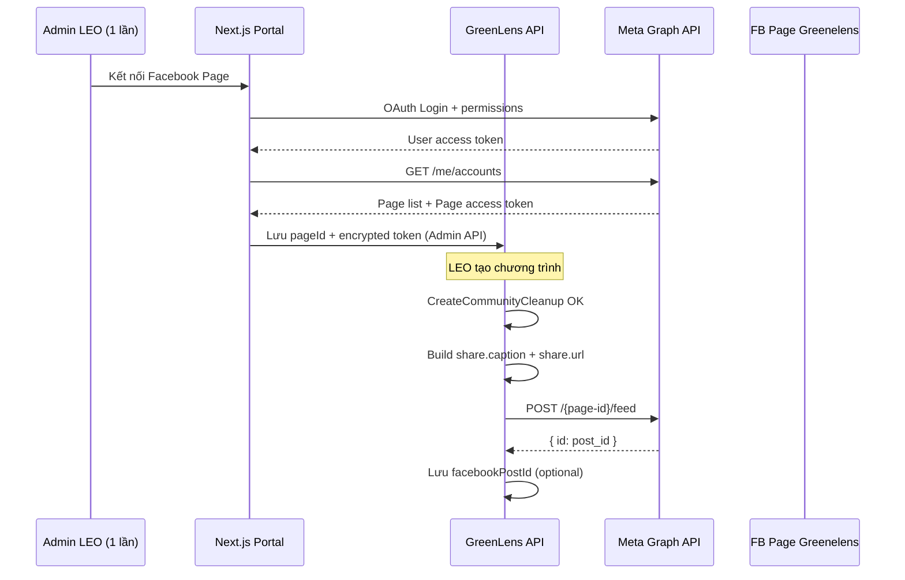

# Hướng dẫn — Tự động đăng bài lên Facebook Page (GreenLens)

> **Phiên bản:** 2026-08-28 · **Audience:** BE + FE + người quản trị Meta  
> **Liên quan:** [`fe-leo-community-cleanup-share-guide.md`](./fe-leo-community-cleanup-share-guide.md) · [`fe-facebook-sdk-share-dialog-guide.md`](./fe-facebook-sdk-share-dialog-guide.md)

Tài liệu mô tả cách **đăng bài tự động** lên **Facebook Page** (vd. Page *Greenelens*) khi LEO tạo chương trình dọn dẹp cộng đồng — **không** qua popup sharer.php.

---

## 1. Mô hình đề xuất cho GreenLens (capstone + production)

### ✅ Phương án A — **Một Page tổ chức** (khuyến nghị)

| Ai | Việc |
|----|------|
| **Admin / LEO trưởng** (1 lần) | Facebook Login → cấp quyền Page → BE lưu **Page Access Token** (mã hóa) |
| **Mọi LEO** (mỗi lần tạo chương trình) | Chỉ gọi API GreenLens → **BE** tự gọi Graph API đăng lên Page Greenelens |
| **Citizen** | Không liên quan Facebook |

**Ưu điểm:** LEO không cần login Facebook; không cần App Review cho từng user; phù hợp Page fanpage dự án.

### ❌ Phương án B — Mỗi LEO đăng lên Page cá nhân họ quản lý

- Mỗi user OAuth Facebook + chọn Page
- Cần **Advanced Access** + **App Review** + **Business Verification** cho `pages_manage_posts`
- Phức tạp, khó pass review đồ án → **không khuyến nghị** trừ khi product yêu cầu

**Doc này theo Phương án A.**

---

## 2. Điều kiện Meta (bạn đã có Business)

| Yêu cầu | Ghi chú |
|---------|---------|
| Facebook **Page** (Greenelens) | Bạn là Admin Page |
| **Meta Developer App** (Greenlens) | App ID đã có |
| **Business portfolio** đã tạo | Verification → xem §2.3 |
| **Privacy Policy** `/privacy` | Đã có trên Vercel |
| App **Live** (nếu production) | Hoặc test với tài khoản Admin app ở Development |

### 2.1 Cấu hình App Dashboard

1. **+ Add use cases** → chọn use case liên quan **Pages** / **Manage everything on your Page** (tên UI có thể khác).
2. **Verification** → **+ Business portfolio** → gắn portfolio đã tạo.
3. Thêm product **Facebook Login** (Web):
   - **Valid OAuth Redirect URIs:**
     ```
     https://greenlens-portal.vercel.app/api/auth/facebook/callback
     http://localhost:3000/api/auth/facebook/callback
     ```
4. **App settings → Basic:** Privacy, domain, icon, Website (đã làm).

### 2.2 Permissions cần xin (Facebook Login — Admin connect 1 lần)

| Permission | Mục đích |
|------------|----------|
| `pages_show_list` | Liệt kê Page user quản lý |
| `pages_read_engagement` | Dependency của `pages_manage_posts` |
| `pages_manage_posts` | **Đăng bài** lên Page |

Không cần `publish_to_groups`, `instagram_*` cho scope này.

### 2.3 Business Verification

- Vào **Business Manager** → hoàn tất **Business Verification** (giấy tờ DN hoặc hồ sơ phù hợp quốc gia).
- **Standard Access:** Admin app test / Page của chính team — thường đủ cho capstone.
- **Advanced Access + App Review:** Chỉ khi user **không có role trên app** phải tự OAuth Page — Phương án A **thường không cần**.

---

## 3. Luồng kỹ thuật (Phương án A)



---

## 4. Test thủ công trước khi code (Graph API Explorer)

1. Vào [Graph API Explorer](https://developers.facebook.com/tools/explorer/)
2. Chọn app **Greenlens**
3. **Generate Access Token** → chọn permissions: `pages_show_list`, `pages_read_engagement`, `pages_manage_posts`
4. `GET /me/accounts` → copy **Page ID** và **access_token** của Page Greenelens
5. Đăng thử:

```http
POST https://graph.facebook.com/v21.0/{PAGE_ID}/feed
Content-Type: application/json

{
  "message": "🌱 Test auto-post GreenLens\n\nTham gia tại: https://greenlens-portal.vercel.app/c/community/xxx",
  "link": "https://greenlens-portal.vercel.app/c/community/xxx",
  "access_token": "{PAGE_ACCESS_TOKEN}"
}
```

6. Kiểm tra Page Greenelens → có bài mới = OK, tiếp tục implement.

**Lưu ý token Explorer** ngắn hạn — production dùng **long-lived Page token** (§5).

---

## 5. Token — lấy và lưu an toàn

### 5.1 OAuth (Admin — FE hoặc script 1 lần)

1. Redirect user tới:
   ```
   https://www.facebook.com/v21.0/dialog/oauth?
     client_id={APP_ID}&
     redirect_uri={ENCODED_REDIRECT}&
     scope=pages_show_list,pages_read_engagement,pages_manage_posts&
     state={csrf}
   ```
2. Callback nhận `code` → BE đổi lấy **User access token**:
   ```
   GET /oauth/access_token?client_id=&client_secret=&redirect_uri=&code=
   ```
3. Đổi **long-lived user token** (~60 ngày):
   ```
   GET /oauth/access_token?grant_type=fb_exchange_token&client_id=&client_secret=&fb_exchange_token={short_token}
   ```
4. Lấy **Page token** (thường không hết hạn nếu user không đổi pass / revoke):
   ```
   GET /me/accounts?access_token={long_lived_user_token}
   ```
   Response mỗi Page có `id`, `name`, `access_token`.

### 5.2 Lưu trữ (BE)

| Cách | Capstone | Production |
|------|----------|------------|
| `dotnet user-secrets` / env VPS | ✅ Page ID + token | ✅ |
| Bảng `facebook_page_connections` (encrypted) | ✅ | ✅ Khuyến nghị |
| **Không** commit token | Bắt buộc | Bắt buộc |

Env mẫu (VPS — **không commit**):

```env
Meta__AppId=1826124652169990
Meta__AppSecret=<from Meta Basic settings>
Meta__PageId=<page_id_greenelens>
Meta__PageAccessToken=<page_access_token>
Meta__AutoPostEnabled=true
```

---

## 6. API đăng bài (Graph API)

### 6.1 Link post (khuyến nghị — có preview OG)

```http
POST https://graph.facebook.com/v21.0/{page-id}/feed
{
  "message": "{plain_text_caption}",
  "link": "{share.url}",
  "published": true,
  "access_token": "{page_access_token}"
}
```

Facebook tự crawl OG từ `link` → card preview (title, ảnh).

### 6.2 Chỉ text

```json
{ "message": "...", "published": true, "access_token": "..." }
```

### 6.3 Ảnh kèm caption

```http
POST /{page-id}/photos
{
  "url": "{thumbnailUrl_https}",
  "caption": "{message}",
  "access_token": "..."
}
```

### 6.4 Response thành công

```json
{ "id": "1234567890_9876543210" }
```

Lưu `id` vào DB (optional) để audit / xóa bài sau này.

---

## 7. Tích hợp GreenLens Backend (gợi ý Clean Architecture)

### 7.1 Config

```csharp
// Application/Common/Options/MetaPageOptions.cs
public sealed class MetaPageOptions
{
    public string AppId { get; init; } = "";
    public string AppSecret { get; init; } = "";  // server only
    public string PageId { get; init; } = "";
    public string PageAccessToken { get; init; } = "";  // server only
    public bool AutoPostEnabled { get; init; }
}
```

### 7.2 Interface

```csharp
// Application/Common/Interfaces/IFacebookPagePublisher.cs
public interface IFacebookPagePublisher
{
    Task<Result<string>> PublishLinkPostAsync(
        string message,
        string linkUrl,
        CancellationToken ct);
}
```

### 7.3 Gọi sau khi tạo chương trình

Trong `CreateCommunityCleanupCommandHandler` (sau khi build `share`):

```csharp
if (metaPageOptions.AutoPostEnabled)
{
    var plainCaption = MarkdownPlainText.ToPlain(share.Caption); // strip markdown
    var postResult = await facebookPagePublisher.PublishLinkPostAsync(
        plainCaption, share.Url, ct);

    if (postResult.IsFailure)
        logger.LogWarning("Facebook auto-post failed for event {EventId}", ev.Id);
    // Không fail cả create — post FB là side effect
}
```

**Quan trọng:** Auto-post **không rollback** transaction tạo chương trình nếu Facebook lỗi.

### 7.4 Infrastructure (HttpClient)

```csharp
// POST {pageId}/feed với form hoặc JSON
// Map lỗi Graph API → Result.Failure
```

---

## 8. Tích hợp Frontend (Admin setup 1 lần)

### 8.1 Trang Admin (LEO / System Admin)

Route gợi ý: `/officer/settings/facebook-page`

| UI | Hành vi |
|----|---------|
| Trạng thái | "Chưa kết nối" / "Đã kết nối Page Greenelens" |
| Nút **Kết nối Facebook Page** | Redirect OAuth |
| Toggle **Tự động đăng lên Page khi tạo chương trình** | Gọi BE bật `AutoPostEnabled` |

### 8.2 Sau khi tạo chương trình (LEO)

Dialog success thêm:

- ✅ "Đã đăng lên Page Greenelens" (nếu BE trả `facebookPostId`)
- ⚠️ "Chương trình đã tạo; đăng Facebook thất bại — dùng nút chia sẻ thủ công" (fallback sharer)

Response create có thể mở rộng:

```json
{
  "share": { ... },
  "facebookAutoPost": {
    "attempted": true,
    "success": true,
    "postId": "123_456",
    "pageUrl": "https://facebook.com/..."
  }
}
```

---

## 9. Nội dung bài đăng — dùng gì từ `share`

| Graph API field | Nguồn GreenLens |
|-----------------|-----------------|
| `link` | `share.url` |
| `message` | `share.caption` (**plain text**, strip markdown từ `description`) |
| Ảnh (nếu dùng `/photos`) | `share.imageUrl` |

Caption hiện tại build từ `CommunityCleanupShareBuilder` — đủ dùng; nếu `description` là Markdown thì BE strip trước khi post.

---

## 10. App Review — khi nào cần?

| Tình huống | App Review |
|------------|------------|
| Admin team OAuth 1 lần, token server-side, mọi LEO trigger post lên **Page tổ chức** | **Thường không** (test Live với token admin trước) |
| Mỗi LEO OAuth Page riêng | **Bắt buộc** Advanced Access |
| Graph API trả lỗi permission (#200, OAuthException) trên production | Submit App Review + screencast |

**Screencast App Review (nếu cần):** quay flow Login → chọn Page → tạo chương trình → bài xuất hiện trên Page.

---

## 11. Checklist triển khai

### Meta

- [ ] Use case **Pages** đã thêm
- [ ] Business portfolio gắn app + verification (nếu Meta yêu cầu)
- [ ] Facebook Login + OAuth redirect URIs
- [ ] Graph Explorer test `POST /{page-id}/feed` thành công
- [ ] Long-lived **Page access token** lấy được

### BE

- [ ] `MetaPageOptions` + secrets VPS
- [ ] `IFacebookPagePublisher` + HttpClient
- [ ] Hook sau `CreateCommunityCleanup` (feature flag `AutoPostEnabled`)
- [ ] Không fail create khi FB lỗi; log + optional retry job (Hangfire)
- [ ] Strip markdown caption

### FE

- [ ] Admin OAuth connect Page (1 lần) hoặc BE config token thủ công giai đoạn 1
- [ ] Dialog success hiển thị kết quả auto-post
- [ ] Giữ **fallback sharer.php** khi auto-post fail

### QA

- [ ] Tạo chương trình → bài lên Page Greenelens
- [ ] Link preview OG đúng
- [ ] Token revoke test → fallback sharer vẫn hoạt động

---

## 12. Rủi ro & giới hạn

| Rủi ro | Giảm thiểu |
|--------|------------|
| Token hết hạn / revoke | Admin reconnect; monitor Graph API errors |
| Business Verification pending | Dùng Development + admin test; song song hoàn tất verification |
| Rate limit Graph API | Không spam; 1 post / 1 create event |
| Đồ án không có DN thật | Verification có thể fail → giữ sharer manual làm phương án chính demo |
| Meta đổi policy | Luôn có sharer fallback |

---

## 13. Tham chiếu Meta

| Tài liệu | URL |
|----------|-----|
| Pages API — Posts | https://developers.facebook.com/docs/pages-api/posts/ |
| Getting Started | https://developers.facebook.com/docs/pages-api/getting-started/ |
| Permission `pages_manage_posts` | https://developers.facebook.com/docs/permissions/reference/pages_manage_posts |
| Graph API Explorer | https://developers.facebook.com/tools/explorer/ |
| Business Verification | https://developers.facebook.com/docs/development/release/business-verification/ |

---

## 14. FAQ

### Q: Khác gì sharer.php?

| | sharer.php | Auto-post API |
|---|------------|---------------|
| User bấm Đăng | Có | Không |
| Đăng lên Page tự động | User chọn Page | BE đăng thẳng Page Greenelens |
| Meta Business | Không cần | Cần setup Page + token |

### Q: Có thể vừa auto-post vừa sharer không?

Có. Auto-post lên Page tổ chức; sharer cho LEO share link cá nhân / copy caption.

### Q: LEO nào được trigger auto-post?

Phương án A: **mọi LEO** tạo chương trình (BE dùng token Page chung). Policy: chỉ role LEO/Admin được create (đã có sẵn).
