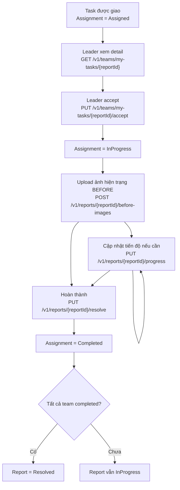

# Mobile CompanyStaff Task Flow - Before Images

> Audience: Mobile FE.
> Scope: flow cho CompanyStaff/Cleaner team leader từ lúc nhận task đến khi hoàn thành.
> Key point: sau khi `accept`, Mobile phải thêm bước upload **before images** trước khi cho user `resolve`.

---

## 1. Tóm tắt flow chuẩn



**Quan trọng:** `accept` không gửi ảnh. Ảnh hiện trạng được gửi bằng endpoint riêng sau khi assignment chuyển sang `InProgress`.

---

## 2. Thứ tự API Mobile nên gọi

### Bước 1 - Lấy task chờ xác nhận

```http
GET /v1/teams/my-tasks?assignmentStatus=Assigned
Authorization: Bearer <accessToken>
```

User chọn một task, lấy `reportId`.

### Bước 2 - Xem chi tiết task

```http
GET /v1/teams/my-tasks/{reportId}
Authorization: Bearer <accessToken>
```

Detail có các field quan trọng:

| Field | Ý nghĩa |
|-------|---------|
| `assignmentStatus` | `Assigned`, `InProgress`, `Completed`, `Declined` |
| `canDecline` | Có thể từ chối task hay không |
| `canUpdateProgress` | Có thể cập nhật tiến độ hay không |
| `canResolve` | Có thể hoàn thành hay không |
| `reportImages` | Ảnh citizen gửi ban đầu, dùng để xem tình trạng được báo cáo |
| `progressPercent` | % tiến độ hiện tại của assignment |

### Bước 3 - Accept task

```http
PUT /v1/teams/my-tasks/{reportId}/accept
Authorization: Bearer <accessToken>
```

Request body: không cần.

Sau khi thành công:

```text
Assignment: Assigned -> InProgress
```

Mobile nên chuyển user sang màn **Chụp ảnh hiện trạng trước khi xử lý**.

### Bước 4 - Upload before images

```http
POST /v1/reports/{reportId}/before-images
Authorization: Bearer <accessToken>
Content-Type: multipart/form-data
```

Form-data:

| Field | Type | Required | Note |
|-------|------|----------|------|
| `images` | file[] | Yes | Ít nhất 1 ảnh, tối đa 5 ảnh |

Ví dụ:

```text
images = before_1.jpg
images = before_2.jpg
```

Response thành công:

```json
{
  "code": "SUCCESS",
  "message": "Thành công",
  "status": 200,
  "data": {
    "uploadedImageUrls": [
      "https://.../reports/{reportId}/before/{teamId}/before_1.jpg"
    ]
  }
}
```

BE lưu các ảnh này với `MediaType.Before`.

### Bước 5 - Cập nhật tiến độ (optional, có thể gọi nhiều lần)

```http
PUT /v1/reports/{reportId}/progress
Authorization: Bearer <accessToken>
Content-Type: multipart/form-data
```

Form-data:

| Field | Type | Required | Note |
|-------|------|----------|------|
| `progressPercent` | number | Yes | 0-100 |
| `progressNote` | string | No | Ghi chú tiến độ |
| `images` | file[] | No | Ảnh tiến độ, tối đa 5 ảnh |

Sau bước này:

```text
Assignment vẫn InProgress
Report vẫn InProgress
```

### Bước 6 - Hoàn thành task

`resolve` nhận URL ảnh after, không nhận file trực tiếp.

Nếu Mobile chưa có URL ảnh after, upload ảnh trước bằng endpoint media chung theo flow hiện tại của app, sau đó truyền URL vào `afterImageUrls`.

```http
PUT /v1/reports/{reportId}/resolve
Authorization: Bearer <accessToken>
Content-Type: application/json
```

Body:

```json
{
  "afterImageUrls": [
    "https://.../after_1.jpg",
    "https://.../after_2.jpg"
  ]
}
```

Điều kiện bắt buộc:

| Điều kiện | Ghi chú |
|-----------|---------|
| User là team leader | `team_members.is_leader = true` |
| Assignment đang `InProgress` | Phải accept trước |
| Report đang `InProgress` | Report chưa resolved/closed |
| Đã upload before images | Ít nhất 1 ảnh `MediaType.Before` |
| Có after images | `afterImageUrls.length >= 2` |

Sau khi thành công:

```text
Assignment: InProgress -> Completed
Report: InProgress -> Resolved nếu tất cả assignment active đều Completed
```

---

## 3. UI đề xuất cho Mobile

### Tab "Chờ xác nhận"

Hiển thị task có `assignmentStatus = Assigned`.

Actions:

| Action | Điều kiện |
|--------|-----------|
| Accept | Leader |
| Decline | Leader, trong vòng 2 giờ |
| View detail | Tất cả member |

### Sau khi Accept

Không cho user bấm "Hoàn thành" ngay.

Điều hướng sang màn:

```text
Chụp ảnh hiện trạng trước khi xử lý
```

Yêu cầu:

- Chụp/chọn ít nhất 1 ảnh.
- Gọi `POST /v1/reports/{reportId}/before-images`.
- Thành công thì chuyển task sang màn "Đang xử lý".

### Tab "Đang xử lý"

Hiển thị task có `assignmentStatus = InProgress`.

Actions:

| Action | Điều kiện |
|--------|-----------|
| Cập nhật tiến độ | Leader, sau accept |
| Hoàn thành | Leader, đã có before images, có >= 2 after images |
| View detail | Tất cả member |

---

## 4. Các lỗi Mobile cần handle

| HTTP | Code | Khi nào |
|------|------|---------|
| 400 | `FILE_REQUIRED` | Gọi `before-images` nhưng không gửi ảnh |
| 413 | `FILE_TOO_LARGE` | Có ảnh vượt quá 20MB |
| 422 | `NOT_TEAM_LEADER` | User không phải team leader |
| 422 | `ASSIGNMENT_NOT_IN_PROGRESS` | Chưa accept hoặc assignment không còn `InProgress` |
| 422 | `MISSING_BEFORE_IMAGES` | Gọi `resolve` khi chưa upload before images |
| 422 | `INSUFFICIENT_AFTER_IMAGES` | Gọi `resolve` nhưng after images < 2 |
| 404 | `ASSIGNMENT_NOT_FOUND` | Team hiện tại không được assign report này |

Nếu gặp `MISSING_BEFORE_IMAGES`, Mobile nên điều hướng user về màn upload before images.

---

## 5. Checklist FE

- [ ] Sau `accept` thành công, không gọi `resolve` ngay.
- [ ] Thêm màn upload before images.
- [ ] Gọi `POST /v1/reports/{reportId}/before-images` với `multipart/form-data`.
- [ ] Chỉ enable "Hoàn thành" khi đã upload before thành công.
- [ ] `resolve` vẫn phải gửi ít nhất 2 URL ảnh after.
- [ ] Nếu BE trả `MISSING_BEFORE_IMAGES`, điều hướng về màn upload before.

---

## 6. Flow ngắn gọn để truyền cho dev Mobile

```text
Assigned task
  -> GET detail
  -> accept
  -> upload before images (required)
  -> update progress optional
  -> upload/select at least 2 after image URLs
  -> resolve
  -> completed
```

