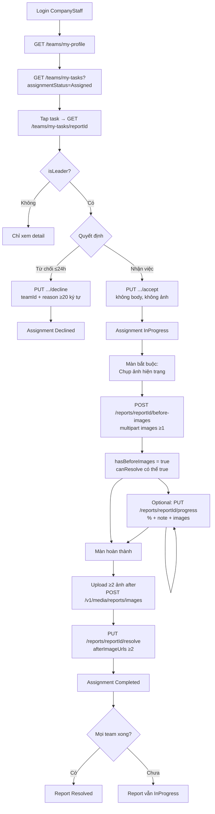

# Mobile — Luồng CompanyStaff / Cleaner từ Accept đến Hoàn thành

> **Audience:** Mobile FE (CompanyStaff shell; Cleaner dùng chung phần lớn API).  
> **Mục đích:** Tài liệu refactor full flow — đủ để implement lại UI + API đúng contract BE hiện tại.  
> **Cập nhật:** 2026-07-17  
> **Tham chiếu:** `fe-company-staff-api-guide.md`, `cleaner-progress-resolve-fe-guide.md`, `mobile-company-staff-before-images-flow.md`

---

## 0. TL;DR — Flow chuẩn Mobile phải làm

```text
1. Login CompanyStaff
2. GET /v1/teams/my-profile          → biết teamId + isLeader
3. GET /v1/teams/my-tasks            → tab Assigned / InProgress / Completed
4. GET /v1/teams/my-tasks/{reportId} → detail + flags
5. Leader ACCEPT  (hoặc DECLINE trong 24h)
6. Leader upload BEFORE images       ← bắt buộc trước resolve
7. Leader UPDATE PROGRESS            ← optional, có thể gọi nhiều lần
8. Upload ≥ 2 ảnh AFTER → lấy URL
9. Leader RESOLVE
10. Assignment = Completed
    Report = Resolved nếu mọi team active đều Completed
```

**Path param luôn là `reportId` (UUID report), không phải `assignmentId`.**

---

## 1. Ai làm được gì?

| Hành động | Member thường | Team Leader (`is_leader = true`) |
|-----------|---------------|----------------------------------|
| Xem list / detail | ✅ | ✅ |
| Accept / Decline | ❌ | ✅ |
| Upload before images | ❌ | ✅ |
| Update progress | ❌ | ✅ |
| Resolve | ❌ | ✅ |
| Escalate | ❌ | ✅ (optional) |

Lấy `isLeader` từ `GET /v1/teams/my-profile` (danh sách members).  
Handler BE check qua `team_members.is_leader` — JWT role `CompanyStaff` **không đủ**, phải là leader.

**Roles JWT cần có:**

| Endpoint nhóm | Roles |
|---------------|-------|
| `GET/PUT /v1/teams/my-tasks/*` | `CompanyStaff` (đã có trong Authorize) |
| `POST /v1/reports/{id}/before-images` | `Cleaner,CompanyStaff,Admin` |
| `PUT /v1/reports/{id}/progress` | `Cleaner,CompanyStaff,Inspector,Admin` |
| `PUT /v1/reports/{id}/resolve` | `Cleaner,CompanyStaff,Admin` |

---

## 2. State machine (đọc kỹ)

### 2.1 Assignment (team của bạn)

```text
Assigned ──accept──► InProgress ──resolve──► Completed
    │                     │
    │                     └──escalate──► Escalated
    └──decline──► Declined
```

| Status | Ý nghĩa UI |
|--------|------------|
| `Assigned` | Chờ xác nhận — tab "Chờ nhận việc" |
| `InProgress` | Đang làm — tab "Đang xử lý" |
| `Completed` | Team đã hoàn thành phần việc |
| `Declined` | Đã từ chối |
| `Escalated` | Báo vượt khả năng, trả LEO/CM |

### 2.2 Report (toàn hệ thống)

Khi CM/LEO giao team: Report đã ở `InProgress`.

| Khi nào Report đổi? | Kết quả |
|---------------------|---------|
| Leader resolve và **mọi** assignment active đều `Completed` | Report → `Resolved` |
| Còn team khác chưa xong | Report vẫn `InProgress` |
| **Tất cả** team decline | Report quay `Verified` (CM giao lại) |

### 2.3 Phân biệt 3 loại ảnh

| Loại | `MediaType` | Ai tạo | Mobile dùng khi nào |
|------|-------------|--------|---------------------|
| Ảnh citizen | `Image` | Citizen lúc submit | Chỉ **xem** trong detail (`reportImages`) |
| Ảnh hiện trạng trước dọn | `Before` | Leader sau accept | **Bắt buộc** trước resolve |
| Ảnh tiến độ | `Progress` | Leader khi update progress | Tùy chọn |
| Ảnh sau dọn | `After` | Leader khi resolve | **Bắt buộc ≥ 2 URL** |

---

## 3. Sơ đồ full flow



---

## 4. API chi tiết theo thứ tự

Envelope chuẩn:

```json
{
  "code": "SUCCESS",
  "message": "...",
  "status": 200,
  "data": { }
}
```

Auth header mọi request:

```http
Authorization: Bearer <accessToken>
```

---

### 4.1 Profile team

```http
GET /v1/teams/my-profile
```

Dùng để:

- Lấy `teamId` (cần cho decline / check-in / escalate nếu dùng)
- Biết user có `isLeader: true` không
- Ẩn/hiện nút Accept / Progress / Resolve

---

### 4.2 Danh sách task

```http
GET /v1/teams/my-tasks?page=1&pageSize=20&assignmentStatus=Assigned
GET /v1/teams/my-tasks?page=1&pageSize=20&assignmentStatus=InProgress
GET /v1/teams/my-tasks?page=1&pageSize=20&assignmentStatus=Completed
```

| Query | Rule |
|-------|------|
| `page` | default 1 |
| `pageSize` | default 20, max 100 |
| `assignmentStatus` | optional; không truyền = tất cả |

Mỗi item có `reportId`, `reportCode`, `assignmentId`, `assignmentStatus`, tọa độ, SLA…

**Khi tap item → dùng `reportId` cho mọi API sau.**

---

### 4.3 Chi tiết task

```http
GET /v1/teams/my-tasks/{reportId}
```

**Response `data` (shape chính):**

```json
{
  "assignmentId": "uuid",
  "assignmentStatus": "Assigned",
  "assignedAt": "2026-07-17T10:00:00Z",
  "startedAt": null,
  "completedAt": null,

  "canDecline": true,
  "canUpdateProgress": false,
  "canResolve": false,

  "reportId": "uuid",
  "reportCode": "RPT-260717-XXXXXX",
  "reportStatus": "InProgress",
  "categoryCode": "TRASH",
  "categoryName": "Ô nhiễm rác thải",
  "severity": "Medium",
  "description": "...",
  "latitude": 10.77,
  "longitude": 106.70,
  "address": "...",
  "wardCode": "26743",
  "slaResolveDueAt": "...",

  "reportImages": [
    { "url": "https://...", "mimeType": "image/jpeg" }
  ],

  "progressPercent": 0,
  "progressNote": null,
  "progressUpdatedAt": null,
  "progressUpdatedByUserId": null,
  "assignmentNote": "Ghi chú khi CM giao việc",

  "wasteTags": [
    { "code": "PLASTIC", "nameVi": "...", "nameEn": "...", "iconUrl": null }
  ],

  "declineDeadlineAt": "2026-07-18T10:00:00Z",
  "hasBeforeImages": false,
  "beforeImageCount": 0,
  "progressRequiredByAt": null
}
```

**Cách UI map flags:**

| Field | Cách dùng |
|-------|-----------|
| `canDecline` | Hiện nút Từ chối |
| `canUpdateProgress` | Hiện nút Cập nhật tiến độ (`InProgress`) |
| `canResolve` | Hiện nút Hoàn thành — **đã gồm điều kiện có before images** |
| `hasBeforeImages` / `beforeImageCount` | Sau accept: nếu `false` → bắt user upload before |
| `declineDeadlineAt` | Countdown 24h từ `assignedAt` |
| `progressRequiredByAt` | Soft SLA: nên update progress mỗi 24h khi đang làm |
| `reportImages` | Gallery ảnh citizen (không phải before của team) |

| `assignmentStatus` | `canDecline` | `canUpdateProgress` | `canResolve` |
|--------------------|--------------|---------------------|--------------|
| `Assigned` (trong 24h) | true | false | false |
| `InProgress` + chưa before | false | true | **false** |
| `InProgress` + đã before | false | true | **true** |
| `Completed` | false | false | false |

---

### 4.4 Accept task

```http
PUT /v1/teams/my-tasks/{reportId}/accept
```

- **Body:** không cần  
- **Ảnh:** không cần  
- **Ai:** Leader only  

**Success:** `200`, `data: null`, message kiểu `"Đã chấp nhận task."`

**Transition:**

```text
Assignment: Assigned → InProgress
StartedAt = now
```

**Lỗi thường gặp:**

| code | Khi nào |
|------|---------|
| `NOT_TEAM_LEADER` | Không phải leader |
| `ASSIGNMENT_NOT_FOUND` | Sai reportId / team không được giao |
| `INVALID_STATUS_TRANSITION` | Không còn `Assigned` hoặc report không `InProgress` |

**UI sau accept:**

1. Refresh detail `GET .../my-tasks/{reportId}`
2. **Bắt buộc** điều hướng màn **Upload ảnh hiện trạng (Before)**  
3. **Không** hiện nút Hoàn thành cho đến khi `hasBeforeImages === true` / `canResolve === true`

---

### 4.5 Decline task (nhánh phụ)

```http
PUT /v1/teams/my-tasks/{reportId}/decline
Content-Type: application/json
```

```json
{
  "teamId": "<uuid từ my-profile>",
  "reason": "Không đủ nhân lực trong ca này, cần giao đội khác."
}
```

| Field | Rule |
|-------|------|
| `teamId` | UUID team của user |
| `reason` | ≥ 20 ký tự |
| Thời hạn | ≤ **24 giờ** kể từ `assignedAt` |

**Transition:** `Assigned → Declined`  
Nếu mọi team decline → Report → `Verified`.

---

### 4.6 Upload Before images — **BẮT BUỘC trước Resolve**

Đây là bước Mobile đang thiếu / hay bỏ qua.

```http
POST /v1/reports/{reportId}/before-images
Content-Type: multipart/form-data
```

| Form field | Type | Required | Rule |
|------------|------|----------|------|
| `images` | file[] | ✅ | ≥ 1, tối đa 5, mỗi file ≤ **20MB** |

Ví dụ multipart:

```text
images = before_1.jpg
images = before_2.jpg
```

**Success `data`:**

```json
{
  "uploadedImageUrls": [
    "https://.../reports/{reportId}/before/{teamId}/...."
  ]
}
```

BE lưu `MediaType.Before`.

**Điều kiện:**

- Leader
- Assignment `InProgress` (đã accept)
- Report `InProgress`

**Lỗi:**

| HTTP | code | Ý nghĩa |
|------|------|---------|
| 400 | `FILE_REQUIRED` | Không gửi ảnh |
| 413 | `FILE_TOO_LARGE` | File > 20MB |
| 422 | `NOT_TEAM_LEADER` | Không phải leader |
| 422 | `ASSIGNMENT_NOT_IN_PROGRESS` | Chưa accept |
| 404 | `ASSIGNMENT_NOT_FOUND` | Sai report / team |

**Sau khi upload thành công:**

```text
GET detail lại → hasBeforeImages=true, beforeImageCount≥1, canResolve=true
```

---

### 4.7 Update Progress — optional, gọi nhiều lần

**Endpoint khuyến nghị cho Mobile (có ảnh):**

```http
PUT /v1/reports/{reportId}/progress
Content-Type: multipart/form-data
```

| Field | Type | Required | Rule |
|-------|------|----------|------|
| `progressPercent` | int | ✅ | 0–100 |
| `progressNote` | string | ❌ | Ghi chú |
| `images` | file[] | ❌ | Max 5, ≤ 20MB/file → lưu `MediaType.Progress` |

**Success `data`:**

```json
{
  "uploadedImageUrls": ["https://..."]
}
```

**Lưu ý quan trọng:**

- **Không** đổi status assignment/report
- `progressPercent = 100` **không** tự resolve — vẫn phải gọi resolve
- Có thể gọi nhiều lần (ghi đè %)

> Có thêm endpoint JSON `PUT /v1/teams/my-tasks/{reportId}/progress` (không upload ảnh trong request).  
> **Mobile nên dùng `PUT /v1/reports/{reportId}/progress`** nếu cần kèm ảnh tiến độ.

---

### 4.8 Upload ảnh After (lấy URL)

Resolve **không nhận file** — chỉ nhận URL.

```http
POST /v1/media/reports/images
Content-Type: multipart/form-data
```

| Field | Type |
|-------|------|
| `file` | 1 file (jpg/png/webp/heic, max **10MB**) |

**Success `data`:**

```json
{
  "url": "https://...",
  "key": "...",
  "message": "Tải ảnh báo cáo thành công.",
  "mimeType": "image/jpeg",
  "sizeBytes": 123456
}
```

Mobile lấy `data.url` — **không** phải `uploadedImageUrls`.

Gọi **≥ 2 lần** (hoặc upload 2 ảnh) rồi giữ URL cho resolve.

**Timeout gợi ý:** client 30–60s (an toàn mạng yếu). Kỳ vọng ảnh ~400KB: **1–3s**. Nếu treo lâu sau khi BE đã `Handled`, kiểm tra loading state FE.

---

### 4.9 Resolve — hoàn thành phần việc team

```http
PUT /v1/reports/{reportId}/resolve
Content-Type: application/json
```

```json
{
  "afterImageUrls": [
    "https://.../after1.jpg",
    "https://.../after2.jpg"
  ]
}
```

| Field | Rule |
|-------|------|
| `afterImageUrls` | array string, **≥ 2** |

**Điều kiện BE (tất cả phải đúng):**

1. JWT role cho phép (`CompanyStaff`…)
2. User là **team leader**
3. Report status = `InProgress`
4. Assignment của team = `InProgress`
5. Đã có ≥ 1 ảnh `Before`
6. `afterImageUrls.length >= 2`

**Success:** thường `200/204`, `data: null`

**Transition:**

```text
Assignment → Completed
nếu tất cả assignment active Completed → Report → Resolved
(+ notification citizen, +20 điểm gamification nền)
```

**Lỗi:**

| code | Mobile nên làm gì |
|------|-------------------|
| `MISSING_BEFORE_IMAGES` | Điều hướng màn upload before |
| `INSUFFICIENT_AFTER_IMAGES` | Bắt chọn thêm ảnh after |
| `NOT_TEAM_LEADER` | Ẩn nút / báo không đủ quyền |
| `ASSIGNMENT_NOT_IN_PROGRESS` | Refresh detail — có thể chưa accept |
| `INVALID_STATUS_TRANSITION` | Refresh — report/assignment đã đổi trạng thái |
| `ASSIGNMENT_NOT_FOUND` | Sai reportId hoặc team không được giao |

---

## 5. API phụ (optional)

### 5.1 Check-in GPS (BR-CLN-002)

```http
POST /v1/teams/my-tasks/{reportId}/check-in
```

```json
{
  "teamId": "uuid",
  "latitude": 10.77,
  "longitude": 106.70,
  "note": "optional"
}
```

- Distance ≤ **200m** so với tọa độ report  
- Cũng chuyển `Assigned → InProgress`  

**Khuyến nghị product hiện tại:** Mobile CompanyStaff dùng **Accept** rồi **Before images**. Check-in là luồng cleanup GPS — chỉ implement nếu product yêu cầu bắt buộc hiện trường.

### 5.2 Escalate

```http
POST /v1/teams/my-tasks/{reportId}/escalate
```

```json
{
  "teamId": "uuid",
  "reason": "Vượt khả năng xử lý của đội, cần hỗ trợ LEO."
}
```

`reason` ≥ 20 ký tự. Assignment → `Escalated`.

### 5.3 Lịch sử tiến độ team

```http
GET /v1/teams/my-progress?page=1&pageSize=20&assignmentStatus=InProgress
```

Chỉ leader.

---

## 6. Đề xuất màn hình Mobile (refactor)

| # | Màn | Trigger | API chính |
|---|-----|---------|-----------|
| 1 | Tab Chờ nhận | `assignmentStatus=Assigned` | list |
| 2 | Chi tiết task | Tap item | detail |
| 3 | Confirm Accept / Decline | Leader | accept / decline |
| 4 | **Upload Before** | Sau accept nếu `!hasBeforeImages` | `POST .../before-images` |
| 5 | Tab Đang xử lý | `InProgress` | list |
| 6 | Cập nhật tiến độ | `canUpdateProgress` | `PUT .../progress` |
| 7 | Hoàn thành | `canResolve` | media upload ×N + resolve |

**Navigation bắt buộc sau Accept:**

```text
Accept success
  → GET detail
  → if (!hasBeforeImages) push ScreenBeforeImages
  → else stay OnProgress screen
```

**Nút Hoàn thành:**

```text
enabled = isLeader && canResolve === true
```

(`canResolve` BE đã AND với `hasBeforeImages`)

---

## 7. Pseudocode flow (copy cho Mobile)

```ts
// 1) Accept
await api.put(`/v1/teams/my-tasks/${reportId}/accept`);

// 2) Refresh flags
const detail = await api.get(`/v1/teams/my-tasks/${reportId}`);
if (!detail.data.hasBeforeImages) {
  navigate('BeforeImages', { reportId });
  return;
}

// 3) Before images
const form = new FormData();
images.forEach((img) => form.append('images', img));
await api.post(`/v1/reports/${reportId}/before-images`, form);

// 4) Optional progress
const progressForm = new FormData();
progressForm.append('progressPercent', '50');
progressForm.append('progressNote', 'Đang dọn khu A');
// progressForm.append('images', file);
await api.put(`/v1/reports/${reportId}/progress`, progressForm);

// 5) After images → URLs
const afterUrls: string[] = [];
for (const file of afterFiles) {
  const fd = new FormData();
  fd.append('file', file);
  const res = await api.post('/v1/media/reports/images', fd);
  afterUrls.push(res.data.data.url); // NOTE: data.url
}

// 6) Resolve
await api.put(`/v1/reports/${reportId}/resolve`, {
  afterImageUrls: afterUrls, // length >= 2
});
```

---

## 8. Checklist refactor Mobile

### Auth / quyền

- [ ] Chỉ hiện Accept/Decline/Progress/Resolve khi `isLeader`
- [ ] Token role `CompanyStaff` (hoặc Cleaner)
- [ ] Mọi path dùng `reportId`, không dùng `assignmentId`

### Accept → Before → Resolve

- [ ] Accept **không** gửi ảnh
- [ ] Sau accept luôn check `hasBeforeImages`
- [ ] Màn Before gọi `POST /v1/reports/{reportId}/before-images` field `images`
- [ ] Không cho Resolve khi `canResolve === false`
- [ ] Handle `MISSING_BEFORE_IMAGES` → về màn Before

### Progress

- [ ] Dùng `PUT /v1/reports/{reportId}/progress` multipart
- [ ] % 0–100; ảnh optional
- [ ] 100% không auto-complete

### After + Resolve

- [ ] Upload after qua `POST /v1/media/reports/images` field `file`
- [ ] Lấy đúng `response.data.data.url`
- [ ] Resolve với ≥ 2 URL
- [ ] Handle `INSUFFICIENT_AFTER_IMAGES`

### UX / reliability

- [ ] Disable nút khi đang request (tránh double submit)
- [ ] `finally { setLoading(false) }`
- [ ] Timeout upload 30–60s; loading indicator riêng từng bước
- [ ] Sau mỗi mutation: refresh detail để sync flags

---

## 9. Bảng lỗi tổng hợp

| HTTP | code | Endpoint liên quan |
|------|------|--------------------|
| 400 | `FILE_REQUIRED` | before-images / media |
| 413 | `FILE_TOO_LARGE` | before-images / progress |
| 403 | `FORBIDDEN` | Sai role JWT |
| 404 | `ASSIGNMENT_NOT_FOUND` / `REPORT_NOT_FOUND` | hầu hết |
| 422 | `NOT_TEAM_LEADER` | accept/progress/before/resolve |
| 422 | `NOT_TEAM_MEMBER` | detail |
| 422 | `ASSIGNMENT_NOT_IN_PROGRESS` | before/progress |
| 422 | `INVALID_STATUS_TRANSITION` | accept/resolve |
| 422 | `DECLINE_WINDOW_EXPIRED` | decline > 24h |
| 422 | `MISSING_BEFORE_IMAGES` | resolve thiếu before |
| 422 | `INSUFFICIENT_AFTER_IMAGES` | resolve < 2 after |
| 422 | `TOO_FAR_FROM_SITE` | check-in > 200m |

---

## 10. Anti-patterns (đừng làm)

| Sai | Đúng |
|-----|------|
| Gọi `GET /reports/company-assignments/*` với Staff | Dùng `/teams/my-tasks/*` |
| Path bằng `assignmentId` | Path bằng `reportId` |
| Accept kèm ảnh | Accept không ảnh; before riêng |
| Resolve ngay sau accept | Phải before (≥1) + after (≥2) |
| Resolve multipart file | Resolve JSON URLs |
| Lấy `uploadedImageUrls` từ media upload | Media upload trả `data.url` |
| Member thường bấm resolve | Chỉ leader |

---

## 11. Flow một dòng gửi team Mobile

```text
Assigned → Accept → Upload Before (≥1) → Progress (optional) → Upload After (≥2 URL) → Resolve → Completed
```

**File liên quan:**

- Before images ngắn: [`mobile-company-staff-before-images-flow.md`](./mobile-company-staff-before-images-flow.md)
- Progress/Resolve chi tiết: [`cleaner-progress-resolve-fe-guide.md`](./cleaner-progress-resolve-fe-guide.md)
- Staff API tổng: [`fe-company-staff-api-guide.md`](./fe-company-staff-api-guide.md)
