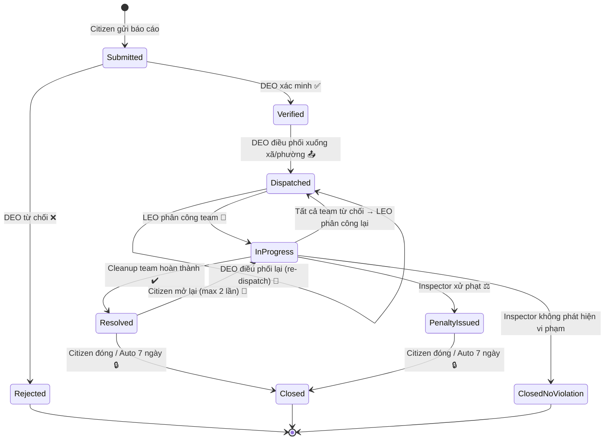
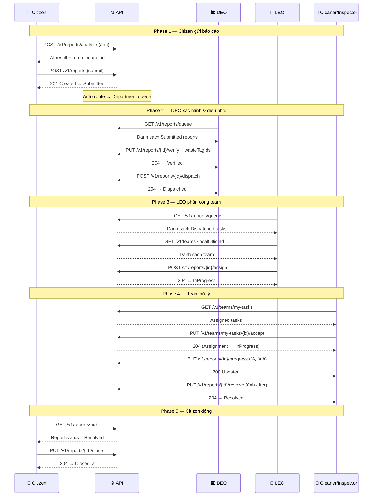

# GreenLens — Report Workflow v2.0: Two-Tier Dispatch Model

## 1. Tổng quan kiến trúc

### 1.1 Mô hình phân cấp

```
┌─────────────────────────────────────────────┐
│           TỈNH / THÀNH PHỐ                  │
│  ┌───────────────────────────────────────┐  │
│  │          DEO (Điều phối viên)          │  │
│  │   • Tiếp nhận tất cả báo cáo          │  │
│  │   • Xác minh / Từ chối                │  │
│  │   • Gắn tag loại rác                  │  │
│  │   • Điều phối task xuống phường/xã     │  │
│  └────────────┬──────────┬───────────────┘  │
│               │          │                   │
│    ┌──────────▼──┐  ┌───▼──────────┐        │
│    │  Phường A    │  │  Phường B     │  ...  │
│    │  (LEO)       │  │  (LEO)        │       │
│    │  • Nhận task  │  │  • Nhận task   │       │
│    │  • Phân công  │  │  • Phân công   │       │
│    │  • Quản lý   │  │  • Quản lý    │       │
│    │    team      │  │    team       │       │
│    └──────┬───┘  └──────┬───┘        │
│      ┌────▼────┐    ┌───▼─────┐             │
│      │ Cleanup │    │Inspector│  ...         │
│      │ Teams   │    │ Teams   │              │
│      └─────────┘    └─────────┘              │
└─────────────────────────────────────────────┘
```

### 1.2 Actors & Roles

| Actor | Role Code | Mô tả | Phạm vi |
|-------|-----------|--------|---------|
| **Citizen** | `Citizen` | Người dân — tạo và theo dõi báo cáo ô nhiễm | Toàn quốc |
| **DEO** | `DEO` | Điều phối viên cấp Tỉnh — tiếp nhận, xác minh, điều phối task | Trong tỉnh |
| **LEO** | `LEO` | Giám sát viên cấp Phường/Xã — nhận task, phân công và quản lý team | Trong phường/xã |
| **Cleaner** | `Cleaner` | Đội dọn dẹp — xử lý ô nhiễm rác/nước/hóa chất | Team assignments |
| **Inspector** | `Inspector` | Đội thanh tra — xử phạt ô nhiễm tiếng ồn/không khí | Team assignments |
| **Admin** | `Admin` | Quản trị viên hệ thống — toàn quyền | Toàn hệ thống |

---

## 2. State Machine — Vòng đời báo cáo



---

## 3. API Workflow — Thứ tự gọi API theo luồng chính

### Phase 1: Citizen gửi báo cáo 📸

> **Actor: Citizen** — App mobile

| Step | Method | Endpoint | Mô tả | Status |
|------|--------|----------|-------|--------|
| 1.1 | `POST` | `/v1/reports/analyze` | Upload ảnh → AI phân tích loại ô nhiễm, gợi ý category + waste tags | — |
| 1.2 | `POST` | `/v1/reports` | Gửi báo cáo chính thức (kèm temp_image_id từ step 1) | → `Submitted` |
| — | | | *Auto-route: báo cáo tự động vào Department queue theo ProvinceCode* | |

**Request body (Step 1.2):**
```json
{
  "categoryId": "guid",
  "latitude": 10.7769,
  "longitude": 106.7009,
  "description": "Bãi rác lớn gần cầu...",
  "tempImageId": "guid-from-step-1"
}
```

**Citizen có thể theo dõi:**

| Method | Endpoint | Mô tả |
|--------|----------|-------|
| `GET` | `/v1/reports/my` | Danh sách báo cáo của tôi |
| `GET` | `/v1/reports/{id}` | Chi tiết báo cáo |
| `GET` | `/v1/reports/{id}/history` | Lịch sử status |

---

### Phase 2: DEO xác minh & điều phối 🏛️

> **Actor: DEO** — Dashboard web tỉnh

| Step | Method | Endpoint | Auth | Mô tả | Status Transition |
|------|--------|----------|------|-------|-------------------|
| 2.1 | `GET` | `/v1/reports/queue` | DEO | Xem hàng đợi báo cáo cấp tỉnh (Submitted/Verified) | — |
| 2.2 | `GET` | `/v1/reports/{id}` | DEO | Xem chi tiết báo cáo | — |
| 2.3a | `PUT` | `/v1/reports/{id}/verify` | DEO | **Xác minh** — override severity/category nếu cần, gắn waste tags | `Submitted → Verified` |
| 2.3b | `PUT` | `/v1/reports/{id}/reject` | DEO | **Từ chối** — lý do ≥ 20 ký tự | `Submitted → Rejected` |
| 2.4 | `PUT` | `/v1/reports/{id}/waste-tags` | DEO | Gắn/sửa tag loại rác (optional, có thể gắn trong verify) | — |
| 2.5 | `POST` | `/v1/reports/{id}/dispatch` | DEO | **Điều phối** task xuống xã/phường (chọn LocalOffice) | `Verified → Dispatched` |

**Request body (Step 2.3a — Verify):**
```json
{
  "overrideSeverity": "High",
  "overrideCategoryId": null,
  "wasteTagIds": ["guid-household", "guid-medical"]
}
```

**Request body (Step 2.5 — Dispatch):**
```json
{
  "targetLocalOfficeId": "guid-phuong-a",
  "note": "Bãi rác lớn, cần xử lý gấp"
}
```

**DEO phụ trợ:**

| Method | Endpoint | Mô tả |
|--------|----------|-------|
| `PUT` | `/v1/reports/{id}/re-dispatch` | Điều phối lại sang phường/xã khác (chỉ khi LEO chưa assign) |
| `GET` | `/v1/waste-tags` | Danh sách waste tags available |

---

### Phase 3: LEO nhận task & phân công team 🏢

> **Actor: LEO** — Dashboard web phường/xã

| Step | Method | Endpoint | Auth | Mô tả | Status Transition |
|------|--------|----------|------|-------|-------------------|
| 3.1 | `GET` | `/v1/reports/queue` | LEO | Xem task đã dispatch xuống (filter: Dispatched) | — |
| 3.2 | `GET` | `/v1/reports/{id}` | LEO | Xem chi tiết task + waste tags | — |
| 3.3 | `GET` | `/v1/teams?localOfficeId=...` | LEO | Xem danh sách team trong phường | — |
| 3.4 | `POST` | `/v1/reports/{id}/assign` | LEO | **Phân công** team (1 hoặc nhiều) | `Dispatched → InProgress` |

**Request body (Step 3.4 — Assign):**
```json
{
  "teams": [
    { "teamId": "guid-cleanup-team-1", "note": "Chuẩn bị xe tải" },
    { "teamId": "guid-inspector-team-1", "note": "Kiểm tra vi phạm" }
  ],
  "wasteTagIds": null
}
```

**LEO quản lý team:**

| Method | Endpoint | Mô tả |
|--------|----------|-------|
| `POST` | `/v1/teams` | Tạo team mới |
| `PUT` | `/v1/teams/{id}` | Cập nhật tên team |
| `POST` | `/v1/teams/{teamId}/members` | Thêm thành viên |
| `DELETE` | `/v1/teams/{teamId}/members/{userId}` | Xóa thành viên |
| `PUT` | `/v1/reports/{id}/reassign` | Chuyển giao team (team cũ → team mới cùng loại) |

---

### Phase 4: Team xử lý task ⚡

> **Actor: Cleaner / Inspector** — App mobile

| Step | Method | Endpoint | Auth | Mô tả | Assignment Status |
|------|--------|----------|------|-------|-------------------|
| 4.1 | `GET` | `/v1/teams/my-tasks` | Team | Xem danh sách task được giao | — |
| 4.2 | `GET` | `/v1/teams/my-tasks/{reportId}` | Team | Chi tiết task | — |
| 4.3a | `PUT` | `/v1/teams/my-tasks/{reportId}/accept` | Team Leader | **Chấp nhận** task | `Assigned → InProgress` |
| 4.3b | `PUT` | `/v1/teams/my-tasks/{reportId}/decline` | Team | **Từ chối** (trong 2h, lý do ≥ 20 chars) | `Assigned → Declined` |
| 4.4 | `PUT` | `/v1/reports/{id}/progress` | Team Leader | Cập nhật tiến độ (%, ghi chú, ảnh) | — |
| 4.5a | `PUT` | `/v1/reports/{id}/resolve` | Cleaner | **Hoàn thành** (≥ 2 ảnh after) | Report: `InProgress → Resolved` |
| 4.5b | `PUT` | `/v1/reports/{id}/penalty` | Inspector | **Xử phạt** vi phạm | Report: `InProgress → PenaltyIssued` |
| 4.5c | `PUT` | `/v1/reports/{id}/close-no-violation` | Inspector | Đóng — không vi phạm | Report: `InProgress → ClosedNoViolation` |

> [!NOTE]
> **Khi tất cả team từ chối** (Step 4.3b), report tự động revert về `Dispatched` → LEO phân công lại (quay về Phase 3).

**Team phụ trợ:**

| Method | Endpoint | Mô tả |
|--------|----------|-------|
| `GET` | `/v1/teams/my-profile` | Thông tin team của tôi |
| `GET` | `/v1/teams/my-progress` | Lịch sử tiến độ team |

---

### Phase 5: Citizen đánh giá & đóng 🔒

> **Actor: Citizen** — App mobile

| Step | Method | Endpoint | Mô tả | Status Transition |
|------|--------|----------|-------|-------------------|
| 5.1 | `GET` | `/v1/reports/{id}` | Xem kết quả xử lý (ảnh after, tiến độ) | — |
| 5.2a | `PUT` | `/v1/reports/{id}/close` | **Đóng** — hài lòng | `Resolved → Closed` |
| 5.2b | `PUT` | `/v1/reports/{id}/reopen` | **Mở lại** — chưa hài lòng (max 2 lần) | `Resolved → InProgress` |
| — | | | *Auto-close: hệ thống tự đóng sau 7 ngày nếu Citizen không phản hồi* | `Resolved → Closed` |

---

## 4. Luồng thay thế (Alternative Flows)

### 4.1 DEO từ chối báo cáo

```
Submitted ──[DEO reject]──→ Rejected (kết thúc)
```
- Lý do ≥ 20 ký tự
- Citizen nhận thông báo báo cáo bị từ chối

### 4.2 DEO điều phối lại (Re-dispatch)

```
Dispatched ──[DEO re-dispatch]──→ Dispatched (đổi phường/xã)
```
- Chỉ khi LEO chưa assign team
- DEO chỉ re-dispatch trong phạm vi tỉnh
- API: `PUT /v1/reports/{id}/re-dispatch`

### 4.3 Team từ chối task

```
InProgress ──[Team decline]──→ (check)
  ├── Còn team khác chưa từ chối → giữ InProgress
  └── Tất cả team đều từ chối → Dispatched (LEO phân công lại)
```

### 4.4 LEO chuyển giao team (Reassign)

```
InProgress ──[LEO reassign]──→ InProgress (đổi team cùng loại)
```
- Team cũ → Declined, team mới → Assigned
- API: `PUT /v1/reports/{id}/reassign`

### 4.5 Citizen mở lại báo cáo (Reopen)

```
Resolved ──[Citizen reopen]──→ InProgress (max 2 lần)
```

---

## 5. Authorization Matrix

### ReportsController (`/v1/reports`)

| Endpoint | Citizen | DEO | LEO | Cleaner | Inspector | Admin |
|----------|---------|-----|-----|---------|-----------|-------|
| `POST /analyze` | ✅ | ✅ | ✅ | ✅ | ✅ | ✅ |
| `POST /` (submit) | ✅ | ✅ | ✅ | ✅ | ✅ | ✅ |
| `GET /` (list) | ✅ | ✅ | ✅ | ✅ | ✅ | ✅ |
| `GET /{id}` | ✅ | ✅ | ✅ | ✅ | ✅ | ✅ |
| `GET /my` | ✅ | ✅ | ✅ | ✅ | ✅ | ✅ |
| `GET /{id}/history` | ✅ | ✅ | ✅ | ✅ | ✅ | ✅ |
| `PUT /{id}/verify` | ❌ | ✅ | ❌ | ❌ | ❌ | ✅ |
| `PUT /{id}/reject` | ❌ | ✅ | ❌ | ❌ | ❌ | ✅ |
| `POST /{id}/dispatch` | ❌ | ✅ | ❌ | ❌ | ❌ | ✅ |
| `PUT /{id}/re-dispatch` | ❌ | ✅ | ❌ | ❌ | ❌ | ✅ |
| `PUT /{id}/waste-tags` | ❌ | ✅ | ❌ | ❌ | ❌ | ✅ |
| `GET /queue` | ❌ | ✅ | ✅ | ❌ | ❌ | ✅ |
| `POST /{id}/assign` | ❌ | ❌ | ✅ | ❌ | ❌ | ✅ |
| `PUT /{id}/reassign` | ❌ | ❌ | ✅ | ❌ | ❌ | ✅ |
| `PUT /{id}/progress` | ❌ | ❌ | ❌ | ✅ | ✅ | ✅ |
| `PUT /{id}/resolve` | ❌ | ❌ | ❌ | ✅ | ❌ | ✅ |
| `PUT /{id}/penalty` | ❌ | ❌ | ❌ | ❌ | ✅ | ✅ |
| `PUT /{id}/close-no-violation` | ❌ | ❌ | ❌ | ❌ | ✅ | ✅ |
| `PUT /{id}/close` | ✅ | ✅ | ✅ | ✅ | ✅ | ✅ |
| `PUT /{id}/reopen` | ✅ | ✅ | ✅ | ✅ | ✅ | ✅ |

### TeamsController (`/v1/teams`)

| Endpoint | Citizen | DEO | LEO | Cleaner | Inspector | Admin |
|----------|---------|-----|-----|---------|-----------|-------|
| `GET /my-profile` | ❌ | ❌ | ❌ | ✅ | ✅ | ❌ |
| `GET /my-tasks` | ❌ | ❌ | ❌ | ✅ | ✅ | ✅ |
| `GET /my-tasks/{reportId}` | ❌ | ❌ | ❌ | ✅ | ✅ | ✅ |
| `PUT /my-tasks/{reportId}/accept` | ❌ | ❌ | ❌ | ✅ | ✅ | ✅ |
| `PUT /my-tasks/{reportId}/decline` | ❌ | ❌ | ❌ | ✅ | ✅ | ✅ |
| `GET /my-progress` | ❌ | ❌ | ❌ | ✅ | ✅ | ✅ |
| `GET /` (list teams) | ❌ | ✅ | ✅ | ❌ | ❌ | ✅ |
| `GET /{id}` (team detail) | ❌ | ✅ | ✅ | ❌ | ❌ | ✅ |
| `POST /` (create team) | ❌ | ❌ | ✅ | ❌ | ❌ | ✅ |
| `PUT /{id}` (update team) | ❌ | ❌ | ✅ | ❌ | ❌ | ✅ |
| `POST /{teamId}/members` | ❌ | ❌ | ✅ | ❌ | ❌ | ✅ |
| `DELETE /{teamId}/members/{userId}` | ❌ | ❌ | ✅ | ❌ | ❌ | ✅ |

---

## 6. Sequence Diagram — Luồng chính (Happy Path)



---

## 7. Data Model — Các field quan trọng trên Report

| Field | Set khi | Bởi ai | Mô tả |
|-------|---------|--------|--------|
| `AssignedDepartmentId` | Submit | System | Tỉnh quản lý — auto theo ProvinceCode |
| `AssignedOfficeId` | Dispatch | DEO | Phường/xã được dispatch xuống |
| `AssignedOfficerId` | Dispatch | DEO | LEO phụ trách office |
| `DispatchedById` | Dispatch | DEO | DEO đã dispatch |
| `DispatchedAt` | Dispatch | DEO | Thời điểm dispatch |
| `VerifiedBy` | Verify | DEO | DEO đã xác minh |
| `VerifiedAt` | Verify | DEO | Thời điểm verify |
| `AssignedByOfficerId` | Assign | LEO | LEO đã phân công team |
| `StartedAt` | Accept | Team | Team chấp nhận task |

---

## 8. Business Rules tham chiếu

| Rule ID | Mô tả |
|---------|--------|
| BR-REP-020 | DEO verify: Submitted → Verified |
| BR-REP-022 | DEO reject: reason ≥ 20 chars |
| BR-OFF-010 | Officer queue: DEO sees department, LEO sees dispatched office |
| BR-OFF-011 | LEO assign: Dispatched → InProgress |
| BR-OFF-012 | Reassign: same team type only |
| BR-CLN-007 | Team decline: 2h window, all decline → revert to Dispatched |
| BR-ORG-011 | Submit routing: all reports go to Department queue |

---

## 9. Thay đổi so với v1

| Aspect | v1 (cũ) | v2 (mới) |
|--------|---------|----------|
| **Verify** | LEO hoặc DEO | **Chỉ DEO** |
| **Reject** | LEO hoặc DEO | **Chỉ DEO** |
| **Dispatch** | Không có | **DEO dispatch xuống xã/phường** |
| **Assign team** | LEO hoặc DEO | **Chỉ LEO** |
| **Reassign** | LEO hoặc DEO | **Chỉ LEO** |
| **Waste tags** | LEO hoặc DEO | **Chỉ DEO** |
| **Team CRUD** | Chỉ Admin | **Admin + LEO** |
| **Submit routing** | Auto → LocalOffice nếu có | **Luôn → Department queue** |
| **Team decline revert** | → Verified | **→ Dispatched** |
| **Status flow** | Submitted → Verified → InProgress | **Submitted → Verified → Dispatched → InProgress** |
